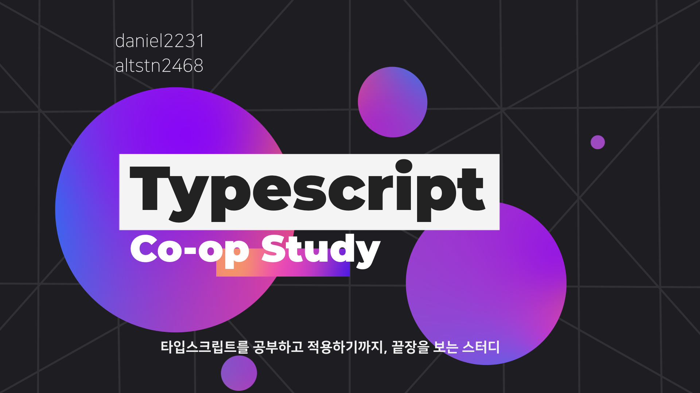

<h2 align="center">
  
    
  Do it! 타입스크립트 프로그래밍 스터디
</h2>

### 참여자

- Kim Minsu  [:octocat:](https://github.com/alstn2468)
- Kang DongHeon [:octocat:](https://github.com/daniel2231)

### 스터디 방법

1. 1주일 동안 스터디할 범위를 정합니다.
2. 각자 스터디를 한 후 마크다운 형식으로 정리합니다.
3. 매주 각자의 스터디 내용을 공유합니다.
4. 책의 내용을 습득하며 사이드 프로젝트를 진행합니다.

### 스터디 기록

| 목차                                   |                    Minsu                     |             DongHeon              |
| :------------------------------------- | :------------------------------------------: | :-------------------------------: |
| 01장 타입스크립트와 개발 환경 만들기   |  [:link: LINK](./Summary/ms/Chapter_1/1.md)  | [:link: LINK](./Summary/dh/1.md)  |
| 02장 타입스크립트 프로젝트 생성과 관리 |  [:link: LINK](./Summary/ms/Chapter_2/2.md)  | [:link: LINK](./Summary/dh/2.md)  |
| 03장 객체와 타입                       |  [:link: LINK](./Summary/ms/Chapter_3/3.md)  | [:link: LINK](./Summary/dh/3.md)  |
| 04장 함수와 메서드                     |  [:link: LINK](./Summary/ms/Chapter_4/4.md)  | [:link: LINK](./Summary/dh/4.md)  |
| 05장 배열과 튜플                       |  [:link: LINK](./Summary/ms/Chapter_5/5.md)  | [:link: LINK](./Summary/dh/5.md)  |
| 06장 반복기와 생성기                   |  [:link: LINK](./Summary/ms/Chapter_6/6.md)  | [:link: LINK](./Summary/dh/6.md)  |
| 07장 Promise와 async/await 구문        |  [:link: LINK](./Summary/ms/Chapter_7/7.md)  | [:link: LINK](./Summary/dh/7.md)  |
| 08장 함수 조합의 원리와 응용           |  [:link: LINK](./Summary/ms/Chapter_8/8.md)  | [:link: LINK](./Summary/dh/8.md)  |
| 09장 람다 라이브러리                   |  [:link: LINK](./Summary/ms/Chapter_9/9.md)  | [:link: LINK](./Summary/dh/9.md)  |
| 10장 제네릭 프로그래밍                 | [:link: LINK](./Summary/ms/Chapter_10/10.md) | [:link: LINK](./Summary/dh/10.md) |
| 11장 모나드                            | [:link: LINK](./Summary/ms/Chapter_11/11.md) | [:link: LINK](./Summary/dh/11.md) |
| 12장 프로젝트 실습                     | [:link: LINK](./Summary/ms/Chapter_12/12.md) | [:link: LINK](./Summary/dh/12.md) |
