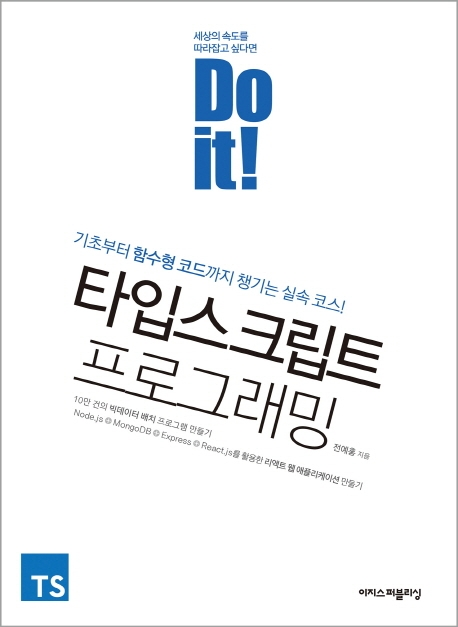

<h1 align="center">
 
  
    
  Do it! 타입스크립트 프로그래밍 스터디
</h1>

---

### 참여자

|     Name      |                   Github                   |                              Facebook                               |                             LinkedIn                              |                   Blog                   |
| :-----------: | :----------------------------------------: | :-----------------------------------------------------------------: | :---------------------------------------------------------------: | :--------------------------------------: |
|   Kim Minsu   | [:octocat:](https://github.com/alstn2468)  | [:shipit:](https://www.facebook.com/profile.php?id=100003769223078) |  [:trollface:](https://www.linkedin.com/in/minsu-kim-336289160/)  | [:bowtie:](https://alstn2468.github.io/) |
| Kang DongHeon | [:octocat:](https://github.com/daniel2231) |        [:shipit:](https://www.facebook.com/daniel.kang.5249)        | [:trollface:](https://www.linkedin.com/in/kang-daniel-a1a18a179/) | [:bowtie:](https://youturn.tech/about/)  |

### 스터디 방법

### [SUMAMRY LINK](./Summary/main.md)