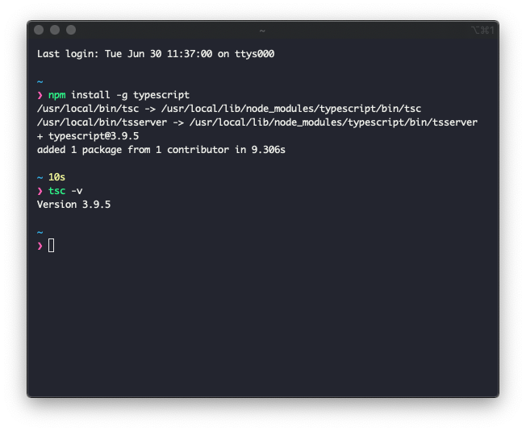

# 타입스크립트와 개발 환경 만들기

## 타입스크립트란?
- 마이크로소프트가 개발하고 유지하고 있는 오픈소스 프로그래밍 언어
- ESNext에 타입 기능을 추가 (ESNext: ES5 이후 버전)
  
### 타입이 있으면 좋은 이유?
- 코드가 더 읽기 쉽다
- 디버깅을 더 쉽게 할 수 있다
- 컴파일러가 어디에서 문제가 생겼는지 알려준다
- 리팩토링이 쉬워진다
> TypeScript will help you finding all the usages of the refactored bit, renaming it, and alerting you with a compile error in case your code has any type mismatches after the refactor.
> [링크](https://medium.com/@jtomaszewski/why-typescript-is-the-best-way-to-write-front-end-in-2019-feb855f9b164)

### 트랜스파일?
- ESNext는 Babel이라는 Transpiler를 통해 ES5 코드로 나온다
- TypeScript는 TSC(TypeScript Compiler)를 통해 ES5 코드로 나온다

## 타입스크립트의 주요 문법 살펴보기

### ESNext 문법 알아보기
1. 비구조화 할당

```JavaScript
let daniel = {age: 23, firstName: "Kang"}
let {age, firstName} = daniel
// age = 23, firstName = "Kang"

let arr = ["A","B","C","D"]
let [head, ...rest] = arr
//head = "A", rest = ["B","C","D"]

let lastName = "Kang", firstName = "Daniel"
[lastName, firstName] = [firstName, lastName]
//lastName = "Daniel", firstName = "Kang"
```

- 1번 예제: 객체의 속성을 비구조 할당으로 쪼갤 수 있다
- 2번 예제: 배열을 비구조 할당을 통해 쉽게 분리할 수 있다
- 3번 예제: 두 변수의 값을 서로 교환할 수 있다

2. 화살표 함수
```Javascript
function addSum(a,b){
    return a + b
}

let addSum = (a,b) => a + b
```

- 화살표(=>)로 함수를 만들 수 있다
- 보통 `let 함수명 = (매개변수) => {실행문}` 형식을 지닌다

3. 클래스
```Typescript
abstract class Animal {
    constructor(public name?: string, public age?: number){ } 
    abstract makeSound(): string;
}

class Cat extends Animal {
    say() {return "야옹"}
}

class Dog extends Animal {
    say() {return "멍멍"}
}

let animals: Animal[] = [new Cat('야옹이', 2), new Dog('멍멍이', 3)]
let sounds = animals.map(a => a.say())
//["야옹", "멍멍"]
```
- ESNext는 클래스라는 기능을 제공한다. 이를 다음을 지원한다:
  - 캡슐화
  - 상속
  - 다양성
- 필자는 객체지향 프로그래밍을 잘 모름으로 이 부분은 그냥 넘어간다
- 뒤에 더 자세히 다룬다

4. 모듈 
```TypeScript
import * as fs from 'fs'
export function writeFile(filepath: string, content: any) {}
```

- 모듈을 이용하여 코드를 여러개 파일로 나누어 관리할 수 있다
- 코드를 재사용 할 수 있다

5. 생성기
```TypeScript
function* gen() {
    yield* [1,2]
}
for(let value of gen()) {console.log(value)}
// 1,2
```

- 생성기는 function 키워드에 별표를 결합한 function*과 yield 키워드를 이용해 만든다
- 위 코드를 분해해보면
  - function* = 생성기 (yield를 사용할 수 있게 해줌)
  - yield가 호출되면 프로그램이 잠깐 일시정지 한 다음 4행 코드를 실행
  - 그 후 다시 2행으로 돌아와 이 과정이 배열 [1,2]를 모두 순회할 떄까지 반복

6. Promise와 Await
```JavaScript
async function get() {
    let values = []
    values.push(await Promise.resolve(1))
    values.push(await Promise.resolve(2))
    values.push(await Promise.resolve(3))
    return values
}
get().then(values => console.log(values))
//[1,2,3]
```

- Promise는 비동기 콜백 함수를 상대적으로 쉽게 고현할 목적으로 만들어짐
- async를 사용한 함수 부문에는 await를 쓸 수 있음
- await는 Promise 객체를 해소(resolve)해준다
- get이 반환한 Promise 객체는 then 메서드를 호출해 실제 값을 얻을 수 있다

# 타입스크립트 고유의 문법 살펴보기
1. 타입 주석과 타입 추론
```TypeScript
let n: number = 1
let m = 2
```
- 콜론 뒤에 타입을 쓸 수 있는데, 이걸 타입 주석(type annotation)이라고 한다
- 타입 부분을 생략할 수 있다

2. 인터페이스
```TypeScript
interface Person {
    name: string
    age?: number
}

let person: Person = {name:"Jane"}
```
- 인터페이스 구문은 처음이라 넘어가겠다

3. 튜븦
```TypeScript
let numberArray: number[ ] = [1,2,3]
let tuple: [boolean, number, string] = [true, 1, 'OK']
```
- 파이썬에 쓰이는 튜플을 쓸 수 있다
- 튜플은 배열과 비슷함, 들어가있는 아이템의 데이터 타임이 다 같아야함

4. 제네릭 타입
```TypeScript
class Container<T> {
    constuctor(public value: T) { }
}
let numberContainer: Container<number> = new Container<number>(1)
let stringContainer: Container<string> = new Container<string>("Hello world")
```
- 다양한 타입을 한꺼번에 취급할 수 있게 해줌
- 여러가지 타입을 대상으로 동작할 수 있는데 이를 제네릭 타입이라고 함

5. 대수 타입
```TypeScript
type NumberOrSting = number | sting //합집합 타입 예
type animalAndPerson = Animal &Person //교집합 타입 예
```
- ADT(Algebraic Data Type)를 의미
- 다른 자료형의 값을 가지는 자료형을 의미
- 크게 합집합 타입(Union, Sum type)과 교집합 타입(Intersection, Product type)이 있다
- 합집합은 "|"
- 교집합은 "&"

# 타입스크립트 개발 환경 만들기
책에서는 맥을 위한 세팅 방법이 없다. 그렇기 떄문에 인터넷에 있는 자료를 참고했다.

책에서는 `scoop`, `Visual Studio Code`, `Node.js` 설치 방법을 다루지만 나는 이미 다 설치가 되어 있기 때문에 생략한다 (scoop 대신 brew를 쓸 예정이다). 

타입스크립트는 크게 두가지 방법으로 설치 할 수 있다.

첫번째는 모든 프로젝트에서 TS를 쓸 수 있도롤 `-global` 옾션을 쓰는 방법이다. 이렇게 되면 모든 프로젝트에서 TS를 쓸 수 있지만, 프로젝트의 `package.json`에 저장이 되지 않기 때문에 프로젝트 받은 사람은 `npm install`를 하면 typescript가 같이 설치되지 않는다.
```Bash
npm i -g typescript
```
두번째는 프로젝트 `package.json`에 설치하는 방법이다. 이렇게 되면 터미널에서 바로 TS 커멘드를 쓸 수 없으니 주의하자
```Bash
npm i --save-dev typescript
```

책에서 시키는 대로 첫번째 명령어를 통해 컴퓨터에 typescript를 깔아보도록 하겠다.

</img>

이렇게 깔고 `tsc -v`를 통해 제대로 설치가 되어 있는지 확인하자.

자 그럼 이제 타입스트립트 파일(hello.ts)를 만들어서 TSC 컴파일러를 돌려 JS로 뽑아보자.

```TypeScript
//hello.ts
console.log('Hello World!')
```

저렇게 작성해준 다음 컴파일러를 돌려주자.

```Bash
tsc hello.ts
```

그럼 `hello.js`라는 컴파일된 자바스크립트 파일이 보일거다.

## ts-node 설치 

타입스크립트 코드를 변환한 동시에 바로 실행해보려면 `ts-node`라는 걸 설치해야 한다.

```bash
npm i -g ts-node
```

설치하고 다음과 같이 입력하면 변환과 동시에 실행이 되는걸 볼 수 있다.

```bash
tsc-node hello.ts
```