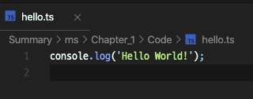
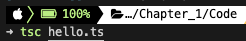
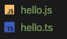
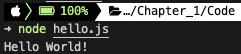
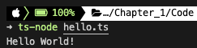

# 01장 타입스크립트와 개발 환경 만들기

<details><summary>Table of Contents</summary>

-   타입스크립트란 무엇인가? [:link:](#01-1-타입스크립트란-무엇인가)
    -   자바스크립트의 종류 [:link:](#자바스크립트의-종류)
    -   타입 기능의 필요성 [:link:](#타입-기능의-필요성)
    -   트랜스파일 [:link:](#트랜스파일)
-   타입스크립트 주요 문법 살펴보기 [:link:](#01-2-타입스크립트-주요-문법-살펴보기)
    -   ESNext 주요 문법 살펴보기 [:link:](#esnext-주요-문법-살펴보기)
        -   비구조화 할당 [:link:](#1-비구조화-할당)
        -   화살표 함수 [:link:](#2-화살표-함수)
        -   클래스 [:link:](#3-클래스)
        -   모듈 [:link:](#4-모듈)
        -   생성기 [:link:](#5-생성기)
        -   Promise와 async/await 구문 [:link:](#6-promise와-asyncawait-구문)
    -   TypeScript 고유 문법 살펴보기 [:link:](#typescript-고유-문법-살펴보기)
        -   타입 주석과 타입 추론 [:link:](#1-타입-주석과-타입-추론)
        -   인터페이스 [:link:](#2-인터페이스)
        -   튜플 [:link:](#3-튜플)
        -   제네릭 타입 [:link:](#4-제네릭-타입)
        -   대수 타입 [:link:](#5-대수-타입)
-   타입스크립트 개발 환경 만들기 [:link:](#01-3-타입스크립트-개발-환경-만들기)
    -   Typescript 사용에 필요한 설정 [:link:](#typescript-사용에-필요한-설정)
    -   Typescript 컴파일러 설치 [:link:](#typescript-컴파일러-설치)
    -   Typescript 컴파일과 실행 [:link:](#typescript-컴파일과-실행)

</details>

## 01-1 타입스크립트란 무엇인가?

**타입스크립트**는 마이크로소프트가 개발하고 유지하고 있는 **오픈소스 언어**

### 자바스크립트의 종류

1. 표준 자바스크립트 (ECMAScript)
2. ESNext
3. 타입스크립트 (TypeScript)

ESNext는 ECMAScript의 모든 문법을 포함한다.<br/>
Typescript는 ESNext의 모든 문법을 포함한다.<br/>

### 타입 기능의 필요성

현대의 소프트웨어는 상당히 복잡하고, 보통 여러 사람이 **협력해 개발**을 한다.<br/>
이런 상황에서 코드를 작성하는 쪽과 사용하는 쪽의 **커뮤니케이션이 중요**하게 여겨진다.<br/>

```javascript
function makePerson(name, age) {}
```

위와 같은 함수를 A라는 개발자가 작성하고 B라는 개발자가 아래와 같이 사용했다.<br/>

```javascript
makePerson(32, "Jack");
```

다른 개발자가 위와 같은 코드를 실행했을때 오류가 발생한다면 **원인을 찾기 힘들다**.<br/>

```typescript
function makePerson(name: string, age: number) {}
```

위와 같이 **타입 기능**을 사용해 구현했다면 이런 문제가 발생하지 않았을 것이다.<br/>
타입스크립트 컴파일러는 오류를 친절하게 알려줘 코드를 더 수월하게 작성할 수 있다.<br/>

### 트랜스파일

ESNext 코드는 **바벨**이라는 **트랜스파일러**를 거쳐 ECMAScript로 변환된다.<br/>
바벨과 유사하게 타입스크립트는 **TSC**라는 **트랜스파일러**로 ECMAScript로 변환된다.<br/>

> 트랜스파일러<br/>
> 어떤 언어로 작성된 소스코드를 또 다른 언어로 된 소스 코드로 바꿔주는 프로그램을 말한다.<br/>
> 텍스트로된 소스코드를 바이너리 코드로 바꿔주는 컴파일러와 구분하기 위해 생긴 용어다.

[[🔝위로가기]](#01장-타입스크립트와-개발-환경-만들기)&nbsp; / &nbsp;[[🔙뒤로가기]](https://github.com/alstn2468/DoIt_Typescript_Programming/blob/master/README.md)

## 01-2 타입스크립트 주요 문법 살펴보기

타입스크립트는 ESNext 문법을 **대부분 지원**한다.<br/>
타입스크립트를 다루기 위해서 ESNext 문법을 알아야한다.<br/>
추가적으로 타입스크립트의 **고유한 문법도 존재**한다.<br/>

### ESNext 주요 문법 살펴보기

#### 1. 비구조화 할당

ESNext는 **비구조화 할당**(**Destructuring Assignment**) 구문을 제공한다.<br/>
**비구조화 할당**은 객체(`{}`)와 배열(`[]`)에 적용할 수 있다.<br/>

-   **비구조화 할당**을 통해 객체의 속성을 얻는 예제

```javascript
let person = { name: "Jane", age: 23 };
let { name, age } = person;

console.log("name :", name); // name : Jane
console.log("age :", age); // age : 23
```

-   **비구조화 할당**을 통해 배열을 분리하는 예제

```javascript
let array = [1, 2, 3, 4];
let [head, ...rest] = array;

console.log("head :", head); // head : 1
console.log("rest :", rest); // [2, 3, 4]
```

-   **비구조화 할당**을 통해 값을 교환하는 예제

```javascript
let a = 1,
    b = 2;
[a, b] = [b, a];

console.log("a :", a); // a : 2
console.log("b: ", b); // b : 1
```

#### 2. 화살표 함수

자바스크립트에서 함수를 선언할 때는 `function`키워드를 사용한다.<br/>
`ESNext`에서는 `function`키워드 외에도 `=>`로 함수를 선언할 수 있다.<br/>
`=>`를 이용해 만든 함수를 **화살표 함수**(**Arrow Function**)이라고 한다.<br/>

-   `function`키워드를 이용해 선언한 함수

```javascript
function add(a, b) {
    return a + b;
}

console.log(add(1, 2)); // 3
```

-   `=>`를 이용해 선언한 **화살표 함수**

```javascript
const add = (a, b) => a + b;

console.log(add(1, 2)); // 3
```

**화살표 함수**를 사용하면 `function`을 이용한 방식보다 간결하게 코드 작성이 가능하다.<br/>

#### 3. 클래스

ESNext에서는 **클래스** 기능을 제공해 **객체 지향 프로그래밍**을 지원한다.<br/>
**객체 지향 프로그래밍**은 **캡슐화**, **상속**, **다형성**을 지원한다.<br/>

-   클래스를 이용해 **객체 지향 프로그래밍**의 요소를 보여주는 예시

```typescript
abstract class Animal {
    constructor(public name?: string, public age?: number) {}
    abstract say(): string;
}

class Cat extends Animal {
    say() {
        return "야옹";
    }
}

class Dog extends Animal {
    say() {
        return "멍멍";
    }
}

let animals: Animal[] = [new Cat("야옹이", 2), new Dog("멍멍이", 3)];
let sounds = animals.map((a) => a.say()); // ["야옹", "멍멍"]
```

#### 4. 모듈

**모듈**을 사용하면 코드를 여러 파일로 나누어 작성할 수 있다.<br/>
변수나 함수, 클래스등에 `export`를 사용해 모듈로 만들면 다른 파일에서 사용 가능하다.<br/>
이렇게 만든 모듈을 가져와 사용하고 싶으면 `import`키워드를 사용한다.<br/>

-   **모듈**생성 및 사용 예시

```typescript
import * as fs from "fs";
export function writeFile(filepath: string, content: any) {}
```

#### 5. 생성기

`yield`문은 반복기(**iterator**)를 생성할 때 사용한다.<br/>
`yield`문을 이용해 반복기를 만들어 내는 제공자를 **생성기**(**Generator**)라고 부른다.<br/>
**생성기**는 `function`키워드에 `*`를 결합한 `function*`과 `yield`를 이용해 만든다.<br/>
타입스크립트에서 `yield`는 만드시 `function*`으로 만들어진 함수 내부에서만 사용가능하다.<br/>

-   `function*`과 `yield`를 이용해 만드는 **생성기** 예시

```typescript
function* gen() {
    yield* [1, 2];
}

for (let value of gen()) {
    console.log(value); // 1, 2
}
```

위의 코드에서 `function*`을 **생성기**라고 한다.<br/>
위의 코드에서 `yield`가 실행되면 정지한 후 `for`문으로 점프해 실행된다.<br/>
`for`문의 실행을 마치면 다시 `yield`로 돌아가고 배열의 **모든 요소를 순회**하면 종료된다.<br/>

#### 6. Promise와 async/await 구문

ECMAScript로 **비동기 콜백 함수**를 구현하려면 코드가 복잡해진다.<br/>
`Promise`는 **비동기 콜백 함수**를 상대적으로 쉽게 구현할 목적으로 만들어졌다.<br/>
ESNext는 `async`, `await` 구문으로 여러 `Promise`의 호출을 간결하게 구현하도록 한다.<br/>

-   **Prmoise**와 **async**, **await** 예시

```typescript
async function get() {
    let values = [];
    values.push(await Promise.resolve(1));
    values.push(await Promise.resolve(2));
    values.push(await Promise.resolve(3));

    return values;
}

get().then((values) => console.log(values)); // [1, 2, 3]
```

`async`키워드를 사용한 함수 내부에서는 `await`키워드를 사용할 수 있다.<br/>
`await`은 `Promise`를 `resolve`해주어 `get`함수는 `[1, 2, 3]`을 `Promise`형태로 반환한다.<br/>
`Promise`객체는 `then`메서드를 호출해 실제 값을 얻을 수 있다.<br/>

### TypeScript 고유 문법 살펴보기

#### 1. 타입 주석과 타입 추론

아래의 예시에서 변수 `n`뒤에 `:`과 **타입 이름**을 작성한 것을 **타입 주석**이라고 한다.<br/>

-   **타입 주석** 예시

```typescript
let n: numvber = 1;
```

아래와 같이 타입 부분을 생략할 수도 있으며 이를 **타입 추론**이라고 한다.<br/>
타입이 생략되면 `=`연산자의 오른쪽 값을 분석해 타입을 결정한다.<br/>

-   **타입 추론** 예시

```typescript
let m = 2;
```

**타입 추론**기능은 자바스크립트 코드와의 호환성을 보장하는 데 큰 역할을 한다.<br/>
**타입 추론** 덕분에 `.js`파일을 `.ts`로 바꾸면 타입스크립트 환경에서도 동작한다.<br/>

#### 2. 인터페이스

**인터페이스**는 객체의 **속성** 혹은 **메소드**에 관한 정보를 갖는다.<br/>
`Person`인터페이스는 `string`타입의 `name`과 `number`타입의 `age`를 갖는다.<br/>
`?`가 붙은 속성은 객체에 존재하지 않아도 `person`과 같이 오류가 발생하지 않는다.<br/>

-   **인터페이스** 예시

```typescript
interface Person {
    name: string;
    age?: number;
}

let person: Person = { name: "Jane" };
```

#### 3. 튜플

**튜플**은 물리적으로 배열과 동일하다.<br/>
배열은 저장되는 아이템의 데이터 타입이 모두 같지만 **튜플**은 그러지 않아도 된다.<br/>

-   **튜플** 예시

```typescript
let numberArray: number[] = [1, 2, 3];
let tuple: [boolean, number, string] = [true, 1, "Ok"];
```

#### 4. 제네릭 타입

**제네릭 타입**은 다양한 타입을 한번에 취급할 수 있게 해준다.<br/>
아래의 예시에서 `Container`클래스는 `value`속성을 갖는다.<br/>
`Container<number>`, `Container<string>`같이 여러 타입을 대상으로 동작할 수 있다.<br/>

-   **제네릭 타입** 예시

```typescript
class Container<T> {
    constructor(public value: T) {}
}

let numberContainer: Container<number> = new Container<number>(1);
let stringContainer: Container<string> = new Container<string>("Hello World");
```

#### 5. 대수 타입

**ADT**는 추상 데이터 타입을 의미하기도 하지만 **대수 타입**이라는 의미로도 사용된다.<br/>
**대수 타입**은 다린 자료형의 값을 갖는 자료형을 의미한다.<br/>
크게는 `&`를 사용한 **합집합 타입**과 `|`를 사용한 **교집합 타입**이 존재한다.<br/>

-   **대수 타입** 예시

```typescript
type NumberOrString = number | string;
type AnimalAndPerson = Animal & Person;
```

[[🔝위로가기]](#01장-타입스크립트와-개발-환경-만들기)&nbsp; / &nbsp;[[🔙뒤로가기]](https://github.com/alstn2468/DoIt_Typescript_Programming/blob/master/README.md)

## 01-3 타입스크립트 개발 환경 만들기

### Typescript 사용에 필요한 설정

-   패키지 매니저 (`Scoop`, `brew`)
-   텍스트 에디터 (`VSCode`, `Atom`, etc...)
-   `git`
-   `node.js`
-   웹 브라우저 (`Chrome`, `Whale`, `Safari`, etc...)

### Typescript 컴파일러 설치

Typescript는 `node.js`환경엣만 동작한다.<br/>
따라서 `node.js`의 패키지 관리자인 `npm`을 이용해 설치한다.<br/>

```powershell
> npm i -g typescript
> tsc -v
```

### Typescript 컴파일과 실행

#### Typescript 코드 작성하기

`hello.ts`파일을 생성한 후 아래의 코드를 작성한 후 저장한다.<br/>



#### Typescript 코드 트랜스파일하기

아래의 명령어를 터미널에서 실행한다.<br/>



작성한 Typescript가 Javascript로 **트랜스파일**되어 나온다.<br/>



#### 트랜스파일된 Javascript코드 실행하기

**트랜스파일**된 Javascript는 `node`명령어로 실행시킬 수 있다.<br/>



#### Typescript파일을 바로 실행하기

`tsc`는 Typescript를 Javascript로 변환만한다.<br/>
변환과 동시에 실행하기 위해서는 `ts-node`패키지를 설치하면 된다.<br/>

```shell
> npm i -g ts-node
```

`ts-node`명령어로 컴파일과 실행을 동시에 할 수 있다.<br/>



[[🔝위로가기]](#01장-타입스크립트와-개발-환경-만들기)&nbsp; / &nbsp;[[🔙뒤로가기]](https://github.com/alstn2468/DoIt_Typescript_Programming/blob/master/README.md)
