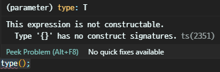
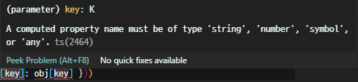
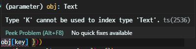
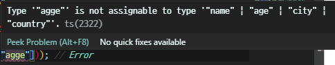
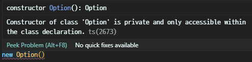

# 10장 제네릭 프로그래밍

<details><summary>Table of Contents</summary>

-   10-1 제네릭 타입 이해하기 [:link:](#10-1-제네릭-타입-이해하기)
    -   제네릭 타입 [:link:](#제네릭-타입)
    -   제네릭 사용하기 [:link:](#제네릭-사용하기)
-   10-2 제네릭 타입 제약 [:link:](#10-2-제네릭-타입-제약)
    -   제네릭 타입 제약 [:link:](#제네릭-타입-제약)
    -   new 타입 제약 [:link:](#new-타입-제약)
    -   인덱스 타입 제약 [:link:](#인덱스-타입-제약)
-   10-3 대수 데이터 타입 [:link:](#10-3-대수-데이터-타입)
    -   대수 데이터 타입 [:link:](#대수-데이터-타입)
    -   합집합 타입 [:link:](#합집합-타입)
    -   교집합 타입 [:link:](#교집합-타입)
    -   합집합 타입 구분하기 [:link:](#합집합-타입-구분하기)
    -   식별 합집합 구문 [:link:](#식별-합집합-구문)
-   10-4 타입 가드 [:link:](#10-4-타입-가드)
    -   클래스와 합집합 타입 [:link:](#클래스와-합집합-타입)
    -   instanceof 연산자 [:link:](#instanceof-연산자)
    -   타입 가드 [:link:](#타입가드)
    -   is 연산자를 활용한 사용자 정의 타입 가드 함수 제작 [:link:](#is-연산자를-활용한-사용자-정의-타입-가드-함수-제작)
-   10-5 F-바운드 다형성 [:link:](#10-5-f-바운드-다형성)
    -   프로젝트 구성 [:link:](#프로젝트-구성)
    -   this 타입과 F-바운드 다형성 [:link:](#this-타입과-f-바운드-다형성)
-   10-6 nullable 타입과 프로그램 안정성 [:link:](#10-6-nullable-타입과-프로그램-안정성)
    -   프로젝트 구성 [:link:](#project2)
    -   nullable 타입이란? [:link:](#nullable-타입이란)
    -   옵션 체이닝 연산자 [:link:](#옵션-체이닝-연산자)
    -   널 병합 연산자 [:link:](#널-병합-연산자)
    -   nullable 타입의 함수형 방식 구현 [:link:](#nullable-타입이란)
    -   Option 타입과 예외 처리 [:link:](#option-타입과-예외-처리)

</details>

## 10-1 제네릭 타입 이해하기

### 제네릭 타입

**제네릭 타입**은 인터페이스나, 클래스, 합수, 타입 별칭 등에 사용할 수 있는 기능이다.<br/>
해당 심볼의 타입을 미리 지정하지 않고 다양한 타입에 대응하려고 할 때 사용한다.<br/>

```typescript
interface IValuable<T> {
    value: T;
}
```

위의 `IValueable` 인터페이스는 `T` 타입의 `value` 라는 속성을 갖는다.<br/>
위와 같이 타입을 `string`, `number`등으로 정하지 않고 `T`로 지정해 **제네릭 타입**으로 만들 수 있다.<br/>
**제네릭 타입**을 인터페이서 지정할 때 위와 같이 인터페이스 이름 뒤에 `<T>`와 같이 표기한다.<br/>

```typescript
function identity<T>(arg: T): T {
    return arg;
}

type IValuable<T> = {
    value: T;
};

class Valueable<T> {
    constructor(public value: T) {}
}
```

위의 코드는 클래스와 함수, 타입 별칭에 각각 **제네릭 타입**을 사용하는 예시다.<br/>

### 제네릭 사용하기

아래와 같이 `T` 타입의 `value` 속성을 갖는 `IValuable` 인터페이스를 작성한다.<br/>

-   `IValuable.ts`

```typescript
export interface IValuable<T> {
    value: T;
}
```

제네릭 인터페이스 `IValuable<T>`를 구현하는 **제네릭 클래스**는 타입 변수 `T`를 갖는다.<br>
구현한 **제네릭 클래스**는 가지고 있는 타입 변수를 인터페이스의 제네릭 타입 변수로 넘길 수 있다.<br/>

-   `Valuable.ts`

```typescript
import { IValuable } from "./IValuable";

export class Valuable<T> implements IValuable<T> {
    constructor(public value: T) {}
}

export { IValuable };
```

**제네릭 함수**는 타입 변수 `T`를 제네릭 인터페이스의 타입 변수로 넘기는 형태로 구현할 수 있다.<Br/>

-   `printValue.ts`

```typescript
import { IValuable, Valuable } from "./Valuable";

export const printValue = <T>(o: IValuable<T>): void => console.log(o.value);
export { IValuable, Valuable };
```

이렇게 만든 제네릭 함수 `printValue`는 아래 처럼 다양한 타입을 대상으로 동작할 수 있다.<br/>

-   `printValue-Test.ts`

```typescript
import { printValue, Valuable } from "./PrintValue";

printValue(new Valuable<number>(1)); // 1
printValue(new Valuable<boolean>(true)); // true
printValue(new Valuable<string>("hello")); // hello
printValue(
    new Valuable<number[]>([1, 2, 3])
); // [ 1, 2, 3 ]
```

또한 아래와 같이 타입 변수 부분을 생략해도 스스로 추론해 제네릭 타입을 찾아낸다.<br/>

-   `printValue-Test2.ts`

```typescript
import { printValue, Valuable } from "./PrintValue";

printValue(new Valuable(1)); // 1
printValue(new Valuable(true)); // true
printValue(new Valuable("hello")); // hello
printValue(new Valuable([1, 2, 3])); // [ 1, 2, 3 ]
```

제네릭 타입을 지정하지 않아도 동일한 결과를 출력하는 것을 볼 수 있다.<br/>

[[🔝위로가기]](#10장-제네릭-프로그래밍)&nbsp; / &nbsp;[[🔙뒤로가기]](https://github.com/alstn2468/DoIt_Typescript_Programming/blob/master/README.md)

## 10-2 제네릭 타입 제약

### 제네릭 타입 제약

**제네릭 타입 제약**은 타입 변수에 적용할 수 있는 **타입의 범위를 제한하는 기능**을 한다.<br/>
Typescript에서 제네릭 함수의 타입을 제한하고 싶을 때는 아래와 같은 구문을 사용한다.<br/>

```typescript
<최종 타입1 extend 타입1, 최종 타입2 extend 타입2>(a: 최종 타입1, b: 최종 타입2, ...) {}
```

아래의 `IValuable<T>`는 `T` 타입 `value` 속성을 갖는 제네릭 인터페이스다.<br/>

-   `IValuable.ts`

```typescript
export interface IValuable<T> {
    value: T;
}
```

아래의 `printValueT` 함수는 앞의 `printValue` 함수와 구현 방식이 조금 다르다.<br/>
`printValueT` 함수는 **제네릭 타입 제약** 구문을 사용해 구현되어 있다.<br/>

-   `printValueT.ts`

```typescript
import { IValuable, Valuable } from "./Valuable";

export const printValueT = <Q, T extends IValuable<Q>>(o: T): void =>
    console.log(o.value);
export { IValuable, Valuable };
```

`printValue`와 비교하여 매개변수의 타입을 어떤 방식으로 제약하는지만 다르다.<br/>

```typescript
import { printValueT } from "./printValueT";
import { Valuable } from "./Valuable";

printValueT(new Valuable(1)); // 1
printValueT({ value: true }); // true
```

출력 결과는 `printValue` 함수를 사용한 것과 동일한 것을 볼 수 있다.<br/>
위의 `printValueT` 함수는 아래와 같이 구현하면 안된다.<br/>

```typescript
export const printValueT = <T extends IValuable<T>>(o: T) =>
    console.log(o.value);
```

`o`의 `T` 입장에서 타입 `T`는 `IValuable<T>`이므로 `IValuable <IValuable<T>>`와 같이 해석되기 때문이다.<br/>

### new 타입 제약

팩토리 함수는 `new` 연산자를 사용해 객체를 생성하는 기능을 하는 함수를 의미한다.<br/>
팩토리 함수는 객체를 생성하는 방법이 복잡할 때 단순화하려는 목적으로 구현한다.<br/>

```typescript
const create = <T>(type: T): T => new type();
```

위 코드에서 `create` 함수의 매개변수 `type`은 실제로 **타입**이다.<br/>
따라서 `type` 변수의 타입 주석으로 명시한 `T`는 **타입의 타입**에 해당한다.<br/>



하지만 Typescript는 타입의 타입을 허용하지 않으므로 위와 같은 오류가 발생한다.<br/>
Typescript의 창시자인 아네르스 하일스베르는 C# 언어의 창시자이기도 하다.<br/>
아래 코드에서 `{new(): T}` 구문은 C#에서 볼 수 있는 구문과 매우 유사하다.<br/>

```typescript
const create = <T extends { new (): T }>(type: T): T => new type();
```

하일스베르는 타입의 타입에 해당하는 구문을 만들지 않고 C# 언어에서의 구문을 빌려 사용하였다.<br/>
`create` 함수의 타입 제약 구문은 `{}`로 `new()` 부분을 감싸서 메서드 형태로 표현했다.<br/>
이 구문은 아래와 같이 `{}`를 없앤 좀 더 간결한 문법으로 표현할 수도 있다.<br/>

```typescript
const create = <T>(type: new () => T): T => new type();
```

결론적으로 `{ new(): T }`와 `new() =>` 는 같은 의미를 갖는다.<br/>
`new` 연산자를 `type`에 적용하며 `type`의 생성자로 인자를 전달하려면 아래와 같이 사용한다.<br/>

```typescript
const create = <T>(type: { new (...args): T }, ...args): T => new type(...args);
```

아래 코드는 `Date`와 `Point` 인스턴스를 **타입 제약**을 설정한 `create`함수로 생성하는 예시다.<br/>

-   `create.ts`

```typescript
export const create = <T>(type: { new (...args): T }, ...args): T =>
    new type(...args);
```

-   `create-Test.ts`

```typescript
import { create } from "./create";

class Point {
    constructor(public x: number, public y: number) {}
}
[create(Date), create(Point, 0, 0)].forEach((s) => console.log(s));
// 2020-07-30T06:16:53.363Z
// Point { x: 0, y: 0 }
```

위의 `create` 함수를 호출해 보면 클래스의 인스턴스가 정상적으로 생성되는 것을 볼 수 있다.<br/>

### 인덱스 타입 제약

객체의 일정 속성들만 추려 좀 더 단순한 객체를 만들어야 할 때가 있다.<br/>
`pick` 함수는 `obj` 객체에서 `name`과 `age` 두 속성만 추출해 간단한 형태를 만드려 한다.<br/>

```typescript
const obj = { name: "Jane", age: 22, city: "Seoul", country: "Korea" };
pick(obj, ["name", "age"]);
```

위에서 사용한 `pick` 함수는 아래와 같이 구현할 수 있다.<br/>

-   `pick.ts`

```typescript
export const pick = (obj, keys) =>
    keys
        .map((key) => ({ [key]: obj[key] }))
        .reduce((result, value) => ({ ...result, ...value }), {});
```

아래의 코드를 실행하면 `pick` 함수가 `name`과 `age` 속성과 값을 추출해주는 것을 볼 수 있다.<br/>

-   `pick-Test.ts`

```typescript
import { pick } from "./pick";

const obj = { name: "Jane", age: 22, city: "Seoul", country: "Korea" };
console.log(pick(obj, ["name", "age"])); // { name: 'Jane', age: 22 }
console.log(pick(obj, ["name", "agge"])); //{ name: 'Jane', agge: undefined }
```

하지만 `pick(obj, ["name", "agge"])`와 같이 오타가 발생하면 엉뚱한 결과가 나온다.<br/>
Typescript는 이러한 상황을 방지하기 위해 `keyof T` 형태로 **타입 제약**을 설정할 수 있다.<br/>
`keyof T` 형태 같은 타입 제약을 **인덱스 타입 제약**이라고 한다.<br/>

```typescript
<T, K extends keyof T>
```

아래 코드에서 `pick` 함수는 `keys` 매개변수에 각각 `T`와 `K`라는 타입 변수를 적용했다.<br/>

```typescript
export const pick = <T, K>(obj: Text, keys: K[]) =>
    keys
        .map((key) => ({ [key]: obj[key] }))
        .reduce((result, value) => ({ ...result, ...value }), {});
```

하지만 이 코드는 `K` 타입에 타입 제약을 설정하지 않았으므로 아래와 같은 오류가 발생한다.<br/>

<br/>


위와 같은 오류를 해결하려면 타입 `K`가 `T`의 속성 이름이라는 것을 알려줘야 한다.<br/>
`keyof T` 구문으로 타입 `K`가 타입 `T`의 속성 이름이라고 **인덱스 타입 제약**을 설정한다.<br/>

-   `pickTwo.ts`

```typescript
export const pickTwo = <T, K extends keyof T>(obj: T, keys: K[]) =>
    keys
        .map((key) => ({ [key]: obj[key] }))
        .reduce((result, value) => ({ ...result, ...value }), {});
```

아래 코드를 실행하면 **인덱스 타입 제약**을 설정한 `pickTwo` 함수를 테스트할 수 있다.<br/>

-   `pickTwo-Test.ts`

```typescript
import { pickTwo } from "./pickTwo";

const obj = { name: "Jane", age: 22, city: "Seoul", country: "Korea" };
console.log(pickTwo(obj, ["name", "age"])); // { name: 'Jane', age: 22 }
console.log(pickTwo(obj, ["name", "agge"])); // Error
```

`pickTwo(obj, ["name", "agge"])` 같이 잘못 사용했을때 작성 시점에 오류를 탐지할 수 있다.<br/>



위와 같이 컴파일 이전에 `obj`의 속성이 아닌 `agge`를 사용할 수 없는 것을 볼 수 있다.<br/>

[[🔝위로가기]](#10장-제네릭-프로그래밍)&nbsp; / &nbsp;[[🔙뒤로가기]](https://github.com/alstn2468/DoIt_Typescript_Programming/blob/master/README.md)

## 10-3 대수 데이터 타입

### 대수 데이터 타입

객체지향 프로그래밍 언어에서 **ADT**는 **추상 데이터 타입**을 의미한다.<br/>
하지만 함수형 프로그래밍 언어에서는 **대수 데이터 타입**을 의미한다.<br/>
Typescript에서 **대수 데이터 타입**은 **합집합 타입**과 **교집합 타입**이 있다.<br/>
객체지향 언어는 **상속**에 기반을 두고 타입을 분류하는 경향이 있다.<br/>
상속에만 의존하면 `true`와 `false`단 두가지 값을 갖는 `boolean`과 같은 타입을 만들기 어렵다.<br/>
이 때문에 함수형 언어들은 상속에 의존하는 타입보다 **대수 데이터 타입**을 선호한다.<br/>

### 합집합 타입

**합집합 타입**은 **또는**의 의미인 `|` 기호로 다양한 타입을 연결해서 만든 타입을 말한다.<br/>
아래 코드에셔 변수 `ns`의 타입인 `NumberOrString`은 `number`나 `string` 타입이다.<br/>

-   `UnionType.ts`

```typescript
type NumberOrString = number | string;
let ns: NumberOrString = 1;
ns = "Hello";
```

따라서 위와 같이 `1`과 같은 수와 `hello`와 같은 문자열을 모두 담을 수 있다.<br/>

### 교집합 타입

**교집합 타입**은 **그리고**의 의미인 `&` 기호로 다양한 타입을 연결해서 만든 타입을 말한다.<br/>
**교집합 타입**의 대표적인 예시는 두 개의 객체를 통합해서 새로운 객체를 만드는 것이다.<br/>
아래 코드에서 `mergeObjects` 함수는 타입 `T`와 `U` 객체를 결합해 새로운 객체를 만든다.<br/>

-   `mergeObjects.ts`

```typescript
export const mergeObjects = <T, U>(a: T, b: U): T & U => ({ ...a, ...b });
```

-   `mergeObjects-Test.ts`

```typescript
import { mergeObjects } from "./mergeObjects";

type INameable = { name: string };
type IAgeable = { age: number };

const nameAndAge: INameable & IAgeable = mergeObjects(
    { name: "Jack" },
    { age: 32 }
);
console.log(nameAndAge); // { name: 'Jack', age: 32 }
```

`INameable` 타입 객체와 `IAgeable` 타입 객체을 `mergeObjects` 함수로 결합한 예시다.<br/>
`mergeObjects` 함수를 이용해 `INameable & IAgeable` 타입의 변수인 `nameAndAge` 객체에 저장한다.<br/>

### 합집합 타입 구분하기

아래와 같인 인터페이스가 세 개 있다고 가정한다.<br/>

```typescript
interface ISquare {
    size: number;
}
interface IRectangle {
    width: number;
    height: number;
}
interface ICircle {
    radius: number;
}
```

위 인터페이스로 만든 각각의 객체는 아래와 같다.<br/>

```typescript
const square: ISquare = { size: 10 };
const rectangle: IRectangle = { width: 4, height: 5 };
const circle: ICircle = { radius: 10 };
```

이 객체들을 모두 받아 면적을 계산해 주는 함수인 `calcArea` 함수를 생각해 볼 수 있다.<br/>

```typescript
console.log(calcArea(square));
console.log(calcArea(rectangle));
console.log(calcArea(circle));
```

함수가 위와 같이 동작하려면 매개변수 타입은 `ISquare`, `IRectangle`, `ICircle`의 합집합이어야 한다.<br/>

```typescript
type IShape = ISquare | IRectangle | ICircle;

export const calcArea = (shape: IShape): number => {
    // shape 객체의 구체적인 타입을 알 수 없음
    return 0;
};
```

하지만 매개변수로 받은 `shape`가 **어떤 타입의 객체인지 구분할 수 없어** 계산을 할 수 없다.<br/>
Typescript는 이러한 문제를 해결할 수 있도록 **식별 합집합**이라는 구문을 제공한다.<br/>

### 식별 합집합 구문

**식별 합집합 구문**을 사용하려면 **합집합**을 구성하는 인터페이스들이 같은 속성을 가지고 있어야 한다.<br/>
아래 코드에서 `ISquare`, `IRectangle`, `ICircle`은 모두 `tag`라는 이름의 공통 속성이 있다.<br/>

-   `IShape.ts`

```typescript
export interface ISquare {
    tag: "square";
    size: number;
}

export interface IRectangle {
    tag: "rectangle";
    width: number;
    height: number;
}
export interface ICircle {
    tag: "circle";
    radius: number;
}

export type IShape = ISquare | IRectangle | ICircle;
```

위와 같이 공통 속성이 있을 때 `area` 함수의 `switch` 구문과 같이 **식별 합집합**을 사용할 수 있다.<br/>

-   `calcArea.ts`

```typescript
import { IShape } from "./IShape";

export const calcArea = (shape: IShape): number => {
    switch (shape.tag) {
        case "square":
            return shape.size * shape.size;
        case "rectangle":
            return shape.width * shape.height;
        case "circle":
            return Math.PI * shape.radius * shape.radius;
    }
    return 0;
};
```

만약 `tag`와 같이 공통 속성이 없다면 `IShape`의 타입을 구분할 방법이 없다.<br/>
아래 코드로 **식별 합집합 구문**을 사용한 `calcArea` 함수를 테스트 할 수 있다<br/>

-   `calcArea-Test.ts`

```typescript
import { calcArea } from "./calcArea";
import { IRectangle, ISquare, ICircle } from "./IShape";

const square: ISquare = { tag: "square", size: 10 };
const rectangle: IRectangle = { tag: "rectangle", width: 4, height: 5 };
const circle: ICircle = { tag: "circle", radius: 10 };

console.log(calcArea(square)); // 100
console.log(calcArea(rectangle)); // 20
console.log(calcArea(circle)); // 314.1592653589793
```

위와 같이 **합집합 타입**인 `IShape`의 상세 타입을 식별해 값이 계산되는 것을 볼 수 있다.<br/>

[[🔝위로가기]](#10장-제네릭-프로그래밍)&nbsp; / &nbsp;[[🔙뒤로가기]](https://github.com/alstn2468/DoIt_Typescript_Programming/blob/master/README.md)

## 10-4 타입 가드

### 클래스와 합집합 타입

아래와 같이 두 개의 클래스가 있다고 가정한다.<br/>

-   `BirdAndFish.ts`

```typescript
export class Bird {
    fly() {
        console.log("I'm flying.");
    }
}

export class Fish {
    swim() {
        console.log("I'm swimming");
    }
}
```

아래와 같이 `flyOrSwim`과 같은 함수를 구현할 때 매개변수 `o`는 `Bird`이거나 `Fish`다.<br/>

```typescript
import { Bird, Fish } from "./BirdAndFish";

export const flyOrSwim = (o: Bird | Fish): void => {
    // o.fly() or o.swim() ??
};
```

따라서 이후 실행해야할 함수가 `o.fly()`인지 `o.swim()`인지 알 수 없다.<br/>
즉 합집합 타입 `(Bird | Fish)`의 객체가 구체적으로 무엇인지 알아야 한다.<br/>

### instanceof 연산자

Javascript는 두 개의 피연산자가 필요한 `instanceof` 라는 이름의 연산자를 제공한다.<br/>

```javascript
객체 instanceof 타입;
```

`instanceof` 연산자를 사용하면 앞 `flyOrSwim` 함수는 다음과 같이 구현할 수 있다.<br/>

```typescript
import { Bird, Fish } from "./BirdAndFish";

export const flyOrSwim = (o: Bird | Fish): void => {
    if (o instanceof Bird) {
        (o as Bird).fly();
    } else if (o instanceof Fish) {
        (<Fish>o).swim();
    }
};
```

`o as Bird`나 `<Fish>o`와 같이 매개변수 `o`에 **타입 단언**을 사용할 수 있다.<br/>

### 타입 가드

Typescript에서 `instanceof` 연산자는 Javascript와 다르게 **타입 가드** 기능이 있다.<br/>
**타입 가드**는 타입을 변환하지 않은 코드 때문에 프로그램이 **비정상 종료되는 상황을 보호**한다.<br/>
아래 `flyOrSwim` 함수는 `instanceof` 연산자의 **타입 가드**를 사용해 `o`의 타입을 전환하지 않고 사용한다.<br/>

```typescript
import { Bird, Fish } from "./BirdAndFish";

export const flyOrSwim = (o: Bird | Fish): void => {
    if (o instanceof Bird) {
        o.fly();
    } else if (o instanceof Fish) {
        o.swim();
    }
};
```

Typescript는 `o instanceof Bird`가 `true`이면 변수 `o`를 자동으로 `Bird` 타입 객체로 전환한다.<br/>
마찬가지로 `o instanceof Fish`가 `true`이면 자동으로 `Fish` 타입 객체로 전환한다.<br/>

```typescript
import { flyOrSwim } from "./flyOrSwim";
import { Bird, Fish } from "./BirdAndFish";

[new Bird(), new Fish()].forEach(flyOrSwim);
// I'm flying.
// I'm swimming
```

위와 같이 코드를 작성해 실행해보면 **타입 단언**을 사용하지 않아도 정상 작동하는 것을 볼 수 있다.<br/>

### is 연산자를 활용한 사용자 정의 타입 가드 함수 제작

**타입 가드** 기능을 하는 `instanceof` 처럼 동작하는 함수 또한 구현할 수 있다.<br/>
**타입 가드** 기능을 하는 함수는 함수의 반환 타입 부분에 `is`라는 연산자를 사용해야 한다.<br/>
`is` 연산자를 사용하는 구문은 아래와 같이 작성한다.<br/>

```typescript
변수 is 타입
```

아래의 `isFlyable` 함수는 반환 타입이 `o is Bird` 이므로 **사용자 정의 타입 가드 함수**다.<br/>

-   `isFlyable.ts`

```typescript
import { Bird, Fish } from "./BirdAndFish";

export const isFlyable = (o: Bird | Fish): o is Bird => {
    return o instanceof Bird;
};
```

또한 아래의 `isSwimmalbe` 함수 또한 **사용자 정의 타입 가드 함수**다.<br/>

-   `isSwimmable.ts`

```typescript
import { Bird, Fish } from "./BirdAndFish";

export const isSwimmable = (o: Bird | Fish): o is Fish => {
    return o instanceof Fish;
};
```

**사용자 타입 가드 함수**는 `if`문에서 사용해야 한다.<br/>
아래 `swimOrFly` 함수는 두 개의 `if` 문에서 작성한 **사용자 정의 타입 가드 함수**를 사용한다.<br/>

-   `swimOrFly.ts`

```typescript
import { Bird, Fish } from "./BirdAndFish";
import { isSwimmable } from "./isSwimmable";
import { isFlyable } from "./isFlyable";

export const swimOrFly = (o: Bird | Fish): void => {
    if (isSwimmable(o)) {
        o.swim();
    } else if (isFlyable(o)) {
        o.fly();
    }
};
```

아래와 같이 `swimOrFly` 함수를 테스트하는 코드를 작성해 확인할 수 있다.<br/>

-   `swimOrFly-Test.ts`

```typescript
import { swimOrFly } from "./swimOrFly";
import { Bird, Fish } from "./BirdAndFish";

[new Bird(), new Fish()].forEach(swimOrFly);
// I'm flying.
// I'm swimming
```

`instanceof`를 사용한 **타입 가드**와 동일하게 작동하는 것을 볼 수 있다.<br/>

[[🔝위로가기]](#10장-제네릭-프로그래밍)&nbsp; / &nbsp;[[🔙뒤로가기]](https://github.com/alstn2468/DoIt_Typescript_Programming/blob/master/README.md)

## 10-5 F-바운드 다형성

### 프로젝트 구성

아래와 같이 Typescript를 사용하는 node.js 프로젝트를 구성한다.<br/>

```shell
> npm init --y
> npm i -D typescript ts-node @types/node
> mkdir -p src/test
> mkdir src/classes
> mkdir src/interfaces
```

`tsconfig.json` 파일은 아래와 같이 설정한다.<br/>

```typescript
{
    "compilerOptions": {
        "module": "CommonJS",
        "esModuleInterop": true,
        "target": "es5",
        "moduleResolution": "node",
        "outDir": "dist",
        "baseUrl": ".",
        "sourceMap": true,
        "downlevelIteration": true,
        "noImplicitAny": false,
        "paths": {
            "*": ["node_modules/*"]
        }
    },
    "include": ["src/**/*"]
}
```

기존에 사용했던 `tsconfig.json` 파일 설정들과 동일하게 설정하였다.<br/>

### this 타입과 F-바운드 다형성

Typescript에서 `this` 키워드는 **타입**으로도 사용된다.<br/>
`this` 가 **타입**으로 사용되면 객체지향 언어에서 의미하는 **다형성** 효과가 나타난다.<br/>
**일반적인 다형성과 구분**하기 위해 `this` 타입으로 인한 **다형성**을 **F-바운드 다형성**이라 한다.<br/>

#### (1) F-바운드 타입

**F-바운드 타입**이란 자신을 구현하거나 상속하는 서브타입을 포함하는 타입을 말한다.<br/>
아래의 `IValueProvider<T>` 타입은 자신을 상속하는 타입이 포함되어 있지 않은 **일반 타입**이다.<br/>

-   `interfaces/IValueProvider.ts`

```typescript
export interface IValueProvider<T> {
    value(): T;
}
```

반면에 아래의 `IAddable<T>`는 `add` 메서드가 `this`타입을 반환하는 **F-바운드 타입**이다.<br/>

-   `interfaces/IAddable.ts`

```typescript
export interface IAddable<T> {
    add(value: T): this;
}
```

아래의 `IMultiplyalbe<T>` 또한 메서드의 반환 타입이 `this`이므로 **F-바운드 타입**이다.<br/>

-   `interfaces/IMultiplyable.ts`

```typescript
export interface IMultiplyable<T> {
    multiply(value: T): this;
}
```

작성한 인터페이스들을 편하게 사용할 수 있게 아래와 같이 `index.ts` 파일을 작성한다.<br/>

-   `interfaces/index.ts`

```typescript
import { IAddable } from "./IAddable";
import { IMultiplyable } from "./IMultiplyable";
import { IValueProvider } from "./IValueProvider";

export { IValueProvider, IMultiplyable, IAddable };
```

이제 이 세 개의 인터페이스를 구현하는 `Calculator`와 `StringComposer` 클래스를 구현한다.<br/>
위의 두 클래스를 구현하면서 `this` 타입이 필요한 이유에 대해 알 수 있다.<Br/>

#### (2) IValueProvider<T> 인터페이스의 구현

아래 `Calculator` 클래스는 `IValueProvider<T>` 인터페이스를 구현하고 있다.<br/>

-   `classes/Calculator.ts`

```typescript
import { IValueProvider } from "../interfaces";

export class Calculator implements IValueProvider<number> {
    constructor(private _value: number = 0) {}
    value(): number {
        return this._value;
    }
}
```

이 클래스는 `_value` 속성을 `private`로 만들어 인스턴스로 속성을 직접 접근할 수 없다.<br/>
따라서 `Calculator`의 `_value` 속성을 사용하기 위해서는 `value()` 메서드를 사용해야 한다.<br/>
동일한 방식으로 아래의 `StringComposer` 또한 `IValueProvider<T>`를 구현한다.<br/>

-   `classes/StringComposer.ts`

```typescript
import { IValueProvider } from "../interfaces";

export class StringComposer implements IValueProvider<string> {
    constructor(private _value: string = "") {}
    value(): string {
        return this._value;
    }
}
```

`StringComposer` 클래스 역시 `value()` 메서드를 사용해야 `_value` 속성에 접근할 수 있다.<br/>

#### (3) IAddable<T>와 IMultiplyable<T> 인터페이스 구현

아래의 `Calculator` 클래스는 `IValueProvider<T>`와 `IAddable<T>`를 구현한다.<br/>

-   `classes/Calculator.ts`

```typescript
import { IValueProvider, IAddable } from "../interfaces";

export class Calculator implements IValueProvider<number>, IAddable<number> {
    constructor(private _value: number = 0) {}
    value(): number {
        return this._value;
    }
    add(value: number): this {
        this._value = this._value + value;
        return this;
    }
}
```

`Calculator` 클래스의 `add` 메서드는 **메서드 체인**을 구현하기 위해 클래스의 `this`를 반환한다.<br/>
`IMultiplyable<T>` 인터페이스도 같은 방법으로 `Calculator` 클래스에 구현한다.<br/>

-   `classes/Calculator.ts`

```typescript
import { IValueProvider, IAddable, IMultiplyable } from "../interfaces";

export class Calculator
    implements IValueProvider<number>, IAddable<number>, IMultiplyable<number> {
    constructor(private _value: number = 0) {}
    value(): number {
        return this._value;
    }
    add(value: number): this {
        this._value = this._value + value;
        return this;
    }
    multiply(value: number): this {
        this._value = this._value * value;
        return this;
    }
}
```

아래와 같이 `test` 폴더에 `Calculator` 클래스를 테스트하는 코드를 작성한다.<Br/>

-   `test/Calculator-Test.ts`

```typescript
import { Calculator } from "../classes/Calculator";

const value = new Calculator(1).add(2).add(3).multiply(4).value();
console.log(value); // 24
```

`Calculator`의 `add`와 `muliply`는 `this`를 반환하므로 **메서드 체인** 기능을 사용할 수 있다.<br/>
`value`는 메서드 체인이 아니라 `private`로 지정된 속성인 `_value`를 가져오는 것이 목적이다.<br/>
따라서 위의 테스트 코드와 같이 메서드 체인에서 **가장 마지막에 호출**해야 한다.<br/>
`StringComposer`도 `Calculator`를 구현했던 방식을 그대로 사용해 아래와 같이 구현할 수 있다.<br/>

-   `classes/StringComposer.ts`

```typescript
import { IValueProvider, IAddable, IMultiplyable } from "../interfaces";

export class StringComposer
    implements IValueProvider<string>, IAddable<string>, IMultiplyable<number> {
    constructor(private _value: string = "") {}
    value(): string {
        return this._value;
    }
    add(value: string): this {
        this._value = this._value.concat(value);
        return this;
    }
    multiply(repeat: number): this {
        const value = this.value();

        for (let index = 0; index < repeat; index++) {
            this.add(value);
        }

        return this;
    }
}
```

`StringComposer` 클래스의 테스트 코드 또한 `Calculator` 때와 비슷하게 아래처럼 작성할 수 있다.<br>

-   `test/StringComposer-Test.ts`

```typescript
import { StringComposer } from "../classes/StringComposer";

const value = new StringComposer("hello")
    .add(" ")
    .add("world")
    .add("!")
    .multiply(3)
    .value();

console.log(value); // hello world!hello world!hello world!hello world!
```

`add` 메서드나 `multiply` 메서드는 자신을 구현한 클래스에 따라 반환 타입이 변한다.<br/>
즉, 반환 타입 `this`는 `Calculator`가 되기도 하고 `StringComposer`가 되기도 한다.<br/>
이러한 방식으로 동작하는 것을 **F-바운드 다형성**이라고 한다.<br/>

[[🔝위로가기]](#10장-제네릭-프로그래밍)&nbsp; / &nbsp;[[🔙뒤로가기]](https://github.com/alstn2468/DoIt_Typescript_Programming/blob/master/README.md)

## 10-6 nullable 타입과 프로그램 안정성

### 프로젝트 <span id="project2">구성</span>

아래와 같이 Typescript를 사용하는 node.js 프로젝트를 구성한다.<br/>

```shell
> npm init --y
> npm i -D typescript ts-node @types/node
> mkdir -p src/option
> mkdir src/test
```

`tsconfig.json` 파일은 아래와 같이 설정한다.<br/>

```typescript
{
    "compilerOptions": {
        "module": "CommonJS",
        "esModuleInterop": true,
        "target": "es5",
        "moduleResolution": "node",
        "outDir": "dist",
        "baseUrl": ".",
        "sourceMap": true,
        "downlevelIteration": true,
        "noImplicitAny": false,
        "paths": {
            "*": ["node_modules/*"]
        }
    },
    "include": ["src/**/*"]
}
```

기존에 사용했던 `tsconfig.json` 파일 설정들과 동일하게 설정하였다.<br/>

### nullable 타입이란?

Javascript와 Typescript는 변수가 초기화되지 않으면 `undefined`라는 값을 기본으로 지정한다.<br/>
Javascript와 Typescript에는 `undefined`와 사실상 같은 의미인 `null`이 있다.<br/>
Typescript에서 `undefined`의 타입은 `undefined`고 `null`의 타입은 `null`이다.<br/>

```typescript
let u: undefined = undefined;
let n: null = null;
u = null;
n = undefined;
u = 1; // ERROR
n = 1; // ERROR
```

위와 같이 `undefined`와 `null`은 사실상 같기 때문에 서로 호환이 된다.<br/>
하지만 `undefined`와 `null` 타입 변수에는 두 값 이외에 `1`과 같은 값은 설정할 수 었다.<br/>
`undefined`와 `null` 타입을 `nullable`이라고 하며 코드로 아래와 같이 표현할 수 있다.<br/>

-   `option/nullable.ts`

```typescript
export type nullable = undefined | null;
export const nullable: nullable = undefined;
```

이 `nullable` 타입들은 프로그램이 동작할 때 프로그램을 **비정상 종료시키는 주요 원인**이 된다.<br/>
`nullable` 타입이 프로그램의 안정성을 해쳐 함수형 언어들을 이를 방지하기 위한 기능을 제공한다.<br/>

### 옵션 체이닝 연산자

변수가 선언되고 어떤 값으로 초기화되지 않으면 아래와 같이 코드를 작성할 때에는 문제가 없다.<br/>

```typescript
interface IPerson {
    name: string;
    age?: number;
}
let person: IPerson;
console.log(person.name);
```

하지만 프로그램을 실행하면 아래와 같이 런타임 오류가 발생하며 비정상 종료된다.<br/>


이런 오류는 프로그램의 안정성을 해쳐 **옵션 체이닝 연산자**나 **널 병합 연산자**를 제공하기도 한다.<br/>
Javascript는 최근에 `?`기호와 `.`기호를 연이서 쓰는 `?.` 연산자를 표준으로 채택했다.<br/>
또한 Typescript는 `?.` 연산자를 3.7.2버전부터 지원하기 시작했다.<br/>

-   `OptionalChaningOperator.ts`

```typescript
export interface IPerson {
    name: string;
    age?: number;
}

let person: IPerson;
console.log(person?.name);
```

`person.name`과 같이 사용하면 런타임 오류가 발생하지만 `person?.name`은 오류가 발생하지 않는다.<br/>
**옵션 체이닝 연산자**는 **세이프 내베게이션 연산자**라고도 한다.<br/>
아래 코드는 복잡하게 값을 확인하는 로직은 **옵션 체이닝 연산자**로 간단히 구현한 예시다.<br/>

-   `SafeNavigation.ts`

```typescript
export type ICoordinates = { longitude: number };
export type ILocation = { country: string; coords?: ICoordinates };
export type IPerson = { name: string; location?: ILocation };

let person: IPerson = { name: "Jack" };
let longitude = person?.location?.coords?.longitude;
console.log(longitude); // undefined

if (person && person.location && person.location.coords) {
    longitude = person.location.coords.longitude;
}
```

위와 같이 `person && person.location && person.location.coords`같이 복잡한 로직을 줄일 수 있다.<br/>

### 널 병합 연산자

Javascript는 **옵션 체이닝 연산자**를 표준으로 채택하며 이와 동시에 `??` 연산자도 채택하였다.<br/>
`??` 연산자는 **널 병합 연산자**이며 Typescript 역시 3.7.2 버전부터 지원하기 시작했다.<br/>
아래 코드는 **옵션 체이닝 연산자**와 **널 병합 연산자**를 같이 사용하는 예시다.<br/>

-   `NullishCoalescingOperator.ts`

```typescript
export type ICoordinates = { longitude: number };
export type ILocation = { country: string; coords?: ICoordinates };
export type IPerson = { name: string; location?: ILocation };

let person: IPerson = { name: "Jack" };
let longitude = person?.location?.coords.longitude ?? 0;
console.log(longitude); // 0
```

**옵션 체이닝 연산자**가 `undefined`가 되면 **널 병합 연산자**가 동작해 `undefined`대신 `0`을 반환한다.<Br/>

### nullable 타입의 함수형 방식 구현

함수형 프로그램이 언어인 하스켈에는 `Maybe`란 타입이 존재한다.<br/>
스칼라 언어는 `Maybe` 타입의 이름을 `Option`으로 바꿔서 제공한다.<br/>
스위프트나, 코틀린, 러스트와 같인 언어들도 `Option`, `Optional`이라는 이름으로 제공한다.<br/>
스칼라에서 사용되는 방식으로 동작하는 `Option` 타입은 아래와 같이 구현할 수 있다.<br/>

-   `option/Option.ts`

```typescript
import { Some } from "./Some";
import { None } from "./None";

export class Option {
    private constructor() {}
    static Some<T>(value: T) {
        return new Some<T>(value);
    }
    static None = new None();
}

export { Some, None };
```

`Option` 클래스는 **생성자**가 `private`로 선언되었으므로 `new` 연산자를 사용할 수 없다.<br/>



`Option` 타입 객체는 아래와 같이 `Option.Some(값)` 또는 `Option.None` 형태로만 생성할 수 있다.<br/>

```typescript
let s: Option = Option.Some(1);
let n: Option = Option.None();
```

`Option.Some` 정적 메서드는 `Some`이라는 클래스의 인스턴스를 반환한다.<br/>
`Option.None` 정적 속성은 `None`이라는 클래스의 인스턴스다.<br/>
정상적인 값을 가지면 `Option.Some(1)`, `Option.Some("Hello")` 처럼 `Some` 타입에 값을 저장한다.<br/>
`undefined`나 `null`과 같은 비정상적인 값은 모두 `None` 타입으로 처리하게 된다.<br/>
이처럼 `Some`과 `None`으로 값을 미리 분리하면 **옵션 체이닝 연산자**나 **널 병합 연산자**가 필요 없다.<br/>

#### (1) IValuable, IFunctor 인터페이스 구현

`Some`과 `None`을 구현하기 위해 아래같이 `IValuable<T>`와 `IFunctor<T>` 인터페이스를 구현한다.<br/>

-   `option/IValuable.ts`

```typescript
export interface IValuable<T> {
    getOrElse(defaultValue: T);
}
```

위의 `IValuable` 제네릭 인터페이스 선언은 `getOrElse`라는 이름의 메서드를 선언하고 있다.<br/>
`IValuable`을 구현하는 `Some`과 `None`은 `getOrElse` 메서드를 반드시 구현해야한다.<br/>

-   `option/IFunctor.ts`

```typescript
export interface IFunctor<T> {
    map<U>(fn: (value: T) => U);
}
```

함수형 프로그래밍 언어세너는 `map`이라는 메서드가 있는 타입을 **펑터**라고 부른다.<br/>
위는 Typescript로 선언한 **펑터** 인터페이스다.<br/>
`Some`과 `None` 클래스는 `IValuable`과 `IFunctor` 인터페이스를 구현하고 있는다.<br/>
그러므로 두 클래스는 `getOrElse`와 `map`이라는 이름의 메서드를 제공해야 한다.<br/>

#### (2) Some 클래스 구현

아래의 `Some` 클래스는 `getOrElse`와 `map` 메서드가 정상적으로 구현되어 있다.<br/>

-   `option/Some.ts`

```typescript
import { IValuable } from "./IValuable";
import { IFunctor } from "./IFunctor";

export class Some<T> implements IValuable<T>, IFunctor<T> {
    constructor(private value: T) {}
    getOrElse(defalutValue: T) {
        return this.value ?? defalutValue;
    }
    map<U>(fn: (T) => U) {
        return new Some<U>(fn(this.value));
    }
}
```

클래스의 `value` 속성은 `private`이므로 `getOrElse` 메서드를 통해 값을 얻어야 한다.<br/>
또한 사용자가 `value` 값을 변경하기 위해서는 항상 `map` 메서드를 사용해야 한다.<br/>

#### (3) None 클래스 구현

아래의 `None` 클래스도 `getOrElse`와 `map` 메서드가 정상적으로 구현되어 있다.<br/>

-   `option/None.ts`

```typescript
import { nullable } from "./nullable";
import { IValuable } from "./IValuable";
import { IFunctor } from "./IFunctor";

export class None implements IValuable<nullable>, IFunctor<nullable> {
    getOrElse<T>(defalutValue: T | null) {
        return defalutValue;
    }
    map<U>(fn: (T) => U) {
        return new None();
    }
}
```

하지만 `Some`과 다르게 `None`의 `map` 메서드는 콜백 함수를 사용하지 않는다.<br/>
`None`은 `nullable` 타입의 값을 의미하므로 `map`의 콜백 함수에 동작하면 오류가 발생할 수 있다.<br/>

#### (4) Some과 None 클래스 사용

앞에서 구현한 `Option` 클래스의 기능은 아래와 같이 테스트할 수 있다.<br/>

-   `test/Option-Test.ts`

```typescript
import { Option } from "../option/Option";

let m = Option.Some(1);
let value = m.map((value) => value + 1).getOrElse(1);
console.log(value); // 2

let n = Option.None;
value = n.map((value) => value + 1).getOrElse(0);
console.log(value); // 0
```

`Some` 타입의 값인 `1`은 `map`을 통해 `2`로 바뀌고 `getOrElse`에 의해 `value`에는 `2`가 저장된다.<br/>
반면에 `None` 타입 변수 `n` 또한 `map` 함수를 사용할 수 있다.<br/>
하지만 이 `map` 메서드의 구현 내용은 콜백 함수를 전혀 실행하지 않고 `None` 타입 객체만 반환한다.<br/>
`None` 타입은 `getOrElse` 메서드는 `defaultValue`로 전달된 `0`을 반환해 `value`에 저장된다.<br/>

### Option 타입과 예외 처리

`Option` 타입은 부수 효과가 있는 불순 함수를 **순수 함수로 만드는데 효과적**이다.<br/>

#### Option 타입을 parseInt 함수에 적용하기

`parseInt`는 문자열을 수로 만드는데 문자열이 `hello`와 같으면 `NaN`을 반환한다.<br/>
어떤 값이 `NaN`인지 알기 위해서는 `isNaN` 함수를 사용하면 알 수 있다.<br/>
아래의 `parseNumber` 함수는 `parseInt`의 반환값이 `NaN`인지에 따라 반환값이 달라진다.<br/>

-   `option/parseNumber.ts`

```typescript
import { Option } from "./Option";
import { IFunctor } from "./IFunctor";
import { IValuable } from "./IValuable";

export const parseNumber = (
    n: string
): IFunctor<number> & IValuable<number> => {
    const value = parseInt(n);

    return isNaN(value) ? Option.None : Option.Some(value);
};
```

`parseInt`의 반환값이 `NaN`이면 `Option.None`을 반환하고 그렇지 않으면 `Option.Some`을 반환한다.<br/>
아래의 테스트 코드로 작성한 `parseNumber` 함수를 테스트할 수 있다.<br/>

-   `test/parseNumber-Test.ts`

```typescript
import { parseNumber } from "../option/parseNumber";

let value = parseNumber("1")
    .map((value) => value + 1)
    .map((value) => value * 2)
    .getOrElse(0);

console.log(value); // 4

value = parseNumber("Hello")
    .map((value) => value + 1)
    .map((value) => value * 2)
    .getOrElse(0);

console.log(value); // 0
```

값이 정상적으로 변환이 되면 `map` 메서드가 정상 작동하고 그렇지 않으면 작동하지 않는다.<br/>
따라서 `1`을 변환된 값의 최종값은 `4`가 되고 `Hello`를 변환한 값의 최종값은 `0`이 된다.<br/>

#### Option 타입을 Json.parse 함수에 적용하기

Javascript의 `JSON.parse` 함수는 매개변수가 정상적인 `JSON` 형태가 아니면 예외를 발생시킨다.<br/>
예외를 발생시키는 함수는 부수 효과가 있는 불순 함수지만 아래의 `parseJson` 함수는 **순수함수**다.<br/>

-   `option/parseJson.ts`

```typescript
import { Option } from "./Option";
import { IFunctor } from "./IFunctor";
import { IValuable } from "./IValuable";

export const parseJson = <T>(json: string): IValuable<T> & IFunctor<T> => {
    try {
        const value = JSON.parse(json);
        return Option.Some<T>(value);
    } catch (e) {
        return Option.None;
    }
};
```

`parseJson` 함수는 `try/catch` 구문과 `Option`을 사용하여 부수 효과가 없는 **순수 함수**가 되었다.<br/>
아래의 테스트 코드로 작성한 `parseJson` 함수를 테스트할 수 있다.<br/>

-   `test/parseJson-Test.ts`

```typescript
import { parseJson } from "../option/parseJson";

const json = JSON.stringify({ name: "Jack", age: 32 });
let value = parseJson(json).getOrElse({});
console.log(value); // { name: 'Jack', age: 32 }

value = parseJson("hello world").getOrElse({});
console.log(value); // {}
```

`parseJson("hello world")`과 같이 `JSON` 형태가 아닌 문자열을 변환해도 비정상 종료되지 않는다.<br/>
`Option.None`이 반환되면서 `getOrElse` 함수의 인자인 `{}`가 반환되어 출력되는 것을 볼 수 있다.<br/>

[[🔝위로가기]](#10장-제네릭-프로그래밍)&nbsp; / &nbsp;[[🔙뒤로가기]](https://github.com/alstn2468/DoIt_Typescript_Programming/blob/master/README.md)
