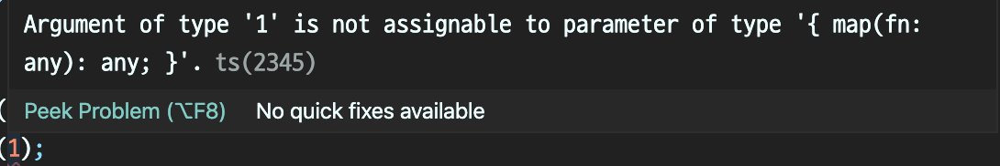
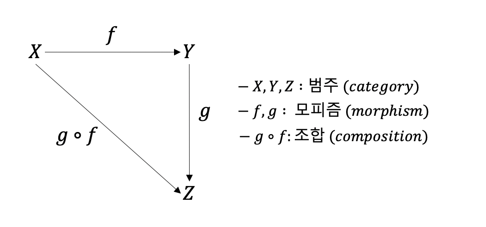
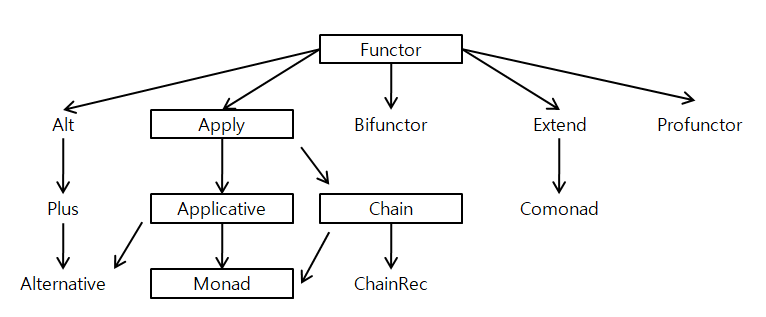
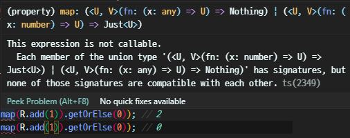
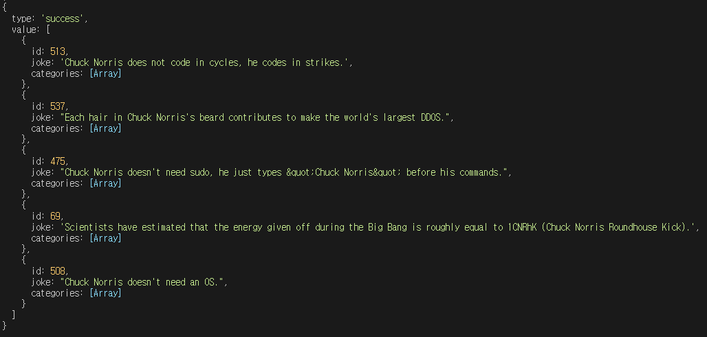
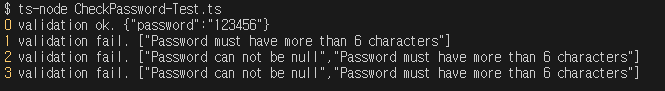
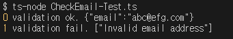

# 11장 모나드

<details><summary>Table of Contents</summary>

-   11-1 모나드 이해하기 [:link:](#11-1-모나드-이해하기)
    -   타입 클래스란? [:link:](#타입-클래스란)
    -   고차 타입이란? [:link:](#고차-타입이란)
    -   카테고리 이론이란? [:link:](#카테고리-이론이란)
    -   판타지랜드 규격 [:link:](#판타지랜드-규격)
    -   모나드 룰 [:link:](#모나드-룰)
-   11-2 Identity 모나드 이해와 구현 [:link:](#11-2-identity-모나드-이해와-구현)
    -   프로젝트 구성 [:link:](#프로젝트-구성)
    -   값 컨테이너 구현용 IValuable\<T> 인터페이스 구현 [:link:](#값-컨테이너-구현용-ivaluablet-인터페이스-구현)
    -   클래스 이름이 왜 Identity 인가? [:link:](#클래스-이름이-왜-identity-인가)
    -   값 컨테이너로서의 Identity\<T> 구현하기 [:link:](#값-컨테이너로서의-identityt-구현하기)
    -   ISetoid\<T> 인터페이스와 구현 [:link:](#isetoidt-인터페이스와-구현)
    -   IFunctor\<T> 인터페이스와 구현 [:link:](#ifunctort-인터페이스와-구현)
    -   엔도펑터란? [:link:](#엔도펑터란)
    -   IApply\<T> 인터페이스와 구현 [:link:](#iapplyt-인터페이스와-구현)
    -   IApplicative\<T> 인터페이스와 구현 [:link:](#iapplicativet-인터페이스와-구현)
    -   IChian\<T> 인터페이스와 구현 [:link:](#ichiant-인터페이스와-구현)
    -   IMonad\<T> 인터페이스와 구현 [:link:](#imonadt-인터페이스와-구현)
-   11-3 Maybe 모나드 이해와 구현 [:link:](#11-3-maybe-모나드-이해와-구현)
    -   프로젝트 구성 [:link:](#2)
    -   Maybe 모나드란? [:link:](#maybe-모나드란)
    -   Maybe 클래스 구조 [:link:](#maybe-클래스-구조)
    -   Maybe가 함수의 반환 타입일 때의 문제점 [:link:](#maybe가-함수의-반환-타입일-때의-문제점)
    -   Just 모나드 구현 [:link:](#just-모나드-구현)
    -   Nothing 모나드 구현 [:link:](#nothing-모나드-구현)
    -   Just와 Nothing 모나드 단위 테스트 [:link:](#just와-nothing-모나드-단위-테스트)
    -   Maybe 테스트 [:link:](#maybe-테스트)
-   11-4 Validation 모나드 이해와 구현 [:link:](#11-4-validation-모나드-이해와-구현)
    -   Validation 모나드란? [:link:](#validation-모나드란)
    -   Validation 클래스 구조 [:link:](#validation-클래스-구조)
    -   Success 모나드 구현 [:link:](#success-모나드-구현)
    -   Failure 모나드 구현 [:link:](#failure-모나드-구현)
    -   비밀번호 검증 기능 구현 [:link:](#비밀번호-검증-기능-구현)
    -   이메일 주소 검증 기능 구현 [:link:](#이메일-주소-검증-기능-구현)
-   11-5 IO 모나드 이해와 구현 [:link:](#11-5-io-모나드-이해와-구현)

</details>

## 11-1 모나드 이해하기

### 타입 클래스란?

**타입 클래스**의 필요성을 이해하는 것은 **모나드**를 이해하기 위해 중요하다.<br/>
아래의 2차 고차 함수 `callMap`은 고차 매개변수 `b`가 `map` 메서드를 가졌다는 가정으로 구현되었다.<br/>

```typescript
const callMap = (fn) => (b) => b.map(fn);
```

따라서 아래와 같은 코드를 사용하면 정상적으로 작동한다.<br/>

```typescript
callMap((a) => a + 1)([1]);
```

하지만 아래와 같이 작성시 프로그램이 비정상적으로 종료된다.<br/>

```typescript
callMap((a) => a + 1)(1);
```

이를 방지하려면 아래처럼 매개변수 `b`는 반드시 `map` 메서드가 있는 타입으로 제한해야 한다.<br/>

```typescript
const callMap = <T, U>(fn: (T) => U) => <T extends { map(fn) }>(b: T) =>
    b.map(fn);
```

아래와 같이 `map` 메서드가 없는 `1`은 고차 매개변수로 사용할 수 없다.<br/>



따라서 코드를 작성하는 시점에 프로그램이 비정상적으로 정료되는 것을 막을 수 있다.<br/>
보통 객체지향 언어라면 `map` 메서드를 갖는 `Number` 클래스를 구현하는 식으로 설계할 것이다.<br/>
하지만 **모나드** 방식 설계는 반드시 `map`과 `of`라는 메서드가 있는 `Monad<T>` 클래스를 만든다.<br/>

```typescript
class Monad<T> {
    constructor(public value: T) {}
    static of<U>(value: U): Monad<U> {
        return new Monad<U>(value);
    }
    map<U>(fn: (x: T) => U): Monad<U> {
        return new Monad<U>(fn(this.value));
    }
}
```

이처럼 `Monad<T>`와 같은 클래스를 **타입 클래스**라고 한다.<br/>
**타입 클래스**는 다음처럼 함수를 만들 때 특별한 타입으로 제약하지 않아도 된다.<br/>

```typescript
const callMonad = (fn) => (b) => Monad.of(b).map(fn).value;
```

**타입 클래스** 덕분에 **타입에 따른 안정성을 보장**하고 코드의 **재사용성이 뛰어난 범용 함수**를 쉽게 만들 수 있다.<br/>

```typescript
callMonad((a: number) => a + 1)(1); // 2
callMonad((a: number[]) => a.map((value) => value + 1))([1, 2, 3, 4]); // [ 2, 3, 4, 5 ]
```

`callMonad`와 같은 함수는 한 번만 만들면 위처럼 **매개변수의 타입에 무관**한 간결한 코드를 작성할 수 있다.<br/>

### 고차 타입이란?

`Monad<T>`는 타입 `T`를 `Monad<T>`로 변환했다 다시 타입 `T`로 변환해준다.<br/>
`Monad<T>`와 같이 타입 `T`를 한 단계 더 높은 타입으로 변환하는 용도의 타입을 **고차 타입**이라 한다.<br/>
**고차 타입**은 **카테고리 이론**이라는 수학에서 아이디어를 얻었다.<br/>
Typescript에서는 `Monad<T>`와 같이 **2차 고차 타입**을 만들 수 있게 하는 구문을 제공한다.<br/>
하지만 스칼라 언어처럼 `Functor[F[_]]` 같은 3차 이상의 고차 타입은 만들 수 없다.<br/>

### 카테고리 이론이란?

**카테고리 이론**은 1940년에 시작된 수학의 한 분야로 함수형 프로그래밍 언어의 중요한 이론적인 배경이 되었다.<br/>
**카테고리 이론**은 흔히 아래의 그림으로 표현된다.<br/>



수학에서 **집합**은 프로그래밍에서의 **타입**이다.<br/>
수학에서 **카테고리**는 **집합의 집합**으로 이해할 수 있다.<br/>
따라서 프로그래밍에서의 **카테고리**는 **타입의 타입**으로 **고차 타입**으로 이해할 수 있다.<br/>
또한 **모나드**는 별도의 특징이 있는 **고차 타입**이다.<br/>

### 판타지랜드 규격

**모나드**는 하스켈 언어의 `Prelude`라는 표준 라이브러리에서 사용되는 용어이기도 하다.<br/>
**모나드**는 **모나드 룰**이라고 하는 코드 설계 원칙에 맞춰 구현된 클래스를 의미한다.<br/>
아래 그림은 Github에 있는 [판타지랜드 규격](https://github.com/fantasyland/fantasy-land)에 있는 그림 중 부분이다.<br/>



판타지랜드 규격은 하스켈 표준 라이브러리 구조를 Javascript 방식으로 재구성한 것이다.<br/>
그림에서 보면 **모나드**는 아래 네 가지 요소를 구현한 것임을 알 수 있다.<br/>

-   **펑터**(**Functor**) : `map`이라는 인스턴스 메서드를 가지는 클래스
-   **어플라이**(**Apply**) : **펑터**이면서 `ap`라는 인스턴스 메서드를 가지는 클래스
-   **애플리커티브**(**Applicative**) : **어플라이**이면서 `of`라는 클래스 메서드를 가지는 클래스
-   **체인**(**Chain**) : **애플리커티브**이면서 `chain`이라는 메서드를 가지는 클래스

어떤 클래스가 위의 네 가지 조건을 모두 만족한다면 그 클래스는 **모나드**다.<br/>

### 모나드 룰

클래스 이름이 `M`이고 인스턴스를 `m`이라고 할때 **모나드**는 **애플리커티브**와 **체인**의 기능을 갖는다.<br/>
또한 해당 **모나드** 클래스는 아래와 같은 두 가지 법칙을 만족한다.<br/>

|             구분             |            의미            |
| :--------------------------: | :------------------------: |
|  왼쪽 법칙 (Left Identity)   | `M.of(a).chain(f) == f(a)` |
| 오른쪽 법칙 (Right Identity) |    `m.chain(M.of) == m`    |

하스켈의 `Prelude` 표준 라이브러리는 `Maybe`와 같은 미리 구현된 **모나드**를 제공한다.<br/>
Typescript는 **모나드** 라이브러리를 제공하지 않으므로 **판타지랜드 규격**에 맞춰 작성해야 한다.<br/>

[[🔝위로가기]](#11장-모나드)&nbsp; / &nbsp;[[🔙뒤로가기]](https://github.com/alstn2468/DoIt_Typescript_Programming/blob/master/README.md)

## 11-2 Identity 모나드 이해와 구현

### 프로젝트 구성

아래와 같이 Typescript를 사용하는 node.js 프로젝트를 구성한다.<br/>

```shell
> npm init --y
> npm i -D typescript ts-node @types/node
> mkdir -p src/test
> mkdir src/interfaces
> mkdir src/classes
```

`tsconfig.json` 파일은 아래와 같이 설정한다.<br/>

```typescript
{
    "compilerOptions": {
        "module": "CommonJS",
        "esModuleInterop": true,
        "target": "es5",
        "moduleResolution": "node",
        "outDir": "dist",
        "baseUrl": ".",
        "sourceMap": true,
        "downlevelIteration": true,
        "noImplicitAny": false,
        "paths": {
            "*": ["node_modules/*"]
        }
    },
    "include": ["src/**/*"]
}
```

기존에 사용했던 `tsconfig.json` 파일 설정들과 동일하게 설정하였다.<br/>

### 값 컨테이너 구현용 IValuable\<T> 인터페이스 구현

어떤 타입 `T`가 있을 때 배열 `T[]`는 같은 타입의 아이템을 여러 개 가진 **컨테이너**다.<br/>
보통 **컨테이너**라는 용어는 이처럼 흔히 **배열**을 의미한다.<br/>
하지만 `Monad<T>`처럼 **배열이 아닌 한 개의 값을 가지는 컨테이너 클래스**를 생각할 수 있다.<br/>
이 **컨테이너 클래스**는 모든 타입 `T`의 값을 가질 수 있는 **제네릭 컨테이너 클래스**다.<br/>
이처럼 타입 `T`를 가지는 값의 컨테이너를 **값 컨테이너**라고 한다.<br/>
**값 컨테이너**를 구현하기 위해 아래의 `IValuable<T>` 인터페이스를 작성한다.<br/>

-   `interfaces/IValuable.ts`

```typescript
export interface IValuable<T> {
    value(): T;
}
```

또한 앞으로 `Identity<T>`의 코드를 편하게 사용하고자 아래의 내용의 `index.ts`를 작성한다.<br/>

-   `interfaces/index.ts`

```typescript
import { IValuable } from "./IValuable";
import { ISetoid } from "./ISetoid";
import { IFunctor } from "./IFunctor";
import { IApplicative } from "./IApplicative";
import { IApply } from "./IApply";
import { IChain } from "./IChain";
import { IMonad } from "./IMonad";

export { IValuable, ISetoid, IFunctor, IApplicative, IApply, IChain, IMonad };
```

### 클래스 이름이 왜 Identity 인가?

**함수형 프로그래밍**에서 `identity`는 항상 아래처럼 구현하는 특별한 의미의 함수다.<br/>

```typescript
const identity = <T>(value: T): T => value;
```

앞에서 본 `ramda` 라이브러리의 `R.identity` 함수가 `identity`를 구현하고 있다.<br/>
`Identity`는 `map`, `ap`, `of`, `chain`과 같은 기본 메서드만 구현한 **모나드**다.<br/>
**카테고리 이론**에서 기존 타입에서 다른 타입으로 갔다 올 때 **값이 변경되지 않는 카테고리**를 `Identity`라고 한다.<br/>

```typescript
Identity.of(1).chain(Identity.of); // Identity.of(1)
```

위 코드의 `Identity<number>` 타입은 `chain` 메서드를 통해 다시 자신의 타입으로 돌아올 수 있다.<br/>

### 값 컨테이너로서의 Identity\<T> 구현하기

아래의 `Identity` 클래스는 값 속성인 `_value`를 `private`하게 가지고 있다.<br/>
따라서 `_value`를 얻기 위해 `public`한 `value` 메서드를 사용해야 한다.<br/>

-   `classes/Identity.ts`

```typescript
import { IValuable } from "../interfaces";

export class Identity<T> implements IValuable<T> {
    constructor(private _value: T) {}
    value() {
        return this._value;
    }
}
```

`Identity<T>` 클래스는 `IValuable<T>` 인터페이스를 구현하고 있는 **값 컨테이너 클래스다**.<br/>

### ISetoid\<T> 인터페이스와 구현

**판타지랜드 규격**에서 `setoid`는 `equals`라는 이름의 메서드를 제공하는 인터페이스를 의미한다.<br/>

-   `interfaces/ISetoid.ts`

```typescript
import { IValuable } from "./IValuable";

export interface ISetoid<T> extends IValuable<T> {
    equals<U>(value: U): boolean;
}
```

Typescript로 `setoid` 인터페이스는 위와 같이 구현할 수 있다.<br/>
`ISetoid<T>`에는 값이 없기 때문에 값을 비교하기 위해 `IValuable<T>` 인터페이스를 상속한다.<br/>
`Identity<T>`에 `ISetoid<T>` 인터페이스를 아래와 같이 구현할 수 있다.<br/>

-   `classes/Identity.ts`

```typescript
import { ISetoid } from "../interfaces";

export class Identity<T> implements ISetoid<T> {
    constructor(private _value: T) {}
    value() {
        return this._value;
    }
    equals<U>(that: U): boolean {
        if (that instanceof Identity) {
            return this.value() == that.value();
        }
        return false;
    }
}
```

`ISetoid<T>` 인터페이스를 상속한 후 `equals` 함수를 위와 같이 구현하였다.<br/>
아래의 테스트 코드를 사용해 구현된 `ISetoid<T>` 클래스를 테스트할 수 있다.<br/>

-   `test/ISetoid-Test.ts`

```typescript
import { Identity } from "../classes/Identity";

const one = new Identity(1),
    anotherOne = new Identity(1);
const two = new Identity(2);

console.log(one.equals(anotherOne)); // true
console.log(one.equals(two)); // false
console.log(one.equals(1)); // false
console.log(one.equals(null)); // false
console.log(one.equals([1])); // false
```

변수 `one`은 똑같은 `Identity<number>` 타입 변수인 `anotherOne`에만 `true`를 반환한다.<br/>
`equals` 함수에서 매개변수 `that`이 `Identity`의 인스턴스임을 판별하기 때문이다.<br/>
매개변수 `that`이 `Identity` 인스턴스가 아니면 무조건 `false`를 반환하게 된다.<br/>
만약 `Identity`의 인스턴스라면 `value` 함수로 값을 가져와 `==` 연산자로 비교하게 된다.<br/>

### IFunctor\<T> 인터페이스와 구현

**판타지랜드 규격**에서 **펑터**는 `map`이라는 메서드를 제공하는 인터페이스다.<br/>

-   `interfaces/IFunctor.ts`

```typescript
export interface IFunctor<T> {
    map<U>(fn: (x: T) => U);
}
```

**카테고리 이론**에서 **펑터**는 **엔도 펑터**라는 특별한 성질을 만족해야 한다.<br/>
Typescript 3.7.4 버전에서는 **엔도펑터**를 구현할 수 있게 하는 구문을 제공하지 않는다.<br/>
따라서 `IFunctor`의 `map` 메서드의 반환 타입을 생략한 이유는 **엔도 펑터**를 구현하기 위해서다.<br/>

### 엔도펑터란?

**엔도**는 단어 앞에 붙는 일종의 접두사다.<br/>
**엔도펑터**는 특정 카테고리에서 출발해 **다시 출발 카테고리로 도착**하는 **펑터**를 의미한다.<br/>
아래의 `Identity<T>`의 `map` 메서드의 구현 내용은 **엔도펑터**로 동작하게 하는 코드다.<br/>

-   `classes/Identtiy.ts`

```typescript
import { ISetoid, IFunctor } from "../interfaces";

export class Identity<T> implements ISetoid<T>, IFunctor<T> {
    constructor(private _value: T) {}

    // IValualbe
    value() {
        return this._value;
    }

    // ISetoid
    equals<U>(that: U): boolean {
        if (that instanceof Identity) {
            return this.value() == that.value();
        }
        return false;
    }

    // IFunctor
    map<U>(fn: (x: T) => U) {
        return new Identity<U>(fn(this.value()));
    }
}
```

값 타입 `T`가 `U`로 바뀔 수는 있지만 **카테고리**는 여전히 `Identity`에 머물게 한다.<br/>

### IApply\<T> 인터페이스와 구현

**판타지랜드 규격**에서 **어플라이**는 **펑터**이면서 `ap` 메서드를 제공하는 인터페이스다.<br/>

-   `interfaces/IApply.ts`

```typescript
import { IFunctor } from "./IFunctor";

export interface IApply<T> extends IFunctor<T> {
    ap<U>(b: U);
}
```

`IApply<T>`를 구현하는 **컨테이너**는 **값 컨테이너**이며 **고차 함수의 컨테이너**로도 동작한다.<br/>
아래와 같은 테스트 코드로 `IApply`의 동작을 이해할 수 있다.<br/>

-   `test/IApply-Test.ts`

```typescript
import { Identity } from "../classes/Identity";

const add = (x) => (y) => x + y;
const id = new Identity(add);

console.log(id.ap(1).ap(2).value()); // 3
```

`Identity`는 `add`라는 **2차 고차 함수**를 값으로 가지고 있다.<br/>
`add`는 **2차 고차 함수**이므로 `ap` 메서드를 두 번 호출해 함수를 동작시킨다.<br/>

```typescript
import { ISetoid, IApply } from "../interfaces";

export class Identity<T> implements ISetoid<T>, IApply<T> {
    // ... 생략 ...
    ap<U>(b: U) {
        const f = this.value();

        if (f instanceof Function) {
            return Identity.of<U>((f as Function)(b));
        }
    }
}
```

`IApply<T>` 인터페이스를 구현하는 `Identity` 클래스의 `ap` 메서드는 위와 같다.<br/>

### IApplicative\<T> 인터페이스와 구현

**판타지랜드 규격**에서 **애플리커티브**는 `Apply`면서 `of`라는 클래스 메서드를 제공하는 인터페이스다.<br/>

-   `interfaces/IApplicative.ts`

```typescript
import { IApply } from "./IApply";

export interface IApplicative<T> extends IApply<T> {
    // static of(value: T);
}
```

Typescript 3.7.4버전에서는 `interface`에 정적 메서드를 구현하지 못한다.<br/>
따라서 위와 같이 주석 처리를 한 후 `Identity` 클래스에 `of` 메서드를 구현해야 한다.<br/>

-   `classes/Identity.ts`

```typescript
import { ISetoid, IApplicative } from "../interfaces";

export class Identity<T> implements ISetoid<T>, IApplicative<T> {
    // ... 생략 ...
    static of<T>(value: T): Identity<T> {
        return new Identity<T>(value);
    }
}
```

또한 3.7.4 버전의 Typescript는 정적 메서드의 반환 타입에 `this`를 사용할 수 없다.<br/>
따라서 `IApply`의 `of` 메서드의 반환 타입을 생략해 구현하였다.<br/>

### IChian\<T> 인터페이스와 구현

**판타지랜드 규격**의 **체인**은 `Apply`면서 `chain`이라는 메서드를 구현하는 인터페이스다.<br/>

-   `interfaces/chain.ts`

```typescript
import { IApply } from "./IApply";

export interface IChain<T> extends IApply<T> {
    chain<U>(fn: (T) => U);
}
```

**모나드** 특성에 따라 `chain`은 `U` 타입을 반환하지 않을 수 있어 반환 타입을 지정하지 않았다.<br/>
**체인**의 `chain` 메서드는 **펑터**의 `map`과 달리 **엔도펑터**로 구현해야할 의미가 없다.<br/>
따라서 아래 코드의 `chain`은 `map`과 함수 시그니처는 같지만 구현 내용은 조금 다르다.<br/>

-   `classes/Identity.ts`

```typescript
import { ISetoid, IApplicative, IChain } from "../interfaces";

export class Identity<T> implements ISetoid<T>, IApplicative<T>, IChain<T> {
    // ... 생략...
    chain<U>(fn: (T) => U): U {
        return fn(this.value());
    }
}
```

**엔도 펑터**인 `map`은 항상 같은 카테고리에 머무른다.<br/>
반면에 `chain`은 자신이 머무르고 싶은 카테고리를 스스로 정해야 한다.<br/>

-   `test/IMap-IChain-Test.ts`

```typescript
import { Identity } from "../classes/Identity";

console.log(
    Identity.of(1)
        .map((value) => `the count is ${value}`)
        .value()
); // the count is 1
console.log(
    Identity.of(1).chain((value) =>
        Identity.of(`the count is ${value}`).value()
    )
); // the count is 1
```

위의 `map`과 `chain`을 사용하는 코드는 같은 결과를 보이지만 사용법에 차이가 있다.<br/>

### IMonad\<T> 인터페이스와 구현

**판타지랜드 규격**에서 **모나드**는 아래처럼 **체인**과 **애플리커티브**를 구현한 것이다.<br/>

-   `interfaces/IMonad.ts`

```typescript
import { IChain } from "./IChain";
import { IApplicative } from "./IApplicative";

export interface IMonad<T> extends IChain<T>, IApplicative<T> {}
```

이제 아래와 같은 `Identity<T>` 모나드가 완성 되었다.<br/>

-   `classes/Identity.ts`

```typescript
import { ISetoid, IMonad } from "../interfaces";

export class Identity<T> implements ISetoid<T>, IMonad<T> {
    constructor(private _value: T) {}

    // IValualbe
    value() {
        return this._value;
    }

    // ISetoid
    equals<U>(that: U): boolean {
        if (that instanceof Identity) {
            return this.value() == that.value();
        }
        return false;
    }

    // IFunctor
    map<U>(fn: (x: T) => U) {
        return new Identity<U>(fn(this.value()));
    }

    // IApply
    ap<U>(b: U) {
        const f = this.value();

        if (f instanceof Function) {
            return Identity.of<U>((f as Function)(b));
        }
    }

    // IApplicative
    static of<T>(value: T): Identity<T> {
        return new Identity<T>(value);
    }

    // IChain
    chain<U>(fn: (T) => U): U {
        return fn(this.value());
    }
}
```

아래 코드는 완성된 `Identity<T>` 모나드가 **왼쪽 법칙**을 만족하는지 테스트하는 코드다.<br/>

-   `test/IMonad-Left-Law-Test.ts`

```typescript
import { Identity } from "../classes/Identity";

const a = 1;
const f = (a) => a * 2;

console.log(Identity.of(a).chain(f) == f(a)); // true
```

위의 코드를 실행하면 `true`가 출력됨에 따라 `Identity<T>`가 **모나드 왼쪽 법칙**을 만족한다.<br/>
아래 코드는 `Identity<T>`가 **오른쪽 법칙**을 만족하는지 테스트하는 내용이다.<br/>

-   `test/IMonad-Right-Law-Test.ts`

```typescript
import { Identity } from "../classes/Identity";

const m = Identity.of(1);

console.log(m.chain(Identity.of).equals(m)); // true
```

위의 코드의 결과 역시 `true`가 출력되므로 `Identity<T>`가 **오른쪽 법칙**을 만족한다.<br/>
따라서 `Identity<T>`는 **오른쪽 법칙**과 **왼쪽 법칙** 모두 만족하므로 정상적인 **모나드**다.<br/>
아래 코드는 `Identity` 타입 객체의 메서드들을 메서드 체인 형태로 호출한다.<br/>

-   `test/IMonad-Method-Chain-Test.ts`

```typescript
import { Identity } from "../classes/Identity";

type IPerson = { name: string; age: number };
const jack = Identity.of(["Jack", 32]);

console.log(
    jack
        .map(([name, age]) => ({ name, age }))
        .chain((p: IPerson) => Identity.of(p))
        .map(({ name, age }) => [name, age])
        .value()[0] == jack.value()[0]
); // true
```

**모나드**는 위와 같이 **선언형 프로그래밍**을 염두에 두고 설계되었다.<br/>

[[🔝위로가기]](#11장-모나드)&nbsp; / &nbsp;[[🔙뒤로가기]](https://github.com/alstn2468/DoIt_Typescript_Programming/blob/master/README.md)

## 11-3 Maybe 모나드 이해와 구현

### 프로젝트 <span id="2">구성</span>

아래와 같이 Typescript를 사용하는 node.js 프로젝트를 구성한다.<br/>
이전 프로젝트에서 `ramda`와 `node-fetch` 패키지를 추가한다.<br/>
또한 11-2에서 작성한 `interfaces` 폴더의 내용을 그대로 복사해 사용한다.<br/>

```shell
> npm init --y
> npm i -S ramda node-fetch
> npm i -D typescript ts-node @types/node @types/ramda @types/node-fetch
> mkdir -p src/test
> mkdir src/classes
```

`tsconfig.json` 파일은 아래와 같이 설정한다.<br/>

```typescript
{
    "compilerOptions": {
        "module": "CommonJS",
        "esModuleInterop": true,
        "target": "es5",
        "moduleResolution": "node",
        "outDir": "dist",
        "baseUrl": ".",
        "sourceMap": true,
        "downlevelIteration": true,
        "noImplicitAny": false,
        "paths": {
            "*": ["node_modules/*"]
        }
    },
    "include": ["src/**/*"]
}
```

기존에 사용했던 `tsconfig.json` 파일 설정들과 동일하게 설정하였다.<br/>

### Maybe 모나드란?

`Maybe`는 오류일 때와 정상적일 때 모두 고려하며 코드를 간결하게 작성할 수 있게 해준다.<br/>
즉, `Maybe`는 **데이터의 유무**에 따라 코드가 적절하게 동작하도록 설계되었다.<br/>
`Maybe`는 하스켈 `Prelude` 표준 라이브러리에서 제공하는 **모나드**다.<br/>
앞에서 만든 `Option` 타입을 이용해 완전한 **모나드**로 동작하는 `Maybe`를 작성한다.<br/>
`Maybe` 모나드는 `Option`의 `Some`, `None`과 비슷한 `Just`와 `Nothing`이라는 타입을 제공한다.<br/>

```typescript
export class Maybe<T> {
    static Just<U>(value: U) {
        return new Just<U>(value);
    }
    static Nothing = new Nothing();
}
```

`Maybe`는 그 자체가 모나드가 아니라, `Maybe`가 제공하는 `Just<T>`와 `Nothing` 타입이 **모나드**다.<br/>
`Maybe`의 이런 설계 목적은 코드의 안정성을 함수형 방식으로 보장하기 위해서다.<br/>
예를 들어 Typescript는 수를 `0`으로 나누면 예외를 발생시키지 않고 `Infinity`값을 반환한다.<br/>
`Infinity`는 `number` 타입의 값이므로 프로그램이 정상 종료되지는 않지만 혼란을 줄 수 있다.<br/>
이처럼 `undefined`, `Infinity` 등의 값이 생길 때 `Maybe`를 사용하면 효율적으로 코드를 작성할 수 있다.<br/>

```typescript
import { Maybe, IMaybe } from "../classes/Maybe";

const divide = (a: number) => (b: number): IMaybe<number> =>
    b ? Maybe.Just(a / b) : Maybe.Nothing;
```

위의 코드는 `b`의 값이 `undefined`, `null`, `0`이 아닐 때는 `Maybe.Just(a / b)`가 반환된다.<br/>
하지만 그 반대로 `undefined`, `null`, `0`일 때는 `Maybe.Nothing`이 반환된다.<br/>
따라서 `divide` 함수를 사용하는 아래 코드는 간결하면서도 안정성을 해치지 않게된다.<br/>

```typescript
import * as R from "ramda";

console.log(divide(1)(1).map(R.add(1)).getOrElse(0)); // 2
console.log(divide(1)(0).map(R.add(1)).getOrElse(0)); // 0
```

`divide(1)(1)`는 `Just(1 / 1)`이 반환한 값을 `R.add(1)`에 더해 `2`를 출력하게 된다.<br/>
`divide(1)(0)`는 `Nothing`을 반환해 `R.add(1)`가 동작하지 않고 `getOrElse(0)`가 반환한 `0`을 출력한다.<br/>

### Maybe 클래스 구조

`Maybe` 클래스는 Typescript 언어의 특성을 고려해 아래와 같이 설계한다.<br/>

-   `classes/Maybe.ts`

```typescript
import { Just } from "./Just";
import { Nothing } from "./Nothing";
import { IMonad } from "../interfaces";
import { _IMaybe } from "./_IMaybe";

export class Maybe<T> {
    static Just<U>(value: U) {
        return new Just<U>(value);
    }
    static Nothing = new Nothing();
}

export type IMaybe<T> = _IMaybe<T> & IMonad<T>;
```

작성되지 않은 `Just`, `Nothing`, `_IMaybe`는 이후에 구현할 예정이다.<br/>
`IMaybe<T>`라는 타입을 내보내는 것은 Typescript 언어의 특징을 반영한 것이다.<br/>

### Maybe가 함수의 반환 타입일 때의 문제점

Typescript 3.7.4버전은 `Just<number> | Nothing`과 같은 합집합 타입을 만나면 오류가 발생한다.<br/>

```typescript
import * as R from "ramda";
import { Just } from "../classes/Just";
import { Nothing } from "../classes/Nothing";
import { Maybe, IMaybe } from "../classes/Maybe";

const divide = (a: number) => (b: number): Just<number> | Nothing =>
    b ? Maybe.Just(a / b) : Maybe.Nothing;

console.log(divide(1)(1).map(R.add(1)).getOrElse(0)); // 2
console.log(divide(1)(0).map(R.add(1)).getOrElse(0)); // 0
```

-   반환 타입이 `Just<number> | Nothing` 일 때 발생하는 오류



하지만 아래와 같이 `IMaybe`라는 인터페이스를 함수의 반환 타입으로 사용하면 정상 작동한다.<br/>

```typescript
import * as R from "ramda";
import { Maybe, IMaybe } from "../classes/Maybe";

const divide = (a: number) => (b: number): IMaybe<number> =>
    b ? Maybe.Just(a / b) : Maybe.Nothing;

console.log(divide(1)(1).map(R.add(1)).getOrElse(0)); // 2
console.log(divide(1)(0).map(R.add(1)).getOrElse(0)); // 0
```

따라서 `Maybe` 클래스는 아래 `_IMaybe`와 `IMonad` 인터페이스를 합한 `IMaybe` 타입을 제공한다.<br/>

-   `classes/_IMaybe.ts`

```typescript
export interface _IMaybe<T> {
    isJust(): boolean;
    isNothing(): boolean;
    getOrElse(defaultValue: T): T;
}
```

`Just`와 `Nothing` 클래스 모두 `_IMaybe`와 `IMonad`를 구현하기 때문에 오류가 발생하지 않는다.<br/>

### Just 모나드 구현

`Just` 모나드는 `Identity` 모나드에 `_IMaybe` 인터페이스를 구현한다.<br/>

-   `classes/Just.ts`

```typescript
import { IMonad } from "../interfaces";
import { _IMaybe } from "./_IMaybe";

export class Just<T> implements _IMaybe<T>, IMonad<T> {
    constructor(private _value: T) {}
    value(): T {
        return this._value;
    }

    static of<T>(value: T): Just<T> {
        return new Just<T>(value);
    }

    isJust() {
        return true;
    }
    isNothing() {
        return false;
    }
    getOrElse<U>(defaultValue: U) {
        return this.value();
    }

    map<U, V>(fn: (x: T) => U): Just<U> {
        return new Just<U>(fn(this.value()));
    }

    ap<U>(b: U) {
        const f = this.value();

        if (f instanceof Function) {
            return Just.of<U>((f as Function)(b));
        }
    }

    chain<U>(fn: (T) => U): U {
        return fn(this.value());
    }
}
```

다만 `Identity` 모나드와 달리 `ISetoid` 인터페이스를 구현하지 않는다.<br/>
이는 `Just`가 `Nothing`일 때를 고려해 `value()`가 아닌 `getOrElse(0)` 형태로 동작하기 위해서다.<br/>

### Nothing 모나드 구현

`Nothing` 모나드는 `Just` 모나드와 달리 코드를 완벽하게 실행시키지 않는 것이 목적이다.<br/>

-   `classes/Nothing.ts`

```typescript
import { IMonad } from "../interfaces";
import { _IMaybe } from "./_IMaybe";

export class Nothing implements _IMaybe<null>, IMonad<null> {
    static of<T>(value: T = null): Nothing {
        return new Nothing();
    }

    isJust() {
        return false;
    }
    isNothing() {
        return true;
    }
    getOrElse<U>(defaultValue: U) {
        return defaultValue;
    }

    map<U, V>(fn: (x) => U): Nothing {
        return new Nothing();
    }

    ap<U>(b: U) {
        return new Nothing();
    }

    chain<U>(fn: (T) => U): Nothing {
        return new Nothing();
    }
}
```

위의 코드는 `divide(1)(0).map(R.add(1))` 형태의 코드가 비정상적으로 동작하지 않게 한다.<br/>
또한 가장 마지막에 호출된 `getOrElse(0)` 메서드의 기본값을 반환하는 것을 목표로한다.<br/>

### Just와 Nothing 모나드 단위 테스트

`Just`는 정상적일 때 동작하는 모나드이므로 항상 실제값을 반환해야 한다.<br/>
아래 코드는 `Just`가 정상적으로 동작하며 `_IMaybe` 인터페이스 기능을 제공하는 것을 보여준다.<br/>

-   `test/Just-Test.ts`

```typescript
import * as R from "ramda";
import { Just } from "../classes/Just";

console.log(Just.of(100).isJust()); // true
console.log(Just.of(100).isNothing()); // false
console.log(Just.of(100).getOrElse(1)); // 100
console.log(Just.of(100).map(R.identity).getOrElse(1)); // 100
console.log(Just.of(R.identity).ap(100).getOrElse(1)); // 100
console.log(Just.of(100).chain(Just.of).getOrElse(1)); // 100
```

`Nothing` 모나드는 `Just`와 달리 자신의 모나드 관련 코드를 동작시키지 말아야 한다.<br/>
또한 `undefined`나 `null`, `Nan`, `Infinity`와 같은 값을 반환해서도 안된다.<br/>

-   `test/Nothing-Test.ts`

```typescript
import { Nothing } from "../classes/Nothing";
import { Just } from "../classes/Just";

console.log(Nothing.of().isJust()); // false
console.log(Nothing.of().isNothing()); // true
console.log(Nothing.of().getOrElse(1)); // 1
console.log(
    Nothing.of()
        .map((x) => x + 1)
        .getOrElse(1)
); // 1
console.log(Nothing.of().ap(1).getOrElse(1)); // 1
console.log(Nothing.of().chain(Just.of).getOrElse(1)); // 1
```

위와 같이 `Nothing` 모나드를 사용하면 `getOrElse`로 넘겨진 기본값만 반환하는 것을 볼 수 있다.<br/>

### Maybe 테스트

웹 브라우저에서 API 서버에서 데이터를 가져올 때는 `fetch`라는 함수를 사용한다.<br/>
`fetch` 함수는 웹 브라우저에서는 제공하지만 `Node.js` 환경에서는 제공하지 않는다.<br/>
`node-fetch` 패키지를 설치하면 `Node.js` 환경에서도 `fetch`함수를 사용할 수 있다.<br/>
`fetch` 함수는 아래처럼 문자열로 된 URL을 입력 매개변수로 호출해 `Promise` 객체를 반환한다.<br/>

```typescript
fetch(url: string): Promise
```

`fetch`가 반환한 `Promise` 객체는 `then` 메서드를 호출해 응답 객체 얻을 수 있다.<br/>
얻은 응답 객체는 `text`, `blob`, `json`과 같은 메서드를 호출해 실제 데이터를 얻을 수 있다.<br/>
아래 코드는 `fetch` 함수를 사용해 `JSON` 포맷으로된 데이터를 가져오는 예시다.<br/>

-   `fetchJokes.ts`

```typescript
import fetch from "node-fetch";

export const fetchJokes = <T>() =>
    new Promise<T>((resolve, reject) => {
        const jokeUrl = "https://api.icndb.com/jokes/random/5?limitTo=[nerdy]";

        fetch(jokeUrl)
            .then((res) => res.json())
            .then((fetchResult: unknown) => resolve(fetchResult as T))
            .catch((e: Error) => reject(e));
    });
```

`jokeUrl` 변수에 담긴 페이지는 `JSON` 포맷으로 데이터를 보내므로 `json` 메서드를 호출한다.<br/>
이렇게 얻은 실제 `JSON` 데이터는 구체적인 타입을 알 수 없으므로 `unknown`으로 해석해 얻는다.<br/>
아래의 코드를 통해 작성한 `fetchJokes` 함수를 테스트할 수 있다.<br/>

-   `test/FetchJokes-Test.ts`

```typescript
import { fetchJokes } from "../fetchJokes";

fetchJokes()
    .then((result) => console.log(result))
    .catch((e: Error) => console.log(e.message));
```

위의 코드를 실행하면 아래와 같은 형태의 `JSON` 포맷의 데이터가 출력된다.<br/>



위의 화면으로부터 데이터는 아래와 같은 형태의 타입을 가지고 있음을 알 수 있다.<br/>

```typescript
{
    type: string,
    value: {
        id: number,
        joke: string,
        category: string[][]
    }
}
```

아래 코드는 `fetchJokes` 함수의 결과를 가공해 데이터 중 하나를 랜덤하게 선택하게 하는 코드다.<br/>

-   `getRandomJoke.ts`

```typescript
import { fetchJokes } from "./fetchJokes";

const random = (max: number) => Math.floor(Math.random() * max);

export type FetchResult = { type: string; value: JokeType[] };
export type JokeType = {
    id: number;
    joke: string;
    category: string[];
};

export const getRandomJoke = () =>
    new Promise<JokeType>((resolve, reject) => {
        fetchJokes<FetchResult>()
            .then((result: FetchResult) => {
                let array: JokeType[] = result.value;
                resolve(array[random(array.length)]);
            })
            .catch((e: Error) => reject(e));
    });
```

아래 코드는 작성한 `getRandomJoke` 함수를 테스트하는 코드다.<br/>

-   `test/GetRandomJoke-Test.ts`

```typescript
import * as R from "ramda";
import { getRandomJoke, JokeType } from "../getRandomJoke";

getRandomJoke()
    .then((JokeItem: JokeType) => {
        const joke = R.view(R.lensProp("joke"))(JokeItem);
        console.log(joke);
    })
    .catch((e: Error) => console.log(e.message));
```

`ramda` 라이브러리의 **렌즈** 기능을 사용해 `joke` 속성값만 얻어 출력한다.<br/>
`getRandomJoke` 함수는 `then`과 `catch`문을 사용해 코드가 조금 번거롭다.<br/>
아래와 같이 `getRandomJoke` 함수로 얻은 값을 `Maybe` 모나드를 사용해 가공할 수 있다.<br/>

-   `getJokeAsMaybe.ts`

```typescript
import * as R from "ramda";
import { getRandomJoke, JokeType } from "./getRandomJoke";
import { IMaybe, Maybe } from "./classes/Maybe";

const _getJokeAsMaybe = async () => {
    const jokeItem: JokeType = await getRandomJoke();
    const joke = R.view(R.lensProp("joke"))(jokeItem);
    return joke;
};

export const getJokeAsMaybe = () =>
    new Promise<IMaybe<string>>((resolve, reject) => {
        _getJokeAsMaybe()
            .then((joke: string) => resolve(Maybe.Just(joke)))
            .catch((e) => resolve(Maybe.Nothing));
    });

export { IMaybe, Maybe };
```

위와 같이 구현된 `getJokeAsMaybe`는 에러가 발생해도 `reject`대신 `Maybe.Nothing`을 반환한다.<br/>
작성한 `getJokeAsMaybe` 함수는 아래와 같이 테스트할 수 있다.<br/>

-   `test/GetJokeAsMaybe-Test.ts`

```typescript
import { getJokeAsMaybe, IMaybe } from "../getJokeAsMaybe";

(async () => {
    const joke: IMaybe<string> = await getJokeAsMaybe();
    console.log(joke.getOrElse("something wrong"));
})();
```

위와 같이 `Maybe` 모나드를 사용해 `then`, `catch` 구문을 사용하지 않고 코드를 작성할 수 있다.<br/>
`Maybe` 모나드는 이처럼 **오류일 때와 정상일 때를 모두 고려**하며 **간결하게 코드를 작성**할 수 있다.<br/>

[[🔝위로가기]](#11장-모나드)&nbsp; / &nbsp;[[🔙뒤로가기]](https://github.com/alstn2468/DoIt_Typescript_Programming/blob/master/README.md)

## 11-4 Validation 모나드 이해와 구현

### Validation 모나드란?

`Validation` 모나드는 **데이터가 유효한지 판단**하는 용도로 설계된 **모나드**다.<br/>
`Validation` 모나드는 **판타지랜드 규격**의 **어플라이** 규격에 의존해 동작한다.<br/>
`Validation` 모나드는 `Success`와 `Failure` 두 가지 모나드로 구성된다.<br/>
`Success`와 `Failure` 모나드는 `Identity` 모나드의 `ap` 메서드 방식으로 동작한다.<br/>
`ap` 메서드를 사용할 때는 `Identity` 모나드의 `value`가 함수여야 한다.<br/>

-   `test/Ap-Test.ts`

```typescript
import { Identity } from "../classes/Identity";

const add = (a: number) => (b: number) => a + b;
console.log(add(1)(2)); // 3
console.log(Identity.of(add).ap(1).ap(2).value()); // 3
```

위의 코드는 `Identity`에 **2차 고차 함수**를 `value`로 한 뒤 `ap` 메서드를 두 번 호출해 `3`을 만든다.<br/>
또한 **N차 고차 함수**를 아래와 같이 만들 수 도 있다.<br/>

-   `getRandomJoke.ts`

```typescript
import { Identity } from "./classes/Identity";

type ISuccess = { isSuccess: boolean; isFailure: boolean };

const checkSuccess = (a: ISuccess) => (b: ISuccess): boolean =>
    [a, b].filter(({ isFailure }) => isFailure == true).length == 0;

const isSuccess = Identity.of(checkSuccess)
    .ap({
        isSuccess: true,
        isFailure: false,
    })
    .ap({ isSuccess: false, isFailure: true })
    .value();

console.log(isSuccess); // false
```

`checkSuccess` 함수는 두 개의 고차 매개변수를 배열로 만든다.<br/>
그 후 `isFailure`값이 `true`인 것들만 추려내 개수가 `0`일 때만 성공이라고 판단한다.<br/>
`Validation` 클래스가 제공하는 `Success`와 `Failure` 모나드는 이런 방식으로 동작한다.<Br/>

### Validation 클래스 구조

`Validation` 모나드는 `Maybe`와 비슷하게 `Success`와 `Failure` 두 가지로 구성된다.<br/>
`Success`와 `Failure`는 내부적으로 데이터의 **유효성 검증 상태를 판단해 동작**한다.<br/>

-   `classes/Validation.ts`

```typescript
import { Success } from "./Success";
import { Failure } from "./Failure";

export class Validation {
    static Success = Success;
    static Failure = Failure;
    static of<T>(fn: T): Success<T> {
        return Success.of<T>(fn);
    }
}

export { Success, Failure };
```

-   `classes/IValidation.ts`

```typescript
export interface IValidation<T> {
    isSuccess: boolean;
    isFailure: boolean;
}
```

`Success`와 `Failure` 모나드는 위의 `IValidation` 인터페이스를 구현한다.<br/>

### Success 모나드 구현

`Success` 모나드는 `IChain` 형태로는 동작하지 않으므로 `IFunctor`, `IApply`, `IApplicative`만 구현한다.<br/>

-   `classes/Success.ts`

```typescript
import { IApplicative } from "../interfaces";
import { IValidation } from "./IValidation";

export class Success<T> implements IValidation<T>, IApplicative<T> {
    constructor(
        public value: T,
        public isSuccess = true,
        public isFailure = false
    ) {}

    static of<U>(value: U): Success<U> {
        return new Success<U>(value);
    }

    map<U>(fn: (x: T) => U) {
        return new Success<U>(fn(this.value));
    }

    ap(b) {
        return b.isFailure ? b : b.map(this.value);
    }
}
```

`ap` 메서드는 매개변수가 `Failure`인지에 따라 조금 다르게 동작한다.<br/>
`Success`의 `value`는 함수이므로 `b.map(this.value)`같이 `map` 함수의 콜백 함수로 사용될 수 있다.<br/>
아래의 코드로 작성한 `Success` 클래스를 테스트할 수 있다.<br/>

-   `test/Success-Test.ts`

```typescript
import { Success } from "../classes/Success";

const checkSuccess = <T>(a: Success<T>) => (b: Success<T>): boolean =>
    [a, b].filter(({ isFailure }) => isFailure == true).length == 0;

console.log(Success.of(checkSuccess).ap(Success.of(1)).ap(Success.of(2)));
// Success { value: true, isSuccess: true, isFailure: false }
```

`checkSuccess`가 최종적으로 `boolean` 타입 값을 반환하므로 최종 `Success` 객체의 `value`는 `true`다.<br/>

### Failure 모나드 구현

`Failure` 모나드는 최종적으로 실패한 원인을 문자열 배열로 저장한다.<br/>

-   `classes/Failure.ts`

```typescript
import { IValidation } from "./IValidation";
import { IApplicative } from "../interfaces";

export class Failure<T> implements IValidation<T>, IApplicative<T> {
    constructor(
        public value: T[],
        public isSuccess = false,
        public isFailure = true
    ) {}

    static of<U>(value: U[]): Failure<U> {
        return new Failure<U>(value);
    }

    map(fn) {
        return new Failure<T>(fn(this.value));
    }

    ap(b) {
        return b.isFailure ? new Failure<T>([...this.value, ...b.value]) : this;
    }
}
```

`Failure`의 `ap` 메서드에서 기존 에러 문자열 배열에 현재 에러 문자열 배열을 **전개 연산자로 병합**한다.<br/>

### 비밀번호 검증 기능 구현

비밀번호를 검증하기 위해서는 객체에는 `string` 타입의 `password` 속성이 있어야한다.<br/>
아래의 `checkNull` 함수는 이런 내용을 검증한다.<br/>

-   `utils/checkNull.ts`

```typescript
import { Success, Failure } from "../classes/Validation";

export const checkNull = <S, F>(o: { password?: string }) => {
    const { password } = o;

    return password == undefined || typeof password != "string"
        ? new Failure(["Password can not be null"])
        : new Success(o);
};
```

문자열의 길이가 최소 6자 이상이어야 한다는 검증은 아래의 `checkLength` 함수로 구현한다.<br/>

-   `utils/checkLength.ts`

```typescript
import { Success, Failure } from "./../classes/Validation";

export const checkLength = (
    o: { password?: string },
    minLength: number = 6
) => {
    const { password } = o;
    return !password || password.length < minLength
        ? new Failure([`Password must have more than ${minLength} characters`])
        : new Success(o);
};
```

비밀번호 유효성 검증은 `checkNull`와 `checkLength`가 모두 `Success`를 반환하는지 판별해야한다.<br/>
아래 코드의 `checkPassword`는 이러한 내용을 구현한 예시다.<br/>

-   `checkPassword.ts`

```typescript
import { Validation } from "./classes/Validation";
import { checkNull } from "./utils/checkNull";
import { checkLength } from "./utils/checkLength";

export const checkPassword = (o): [object, string[]] => {
    const result = Validation.of((a) => (b) => o)
        .ap(checkNull(o))
        .ap(checkLength(o));

    return result.isSuccess
        ? [result.value, undefined]
        : [undefined, result.value];
};
```

아래의 테스트 코드로 작성한 `checkPassword` 함수의 동작을 확인할 수 있다.<br/>

-   `test/CheckPassword-Test.ts`

```typescript
import { checkPassword } from "../checkPassword";

[{ password: "123456" }, { password: "1234" }, {}, { pa: "123456" }].forEach(
    (target, index) => {
        const [value, failureReason] = checkPassword(target);

        if (failureReason) {
            console.log(
                index,
                `validation fail.`,
                JSON.stringify(failureReason)
            );
        } else {
            console.log(index, `validation ok.`, JSON.stringify(value));
        }
    }
);
```

-   `CheckPassword-Test.ts` 실행 결과



`{ password: '123456' }`과 같은 정상적인 비밀번호일 경우 `validation ok.` 메시지를 확인할 수 있다.<br/>
반면에 `{}`나 `{ pa: '123456' }`과 같이 검증이 실패한 경우 검증에 실패한 이유를 확인할 수 있다.<br/>

### 이메일 주소 검증 기능 구현

이메일 주소처럼 어떤 일정한 패턴이 있을 때는 **정규식**을 사용해 유효성을 판별한다.<br/>
아래의 코드는 **정규식**을 이용해 이메일 주소를 검증하는 함수다.<br/>

-   `utils/checkEmailAddress.ts`

```typescript
import { Success, Failure } from "../classes/Validation";

export const checkEmailAddress = (o: { email?: string }) => {
    const { email } = o;

    const re = new RegExp(
        /^(([^<>()\[\]\\.,;:\s@"]+(\.[^<>()\[\]\\.,;:\s@"]+)*)|(".+"))@((\[[0-9]{1,3}\.[0-9]{1,3}\.[0-9]{1,3}\.[0-9]{1,3}\])|(([a-zA-Z\-0-9]+\.)+[a-zA-Z]{2,}))$/
    );

    return re.test(email)
        ? new Success(email)
        : new Failure(["Invalid email address"]);
};
```

`checkEmail` 함수는 `checkEmailAddress` 함수를 사용해 데이터 유효성을 판별하도록 구현되었다.<br/>

-   `checkEmail.ts`

```typescript
import { Validation } from "./classes/Validation";
import { checkEmailAddress } from "./utils/checkEmailAddress";

export const checkEmail = (o): [object, string[]] => {
    const result = Validation.of((a) => o).ap(checkEmailAddress(o));

    return result.isSuccess
        ? [result.value, undefined]
        : [undefined, result.value];
};
```

`checkPassword`와 달리 `email` 속성이 `null`인지 판별하지 않는다.<br/>
따라서 `Validation.of`에 1차 함수가 적용되며 `ap` 메서드 또한 한 번만 호출된다.<br/>
아래의 테스트 코드로 작성한 `checkEmail` 함수의 동작을 확인할 수 있다.<br/>

-   `test/CheckEmail-Test.ts`

```typescript
import { checkEmail } from "../checkEmail";

[{ email: "abc@efg.com" }, { email: "abcefg" }].forEach((target, index) => {
    const [value, failureReason] = checkEmail(target);

    if (failureReason) {
        console.log(index, "validation fail.", JSON.stringify(failureReason));
    } else {
        console.log(index, "validation ok.", JSON.stringify(value));
    }
});
```

-   `CheckEmail-Test.ts` 실행 결과



위와 같이 `abc@efg.com`은 검증에 성공했지만 `abcdef`와 같은 단순 문자열은 틀린 주소로 판별한다.<br/>

[[🔝위로가기]](#11장-모나드)&nbsp; / &nbsp;[[🔙뒤로가기]](https://github.com/alstn2468/DoIt_Typescript_Programming/blob/master/README.md)

## 11-5 IO 모나드 이해와 구현

[[🔝위로가기]](#11장-모나드)&nbsp; / &nbsp;[[🔙뒤로가기]](https://github.com/alstn2468/DoIt_Typescript_Programming/blob/master/README.md)
