# 12장 프로젝트 실습

<details><summary>Table of Contents</summary>

-   12-1 빅데이터 배치 프로그램 만들기 [:link:](#12-1-빅데이터-배치-프로그램-만들기)
    -   실습 프로젝트 구성 [:link:](#실습-프로젝트-구성)
    -   CSV 파일과 생성기 [:link:](#csv-파일과-생성기)
    -   node.js에서 프로그램 명령 줄 인수 읽기 [:link:](#nodejs에서-프로그램-명령-줄-인수-읽기)
    -   파일 처리 비동기 함수를 Promise로 구현하기 [:link:](#파일-처리-비동기-함수를-promise로-구현하기)
    -   그럴듯한 가짜 데이터 만들기 [:link:](#그럴듯한-가짜-데이터-만들기)
    -   Object.keys와 Object.values 함수 사용하기 [:link:](#objectkeys와-objectvalues-함수-사용하기)
    -   CSV 파일 만들기 [:link:](#csv-파일-만들기)
    -   데이터를 CSV 파일에 쓰기 [:link:](#데이터를-csv-파일에-쓰기)
    -   zip 함수 만들기 [:link:](#zip-함수-만들기)
    -   CSV 파일 데이터 읽기 [:link:](#csv-파일-데이터-읽기)
-   12-2 몽고DB에 데이터 저장하기 [:link:](#12-2-몽고db에-데이터-저장하기)
    -   몽고DB란? [:link:](#몽고db란)
    -   몽고DB 설치 [:link:](#몽고db-설치)
    -   프로젝트 구성 [:link:](#프로젝트-구성)
    -   몽고DB에 접속하기 [:link:](#몽고db에-접속하기)
    -   데이터베이스 연결 [:link:](#데이터베이스-연결)
    -   컬렉션이란? [:link:](#컬렉션이란)
    -   문서를 컬렉션에 저장하기 [:link:](#문서를-컬렉션에-저장하기)
    -   몽고 셸에 접속하기 [:link:](#몽고-셸에-접속하기)
    -   \_id속성과 ObjectId 타입 [:link:](#_id속성과-objectid-타입)
    -   문서 찾기 [:link:](#문서-찾기)
    -   문서 삭제하기 [:link:](#문서-삭제하기)
    -   검색 결과 정렬하기 [:link:](#검색-결과-정렬하기)
    -   CSV 파일을 몽고DB에 저장하기 [:link:](#csv-파일을-몽고db에-저장하기)
    -   limit과 skip 메서드 [:link:](#limit과-skip-메서드)
-   12-3 익스프레스로 API 서버 만들기 [:link:](#12-3-익스프레스로-api-서버-만들기)
    -   실습 프로젝트 구성 [:link:](#project-setup-two)
    -   REST 방식 서버 [:link:](#rest-방식-서버)
    -   익스프레스 프레임워크 [:link:](#익스프레스-프레임워크)
    -   라우팅 기능 구현 [:link:](#라우팅-기능-구현)
    -   익스프레스 미들웨어 추가 [:link:](#익스프레스-미들웨어-추가)
    -   몽고DB 연결 [:link:](#몽고db-연결)
-   12-4 리액트와 부트스트랩으로 프론트엔드 웹 만들기 [:link:](#12-4-리액트와-부트스트랩으로-프론트엔드-웹-만들기)

</details>

## 12-1 빅데이터 배치 프로그램 만들기

### 실습 프로젝트 구성

이 프로젝트에서는 `node.js`의 `fs` 패키지를 사용하므로 `@types/node` 패키지를 설치한다.<br/>
아래의 명령어를 실행해 `package.json` 파일을 생성하고 패키지를 설치한다.<br/>

```shell
> npm init --y
> npm i -D typescript ts-node @types/node
```

폴더를 생성하고 삭제하는 기능을 구현하기 위해 아래의 두 패키지를 설치한다.<br/>

```shell
> npm i -S mkdirp rimraf
> npm i -D @types/mkdirp @types/rimraf
```

또한 가짜 데이터를 만들어주는 `chance` 패키지를 설치한다.<br/>

```shell
> npm i -S chance
> npm i -D @types/chance
```

`tsconfig.json` 파일은 아래와 같이 설정한다.<br/>

```json
{
    "compilerOptions": {
        "module": "CommonJS",
        "esModuleInterop": true,
        "target": "es5",
        "moduleResolution": "node",
        "outDir": "dist",
        "baseUrl": ".",
        "sourceMap": true,
        "downlevelIteration": true,
        "noImplicitAny": false,
        "paths": {
            "*": ["node_modules/*"]
        }
    },
    "include": ["src/**/*"]
}
```

아래와 같이 프로젝트에 필요한 폴더들을 생성해준다.<br/>

```shell
> mkdir -p src/fileApi
> mkdir src/fake
> mkdir src/csv
> mkdir src/utils
> mkdir src/test
```

### CSV 파일과 생성기

Javascript나 Typescript는 파일에 데이터를 저장할 때 주로 `JSON` 포맷을 사용한다.<br/>
하지만 저장할 데이터의 양이 많아지면 `JSON`파일 포맷은 시스템 메모리를 많이 사용한다.<br/>
따라서 데이터를 파일에 저장할 때는 `JSON`처럼 나중에 읽기 쉬운 형식으로 만든다.<br/>
보통 테이블 형태의 데이터는 파일 확장자가 `csv`인 파일에 저장한다.<br/>
CSV 파일은 데이터가 아래와 같은 형식으로 저장된 파일을 말한다.<br/>

```csv
name,email,ip,phone
Leona Alexander,ikefo@ved.ws,32.133.3.226,(502) 739-6533
```

CSV 파일 형식은 맨 첫 줄의 헤더 정보에 데이터를 나타내는 이름을 `,`로 구분한다.<br/>
그 다음 줄부터는 각 이름에 해당하는 데이터를 똑같이 `,`로 구분해 놓을 수 있다.<br/>
또한 CSV파일은 JSON파일과 달리 데이터를 한꺼번에 읽지 않고 한줄 씩 읽는다.<br/>
**생성기**는 시스템 자원을 매우 적게 소모하며 엄청난 분량의 데이터를 처리할 수 있도록 한다.<br/>
CSV파일을 한 줄씩 읽으며 Typescript 객체로 변환한 후 `yield`문으로 넘겨줄 수 있다.<br/>
`for...of` 구문으로 `yield`문으로 넘겨받은 하나의 객체를 대상으로 작업을 진행한다.<br/>

### node.js에서 프로그램 명령 줄 인수 읽기

`node.js` 프로그램을 실행하면 아래처럼 실행 명령 뒤에 여러 개의 매개변수를 입력할 수 있다.<br/>

```shell
> ts-node src/test/processArgs-test.ts data/fake.csv 100000
```

이와 같이 프로그램을 실행할 때 외부에서 입력된 값을 **명령 줄 인수**라고 한다.<br/>
`node.js`가 제공하는 `process` 내장 객체의 `argv` 배열 속성에서 **명령 줄 인수**를 얻을 수 있다.<br/>

-   `test/processArgs-Test.ts`

```typescript
process.argv.forEach((val: string, index: number) => {
    console.log(index + ": " + val);
});
```

-   `test/processArgs-Test.ts` 실행결과

```shell
0: C:\...\nodejs\node_modules\ts-node\dist\bin.js
1: C:\...\test\processArgs-test.ts
2: data/fake.csv
3: 100000
```

위와 같이 `data/fake.csv`와 `100000` 값은 `index`가 `2`와 `3`일 때 얻어지는 것을 볼 수 있다.<br/>
이 내용을 바탕으로 `utils` 폴더에 `getFileNameAndNumber.ts` 함수를 작성한다.<br/>

-   `utils/getFileNameAndNumber.ts`

```typescript
export type FileNameAndNumber = [string, number];

export const getFileNameAndNumber = (
    defaultFileName: string,
    defaultNumberOfFakeData: number
): FileNameAndNumber => {
    const [bin, node, filename, numberOfFakeData] = process.argv;
    return [
        filename || defaultFileName,
        numberOfFakeData
            ? parseInt(numberOfFakeData, 10)
            : defaultNumberOfFakeData,
    ];
};
```

아래의 테스트 코드를 사용해 작성한 `getFileNameAndNumber` 함수를 테스트할 수 있다.<br/>

-   `test/getFileNameAndNumber-Test.ts`

```typescript
import { getFileNameAndNumber } from "../utils/getFileNameAndNumber";

const [fileName, numberOfFakeItems] = getFileNameAndNumber(
    "data/fake.csv",
    100000
);
console.log(fileName, numberOfFakeItems); // data/fake.csv 100000
```

위와 같이 **명령 줄 인수**로 넘긴 파일 이름과 숫자를 얻을 수 있다.<br/>

### 파일 처리 비동기 함수를 Promise로 구현하기

#### (1) fs.access API로 디렉터리나 파일 확인하기

`fs.access` 함수를 사용하면 파일이나 디렉터리가 있는지 없는지 확인할 수 있다.<br/>
아래 코드는 파일이나 디렉터리가 있는지 확인하는 기능을 `Promise` 형태로 구현했다.<br/>

-   `fileApi/fileExists.ts`

```typescript
import * as fs from "fs";

export const fileExists = (filePath: string): Promise<boolean> =>
    new Promise((resolve) =>
        fs.access(filePath, (error) => resolve(error ? false : true))
    );
```

`fs.access` 함수를 사용해 파일이나 디렉터리가 있는지 확인해 `Promise`를 반환한다.<br/>
아래의 테스트 코드로 작성한 `fileExists` 함수를 테스트할 수 있다.<br/>

-   `test/fileExists-Test.ts`

```typescript
import { fileExists } from "../fileApi/fileExists";

const exists = async (filePath) => {
    const result = await fileExists(filePath);
    console.log(`${filePath} ${result ? "exists" : "not exists"}`);
};

exists("./package.json"); // ./package.json exists
exists("./package"); // ./package not exists
```

위와 같이 파일이나 디렉터리의 존재여부를 확인할 수 있는 것을 볼 수 있다.<br/>

#### (2) mkdirp 패키지로 디렉터리 생성 함수 만들기

`node.js`는 `mkdir`이라는 API를 제공한다.<br/>
하지만 `mkdir`은 `./src/data/today`처럼 여러 경로의 디렉터리를 한번에 만들지는 못한다.<br/>
반면에 `mkdirp` 패키지는 `mkdir -p` 처럼 한번에 여러 디렉터리를 만드는 기능을 제공한다.<br/>
아래 코드는 디렉터리가 있는지를 판단해 없을 때만 `mkdirp` 함수로 디렉터리를 생성한다.<br/>

-   `fileApi/mkdir.ts`

```typescript
import mkdirp from "mkdirp";
import { fileExists } from "./fileExists";

export const mkdir = (dirname: string): Promise<string> =>
    new Promise(async (resolve, reject) => {
        const alreadyExists = await fileExists(dirname);
        alreadyExists
            ? resolve(dirname)
            : mkdirp(dirname, (error) =>
                  error ? reject(error) : resolve(dirname)
              );
    });
```

아래의 테스트 코드로 동작을 확인할 수 있다.<br/>

-   `test/mkdir-Test.ts`

```typescript
import { mkdir } from "../fileApi/mkdir";

const makeDataDir = async (dirname: string) => {
    let result = await mkdir(dirname);
    console.log(`'${result}' dir created`);
};

makeDataDir("./data/today"); // './data/today' dir created
```

위의 코드를 실행하면 프로젝트 경로에 `data` 폴더와 그 안에 `today` 폴더가 생긴 것을 볼 수 있다.<br/>

#### (3) rimraf 패키지로 디렉터리 삭제 함수 만들기

`node.js`는 폴더를 삭제하는 `fs.rmdir`이라는 함수를 제공한다.<br/>
`fs.rmdir` 함수는 비어 있지 않은 디렉터르는 삭제하지 못하는 문제점이 있다.<br/>
`rimraf` 패키지를 이용하면 비어 있지 않은 디렉터리 또한 삭제할 수 있다.<br/>
아래 코드는 `rimraf` 함수로 디렉터리 삭제 함수 `rmdir`을 구현한다.<br/>

-   `fileApi/rmdir.ts`

```typescript
import rimraf from "rimraf";
import { fileExists } from "./fileExists";

export const rmdir = (dirname: string): Promise<string> =>
    new Promise(async (resolve, reject) => {
        const alreadyExists = await fileExists(dirname);
        !alreadyExists
            ? resolve(dirname)
            : rimraf(dirname, (error) =>
                  error ? reject(error) : resolve(dirname)
              );
    });
```

아래의 테스트 코드로 동작을 확인할 수 있다.<br/>

-   `test/rmdir-Test.ts`

```typescript
import { rmdir } from "../fileApi/rmdir";

const deleteDataDir = async (dir) => {
    const result = await rmdir(dir);
    console.log(`'${result}' dir deleted.`);
};

deleteDataDir("./data/today"); // './data/today' dir deleted.
```

위의 코드를 실행하면 프로젝트 경로에 `today` 폴더가 삭제 된 것을 볼 수 있다.<br/>

#### (4) fs.writeFile API로 파일 생성하기

`node.js` 환경에서 파일의 데이터를 읽거나 쓸 때는 대부분 텍스트 데이터를 대상으로 한다.<br/>
텍스트 데이터를 처리할 때에는 유니코드로 데이터를 처리해야한다.<br/>
유니코드 텍스트 데이터를 처리할 때 `fs.writeFile` API는 아래와 같이 사용할 수 있다.<br/>

```typescript
import * as fs from "fs";

fs.writeFile(filepath, data, "utf8", callback);
```

아래 코드는 `fs.writeFile`을 `Promise`를 반환하도록 구현한 함수다.<br/>

-   `fileApi/writeFile.ts`

```typescript
import * as fs from "fs";

export const writeFile = (filename: string, data: any): Promise<any> =>
    new Promise((resolve, reject) => {
        fs.writeFile(filename, data, "utf8", (error: Error) => {
            error ? reject(error) : resolve(data);
        });
    });
```

아래의 테스트 코드는 `./data` 폴더를 생성하고 `hello.txt`와 `test.json` 파일을 작성하는 예시다.<br/>

-   `test/writeFile-Test.ts`

```typescript
import { writeFile } from "../fileApi/writeFile";
import { mkdir } from "../fileApi/mkdir";

const writeTest = async (filename: string, data: any) => {
    const result = await writeFile(filename, data);
    console.log(`wrtie ${result} to ${filename}`);
};

mkdir("./data")
    .then((s) => writeTest("./data/hello.txt", "hello world"))
    .then((s) =>
        writeTest(
            "./data/test.json",
            JSON.stringify({ name: "Jack", age: 32 }, null, 2)
        )
    )
    .catch((e: Error) => console.log(e.message));

// wrtie hello world to ./data/hello.txt
// wrtie {
//   "name": "Jack",
//   "age": 32
// } to ./data/test.json
```

`hello.txt`와 `test.json` 파일이 생성되고 내용이 작성되어있는 것을 볼 수 있다.<br/>
객체를 문자열로 바꾸는 기능의 기본적인 사용법은 `JSON.stringify(object)`과 같이 사용한다.<br/>
`JSON.stringify(object, null, 2)`으로 사용해 줄바꿈과 들여쓰기가 되어있는 데이터를 볼 수 있다.<br/>
여기에서 3번째 인자로 넘겨진 `2`는 들여쓰기를 위한 공백 문자의 개수를 의미한다.<br/>

#### (5) fs.readFile API로 파일 내용 읽기

파일에 담긴 데이터를 읽을 때는 `fs.readFile` API를 사용한다.<br/>
파일에 담긴 데이터는 텍스트 포맷과 바이너리 포맷으로 읽을 수 있다.<br/>
보통 `node.js` 환경에서 파일의 데이터를 읽거나 쓸 때는 `utf8` 포맷을 사용한다.<br/>
`fs.readFile` API를 이용해 유니코드 텍스트를 읽을 때는 아래와 같이 사용한다.<br/>

```typescript
import * as fs from "fs";

fs.readFile(filepath, "utf8", callback);
```

아래 코드는 `fs.readFile`을 `Promise`를 반환하도록 구현한 함수다.<br/>

-   `fileApi/readFile.ts`

```typescript
import * as fs from "fs";

export const readFile = (filename: string): Promise<any> =>
    new Promise<any>((resolve, reject) => {
        fs.readFile(filename, "utf8", (error: Error, data: any) => {
            error ? reject(error) : resolve(data);
        });
    });
```

아래의 테스트 코드는`hello.txt`와 `test.json` 파일을 `readFile` 함수로 읽는 예시다.<br/>

-   `test/readFile-Test.ts`

```typescript
import { readFile } from "../fileApi/readFile";

const readTest = async (filename: string) => {
    const result = await readFile(filename);
    console.log(`read '${result}' from ${filename} file.`);
};

readTest("./data/hello.txt")
    .then((s) => readTest("./data/test.json"))
    .catch((e: Error) => console.log(e.message));

// read 'hello world' from ./data/hello.txt file.
// read '{
// "name": "Jack",
//     "age": 32
// }' from ./data/test.json file.
```

위와 같이 `writeFile`로 생성한 두 개의 파일들을 잘 읽어오는 것을 확인할 수 있다.<br/>

#### (6) fs.appendFile API로 파일 내용 추가하기

`fs.writeFile`은 파일이 이미 존재할 때는 기존 파일 내용을 모두 지우고 새로운 데이터를 쓴다.<br/>
기존 내용을 끝에 새로운 데이터를 삽입하고자 한다면 `fs.appendFile`을 사용해야 한다.<br/>
아래 코드는 `fs.appendFile`을 `Promise`를 반환하도록 구현한 함수다.<br/>

-   `fileApi/appendFile.ts`

```typescript
import * as fs from "fs";

export const appendFile = (filename: string, data: any): Promise<any> =>
    new Promise((resolve, reject) => {
        fs.appendFile(filename, data, "utf8", (error: Error) => {
            error ? reject(error) : resolve(data);
        });
    });
```

아래 테스트 코드는 `./data/hello.txt`에 `"Hi, there!"`이라는 문자열을 추가한다.<br/>

-   `test/appendFile-Test.ts`

```typescript
import { appendFile } from "../fileApi/appendFile";
import { mkdir } from "../fileApi/mkdir";

const appendTest = async (filename: string, data: any) => {
    const result = await appendFile(filename, data);
    console.log(`append ${result} to ${filename}`);
};

mkdir("./data")
    .then((s) => appendTest("./data/hello.txt", "Hi, there!"))
    .catch((e: Error) => console.log(e.message));

// append Hi, there! to ./data/hello.txt
```

`hello.txt`를 확인해보면 `hello worldHi, there!` 같이 데이터를 유지하며 추가된 것을 볼 수 있다.<br/>

#### (7) fs.unlink API로 파일 삭제하기

`node.js` 환경에서 파일을 삭제할 때는 `fs.unlink` API를 사용한다.<br/>
아래의 `deleteFile` 함수는 파일이 존재하는지 판별해 존재할 때 파일을 삭제하는 기능을 한다.<br/>

-   `fileApi/deleteFile.ts`

```typescript
import * as fs from "fs";
import { fileExists } from "./fileExists";

export const deleteFile = (filename: string): Promise<string> =>
    new Promise<any>(async (resolve, reject) => {
        const alreadyExists = await fileExists(filename);
        !alreadyExists
            ? resolve(filename)
            : fs.unlink(filename, (error) =>
                  error ? reject(error) : resolve(filename)
              );
    });
```

아래 테스트 코드는 `./data` 폴더에 있는 데이터와 `./data` 폴더를 삭제한다.<br/>

-   `test/deleteFile-Test.ts`

```typescript
import { deleteFile } from "../fileApi/deleteFile";
import { rmdir } from "../fileApi/rmdir";

const deleteTest = async (filename: string) => {
    const result = await deleteFile(filename);
    console.log(`delete ${result} file.`);
};

Promise.all([deleteTest("./data/hello.txt"), deleteTest("./data/test.json")])
    .then((s) => rmdir("./data"))
    .then((dirname) => console.log(`delete ${dirname} dir.`))
    .catch((e: Error) => console.log(e.message));

//delete ./data/test.json file.
//delete ./data/hello.txt file.
//delete ./data dir.
```

위의 코드를 실행시키면 `./data` 폴더 내부의 파일과 `./data`폴더가 삭제되는 것을 볼 수 있다.<br/>

#### (8) fileApi/index.ts 파일 만들기

`src/fileApi` 폴더에 `index.ts` 파일을 생성하고 아래의 내용을 작성한다.<br/>

-   `fileApi/index.ts`

```typescript
import { mkdir } from "./mkdir";
import { rmdir } from "./rmdir";
import { readFile } from "./readFile";
import { writeFile } from "./writeFile";
import { fileExists } from "./fileExists";
import { appendFile } from "./appendFile";
import { deleteFile } from "./deleteFile";

export {
    fileExists,
    mkdir,
    rmdir,
    writeFile,
    readFile,
    appendFile,
    deleteFile,
};
```

`export`를 이용해 다른 파일에서 구현된 함수들을 모두 다시 내보낸다.<br/>
앞으로 `fileApi` 폴더안에 구현된 함수들은 `./src/fileApi`에서 가져와 사용할 수 있다.<br/>

### 그럴듯한 가짜 데이터 만들기

앞과 동일하게 `chance` 패키지를 사용해 그럴듯한 가짜 데이터를 생성할 수 있다.<br/>
`IFake`라는 이름으로 프로필 정보를 갖는 인터페이스를 아래와 같이 구현한다.<br/>

-   `fake/IFake.ts`

```typescript
export interface IFake {
    name: string;
    email: string;
    sentence: string;
    profession: string;
    birthday: Date;
}
```

`chance` 패키지를 이용해 `IFake` 인터페이스 형태의 데이터를 생성하는 함수를 작성한다.<br/>

-   `fake/makeFakeData.ts`

```typescript
import Chance from "chance";
import { IFake } from "./IFake";

const c = new Chance();

export const makeFakeData = (): IFake => ({
    name: c.name(),
    email: c.email(),
    profession: c.profession(),
    birthday: c.birthday(),
    sentence: c.sentence(),
});

export { IFake };
```

아래 코드로 작성한 `makeFakeData` 함수를 테스트할 수 있다.<br/>

-   `test/makeFakeData-Test.ts`

```typescript
import { makeFakeData, IFake } from "../fake/makeFakeData";

const fakeData: IFake = makeFakeData();
console.log(fakeData);
// {
//   name: 'Wayne Jenkins',
//   email: 'dair@di.bh',
//   profession: 'Payroll Specialist',
//   birthday: 1992-12-07T17:00:56.753Z,
//   sentence: 'Lo udtizro lezirezu uh opeweten uki eve bob atrepij polur zuwu hoowuse vi focbus.'
// }
```

위와 같이 `IFake` 인터페이스 속성을 갖는 가짜 데이터가 생성된 것을 볼 수 있다.<br/>

### Object.keys와 Object.values 함수 사용하기

CSV 파일을 만들기 위해서는 객체의 속성과 값을 분리해야 한다.<br/>
이 때 사용할 수 있는 함수는 `Object.keys`와 `Object.values` 함수다.<br/>
아래의 코드는 이 두 함수를 사용해 객체의 속성 이름과 속성 값으로 구성된 배열을 반환한다.<br/>

-   `test/keys-values-Test.ts`

```typescript
import { IFake, makeFakeData } from "../fake/makeFakeData";

const data: IFake = makeFakeData();

const keys = Object.keys(data);
console.log("keys :", keys);
// keys : [ 'name', 'email', 'profession', 'birthday', 'sentence' ]

const values = Object.values(data);
console.log("values :", values);
// values : [
//   'Harriet Carpenter',
//   'jumibe@mono.tf',
//   'Security Director',
//   1968-04-06T22:39:20.764Z,
//   'Muz uw veglivun ho metbifi ta su vefniiw bif wolawi lervimba weogjo al aluko vudatzur.'
// ]
```

위와 같이 `IFake` 타입 객체의 속성 이름과 값이 분리되어 반환되는 것을 볼 수 있다.<br/>

### CSV 파일 만들기

가짜 데이터를 여러 개 생성해 CSV 파일에 쓰기위해 아래의 `range` 함수를 구현한다.<br/>

-   `utils/range.ts`

```typescript
export function* range(max: number, min: number = 0) {
    while (min < max) {
        yield min++;
    }
}
```

이제 앞에서 구현한 함수들을 사용해 `numberOfItems` 만큼 `IFake` 객체를 생성한다.<br/>
그 후 속성명과 속성값의 배열을 각각 추출해 `filename` 파일을 생성할 수 있다.<br/>

-   `fake/writeCsvFormatFakeData.ts`

```typescript
import * as path from "path";
import { IFake, makeFakeData } from "./makeFakeData";
import { mkdir, writeFile, appendFile } from "../fileApi";
import { range } from "../utils/range";

export const writeCsvFormatFakeData = async (
    filename: string,
    numberOfItems: number
): Promise<string> => {
    const dirname = path.dirname(filename),
        comma = ",",
        newLine = "\n";
    await mkdir(dirname);

    for (let n of range(numberOfItems)) {
        const fake: IFake = makeFakeData();

        if (n == 0) {
            const keys = Object.keys(fake).join(comma);
            await writeFile(filename, keys);
        }

        const values = Object.values(fake).join(comma);
        await appendFile(filename, newLine + values);
    }

    return `write ${numberOfItems} items to ${filename} file.`;
};
```

CSV 파일의 첫 줄은 객체의 속성 이름을 쉼표로 구분해서 작성해야 한다.<br/>
따라서 `Object.keys(fake).join(comma)` 같이 속성 이름 배열에 `join` 메서드를 사용해 구현하였다.<br/>
이후에는 `Object.values(fake).join(comma)` 같이 속성 값 배열을 `join` 메서드를 사용해 추가한다.<br/>
지금까지 구현한 파일들을 사용하기 쉽게 `src/fake` 폴더에 `index.ts` 파일을 작성한다.<br/>

-   `fake/index.ts`

```typescript
import { IFake, makeFakeData } from "./makeFakeData";
import { writeCsvFormatFakeData } from "./writeCsvFormatFakeData";

export { IFake, makeFakeData, writeCsvFormatFakeData };
```

위와 같이 작성함으로써 `fake` 폴더 안에 구현한 기능들을 `src/fake` 경로에서 가져올 수 있다.<br/>

### 데이터를 CSV 파일에 쓰기

CSV 파일 포맷으로 `IFake` 타입 객체를 저장하는 코드를 아래와 같이 작성한다.<br/>

-   `writeCsv.ts`

```typescript
import { writeCsvFormatFakeData } from "./fake";
import { getFileNameAndNumber } from "./utils/getFileNameAndNumber";

const [filename, numberOfFakeData] = getFileNameAndNumber("./data/fake", 1);
const csvFileName = `${filename}-${numberOfFakeData}.csv`;

writeCsvFormatFakeData(csvFileName, numberOfFakeData)
    .then((result) => console.log(result))
    .catch((e: Error) => console.log(e.message));
```

터미널에서 아래의 명령을 실행하면 `data/fake-1.csv` 파일이 생긴다.<br/>

```shell
> ts-node src/writeCsv.ts
write 1 items to ./data/fake-1.csv file.
```

`fake-1.csv` 파일을 열어보면 아래와 같이 `IFake` 타입 데이터가 작성되어 있는 것을 볼 수 있다.<br/>

```csv
name,email,profession,birthday,sentence
Christina Adams,kitode@uzka.bm,Chiropractor,Thu Apr 28 1966 04:41:51 GMT+0900 (대한민국 표준시),Atevan wilga los futdis duvurso nawos mitah loh zuhvahjub kijtigvac omior paariji wif owvivcer.
```

더 많은 데이터를 생성하기 위해 아래와 같이 10만개의 데이터를 생성하는 명령어를 실행한다.<br/>

```shell
> ts-node src/writeCsv.ts data/fake 100000
```

마찬가지로 파일을 확인해보면 정상적으로 데이터들이 생성된 것을 볼 수 있다.<br/>

### zip 함수 만들기

CSV 파일은 첫 줄에 객체의 속성 이름이 있고 두 번째 줄부터는 속성값들만 존재한다.<br/>
이를 고려하면 객체의 속성명 배열과 속성값 배열을 결합해 객체를 만드는 함수가 필요하다.<br/>
이와 같은 기능을 하는 함수를 아래와 같이 `zip`이라는 이름으로 구현할 수 있다.<br/>

```typescript
const zip = (keys: string[], values: any[]): object => {};
```

아래의 코드는 속성명과 속성값을 합쳐 객체를 만드는 `zip` 함수를 구현한 코드다.<br/>

-   `utils/zip.ts`

```typescript
export const zip = (keys: string[], values: any[]) => {
    const makeObject = (key: string, value: any) => ({ [key]: value });
    const mergeObject = (a: any[]) =>
        a.reduce((sum, val) => ({ ...sum, ...val }), {});

    let tmp = keys
        .map((key, index) => [key, values[index]])
        .filter((a) => a[0] && a[1])
        .map((a) => makeObject(a[0], a[1]));

    return mergeObject(tmp);
};
```

`zip` 유틸 함수를 작성했으므로 `utils/index.ts` 파일을 아래와 같이 작성한다.<br/>

-   `utils/index.ts`

```typescript
import {
    getFileNameAndNumber,
    FileNameAndNumber,
} from "./getFileNameAndNumber";
import { range } from "./range";
import { zip } from "./zip";

export { getFileNameAndNumber, FileNameAndNumber, range, zip };
```

이제 아래와 같이 `zip` 함수를 테스트하는 코드를 작성할 수 있다.<br/>

-   `test/zip-Test.ts`

```typescript
import { zip } from "../utils";
import { makeFakeData, IFake } from "../fake";

const data = makeFakeData();
const keys = Object.keys(data),
    values = Object.values(data);

const fake: IFake = zip(keys, values) as IFake;
console.log(fake);
// {
//     name: 'Antonio Mendez',
//     email: 'ni@pawruric.gu',
//     profession: 'Human Resources Manager',
//     birthday: 1996-11-13T04:02:05.320Z,
//     sentence: 'If fu boz ji cu ihubiuh sajowna nukafih sefas cizet kisukce pakucugo zep nam owivam vav.'
//  }
```

`Object.keys`와 `Object.values`를 이용해 속성명, 속성값 배열을 만든 후 `zip` 함수로 합쳐 `IFake` 타입 객체를 만든다.<br/>

### CSV 파일 데이터 읽기

파일을 읽는 기능을 생성기 방식으로 구현할 때에는 `fs.readFile` 함수를 사용할 수 없다.<br/>
생성기를 사용하지 않고 `fs.readFile` 함수만 사용해 구현하면 메모리를 많이 사용하는 문제가 발생한다.<br/>
이 문제의 해법은 파일을 한 줄씩 읽는 방식으로 생성기를 구현하는 것이다.<br/>
아래의 코드는 생성기를 이용해 파일을 한 줄씩 읽는 방식을 구현한 코드다.<br/>

-   `fileApi/readFileGenerator.ts`

```typescript
import * as fs from "fs";

export function* readFileGenerator(filename: string): any {
    let fd: any;

    try {
        fd = fs.openSync(filename, "rs");
        const stats = fs.fstatSync(fd);
        const bufferSize = Math.min(stats.size, 1024);
        const buffer = Buffer.alloc(bufferSize + 4);
        let filepos = 0,
            line;

        while (filepos > -1) {
            [line, filepos] = readLine(fd, buffer, bufferSize, filepos);

            if (filepos > -1) {
                yield line;
            }
        }

        yield buffer.toString();
    } catch (e) {
        console.error("readLine :", e.message);
    } finally {
        fd && fs.closeSync(fd);
    }
}

function readLine(
    fd: any,
    buffer: Buffer,
    bufferSize: number,
    position: number
): [string, number] {
    let line = "",
        readSize;
    const crSize = "\n".length;

    while (true) {
        readSize = fs.readSync(fd, buffer, 0, bufferSize, position);

        if (readSize > 0) {
            const temp = buffer.toString("utf8", 0, readSize);
            const index = temp.indexOf("\n");

            if (index > -1) {
                line += temp.substr(0, index);
                position += index + crSize;
                break;
            } else {
                line += temp;
                position += temp.length;
            }
        } else {
            position = -1;
            break;
        }
    }

    return [line.trim(), position];
}
```

위 코드는 1024Byte의 Buffer 타입 객체를 생성해 파일을 1024Byte씩 읽는다.<br/>
읽은 파일에서 한 줄씩 찾은 뒤 찾은 줄의 데이터를 `yield` 문으로 반환하는 방식이다.<br/>
작성한 함수를 가져오기 쉽도록 `fileApi/index.ts`를 아래와 같이 수정한다.<br/>

-   `fileApi/index.ts`

```typescript
import { mkdir } from "./mkdir";
import { rmdir } from "./rmdir";
import { readFile } from "./readFile";
import { writeFile } from "./writeFile";
import { fileExists } from "./fileExists";
import { appendFile } from "./appendFile";
import { deleteFile } from "./deleteFile";
import { readFileGenerator } from "./readFileGenerator";

export {
    fileExists,
    mkdir,
    rmdir,
    writeFile,
    readFile,
    appendFile,
    deleteFile,
    readFileGenerator,
};
```

아래의 테스트 코드를 작성해 `readFileGenerator` 함수를 테스트할 수 있다.<br/>

-   `test/readFileGenerator-Test.ts`

```typescript
import { readFileGenerator } from "../fileApi";

for (let value of readFileGenerator("data/fake-100000.csv")) {
    console.log("<line>", value, "</line >");
    // <line> name,email,profession,birthday,sentence </line >
    break;
}
```

객체의 속성명을 저장한 첫번 째 줄이 정상적으로 읽히는 것을 확인할 수 있다.<br/>
`readFileGenerator` 함수는 단순히 파일을 한 줄 한줄 읽는 역할을 한다.<br/>
아래 구현한 `csvFileReaderGenerator` 함수는 CSV 파일을 해석하며 읽는 기능을 한다.<br/>

-   `csv/csvFileReaderGenerator.ts`

```typescript
import { readFileGenerator } from "../fileApi";
import { zip } from "../utils";

export function* csvFileReaderGenerator(filename: string, delim: string = ",") {
    let header = [];

    for (let line of readFileGenerator(filename)) {
        if (!header.length) {
            header = line.split(delim);
        } else {
            yield zip(header, line.split(delim));
        }
    }
}
```

앞서 구현한 `zip` 유틸 함수를 이용해 객체를 만들어 `yield` 문으로 반환하게 된다.<br/>
`src` 폴더에 `readCsv.ts` 파일을 생생해 아래와 같이 작성해 테스트한다.<br/>

-   `readCsv.ts`

```typescript
import { getFileNameAndNumber } from "./utils";
import { csvFileReaderGenerator } from "./csv/csvFileReaderGenerator";

const [filename] = getFileNameAndNumber("./data/fake-100000.csv", 1);

let line = 1;

for (let object of csvFileReaderGenerator(filename)) {
    console.log(`[${line++}] ${JSON.stringify(object)}`);
}

console.log("\n read complete.");
```

코드를 실행시키면 아래와 같이 10만 줄의 데이터를 모두 읽어 객체를 만든 것을 볼 수 있다.<br/>

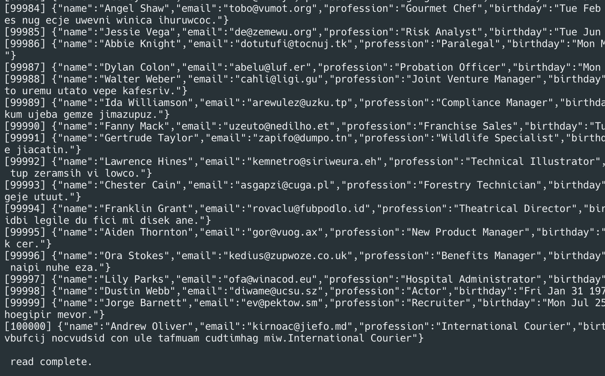

지금까지는 가짜 데이터를 CSV 파일에 쓰고 읽는 프로그램을 구현하였다.<br/>
실제 서비스에는 CSV 파일로 데이터를 저장하는 방법보다는 데이터베이스를 사용한다.<br/>

[[🔝위로가기]](#12장-프로젝트-실습)&nbsp; / &nbsp;[[🔙뒤로가기]](https://github.com/alstn2468/DoIt_Typescript_Programming/blob/master/README.md)

## 12-2 몽고DB에 데이터 저장하기

### 몽고DB란?

데이터베이스는 크게 관계형 데이터베이스와 NoSQL 데이터베이스로 나누어져 있다.<br/>
관계형 데이터베이스 시스템은 SQL이라고 부르는 데이터 질의 언어를 사용한다.<br/>
반면에 몽고DB와 같은 NoSQL 시스템은 SQL을 사용하지 않고 다른 방식의 질의어를 사용한다.<br/>
몽고DB는 오픈소스이므로 무료로 사용할 수 있고 몽고 DB 아틀라스 같은 클라우드 서비스도 제공한다.<br/>

### 몽고DB 설치

아래의 명령어를 이용해 몽고DB를 설치할 수 있다.<br/>

-   Window 환경

```shell
> scoop install mongodb
> mongod --install
> net start mongodb
```

-   MacOS 환경

```shell
> brew tap mongodb/brew
> xcode-select --install # gcc 설치 중 오류가 발생할 경우 설치
> brew install gcc # gcc가 없다고 할 경우 설치
> brew install mongodb-community
> brew services start mongodb-community # 시작 명령어
> brew services stop mongodb-community # 종료 명령어
```

책에서는 Window 환경으로 설치를 진행하였지만 MacOS에서 진행하므로 관련 내용을 추가하였다.<br/>

### 프로젝트 구성

12-1의 프로젝트에 몽고DB 접속 라이브러리를 추가적으로 사용한다.<br/>
몽고DB는 거의 모든 프로그래밍 언어로 구현된 접속 라이브러리를 제공한다.<br/>
Javascript는 `mongodb`라는 이름의 패키지를 사용하면 몽고DB에 접속할 수 있다.<br/>

```shell
> npm i -S mongodb
> npm i -D @types/mongodb
```

위의 명령어를 실행해 `mongodb`와 `@types/mongodb` 패키지를 설치해준다.<br/>

-   `package.json`

```json
{
    "name": "ch12_2",
    "version": "1.0.0",
    "devDependencies": {
        "@types/chance": "^1.1.0",
        "@types/mkdirp": "^0.5.2",
        "@types/mongodb": "^3.3.12",
        "@types/node": "^14.0.27",
        "@types/rimraf": "^3.0.0",
        "ts-node": "^8.10.2",
        "typescript": "^3.9.7"
    },
    "dependencies": {
        "chance": "^1.1.6",
        "mkdirp": "^0.5.1",
        "mongodb": "^3.3.5",
        "rimraf": "^3.0.2"
    }
}
```

최종적으로 구성된 프로젝트의 `package.json`은 위와 같다.<br/>
12-1에서 사용한 `src`폴더를 복사해 붙여넣으면 구성이 완료된다.<br/>

### 몽고DB에 접속하기

몽고DB 관련 유틸 함수를 작성하기 위해 `src` 폴더에 `mongodb` 폴더를 생성한다.<br/>

```shell
> mkdir -p src/mongodb
```

`mongodb` 패키지가 제공하는 `MongoClient` 객체의 `connect` 함수를 사용하면 몽고DB에 접속할 수 있다.<br/>
아래의 코드는 27017 포트에 실행중인 몽고DB에 접속하는 코드다.<br/>

-   `mongodb/connect.ts`

```typescript
import MongoClient from "mongodb";

export const connect = (mongoUrl: string = "mongodb://localhost:27017") =>
    MongoClient.connect(mongoUrl, {
        useNewUrlParser: true,
        useUnifiedTopology: true,
    });
```

`mongodb` 패키지가 제공하는 서비스는 모두 `Promise`를 기반으로 동작한다.<br/>
아래의 테스트 코드는 `mongodb`가 권장하는 몽고DB 연결 코드다.<br/>

-   `test/connect-Test.ts`

```typescript
import { connect } from "../mongodb/connect";

const connectTest = async () => {
    let connection;

    try {
        connection = await connect();
        console.log("connection OK", connection);
    } catch (e) {
        console.log(e.message);
    } finally {
        connection.close();
    }
};

connectTest();
```

-   `test/connect-Test.ts` 실행 결과

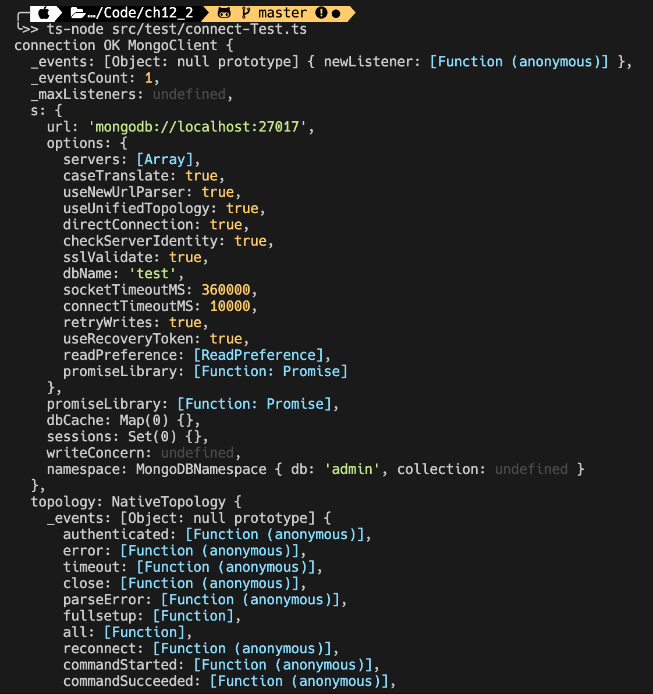

코드를 실행했을 때 정상적으로 연결되면 위와 같이 `connection OK` 메시지와 접속 정보가 출력된다.<br/>

### 데이터베이스 연결

데이터베이스 시스템은 보통 여러 개의 데이터베이스를 담을 수 있다.<br/>
각 데이터베이스는 자신만의 이름을 가지며 아래 코드는 `ch12-2`라는 이름의 데이터베이스를 생성한다.<br/>

```typescript
const db = await connection.db("ch12-2");
```

앞에 작성한 `connect-Test.ts` 파일에 데이터베이스를 생성하는 내용을 추가해 아래와 같이 작성한다.<br/>

-   `test/makedb-Test.ts`

```typescript
import { connect } from "../mongodb/connect";

const makedbTest = async () => {
    let connection;

    try {
        connection = await connect();
        const db = await connection.db("ch12-2");
        console.log("db", db);
    } catch (e) {
        console.log(e.message);
    } finally {
        connection.close();
    }
};

makedbTest();
```

-   `test/makedb-Test.ts` 실행 결과

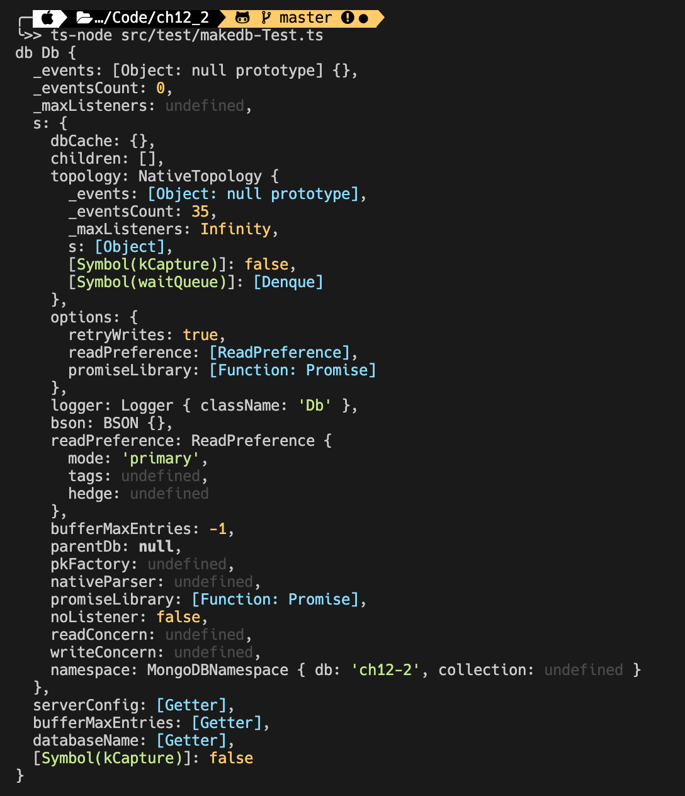

위와 같이 생성된 몽고DB 데이터베이스의 정보를 확인할 수 있다.<br/>
데이터베이스가 이미 만들어져있는 경우 데이터베이스를 생성하지 않고 이용할 수 있다.<br/>

### 컬렉션이란?

데이터베이스에는 여러 종류의 데이터를 저장할 수 있다.<br/>
일반적으로 관계형 DB들은 **테이블**을 만들고 여기에 관련된 데이터를 저장한다.<br/>
**테이블**에 저장되는 한 개의 데이터를 **레코드**라고 한다.<br/>
몽고DB도 관계형 DB와 비슷하지만 **테이블**이라는 용어 대신에 **컬렉션**을 사용한다.<br/>
데이터를 표현하는 **레코드**라는 용어 대신에 **문서**라는 용어를 사용한다.<br/>

-   관계형 DB와 몽고DB 용어 비교

|        구분        | 관계형 DB | 몽고 DB |
| :----------------: | :-------: | :-----: |
|   한 개의 데이터   |  레코드   |  문서   |
| 관련된 데이터 전체 |  테이블   | 컬렉션  |

아래 코드는 각각 `persons`와 `addresses`라는 이름의 컬렉션을 생성하는 코드다.<br/>

```typescript
const personCollection = db.collection("persons");
const addressesCollection = db.collection("addresses");
```

`makedb-Test.ts`에 컬렉션을 만드는 내용을 추가해 `collection-Test.ts`를 작성한다.<br/>

-   `test/colleciton-Test.ts`

```typescript
import { connect } from "../mongodb/connect";

const makeCollectionsTest = async () => {
    let connection;

    try {
        connection = await connect();
        const db = await connection.db("ch12-2");
        const personsCollection = db.collection("persons");
        const addressesCollection = db.collection("addresses");
        console.log(personsCollection, addressesCollection);
    } catch (e) {
        console.log(e.message);
    } finally {
        connection.close();
    }
};

makeCollectionsTest();
```

-   `test/colleciton-Test.ts` 실행 결과

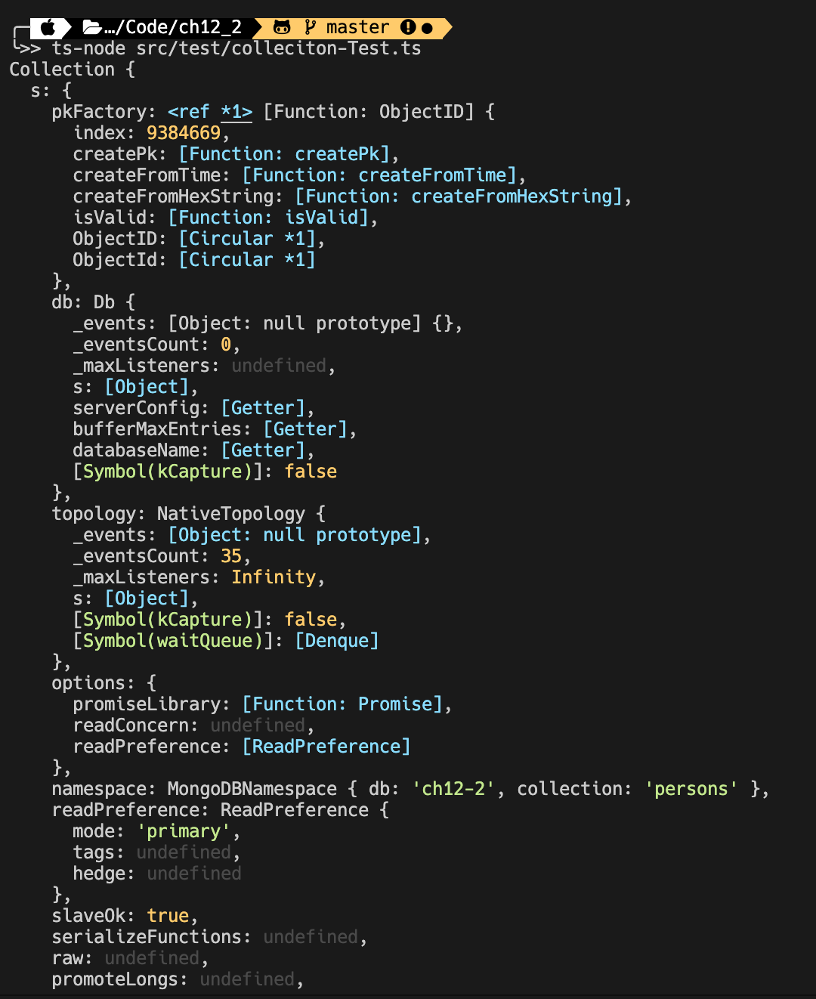

위와 같이 생성된 `persons`, `addresses` 컬렉션에 관한 정보들을 확인할 수 있다.<br/>

### 문서를 컬렉션에 저장하기

컬렉션에 한 개의 문서를 저장하는 것은 컬렉션 객체의 `insertOne` 메서드를 사용한다.<br/>

```typescript
const personsCollection = db.collection("persons");
const person = { name: "Jack", age: 32 };
let result = await personsCollection.insertOne(person);
```

`collection-Test.ts`에 문서를 저장하는 내용을 추가해 `insertDocumnet-Test.ts`를 작성한다.<br/>

-   `test/insertDocumnet-Test.ts`

```typescript
import { connect } from "../mongodb/connect";

const insertDocumentTest = async () => {
    let connection;

    try {
        connection = await connect();
        const db = await connection.db("ch12-2");
        const personsCollection = db.collection("persons");
        const addressesCollection = db.collection("addresses");

        const person = { name: "Jack", age: 32 };
        let result = await personsCollection.insertOne(person);
        console.log(result);

        const address = { country: "korea", city: "seoul" };
        result = await addressesCollection.insertOne(address);
        console.log(result);
    } catch (e) {
        console.log(e.message);
    } finally {
        connection.close();
    }
};

insertDocumentTest();
```

-   `test/insertDocumnet-Test.ts` 실행 결과

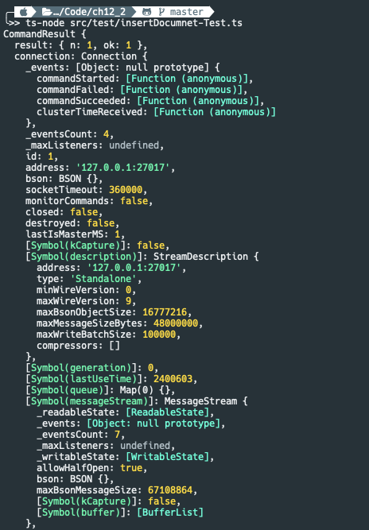

위와 같이 한 개의 문서를 콜렉션에 저장한 명령의 결과를 확인할 수 있다.<br/>

### 몽고 셸에 접속하기

몽고 셸에 접속하기 위해서는 `mongo` 명령어를 사용하면 된다.<br/>

```shell
> mongo
```

위의 명령어를 실행하면 아래와 같이 쉘이 변하며 몽고 셸에 접속된다.<br/>

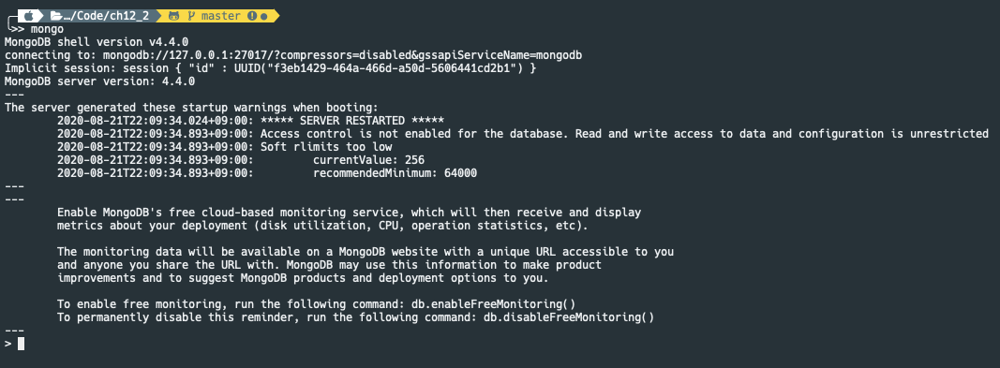

현재까지 `ch12-2`라는 이름의 데이터베이스를 만들었다.<br/>
`ch12-2` 데이터베이스를 사용하기 위해서는 아래와 같이 명령어를 사용한다.<br/>

```shell
> use ch12-2
switched to db ch12-2
```

데이터베이스 연결에 성공하면 컬렉션에 저장된 문서들을 아래와 같이 확인할 수 있다.<br/>

```shell
> db.persons.find({})
{ "_id" : ObjectId("5f3fc79fe9b60f19c230c63a"), "name" : "Jack", "age" : 32 }
> db.addresses.find({})
{ "_id" : ObjectId("5f3fc79fe9b60f19c230c63b"), "country" : "korea", "city" : "seoul" }
```

몽고 셸에서 빠져나오기 위해서는 `Ctrl + D`를 누르면 된다.<br/>

### \_id속성과 ObjectId 타입

모든 몽고DB 문서는 `_id`라는 이름의 속성을 가지고 있다.<br/>
이 속성은 문서가 DB에 저장될 때 자동으로 만들어진다.<br/>
`_id` 값은 `ObjectId('문자열')` 형태로 출력이 되게 된다.<br/>

```typescript
import { ObjectId } from "mongodb";
```

프로그램에서 `ObjectId`는 위의 코드로 얻을 수 있다.<br/>

### 문서 찾기

특정 컬렉션에 담긴 문서들은 아래와 같은 형식의 코드로 얻을 수 있다.<br/>

```typescript
let cursor = aawait 컬랙션 객체.find(검색 조건 객체)
const foundResult = await cursor.toArray()
```

`find` 메서드는 배열을 반환하지 않고 `cursor`라는 객체를 반환한다.<br/>
따라서 `cursor` 객체의 `toArray` 메서드로 Javascript 배열을 얻을 수 있다.<br/>
아래는 `personsCollection`에 저장된 문서 중 `name` 속성이 `Jack`인 문서를 찾는 예시다.<br/>

```typescript
cursor = personsCollection.find({ name: "Jack" });
```

조건을 사용하지 않고 모든 문서를 얻기 위해서는 빈 객체 `{}`를 사용한다.<br/>

```typescript
cursor = addressesCollection.find({});
```

`insertDocumnet-Test.ts`에 문서를 찾는 내용을 추가해 `find-Test.ts`를 작성한다.<br/>

-   `test/find-Test.ts`

```typescript
import { connect } from "../mongodb/connect";

const findDocumentTest = async () => {
    let connection, cursor;

    try {
        connection = await connect();
        const db = await connection.db("ch12-2");
        const personsCollection = db.collection("persons");
        const addressesCollection = db.collection("addresses");

        cursor = personsCollection.find({ name: "Jack" });
        const foundPersons = await cursor.toArray();
        console.log(foundPersons);
        // [ { _id: 5f3fc79fe9b60f19c230c63a, name: 'Jack', age: 32 } ]

        cursor = addressesCollection.find({});
        const foundAddresses = await cursor.toArray();
        console.log(foundAddresses);
        // [ { _id: 5f3fc79fe9b60f19c230c63b, country: 'korea', city: 'seoul' } ]
    } catch (e) {
        console.log(e.message);
    } finally {
        connection.close();
    }
};

findDocumentTest();
```

-   `test/find-Test.ts` 실행 결과

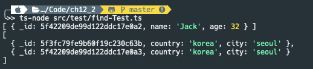

컬랙션 객체는 조건에 맞는 문서를 한 개 찾아주는 `findOne` 메서드 또한 제공한다.<br/>
문서가 한 개이기 때문에 `findOne`은 `cursor`를 반환하지 않고 문서 객체를 반환한다.<br/>

-   `test/findOne-Test.ts`

```typescript
import { connect } from "../mongodb/connect";

const findOneTest = async () => {
    let connection, cursor;

    try {
        connection = await connect();
        const db = await connection.db("ch12-2");
        const personsCollection = db.collection("persons");

        cursor = personsCollection.find({});
        const foundPersons = await cursor.toArray();

        const _id = foundPersons[0]._id;
        const result = await personsCollection.findOne({ _id });
        console.log(result);
        // { _id: 5f3fc79fe9b60f19c230c63a, name: 'Jack', age: 32 }
    } catch (e) {
        console.log(e.message);
    } finally {
        connection.close();
    }
};

findOneTest();
```

-   `test/findOne-Test.ts` 실행 결과

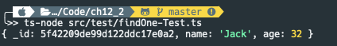

위와 같이 `findOne` 메서드가 하나의 객체를 반환하는 것을 확인할 수 있다.<br/>

### 문서 삭제하기

컬렉션에 담긴 문서는 `deleteOne` 또는 `deleteMany` 메서드를 사용하면 삭제할 수 있다.<br/>
두 메서드는 `deleteCount`라는 이름의 속성에 삭제된 문서의 개수가 담긴 객체를 반환한다.<br/>

```typescript
let result = await 컬랙션 객체.deleteOne(검색 조건 객체)
result = await 컬랙션 객체.deleteMany(검색 조건 객체)
```

아래 코드는 `insertMany`로 생성한 문서를 `deleteOne`과 `deletMany`를 사용해 삭제하는 예시다.<br/>

-   `test/delete-Test.ts`

```typescript
import { connect } from "../mongodb/connect";

const deleteTest = async () => {
    let connection;

    try {
        connection = await connect();
        const db = await connection.db("ch12-2");
        const personsCollection = db.collection("persons");
        await personsCollection.insertMany([
            { name: "Jack" },
            { name: "Tom" },
            { name: "Jane" },
        ]);

        let result = await personsCollection.deleteOne({ name: "Tom" });
        console.log(result); // { deletedCount: 1 }
        result = await personsCollection.deleteMany({});
        console.log(result); // { deletedCount: 2 }
    } catch (e) {
        console.log(e.message);
    } finally {
        connection.close();
    }
};

deleteTest();
```

-   `test/delete-Test.ts` 실행 결과

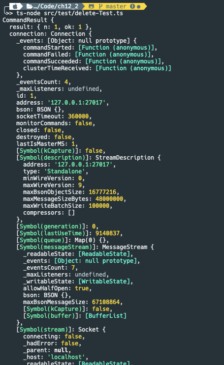

`deleteOne`과 `deleteMany` 메서드는 `deletedCount`을 포함한 실행한 명령의 결과를 반환한다.<br/>

### 검색 결과 정렬하기

`find` 메서드로 검색한 결과는 아래와 같이 `sort` 메서드를 이용해 정렬할 수 있다.<br/>

```typescript
const cursor = personsCollection.find({ name: "Jack" }).sort({ age: -1 });
```

위의 코드는 `name` 속성값이 `Jack`인 문서를 `age`를 기준으로 내림차순 정렬한다.<br/>
컬렉션에 문서의 개수가 많아지면 검색 시간이 느려지게 된다.<br/>
이를 방지하기 위해서 컬렉션에 `createIndex`를 사용해 **인덱스**를 만들게 된다.<br/>
**인덱스** 항목은 아래와 같이 속성 이름에 오름차순 정렬일 때는 `1`을 내림차순일 때는 `-1`을 설정한다.<br/>

```typescript
let result = await 컬랙션_객체.createIndex({ name: 1, age: -1 });
```

아래 예시는 `createIndex`를 사용해 **인덱스**를 생성해 `age`를 기준으로 내림차순 정렬한다.<br/>

-   `test/sort-Test.ts`

```typescript
import { connect } from "../mongodb/connect";

const sortTest = async () => {
    let connection;

    try {
        connection = await connect();
        const db = await connection.db("ch12-2");
        const personsCollection = db.collection("persons");
        await personsCollection.createIndex({ name: 1, age: -1 });
        await personsCollection.deleteMany({});
        await personsCollection.insertMany([
            { name: "Jack", age: 32 },
            { name: "Jack", age: 33 },
            { name: "Jane", age: 10 },
        ]);

        const cursor = personsCollection
            .find({ name: "Jack" })
            .sort({ age: -1 });
        const result = await cursor.toArray();
        console.log(result);
    } catch (e) {
        console.log(e.message);
    } finally {
        connection.close();
    }
};

sortTest();
```

-   `test/sort-Test.ts` 실행 결과

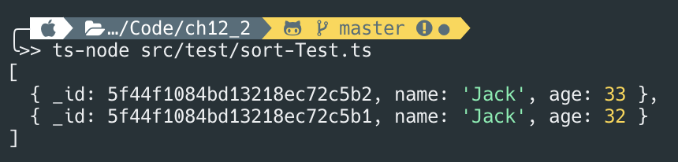

위와 같이 `find`로 찾은 `name`이 `Jack`인 문서를 `age`를 기준으로 내림차순 정렬한 것을 볼 수 있다.<br/>

### CSV 파일을 몽고DB에 저장하기

`writeCsv.ts`로 생성된 CSV파일은 `readCsv.ts`를 아래와 같이 수정해 데이터를 몽고DB에 담을 수 있다.<br/>

```typescript
for (let object in csvFileReaderGenerator(filename)) {
    await collection.insertOne(object);
}
```

아래 코드는 CSV파일을 읽어 `users` 컬렉션에 저장하고 `birthday`, `name` 속성에 인덱스를 생성한다.<br/>

-   `insertCsvToMongo.ts`

```typescript
import { connect } from "./mongodb/connect";
import { getFileNameAndNumber } from "./utils";
import { csvFileReaderGenerator } from "./csv/csvFileReaderGenerator";

const insertCsvToMongo = async (csvFileName, collectionName, index) => {
    let connection;

    try {
        connection = await connect();
        const db = await connection.db("ch12-2");
        const collection = db.collection(collectionName);

        await collection.deleteMany({});
        await collection.createIndex(index);

        let line = 1;

        for (let object of csvFileReaderGenerator(csvFileName)) {
            await collection.insertOne(object);
            console.log(`${line++} inserted.`);
        }

        console.log("\n insertion complete.");
    } catch (e) {
        console.log(e.message);
    } finally {
        connection.close();
    }
};

const [filename] = getFileNameAndNumber("./data/fake-100000.csv", 1);
insertCsvToMongo(filename, "users", { birthday: -1, name: 1 });
// 1 inserted.
// .... 생략 ....
// 99999 inserted.
// 100000 inserted.
//  insertion complete.
```

-   `insertCsvToMongo.ts` 실행 결과

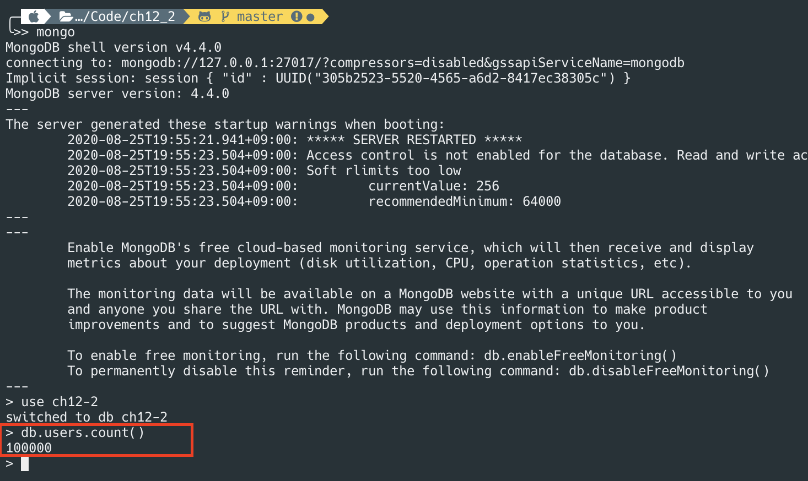

몽고 셸에 접속한 후 문서의 수를 알려주는 `count()`를 사용하면 10만개가 저장된 것을 볼 수 있다.<br/>

### limit과 skip 메서드

10만 건이나 되는 많은 데이터를 `find({})` 형태로 찾는 것은 문제가 존재한다.<br/>
`find` 메서드는 이런 상황에 대응하도록 검색된 데이터의 개수를 제한하는 `limit` 메서드를 제공한다.<br/>
또한 페이징 등의 기능을 할 수 있도록 결과의 앞 N번째를 거를 수 있는 `skip` 메서드도 제공한다.<br/>
아래 코드는 검색된 결과 중에 100번째부터 다섯 개의 건수만 선택하는 예시다.<br/>

```typescript
let cursor = await usersCollection
    .find({})
    .sort({ birthday: -1, name: 1 })
    .skip(100)
    .limit(5);
```

아래와 같이 저장한 `users` 컬렉션에서도 동일하게 적용해 몽고DB에서 값을 가져올 수 있다.<br/>

-   `findLimitSkip.ts`

```typescript
import { connect } from "./mongodb/connect";
import { IFake } from "./fake";

const findLimitSkip = async () => {
    let connection;

    try {
        connection = await connect();
        const db = await connection.db("ch12-2");
        const usersCollection = db.collection("users");

        let cursor = await usersCollection
            .find({})
            .sort({ birthday: -1, name: 1 })
            .skip(100)
            .limit(5);
        let result = await cursor.toArray();
        console.log(
            result.map((user: IFake) => ({
                name: user.name,
                birthday: user.birthday,
            }))
        );
    } catch (e) {
        console.log(e.message);
    } finally {
        connection.close();
    }
};

findLimitSkip();
```

-   `findLimitSkip.ts` 실행 결과

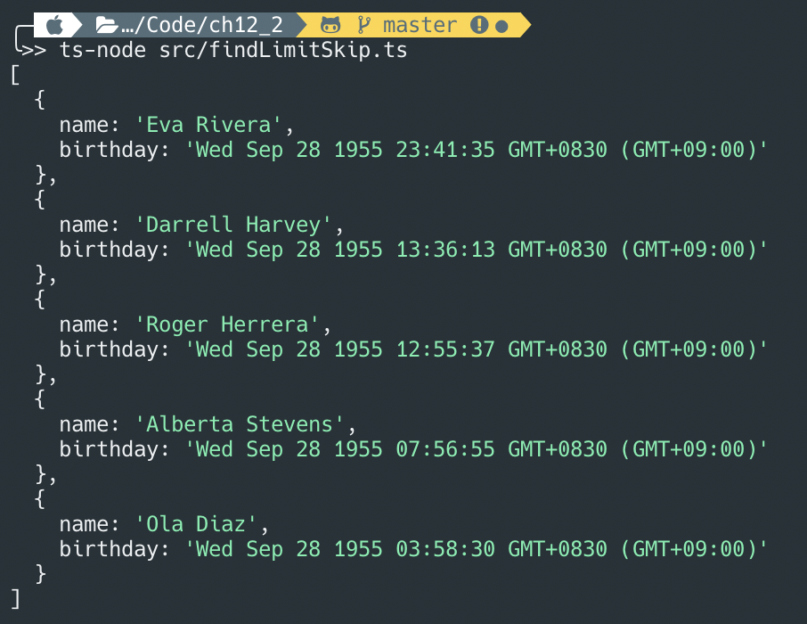

위와 같이 정상적으로 5건의 데이터의 `name` 속성값과 `birthday` 속성값을 확인할 수 있다.<br/>

[[🔝위로가기]](#12장-프로젝트-실습)&nbsp; / &nbsp;[[🔙뒤로가기]](https://github.com/alstn2468/DoIt_Typescript_Programming/blob/master/README.md)

## 12-3 익스프레스로 API 서버 만들기

### 실습 프로젝트 <span id="project-setup-two">구성</span>

### REST 방식 서버

### 익스프레스 프레임워크

### 라우팅 기능 구현

### 익스프레스 미들웨어 추가

### 몽고DB 연결

[[🔝위로가기]](#12장-프로젝트-실습)&nbsp; / &nbsp;[[🔙뒤로가기]](https://github.com/alstn2468/DoIt_Typescript_Programming/blob/master/README.md)

## 12-4 리액트와 부트스트랩으로 프론트엔드 웹 만들기

[[🔝위로가기]](#12장-프로젝트-실습)&nbsp; / &nbsp;[[🔙뒤로가기]](https://github.com/alstn2468/DoIt_Typescript_Programming/blob/master/README.md)
