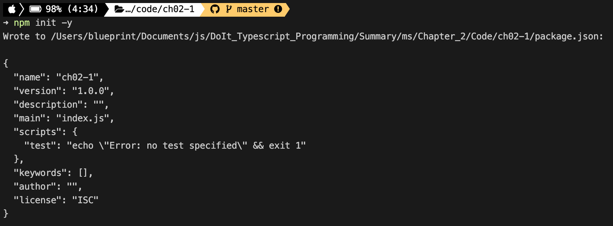
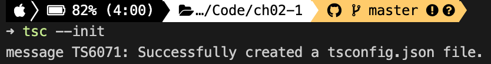
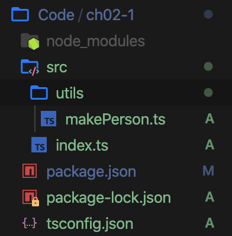
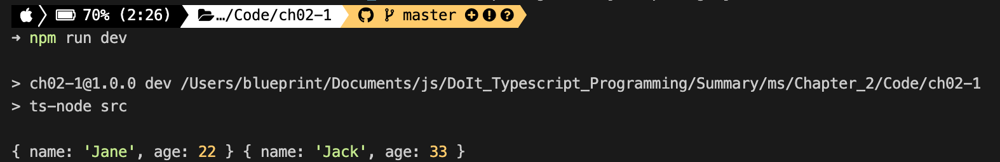
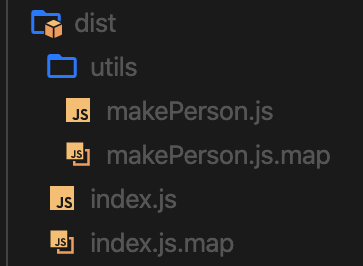

# 02장 타입스크립트 프로젝트 생성과 관리

<details><summary>Table of Contents</summary>

- 타입스크립트 프로젝트 만들기 [:link:](#02-1-타입스크립트-프로젝트-만들기)
  - node.js 프로젝트 생성하기 [:link:](#nodejs-프로젝트-생성하기)
  - 프로젝트 생성자 관점에서 패키지 설치하기 [:link:](#프로젝트-생성자-관점에서-패키지-설치하기)
  - 프로젝트 이용자 관점에서 패키지 설치하기 [:link:](#프로젝트-이용자-관점에서-패키지-설치하기)
  - tsconfig.json 파일 만들기 [:link:](#tsconfigjson-파일-만들기)
  - src 디렉터리와 소스 파일 만들기 [:link:](#src-디렉터리와-소스-파일-만들기)
  - 시작 소스 파일명을 index로 짓는 이유 [:link:](#시작-소스-파일명을-index로-짓는-이유)
  - package.json 수정 [:link:](#packagejson-수정)
- 모듈 이해하기 [:link:](#02-2-모듈-이해하기)
- tsconfig.json 파일 살펴보기 [:link:](#02-3-tsconfigjson-파일-살펴보기)

</details>

## 02-1 타입스크립트 프로젝트 만들기

Typescript 개발은 아래의 순서로 보통 진행한다.<br/>

1. `node.js` 프로젝트 생성
2. 개발 언어를 Typescript로 변경

### node.js 프로젝트 생성하기

1. 프로젝트 폴더 생성 및 이동

```shell
> mkdir ch02-1
> cd ch02-1
```

2. 프로젝트(`package.json`) 생성하기

`package.json`은 `node.js`가 관리하는 패키지 관리 파일이다.<br/>
프로젝트 정보와 프로젝트 관련 패키지에 관한 정보가 기록된다.<br/>

```shell
> npm init -y
```



[[🔝위로가기]](#02-타입스크립트-프로젝트-생성과-관리)

### 프로젝트 생성자 관점에서 패키지 설치하기

`package.json`생성 후 프로젝트에 필요한 오픈소스 패키지를 설치한다.<br/>

- 패키지 설치 명령어

```shell
> npm install <package name>
> npm i <package name>
```

- 패키지 설치 명령 옵션

|    옵션    |           의미            | 단축 명령 |
| :--------: | :-----------------------: | :-------: |
|   --save   | 실행에 필요한 패키지 설치 |    -S     |
| --save-dev | 개발에 필요한 패키지 설치 |    -D     |

Typescript 프로젝트는 보통 `typscript`와 `ts-node`패키지를 설치한다.<br/>
이 프로젝트를 사용하는 개발자의 환경에 두 패키지가 없을 수 있다.<br/>
따라서 아래의 명령어를 통해 두개의 패키지를 설치해준다.<br/>

```shell
> npm i -D typescript ts-node
```

Javascript로 개발된 라이브러리들은 추가적으로 `@types`가 붙은 라이브러리를 제공해야 한다.<br/>
`@types`가 붙은 라이브러리는 항상 `index.d.ts`라는 이름의 파일을 갖는다.<br/>
Typescript 컴파일러는 `index.d.ts`의 내용을 바탕으로 라이브러리의 기능 사용을 검증한다.<br/>
Typescript는 브라우저나 `node.js`가 제공하는 타입의 존재를 그냥 알지 못한다.<br/>
따라서 `@types/node`라는 패키지를 설치해 사용한다.<br/>

```shell
> npm i -D @types/node
```

[[🔝위로가기]](#02-타입스크립트-프로젝트-생성과-관리)

### 프로젝트 이용자 관점에서 패키지 설치하기

다른 사람이 작성한 프로젝트를 이용할때는 가장 먼저 아래의 명령어를 실행한다.<br/>

```shell
> npm i
```

설치 명령어는 `package.json`이 있는 디렉토리에서 실행한다.<br/>
위의 명령어를 실행하면 `package.json`에 등록된 패키지들이 설치된다.<br/>

[[🔝위로가기]](#02-타입스크립트-프로젝트-생성과-관리)

### tsconfig.json 파일 만들기

Typescript 프로젝트는 설정 파일인 `tsconfig.json`파일이 있어야 한다.<br/>
`tsconfig.json`은 아래의 명령어를 이용해 만들 수 있다.<br/>

```shell
> tsc --init
```



`tsconfig.json`파일을 열고 아래와 같이 수정한다.<br/>

```json
{
    "compilerOptions": {
        "module": "CommonJS",
        "esModuleInterop": true,
        "target": "ES5",
        "moduleResolution": "node",
        "outDir": "dist",
        "baseUrl": ".",
        "sourceMap": true,
        "downlevelIteration": true,
        "noImplicitAny": false,
        "paths": { "*": ["node_modules/*"] }
    },
    "include": ["src/**/*"]
}
```

[[🔝위로가기]](#02-타입스크립트-프로젝트-생성과-관리)

### src 디렉터리와 소스 파일 만들기

`tsconfig.json`의 `include`옵션이 있다.<br/>
`["src/**/*"]`와 같이 설정이 되어있다.<br/>
이는 `./src/`와 `./src/utils` 폴더에 모든 소스 파일이 있다는 뜻이다.<br/>
래의 명령어로 설정해둔 프로젝트를 위한 폴더를 생성한다.<br/>

```shell
> mkdir -p src/utils
```

실습에 필요한 소스 파일을 만들기 위해 아래 명령어를 실행한다.<br/>

```shell
> touch src/index.ts src/utils/makePerson.ts
```

현재의 프로젝트 구조는 아래와 같다.<br/>



- `makePerson.ts` 작성하기

```typescript
export function makePerson(name: string, age: number) {
    return { name: name, age: age };
}

export function testMakePerson() {
    console.log(makePerson('Jane', 22), makePerson('Jack', 33));
}
```

- `index.ts` 작성하기

```typescript
import { testMakePerson } from './utils/makePerson';

testMakePerson();
```

[[🔝위로가기]](#02-타입스크립트-프로젝트-생성과-관리)

### 시작 소스 파일명을 index로 짓는 이유

`node`나 `ts-node`로 코드를 실행하기 위해서는 아래와 같이 명령어를 사용한다.<br/>

```shell
> ts-node ./src/index.ts
```

하지만 소스의 파일명이 `index`이면 파일명을 아래 같이 생략할 수 있다.<br/>

```shell
> ts-node ./src
```

이 떄문에 프로젝트의 시작 함수가 있는 소스 파일명은 보통 `index`로 짓는다.<br>

[[🔝위로가기]](#02-타입스크립트-프로젝트-생성과-관리)

### package.json 수정

Typescript 프로젝트를 개발할 때는 `ts-ndoe`를 사용한다.<br/>
개발이 완료되면 Typescript를 Javascript로 변환해 `node`로 실행해야 한다.<br/>
이를 위해 `package.json`의 `scripts`항목에 `dev`와 `build`명령을 추가한다.<br>

```json
{
    // ... 생략
    "scripts": {
        "test": "echo \"Error: no test specified\" && exit 1",
        "dev": "ts-node src",
        "build": "tsc && node dist"
    },
    // ... 생략
}
```

위의 명령어들은 `npm run <명령어>`와 같이 사용한다.<br/>
`dev`명령은 `src`폴더의 `index.ts`파일을 실행하는 용도로 사용한다.<br/>

```shell
> npm run dev
```



`build`명령은 배포를 위해 `dist`폴더에 Javascript 파일 생성을 위해 사용한다.<br/>


`build`명령으로 만든 `dist`폴더와 컴파일된 Javascript파일을 확인할 수 있다.<br/>
컴파일된 Javascript코드을 보면 작성한 Typescript코드와 내용이 다른 것을 확인할 수 있다.<br/>



[[🔝위로가기]](#02-타입스크립트-프로젝트-생성과-관리)

## 02-2 모듈 이해하기

[[🔝위로가기]](#02-타입스크립트-프로젝트-생성과-관리)

## 02-3 tsconfig.json 파일 살펴보기

[[🔝위로가기]](#02-타입스크립트-프로젝트-생성과-관리)
