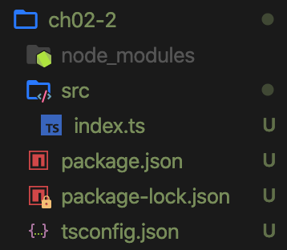
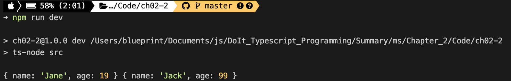
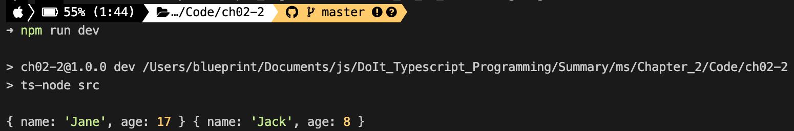
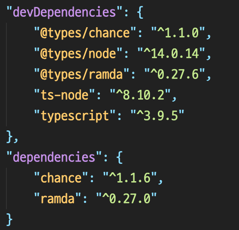
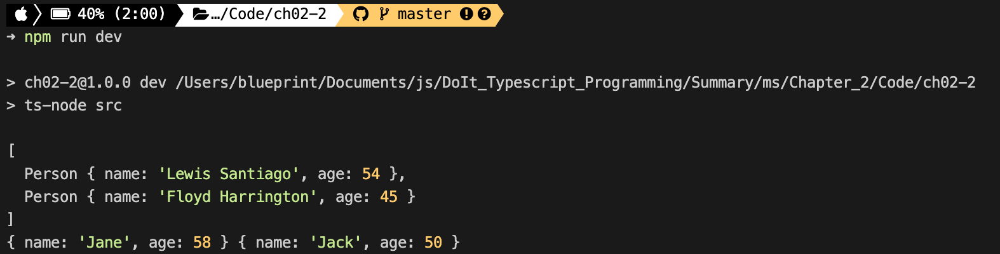
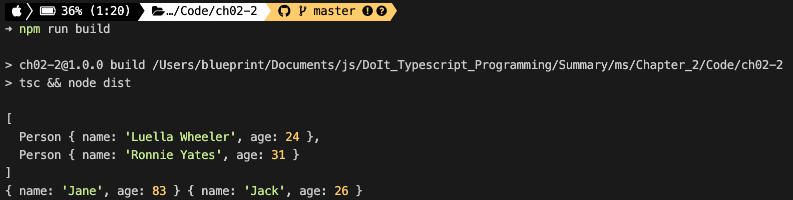

# 02장 타입스크립트 프로젝트 생성과 관리

<details><summary>Table of Contents</summary>

- 타입스크립트 프로젝트 만들기 [:link:](#02-1-타입스크립트-프로젝트-만들기)
  - node.js 프로젝트 생성하기 [:link:](#nodejs-프로젝트-생성하기)
  - 프로젝트 생성자 관점에서 패키지 설치하기 [:link:](#프로젝트-생성자-관점에서-패키지-설치하기)
  - 프로젝트 이용자 관점에서 패키지 설치하기 [:link:](#프로젝트-이용자-관점에서-패키지-설치하기)
  - tsconfig.json 파일 만들기 [:link:](#tsconfigjson-파일-만들기)
  - src 디렉터리와 소스 파일 만들기 [:link:](#src-디렉터리와-소스-파일-만들기)
  - 시작 소스 파일명을 index로 짓는 이유 [:link:](#시작-소스-파일명을-index로-짓는-이유)
  - package.json 수정 [:link:](#packagejson-수정)
- 모듈 이해하기 [:link:](#02-2-모듈-이해하기)
  - 모듈과 모듈화 [:link:](#모듈과-모듈화)
  - 모듈 생성 및 이용하기 [:link:](#모듈-생성-및-이용하기)
  - index.ts파일의 모듈화 [:link:](#indexts파일의-모듈화)
  - export 키워드 [:link:](#export-키워드)
  - import 키워드 [:link:](#import-키워드)
  - import * as 구문 [:link:](#import--as-구문)
  - export default 키워드 [:link:](#export-default-키워드)
  - 외부 패키지를 사용할 때 import 문 [:link:](#외부-패키지를-사용할-때-import-문)
- tsconfig.json 파일 살펴보기 [:link:](#02-3-tsconfigjson-파일-살펴보기)
  - tsc 명령어 살펴보기 [:link:](#tsc-명령어-살펴보기)
  - options 살펴보기 [:link:](#options-살펴보기)

</details>

## 02-1 타입스크립트 프로젝트 만들기

Typescript 개발은 아래의 순서로 보통 진행한다.<br/>

1. `node.js` 프로젝트 생성
2. 개발 언어를 Typescript로 변경

### node.js 프로젝트 생성하기

1. 프로젝트 폴더 생성 및 이동

```shell
> mkdir ch02-1
> cd ch02-1
```

2. 프로젝트(`package.json`) 생성하기

`package.json`은 `node.js`가 관리하는 패키지 관리 파일이다.<br/>
프로젝트 정보와 프로젝트 관련 패키지에 관한 정보가 기록된다.<br/>

```shell
> npm init -y
```


[[🔝위로가기]](#02장-타입스크립트-프로젝트-생성과-관리) / [[🔙뒤로가기]](https://github.com/alstn2468/DoIt_Typescript_Programming/blob/master/README.md)

### 프로젝트 생성자 관점에서 패키지 설치하기

`package.json`생성 후 프로젝트에 필요한 오픈소스 패키지를 설치한다.<br/>

- 패키지 설치 명령어

```shell
> npm install <package name>
> npm i <package name>
```

- 패키지 설치 명령 옵션

|    옵션    |           의미            | 단축 명령 |
| :--------: | :-----------------------: | :-------: |
|   --save   | 실행에 필요한 패키지 설치 |    -S     |
| --save-dev | 개발에 필요한 패키지 설치 |    -D     |

Typescript 프로젝트는 보통 `typscript`와 `ts-node`패키지를 설치한다.<br/>
이 프로젝트를 사용하는 개발자의 환경에 두 패키지가 없을 수 있다.<br/>
따라서 아래의 명령어를 통해 두개의 패키지를 설치해준다.<br/>

```shell
> npm i -D typescript ts-node
```

Javascript로 개발된 라이브러리들은 추가적으로 `@types`가 붙은 라이브러리를 제공해야 한다.<br/>
`@types`가 붙은 라이브러리는 항상 `index.d.ts`라는 이름의 파일을 갖는다.<br/>
Typescript 컴파일러는 `index.d.ts`의 내용을 바탕으로 라이브러리의 기능 사용을 검증한다.<br/>
Typescript는 브라우저나 `node.js`가 제공하는 타입의 존재를 그냥 알지 못한다.<br/>
따라서 `@types/node`라는 패키지를 설치해 사용한다.<br/>

```shell
> npm i -D @types/node
```

[[🔝위로가기]](#02장-타입스크립트-프로젝트-생성과-관리) / [[🔙뒤로가기]](https://github.com/alstn2468/DoIt_Typescript_Programming/blob/master/README.md)

### 프로젝트 이용자 관점에서 패키지 설치하기

다른 사람이 작성한 프로젝트를 이용할때는 가장 먼저 아래의 명령어를 실행한다.<br/>

```shell
> npm i
```

설치 명령어는 `package.json`이 있는 디렉토리에서 실행한다.<br/>
위의 명령어를 실행하면 `package.json`에 등록된 패키지들이 설치된다.<br/>

[[🔝위로가기]](#02장-타입스크립트-프로젝트-생성과-관리) / [[🔙뒤로가기]](https://github.com/alstn2468/DoIt_Typescript_Programming/blob/master/README.md)

### tsconfig.json 파일 만들기

Typescript 프로젝트는 설정 파일인 `tsconfig.json`파일이 있어야 한다.<br/>
`tsconfig.json`은 아래의 명령어를 이용해 만들 수 있다.<br/>

```shell
> tsc --init
```


`tsconfig.json`파일을 열고 아래와 같이 수정한다.<br/>

```json
{
    "compilerOptions": {
        "module": "CommonJS",
        "esModuleInterop": true,
        "target": "ES5",
        "moduleResolution": "node",
        "outDir": "dist",
        "baseUrl": ".",
        "sourceMap": true,
        "downlevelIteration": true,
        "noImplicitAny": false,
        "paths": { "*": ["node_modules/*"] }
    },
    "include": ["src/**/*"]
}
```

[[🔝위로가기]](#02장-타입스크립트-프로젝트-생성과-관리) / [[🔙뒤로가기]](https://github.com/alstn2468/DoIt_Typescript_Programming/blob/master/README.md)

### src 디렉터리와 소스 파일 만들기

`tsconfig.json`의 `include`옵션이 있다.<br/>
`["src/**/*"]`와 같이 설정이 되어있다.<br/>
이는 `./src/`와 `./src/utils` 폴더에 모든 소스 파일이 있다는 뜻이다.<br/>
래의 명령어로 설정해둔 프로젝트를 위한 폴더를 생성한다.<br/>

```shell
> mkdir -p src/utils
```

실습에 필요한 소스 파일을 만들기 위해 아래 명령어를 실행한다.<br/>

```shell
> touch src/index.ts src/utils/makePerson.ts
```

현재의 프로젝트 구조는 아래와 같다.<br/>


- `makePerson.ts` 작성하기

```typescript
export function makePerson(name: string, age: number) {
    return { name: name, age: age };
}

export function testMakePerson() {
    console.log(makePerson('Jane', 22), makePerson('Jack', 33));
}
```

- `index.ts` 작성하기

```typescript
import { testMakePerson } from './utils/makePerson';

testMakePerson();
```

[[🔝위로가기]](#02장-타입스크립트-프로젝트-생성과-관리) / [[🔙뒤로가기]](https://github.com/alstn2468/DoIt_Typescript_Programming/blob/master/README.md)

### 시작 소스 파일명을 index로 짓는 이유

`node`나 `ts-node`로 코드를 실행하기 위해서는 아래와 같이 명령어를 사용한다.<br/>

```shell
> ts-node ./src/index.ts
```

하지만 소스의 파일명이 `index`이면 파일명을 아래 같이 생략할 수 있다.<br/>

```shell
> ts-node ./src
```

이 떄문에 프로젝트의 시작 함수가 있는 소스 파일명은 보통 `index`로 짓는다.<br>

[[🔝위로가기]](#02장-타입스크립트-프로젝트-생성과-관리) / [[🔙뒤로가기]](https://github.com/alstn2468/DoIt_Typescript_Programming/blob/master/README.md)

### package.json 수정

Typescript 프로젝트를 개발할 때는 `ts-ndoe`를 사용한다.<br/>
개발이 완료되면 Typescript를 Javascript로 변환해 `node`로 실행해야 한다.<br/>
이를 위해 `package.json`의 `scripts`항목에 `dev`와 `build`명령을 추가한다.<br>

```json
{
    "scripts": {
        "test": "echo \"Error: no test specified\" && exit 1",
        "dev": "ts-node src",
        "build": "tsc && node dist"
    }
}
```

위의 명령어들은 `npm run <명령어>`와 같이 사용한다.<br/>
`dev`명령은 `src`폴더의 `index.ts`파일을 실행하는 용도로 사용한다.<br/>

```shell
> npm run dev
```


`build`명령은 배포를 위해 `dist`폴더에 Javascript 파일 생성을 위해 사용한다.<br/>


`build`명령으로 만든 `dist`폴더와 컴파일된 Javascript파일을 확인할 수 있다.<br/>


컴파일된 Javascript코드을 보면 작성한 Typescript코드와 내용이 다른 것을 확인할 수 있다.<br/>

- 컴파일된 `index.js` 파일

```javascript
"use strict";
Object.defineProperty(exports, "__esModule", { value: true });
var makePerson_1 = require("./utils/makePerson");
makePerson_1.testMakePerson();
//# sourceMappingURL=index.js.map
```

[[🔝위로가기]](#02장-타입스크립트-프로젝트-생성과-관리) / [[🔙뒤로가기]](https://github.com/alstn2468/DoIt_Typescript_Programming/blob/master/README.md)

## 02-2 모듈 이해하기

### 모듈과 모듈화

Typescript에서는 `index.ts`와 같은 파일을 **모듈**이라고 한다.<br/>
02-1에서 만든 `index.ts`와 `makePerson.ts`는 모두 **모듈**이다.<br/>
하나의 파일로 구현해도 되지만 코드 관리와 유지보수를 위해 분할한다.<br/>
각각의 모듈은 고유한 기능을 구현하며 이러한 작업을 **모듈화**라고 한다.<br/>

[[🔝위로가기]](#02장-타입스크립트-프로젝트-생성과-관리) / [[🔙뒤로가기]](https://github.com/alstn2468/DoIt_Typescript_Programming/blob/master/README.md)

### 모듈 생성 및 이용하기

여러개의 **모듈**로 코드를 분할하면 어떤 모듈에 무엇이 있는지 알게해야 한다.<br>
Typescript는 이를 위해 `export`와 `import`라는 키워드를 제공한다.<br/>
`export`는 모듈을 제공하는 쪽에서 `import`는 모듈을 사용하는 쪽에서 사용한다.<br/>

#### 모듈을 위한 예제

02-1에서 진행했던 것과 동일하게 새로운 프로젝트를 생성한다.<br/>



`index.ts`를 아래와 같이 작성한다.<br/>

```typescript
let MAX_AGE = 100;

interface IPerson {
    name: string;
    age: number;
}

class Person implements IPerson {
    constructor(public name: string, public age: number) {}
}

function makeRandomNumber(max: number = MAX_AGE): number {
    return Math.ceil(Math.random() * max);
}

const makePerson = (name: string, age: number = makeRandomNumber()) => ({
    name,
    age,
});

const testMakePerson = (): void => {
    let jane: IPerson = makePerson('Jane');
    let jack: IPerson = makePerson('Jack');

    console.log(jane, jack);
};

testMakePerson();
```

`dev`명령을 사용해 위의 코드를 실행해볼 수 있다.<br/>

```shell
> npm run dev
```



문제가 있는 코드는 아니기 때문에 정상적으로 작동한다.<br/>
코드를 이해하고 수정을 하기에는 내용이 복잡하다.<br/>
`index.ts`파일의 내용을 분리해 **모듈화**를 진행한다.<br/>

[[🔝위로가기]](#02장-타입스크립트-프로젝트-생성과-관리) / [[🔙뒤로가기]](https://github.com/alstn2468/DoIt_Typescript_Programming/blob/master/README.md)

### index.ts파일의 모듈화

**모듈화**를 진행하기 위해 `person`폴더에 `Person.ts`파일을 생성했다.<br/>
`index.ts`에 있는 아래의 코드를 `Person.ts`로 옮긴다.<br/>

```typescript
let MAX_AGE = 100;

interface IPerson {
    name: string;
    age: number;
}

class Person implements IPerson {
    constructor(public name: string, public age: number) {}
}

function makeRandomNumber(max: number = MAX_AGE): number {
    return Math.ceil(Math.random() * max);
}

const makePerson = (name: string, age: number = makeRandomNumber()) => ({
    name,
    age,
});
```

따라서 `index.ts`에 있는 내용을 아래처럼 간단해지게 된다.<br/>

```typescript
const testMakePerson = (): void => {
    let jane: IPerson = makePerson('Jane');
    let jack: IPerson = makePerson('Jack');

    console.log(jane, jack);
};

testMakePerson();
```

하지만 현재 상황에서 `dev`명령을 사용하면 오류가 발생한다.<br/>
`IPerson`과 `makePerson`을 찾을 수 없다는 오류가 발생했다.<br/>


이 상황은 `export`와 `import`구문을 이용하여 해결할 수 있다.<br/>

[[🔝위로가기]](#02장-타입스크립트-프로젝트-생성과-관리) / [[🔙뒤로가기]](https://github.com/alstn2468/DoIt_Typescript_Programming/blob/master/README.md)

### export 키워드

`Person.ts`파일에 작성한 `IPerson`과 `makePerson`을 `index.ts`에 전달해야 한다.<br/>
아래와 같이 `IPerson`과 `makePerson`선언부에 `export` 키워드를 추가한다.<br/>

```typescript
// ...
export interface IPerson {
    name: string;
    age: number;
}
// ...
export const makePerson = (name: string, age: number = makeRandomNumber()) => ({
    name,
    age,
});
```

`export` 키워드는 `interface`, `class`, `type`, `let`, `const` 앞에도 붙을 수 있다.<br/>

[[🔝위로가기]](#02장-타입스크립트-프로젝트-생성과-관리) / [[🔙뒤로가기]](https://github.com/alstn2468/DoIt_Typescript_Programming/blob/master/README.md)

### import 키워드

`export` 키워드로 내보낸 심볼은 `import` 키워드로 불러올 수 있다.<br/>
`import`를 사용하는 기본적인 형태는 아래와 같다.<br/>

```typescript
import { 심볼 } from "파일 경로";
```

`index.ts`에 아래와 같이 `import` 구문을 추가한다.<br/>

```typescript
import { IPerson, makePerson } from './person/Person';

const testMakePerson = (): void => {
    let jane: IPerson = makePerson('Jane');
    let jack: IPerson = makePerson('Jack');

    console.log(jane, jack);
};

testMakePerson();
```

[[🔝위로가기]](#02장-타입스크립트-프로젝트-생성과-관리) / [[🔙뒤로가기]](https://github.com/alstn2468/DoIt_Typescript_Programming/blob/master/README.md)

### import * as 구문

`import` 구문을 사용하는 다른 형태는 아래와 같이 `as` 키워드를 사용하는 것 이다.<br/>

```typescript
import * as 심볼 from "파일 경로";
```

`import * as` 예시를 위해 `src/utils`폴더와 `makeRandomNumber.ts`를 생성한다.<br/>
그 후 `Person.ts`에서 아래의 코드를 옮겨 적는다.<br/>

```typescript
let MAX_AGE = 100;

export function makeRandomNumber(max: number = MAX_AGE): number {
    return Math.ceil(Math.random() * max);
}
```

`Person.ts`파일의 첫 줄에 아래와 같이 `import`구문을 작성한다.<br/>

```typescript
import * as U from "../utils/makeRandomNumber";
```

`makeRandomNumber` 함수를 사용하는 `makePerson`함수는 아래와 같이 변경한다.<br/>

```typescript
export const makePerson = (
    name: string,
    age: number = U.makeRandomNumber()
) => ({
    name,
    age,
});
```

난수 발생 기능을 `makeRandomNumber.ts`로 분리했으며 `Person.ts`에서는 `U`로 접근 가능하다.<br/>

[[🔝위로가기]](#02장-타입스크립트-프로젝트-생성과-관리) / [[🔙뒤로가기]](https://github.com/alstn2468/DoIt_Typescript_Programming/blob/master/README.md)

### export default 키워드

Typescript는 Javascript와의 호환을 위해 `export default` 구문을 제공한다.<br/>
`person`폴더에 `IPerson.ts`파일을 생성하고 아래와 같이 작성한다.<br/>

```typescript
export default interface IPerson {
    name: string;
    age: number;
}
```

`export default` 키워드는 모듈이 내보내는 기능 중 **오직 한 개**에만 붙일 수 있다.<br/>
`export default` 키워드가 붙은 기능은 `{}`가 없이 `import`가 가능하다.<br/>
`export`와 `export default`는 동시에 사용이 가능하다.<br/>

```typescript
import * as U from '../utils/makeRandomNumber';
import IPerson from './IPerson';

export default class Person implements IPerson {
    constructor(public name: string, public age: number) {}
}
```

`Person.ts`파일에 위와 같이 `IPerson`을 `import`할 수 있다.<br/>
또한 `Person`클래스를 `export default`키워드를 이용해 내보낼 수 있다.<br/>

```typescript
import IPerson from './person/IPerson';
import Person, { makePerson } from './person/Person';

const testMakePerson = (): void => {
    let jane: IPerson = makePerson('Jane');
    let jack: IPerson = makePerson('Jack');

    console.log(jane, jack);
};

testMakePerson();
```

위는 지금까지 진행한 모든 **모듈화**를 반영한 `index.ts`코드다.<br/>
`dev`명령어를 사용해 실행해 보면 정상적으로 작동하는 것을 볼 수 있다.<br/>



[[🔝위로가기]](#02장-타입스크립트-프로젝트-생성과-관리) / [[🔙뒤로가기]](https://github.com/alstn2468/DoIt_Typescript_Programming/blob/master/README.md)

### 외부 패키지를 사용할 때 import 문

`chance`와 `ramba`패키지를 아래의 명령어로 설치한다.<br/>

```shell
> npm i -S chance ramda
> npm i -D @types/chance @types/ramda
```

`-S`로 설치된 패키지는 `dependencies`에 추가되었다.<br/>
`-D`로 설치된 패키지는`devDependencies`에 추가되었다.<br/>



설치한 패키지를 사용하기 위해 `index.ts`파일을 아래와 같이 수정한다.<br/>

```typescript
import IPerson from './person/IPerson';
import Person, { makePerson } from './person/Person';
import Chance from 'chance';
import * as R from 'ramda';

const chance = new Chance();
let persons: IPerson[] = R.range(0, 2).map(
    (n: number) => new Person(chance.name(), chance.age())
);

console.log(persons);
...
```

`chance`패키지는 클래스 하나를 `export default`형태로 제공한다.<br/>
따라서 `import`구문을 2번째 줄 처럼 사용한다.<br/>
`ramda`패키지는 다양한 기능을 제공하므로 4번째 줄 처럼 사용한다.<br/>
설치한 패키지는 `node_modules`폴더에 위치한다.<br/>
따라서 경로에서 `./`등을 생략하고 **패키지 이름만 추가**해 사용한다.<br/>

- `dev`명령을 실행한 결과



- `build`명령을 실행한 결과



**모듈화**과정을 통해 코드를 여러개의 파일로 나누었지만 정상적으로 작동한다.<br/>

[[🔝위로가기]](#02장-타입스크립트-프로젝트-생성과-관리) / [[🔙뒤로가기]](https://github.com/alstn2468/DoIt_Typescript_Programming/blob/master/README.md)

## 02-3 tsconfig.json 파일 살펴보기

### tsc 명령어 살펴보기

콘솔에서 아래와 같이 명령어를 실행하면 다음 내용을 볼 수 있다.<br/>

```shell
> tsc --help
Version 3.9.5
Syntax:   tsc [options] [file...]

Examples: tsc hello.ts
          tsc --outFile file.js file.ts
          tsc @args.txt
          tsc --build tsconfig.json

Options:
...
```

이를 통해 `tsc` 컴파일러는 컴파일 옵션과 대상 파일 목록을 받는 것을 알 수 있다.<br/>
프로젝트 파일 생성에 사용했던 `tsconfig.json`을 살펴보면 아래와 같이 구성되어 있다.<br/>

```json
{
    "compileOptions": { },
    "include": ["src/**/*"]
}
```

`compileOptions`는 `tsc` 명령 형식에서 `options`를 나타낸다.<br/>
`include`항목은 컴파일을 진행할 **대상 파일 목록**을 나타낸다.<br/>
`"src/**/*"`는 src와 그 하위에 있는 모든 폴더의 파일을 가리킨다.<br/>

[[🔝위로가기]](#02장-타입스크립트-프로젝트-생성과-관리) / [[🔙뒤로가기]](https://github.com/alstn2468/DoIt_Typescript_Programming/blob/master/README.md)

### options 살펴보기

`tsconfig.json`는 `key:value`의 형태로 이루어져있다.<br/>
여기서 `key`는 설정 항목을 의미하고 `value`는 설정 값을 의미한다.<br/>

#### module

Typescript가 컴파일되어 만들어진 Javascript는 브라우저와 `node.js`에서 동작해야한다.<br/>
브라우저와 `node.js`는 모듈로 분할된 코드가 다르게 동작한다.<br/>
브라우저에서는 `AMD`방식으로 동작하고 `node.js`는 `CommonJS`방식으로 동작한다.<br/>
`tsconfig.json`에서 `module`옵션은 동작 대상에 따라 설정한다.<br/>

- 웹 브라우저에서 동작 : `amd`
- `node.js`에서 동작 : `commonjs`

위와 같이 플랫폼에 따라서 값을 설정할 수 있다.<br/>

#### moduleResolution

`module`의 값이 `commonjs`일 경우 `node.js`환경에서 동작하는 것을 의미한다.<br/>
따라서 `moduleResolution`은 항상 `node`로 값이 고정된다.<br/>
반면에 `module`이 `amd`일 경우 `moduleResolution`값은 `classic`으로 설정된다.<br/>

#### target

`target`옵션은 트랜스파일을 할 Javascript의 버전을 설정한다.<br/>
대부분 `es5`를 설정하지만 최신의 `node.js`를 사용하면 `es6`을 설정할 수 있다.<br/>

#### baseUrl, outDir

트랜스파일된 Javascript파일을 저장하는 폴더를 설정한다.<br/>
`tsc`명령은 `tsconfig.json`가 있는 폴더에서 실행된다.<br/>
따라서 현재 폴더를 의미하는 `"."`로 `baseUrl`을 설정하는 것이 일반적이다.<br/>
`outDir`은 `baseUrl`설정 값을 기준으로 했을 때 하위 폴더의 이름이다.<br/>
앞에서 이 옵션은 `dist`로 지정하여 빌드된 결과가 `dist`폴더에 생성되었다.<br/>

#### paths

`paths`옵션은 `import`문에서 `from`부분을 해석할 때 사용된다.<br/>
**모듈**을 찾아야하는 폴더의 경로를 설정한다.<br/>
찾아야하는 **모듈**이 외부 패키지일 경우 `node_modules`에서 찾아야한다.<br/>
따라서 `node_modules/*`도 포함해 설정을 진행하였다.<br/>

#### esModuleInterop

라이브러리 중에는 브라우저에서 동작한다는 가정으로 만들어진 것이 있다.<br/>
이 라이브러리는 `commonjs`방식으로 동작하는 Typescript코드에 혼란을 줄 수 있다.<br/>
앞에서 사용해본 `chance`패키지가 `amd`방식으로 구현이된 라이브러리다.<br/>
이러한 패키지가 동작하기 위해서는 `esModuleInterop`옵션은 `true`로 지정해야 한다.<br/>

#### sourceMap

`sourceMap`옵션이 `true`일 경우 트랜스파일 폴더에는 `.js.map`파일도 생성된다.<br/>
소스맵 파일은 변환된 Javascript가 Typescript의 어디에 해당하는지를 의미한다.<br/>
소스맵 파일은 주로 디버깅을 할 때 사용된다.<br/>

#### downlevelIteration

생성기(**Generator**)라는 Typescript구문을 사용하기 위해서 필요한 옵션이다.<br/>
생성기를 사용하기 위해서는 `downlevelIteration`을 `true`로 설정해야 한다.<br/>

#### noImplicitAny

Typescript 컴파일러는 `f(a, b)`처럼 매개변수에 타입을 명시하지 않은 코드를<br/>
`f(a: any, b: any)`처럼 암시적으로 `any`타입을 설정한 것으로 간주한다.<br/>
이러한 형태의 코드는 Typescript의 장점을 사용하지 않으므로 코드에 문제가 있음을 알려준다.<br/>
`true`로 사용할 경우 암시적으로 `any`타입을 지정하지 않도록 설정된다.<br/>

[[🔝위로가기]](#02장-타입스크립트-프로젝트-생성과-관리) / [[🔙뒤로가기]](https://github.com/alstn2468/DoIt_Typescript_Programming/blob/master/README.md)
