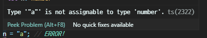
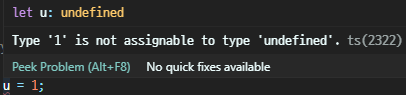
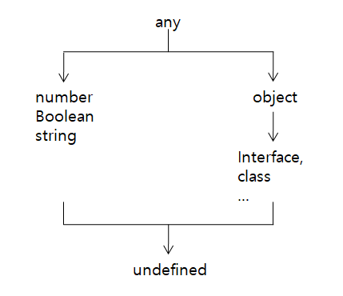
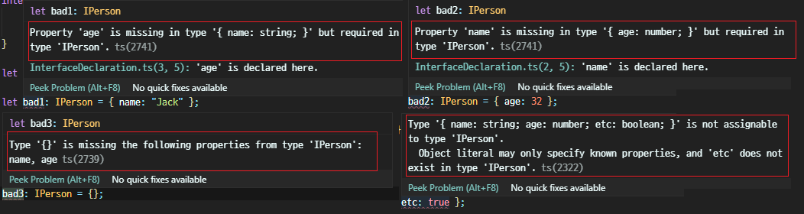

# 03장 객체와 타입

<details><summary>Table of Contents</summary>

-   03-1 타입스크립트 변수 선언문 [:link:](#03-1-타입스크립트-변수-선언문)
    -   let과 const 키워드 [:link:](#let과-const-키워드)
    -   타입 주석 [:link:](#타입-주석)
    -   타입 추론 [:link:](#타입-추론)
    -   any 타입 [:link:](#any-타입)
    -   undefined 타입 [:link:](#undefined-타입)
    -   Typescript 타입 계층도 [:link:](#typescript-타입-계층도)
    -   템플릿 문자열 [:link:](#템플릿-문자열)
-   03-2 객체와 인터페이스 [:link:](#03-2-객체와-인터페이스)
    -   타입스크립트의 객체 [:link:](#타입스크립트의-객체)
    -   인터페이스 선언문 [:link:](#인터페이스-선언문)
    -   선택 속성 구문 [:link:](#선택-속성-구문)
    -   익명 인터페이스 [:link:](#익명-인터페이스)
-   03-3 객체와 클래스 [:link:](#03-3-객체와-클래스)
    -   클래스 선언문 [:link:](#클래스-선언문)
    -   접근 제한자 [:link:](#접근-제한자)
    -   생성자 [:link:](#생성자)
    -   인터페이스 구현 [:link:](#인터페이스-구현)
    -   추상 클래스 [:link:](#추상-클래스)
    -   클래스의 상속 [:link:](#클래스의-상속)
    -   static 속성 [:link:](#static-속성)
-   03-4 객체의 비구조화 할당문 [:link:](#03-4-객체의-비구조화-할당문)
    -   구조화 [:link:](#구조화)
    -   비구조화란? [:link:](#비구조화란?)
    -   비구조화 할당 [:link:](#비구조화-할당)
    -   잔여 연산자 [:link:](#잔여-연산자)
    -   전개 연산자 [:link:](#전개-연산자)
-   03-5 객체의 타입 변환 [:link:](#03-5-객체의-타입-변환)

</details>

## 03-1 타입스크립트 변수 선언문

### 타입스크립트 기본 제공 타입

Typescript는 Javascript와의 호환을 위해 Javascrip의 타입을 제공한다.<br/>
또한 그에 대응하는 Typescript의 타입 또한 제공한다.<br/>
Javascript와 Typescript의 기본 타입은 아래의 표와 같다.<br/>

|    유형     | Javascript 타입 | Typescript 타입 |
| :---------: | :-------------: | :-------------: |
|   수 타입   |     Number      |     number      |
| 불리언 타입 |     Boolean     |     boolean     |
| 문자열 타입 |     String      |     string      |
|  객체 타입  |     Object      |     object      |

### let과 const 키워드

#### let 키워드

Javascript는 vaiable의 앞 세글자를 딴 `var`키워드를 사용해 변수 선언이 가능하다.<br/>
하지만 `var`은 다른 프로그래밍 언어와 다르게 동작한다.<br/>
ESNext에는 `let`과 `const`라는 키워드를 도입해 다른 언어와 같게 동작하도록 하였다<br/>
ESNext에서 `let`키워드로 변수를 선언하는 방법은 아래와 같다.<br/>

```javascript
let 변수_이름 [= 초기값];
```

`let`키워드로 선언된 변수는 코드에서 항상 값이 **변경될 수 있음**을 암시한다.<br/>

#### const 키워드

`const`키워드로 변수를 선언할 때에는 항상 초기값을 명시해야한다.<br/>
`const`키워드로 변수를 선언하는 방법은 `let`과 동일하다.<br/>

```javascript
const 변수_이름 = 초기값;
```

`const`로 변수는 코드에서 변수의 값이 절대 **변하지 않음**을 암시한다.<br/>

### 타입 주석

Typescript는 Javascript의 변수 선언문을 확장해 아래와 같이 **타입을 명시**할 수 있다.<br/>
타입을 명시해 변수를 선언하는 것을 **타입 주석**(**Type Annotation**)이라 한다.<br/>

```typescript
let 변수_이름: 타입 [= 초기값];
const 변수_이름: 타입 = 초기값;
```

-   **타입 주석**을 붙여 변수를 선언한 예시

```typescript
let n: number = 1;
let b: boolean = true;
let s: string = "hello";
let o: object = {};
```

Typescript는 `let`으로 선언한 변수는 **명시한 타입으로만 값이 변경 가능**하다.<br/>

-   **타입 주석**과 일치하지 않는 값으로 변경한 예시

```typescript
let n: number = 1;
let b: boolean = true;
let s: string = "hello";
let o: object = {};

n = "a"; // ERROR!
b = 1; // ERROR!
s = false; // ERROR!
o = { name: "Jack", age: 32 };
```



위와 같이 IDE에서도 **타입 불일치 오류**를 보여주는 것을 확인할 수 있다.<br/>

### 타입 추론

Typescript는 Javascript와의 호환을 위해 **타입 주석**을 생략할 수 있다.<br/>
**타입 주석**이 생략되면 `=`연산자 **오른쪽 값**에 따라 **타입을 지정**한다.<br/>
생략된 타입을 지정하는 기능을 **타입 추론**(**Type Inference**)라고 한다.<br/>

-   **타입 추론** 예시

```javascript
let n = 1; // n -> number
let b = true; // b -> boolean
let s = "hello"; // s -> string
let o = {}; // o -> object
```

변수 선언문에 **타입 주석**을 명시하지 않았지만 컴파일러가 **초기값에 따라 타입을 추론**한다.<br/>
따라 이후에는 각 변수에는 **초기값으로 지정된 타입의 값만 지정**할 수 있다.<br/>

### any 타입

`any`타입 역시 Javascript와의 호환을 위해 제공된다.<br/>
`any`타입으로 타입이 선언되면 값의 타입과 무관하게 어떤 종류도 저장할 수 있다.<br/>

-   `any` 타입 예시

```typescript
let a: any = 0;
a = "hello";
a = true;
a = {};
```

### undefined 타입

Javascript에서 `undefined`는 하나의 값이다.<br/>
변수를 **초기화하지 않게되면** 해당 변수의 값은 `undefined`가 된다.<br/>
Typescript에서의 `undefined`는 **타입**이기도 하면서 **값**이다.<br/>

-   `undefined` 타입 예시

```typescript
let u: undefined = undefined;
u = 1;
```



예시와 같이 `undefined` 타입에 다른 타입의 값을 저장하려고하면 오류가 발생한다.<br/>
`undefined` 타입으로 선언된 변수는 오직 `undefined`값만 가질 수 있다.<br/>

### Typescript 타입 계층도

Typescript의 타입 상속 관계는 아래와 같다.<br/>



`any`는 모든 타입들의 루트 타입 즉 **최상위 타입**이다.<br/>
반면에 `undefined`는 모든 타입의 **최하위 타입**이다.<br/>
따라서 `undefined`값을 제외한 모든 값들은 `undefined`타입이 될 수 없다.<br/>

### 템플릿 문자열

Typescript에서는 변수값을 조합해 문자열을 만드는 **템플릿 문자열** (**Template String**)을 제공한다.<br/>
**템플릿 문자열**은 역따옴표(`` ` ``)로 문자열을 감싸고 변수를 `${}`로 감싸는 형태로 만든다.<br/>

-   **템플릿 문자열** 문법

```typescript
`${변수_이름}`;
```

-   **템플릿 문자열** 예시

```typescript
let count = 10,
    message = "Your count";
let result = `${message} is ${count}`;

console.log(result); // Your count is 10
```

[[🔝위로가기]](#03장-객체와-타입)&nbsp; / &nbsp;[[🔙뒤로가기]](https://github.com/alstn2468/DoIt_Typescript_Programming/blob/master/README.md)

## 03-2 객체와 인터페이스

### 타입스크립트의 객체

Typescript의 타입 계층도에서 `object` 타입은 `interface`와 `class`의 상위 타입이다.<br/>
`object` 타입으로 선언된 변수는 `number`, `boolean`, `string`타입의 값을 가질수 없다.<br/>
하지만 아래와 같이 **속성 이름이 다른 객체**를 모두 자유롭게 담을 수 있다.<br/>

```typescript
let o: object = { name: "Jack", age: 32 };
o = { first: 1, second: 2 };
```

위의 코드에서 `object`타입은 객체를 대상으로 하는 `any`와 같이 동작한다.<br/>
Typescript에서의 `interface`는 위와 같이 동작하는 것을 방지하기 위해 고안되었다.<br/>
변수 `o`에는 항상 `name`속성과 `age`속성을 갖는 객체만 저장되도록 설정해야한다.<br/>

### 인터페이스 선언문

Typescript는 **객체의 타입**을 정의하는 `interface` 키워드를 제공한다.<br/>
Typescript의 `interface`는 객체의 타입을 정의하는 것이 목적이다.<br/>
따라서 객체를 의미하는 `{}`로 **속성**과 **속성의 타입 주석**을 나열하는 형태로 사용한다.<br/>

-   `interface` 문법

```typescript
interface 인터페이스 이름 {
    속성이름[?]: 속성 타입[,...];
}
```

-   `IPerson` 인터페이스 예시

```typescript
interface IPerson {
    name: string;
    age: number;
}
```

위의 `IPerson` 인터페이스는 `name`과 `age`속성을 포함한다.<br/>
`IPerson` 인터페이스는 `name`과 `age`속성이 없는 객체는 저장할 수 없다.<br/>

-   `interface` 선언 조건을 벗어난 예시

```typescript
interface IPerson {
    name: string;
    age: number;
}

let good: IPerson = { name: "Jack", age: 32 };

let bad1: IPerson = { name: "Jack" };
let bad2: IPerson = { age: 32 };
let bad3: IPerson = {};
let bad4: IPerson = { name: "Jack", age: 32, etc: true };
```



위와 같이 IDE 자체에서도 타입 오류를 발생시키는 것을 확인할 수 있다.<br/>

### 선택 속성 구문

`interface`를 설계할 때 속성에는 포함되지만 없어도 되는 속성이 존재할 때가 있다.<br/>
이러한 속성을 **선택 속성**(**Optional Peoperty**)라고 한다.<br/>
**선택 속성**은 속성 이름 뒤에 `?`를 붙여 사용한다.<br/>

-   **선택 속성** 예시

```typescript
interface IPerson2 {
    name: string;
    age: number;
    etc?: boolean;
}

let good1: IPerson2 = { name: "Jack", age: 32 };
let good2: IPerson2 = { name: "Jack", age: 32, etc: true };
```

예시에서 `etc`속성은 **선택 속성**이기 때문에 `good1`에 속성이 없어도 동작한다.<br/>

### 익명 인터페이스

`interface` 키워드를 사용하지 않고 이름이 없는 인터페이스를 사용할 수 있다.<br/>
이러한 `interface`를 **익명 인터페이스**(**Anonymous Inteface**)라고 한다.<br/>

-   **익명 인터페이스** 예시

```typescript
let ai: {
    name: string;
    age: number;
    etc?: boolean;
} = { name: "Jack", age: 32 };
```

위의 `ai`변수에 사용된 `interface`는 `IPerson2`와 같은 구성이지만 이름이 없다.<br/>

-   **익명 인터페이스** 사용 예시

```typescript
function printMe(me: { name: string; age: number; etx?: boolean }) {
    console.log(
        me.etc ? `${me.name} ${me.age} ${me.etc}` : `${me.name} ${me.age}`
    );
}

printMe(ai); // Jack 32
```

**익명 인터페이스**는 주로 위와 같이 함수를 구현할 때 사용한다.<br/>

[[🔝위로가기]](#03장-객체와-타입)&nbsp; / &nbsp;[[🔙뒤로가기]](https://github.com/alstn2468/DoIt_Typescript_Programming/blob/master/README.md)

## 03-3 객체와 클래스

### 클래스 선언문

Typescript는 `class`, `private`, `public`, `protected`, `implements`, `extend`와 같은 키워드를 제공한다.<br/>
문법적인 차이는 존재하지만 다른 언어와 의미는 같다.<br/>

-   클래스 선언 문법

```typescript
class 클래스 이름 {
    [private | protected | public] 속성 이름[?]: 속성 타입[...];
}
```

-   클래스 선언 예시

```typescript
class Person1 {
    name: string;
    age?: number;
}
```

위의 코드는 `name`과 `age` 속성을 갖는 클래스를 선언한 코드다.<br/>

-   클래스 생성 예시

```typescript
let jack1: Person1 = new Person1();
jack1.name = "Jack";
jack1.age = 32;

console.log(jack1); // Person1 { name: 'Jack', age: 32 }
```

선언한 `Person`클래스를 `new`키워드를 통해 생성해 `jack1`변수에 저장했다.<br/>
그 후 `name`속성과 `age`속성 값을 저장해주고 출력했다.<br/>

### 접근 제한자

클래스의 속성은 `public`, `private`, `protect`와 같은 접근 제한자를 붙일 수 있다.<br/>
접근 제한자를 생략하면 `public`으로 간주되어 속성이 사용된다.<br/>

### 생성자

Typescript의 클래스는 `constructor`라는 이름의 **생성자** 매서드를 포함한다.<br/>
아래와 같이 `constructor` 매서드를 이용해 클래스를 작성할 수 있다.<br/>

-   **생성자** 매서드 예시

```typescript
class Person2 {
    constructor(public name: string, public age?: number) {}
}

let jack2: Person2 = new Person2("Jack", 32);
console.log(jack2); // Person2 { name: 'Jack', age: 32 }
```

`constructor` 매서드에 속성을 선언하며 클래스 생성과 동시에 값을 저장할 수 있다.<br/>
위에 코드에서는 생성자의 매개변수에 **접근 제한자**를 붙여 사용했다.<br/>
따라서 **접근 제한자**가 붙은 매개변수의 이름의 속성이 클래스에 **선언된 것 처럼 동작**한다.<br/>

-   `Person2`클래스를 풀어서 작성한 예시

위에 작성한 `Person2`클래스를 풀어서 작성한 클래스는 아래와 같다.<br/>

```typescript
class Person3 {
    name: string;
    age?: number;

    constructor(name: string, age?: number) {
        this.name = name;
        this.age = age;
    }
}

let jack3: Person3 = new Person3("Jack", 32);
console.log(jack3); // Person3 { name: 'Jack', age: 32 }
```

### 인터페이스 구현

클래스가 **인터페이스**를 구현할 때는 `implements` 키워드를 사용한다.<br/>

-   클래스의 **인터페이스** 구현 문법

```typescript
class 클래스 이름 implements 인터페이스 이름 {
    ...
}
```

-   클래스의 **인터페이스** 구현 예시

**인터페이스**는 속성이 있어야한다는 규약에 불과하다.<br/>
따라서 물리적으로 속성이 생기지 않아 인터페이스의 속성을 **클래스에 직접 포함**해야한다.<br/>

```typescript
interface IPerson4 {
    name: string;
    age?: number;
}

class Person4 implements IPerson4 {
    name: string;
    age: number;
}
```

-   **생성자**를 포함한 **인터페이스** 구현 예시

```typescript
class Person5 implements IPerson4 {
    constructor(public name: string, public age?: number) {}
}

let jack4: IPerson4 = new Person5("Jack", 32);
console.log(jack4); // Person5 { name: 'Jack', age: 32 }
```

### 추상 클래스

Typescript에서 **추상 클래스**는 `abstract` 키워드를 사용해 만들 수 있다.<br/>
**추상 클래스**는 `abstract` 키워드를 `class` 키워드 앞에 붙여 사용한다.<br/>
**추상 클래스**는 속성이나 메서드 앞에 `abstract`를 붙여 상속하는 클래스에서 구현하도록 한다.<br/>

-   **추상 클래스** 문법

```typescript
abstract class 클래스 이름 {
    abstract 속성 이름: 속성 타입;
    abstract 메서드 이름() {}
}
```

-   **추상 클래스** 예시

아래의 **추상 클래스**에서 `name`속성은 `abstract` 키워드가 붙어있다.<br/>
따라서 `new` 연산자를 이용해 `name`속성을 갖는 객체를 만들 수 없다.<br/>

```typescript
abstract class AbstractPerson6 {
    abstract name: string;
    constructor(public age?: number) {}
}
```

### 클래스의 상속

Typescript에서도 부모 클래스를 상속 받는 **상속 클래스**를 만들 수 있다.<br/>
부모 클래스를 상속 받기 위해서는 `extends` 키워드를 사용한다.<br/>

-   **상속 클래스** 문법

```typescript
class 상속 클래스 extends 부모 클래스 {
    ...
}
```

-   **상속 클래스** 예시

`Person6`클래스는 `AbstractPerson6` **추상 클래스**를 상속 받는다.<br/>
`AbstractPerson6`에 구현된 `age`속성을 얻고 구현해야할 `name`속성을 구현한다.<br/>
부모 클래스의 **생성자** 메서드는 `super`를 이용해 호출한다.<br/>

```typescript
abstract class AbstractPerson6 {
    abstract name: string;
    constructor(public age?: number) {}
}

class Person6 extends AbstractPerson6 {
    constructor(public name: string, age?: number) {
        super(age);
    }
}

let jack6: Person6 = new Person6("Jack", 32);
console.log(jack6); // Person6 { age: 32, name: 'Jack' }
```

### static 속성

Typescript의 클래스는 **정적인 속성**을 가질 수 있다.<br/>

-   **정적 속성** 문법

```typescript
class 클래스 이름 {
    static 정적 속성 이름: 속성 타입;
}
```

-   **정적 속성** 예시

**정적 속성**은 클래스가 생성자로 생성되지 않아도 아래와 같이 접근 가능하다.<br/>

```typescript
class A {
    static initValue = 1;
}

let initValue = A.initValue;
console.log(initValue); // 1
```

[[🔝위로가기]](#03장-객체와-타입)&nbsp; / &nbsp;[[🔙뒤로가기]](https://github.com/alstn2468/DoIt_Typescript_Programming/blob/master/README.md)

## 03-4 객체의 비구조화 할당문

### 구조화

아래의 코든는 name이라는 단어와 age라는 단어가 다른 의미로 사용되는 예시가 있다.<br/>

```typescript
let personName = "Jack";
let personAge = 32;

let companyName = "Apple Company, Inc";
let companyAge = 43;
```

정상적으로 작동은하지만 작성하기에도 번거로우며 기능을 확장하기 쉽지않다.<br/>
따라서 **인터페이스**나 **클래스**를 사용해 관련 정보를 묶어 새로운 타입으로 표현한다.<br/>
이렇게 정보를 묶는 과정을 **구조화**(**Structuring**)이라고 한다.<br/>

-   위의 예시를 **구조화**한 예시

```typescript
export interface IPerson {
    name: string;
    age: number;
}

export interface ICompany {
    name: string;
    age: number;
}
```

위와 같이 **구조화**를 진행하면 비슷한 유형의 변수를 쉽게 만들 수 있다.<br/>

-   **구조화**한 **인터페이스**를 사용하는 예시

```typescript
import { IPerson, ICompany } from "./Structuring";

let jack: IPerson = { name: "Jack", age: 32 },
    jane: IPerson = { name: "Jane", age: 32 };

let apple: ICompany = { name: "Apple Computer, Inc", age: 43 },
    ms: ICompany = { name: "Microsoft", age: 44 };
```

`jack`, `jane`, `apple`, `ms`와 같이 새로운 변수를 쉽게 만들 수 있다.<br/>

### 비구조화란?

구조화된 데이터는 어떤 시점에서 **데이터의 일부만 사용**해야 할 때가 있다.<br/>
이런 상황에서 구조화된 데이터를 분해하는 **비구조화**(**Destructuring**)를 사용한다.<br/>

-   **비구조화** 예시

```typescript
interface IPerson {
    name: string;
    age: number;
}

let jack: IPerson = { name: "Jack", age: 32 };

let jack_name = jack.name;
let jack_age = jack.age;
```

`jack` 객체에서 `jack.name`, `jack.age` 부분을 `jack_name`, `jack_age`를 저장한다.<br/>
이 시점부터 `jack`변수를 사용하지 않고 `jack_name`, `jack_age` 변수를 사용한다.<br/>

### 비구조화 할당

**비구조화 할당**(**Destructuring**)은 ESNext 문법으로 Typescript에서도 사용 가능하다.<br/>
**비구조화 할당**은 **객체**뿐만 아니라 **배열**과 **튜플**에도 적용이 가능하다.<br/>
**비구조화 할당**을 객체에 적용하려면 얻고 싶은 속성을 `{}`로 묶는다.<br/>

-   **비구조화 할당** 예시

```typescript
let { name, age } = jack;
console.log(name, age); // Jack 32
```

**비구조화 할당**은 `name`, `age`변수가 **생성**되고 **객체의 속성값**이 변수에 **할당**된다.<br/>

### 잔여 연산자

ESNext와 Typescript는 `...`을 사용하는 **잔여 연산자**(**Rest Operator**)를 제공한다.<br/>
이 연산자는 사용 위치에 따라 **잔여 연산자** 또는 **전개 연산자**라고 불린다.<br/>

-   **전개 연산자** 예시

```typescript
let address: any = {
    country: "Korea",
    city: "Seoul",
    address1: "Gangnam-gu",
    address2: "Sinsa-dong 123-456",
    address3: "789 street, 2 Floor ABC building",
};

const { country, city, ...detail } = address;

console.log(detail);
// {
//   address1: 'Gangnam-gu',
//   address2: 'Sinsa-dong 123-456',
//   address3: '789 street, 2 Floor ABC building'
// }
```

위의 코드에서 `address`객체는 5개의 속성을 가지고 있다.<br/>
속성 중 `country`와 `city`를 제외한 나머지 속성을 저장하는 코드다.<br/>
`detail`변수 앞에 `...`연산자를 붙이면서 `country`, `city`를 제외한 속성이 저장되었다.<br/>

### 전개 연산자

**잔여 연산자**는 변수 앞에 `...`연산자가 붙었다.<br/>
**전개 연산자**(**Spread Operator**)는 객체 앞에 `...`연산자를 붙여 사용한다.<br/>

-   **전개 연산자** 예시

```typescript
let coord = { ...{ x: 0 }, ...{ y: 0 } };
console.log(coord); // { x: 0, y: 0 }
```

**전개 연산자**는 객체의 속성을 모두 **전개**해 새로운 객체를 만든다.<br/>

-   3개의 객체를 전개하는 **전개 연산자** 예시

```typescript
let part1 = { name: "Jane" };
let part2 = { age: 22 };
let part3 = { city: "Seoul", country: "Kr" };
let merged = {
    ...part1,
    ...part2,
    ...part3,
};

console.log(merged); // { name: 'Jane', age: 22, city: 'Seoul', country: 'Kr' }
```

`part1`, `part2`, `part3`객체를 **전개**해 새로운 `merged`객체를 생성하였다.<br/>

[[🔝위로가기]](#03장-객체와-타입)&nbsp; / &nbsp;[[🔙뒤로가기]](https://github.com/alstn2468/DoIt_Typescript_Programming/blob/master/README.md)

## 03-5 객체의 타입 변환

[[🔝위로가기]](#03장-객체와-타입)&nbsp; / &nbsp;[[🔙뒤로가기]](https://github.com/alstn2468/DoIt_Typescript_Programming/blob/master/README.md)
