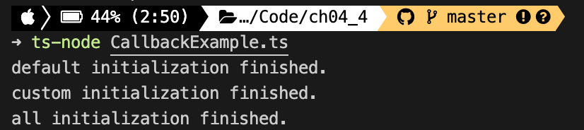

# 04장 함수와 메서드

<details><summary>Table of Contents</summary>

-   04-1 함수 선언문 [:link:](#04-1-함수-선언문)
    -   함수 선언문 문법 [:link:](#함수-선언문-문법)
    -   매개변수와 인수, 인자 [:link:](#매개변수와-인수-인자)
    -   매개변수와 반환값의 타입 주석 생략 [:link:](#매개변수와-반환값의-타입-주석-생략)
    -   void 타입 [:link:](#void-타입)
    -   함수 시그니처 [:link:](#함수-시그니처)
    -   type 키워드로 타입 별칭 만들기 [:link:](#type-키워드로-타입-별칭-만들기)
    -   undefined 관련 주의 사항 [:link:](#undefined-관련-주의-사항)
    -   선택적 매개변수 [:link:](#선택적-매개변수)
-   04-2 함수 표현식 [:link:](#04-2-함수-표현식)
    -   함수는 객체다 [:link:](#함수는-객체다)
    -   일등 함수 [:link:](#일등-함수)
    -   함수 표현식 [:link:](#함수-표현식)
    -   함수 호출 연산자 [:link:](#함수-호출-연산자)
    -   익명 함수 [:link:](#익명-함수)
    -   const 키워드와 함수 표현식 [:link:](#const-키워드와-함수-표현식)
-   04-3 화살표 함수와 표현식 문 [:link:](#04-3-화살표-함수와-표현식-문)
    -   실행문과 표현식 문 [:link:](#실행문과-표현식-문)
    -   복합 실행문 [:link:](#복합-실행문)
    -   return 키워드 [:link:](#return-키워드)
    -   표현식 문 스타일의 화살표 함수 구현 [:link:](#표현식-문-스타일의-화살표-함수-구현)
    -   표현식과 표현식 문의 차이 [:link:](#표현식과-표현식-문의-차이)
-   04-4 일등 함수 살펴보기 [:link:](#04-4-일등-함수-살펴보기)
    -   콜백 함수 [:link:](#콜백-함수)
    -   중첩 함수 [:link:](#중첩-함수)
    -   고차 함수와 클로저, 그리고 부분 함수 [:link:](#고차-함수와-클로저-그리고-부분-함수)
-   04-5 함수 구현 기법 [:link:](#04-5-함수-구현-기법)
-   04-6 클래스 메서드 [:link:](#04-6-클래스-메서드)

</details>

## 04-1 함수 선언문

### 함수 선언문 문법

Javascript에는 `function` 키워드로 만드는 함수와 `=>`로 만드는 함수 두가지가 있다.<br/>

-   `function` 키워드로 만드는 Javscript 함수 선언문

```typescript
function 함수 이름(매개변수1, 매개변수2[, ...]) {
    함수 몸통
}
```

-   `function` 키워드로 만드는 Typescript 함수 선언문

```typescript
function 함수 이름(매개변수1: 타입1, 매개변수2: 타입2[, ...]): 반환값 타입 {
    함수 몸통
}
```

-   Typescript 함수 선언문 예시

```typescript
function add(a: number, b: number): number {
    return a + b;
}
```

### 매개변수와 인수, 인자

**매개변수**는 `parameter`라고 하며 `argument`는 **인수** 혹은 **인자**라고 한다.<br/>
**매개변수**는 함수 선언문에서 함수 이름 뒤 **괄호 안에 선언하는 변수**다.<br/>
**인자**는 선언한 함수를 **호출할 때 전달하는 값**을 의미한다.<br/>

-   **매개변수**와 **인자** 예시

```typescript
function add(a: number, b: number): number {
    return a + b;
}

let result = add(1, 2);
console.log(result); // 3
```

위의 예시에서 `a`와 `b`는 **매개변수**이고 전달한 `1`과 `2`는 **인자**다.<br/>

### 매개변수와 반환값의 타입 주석 생략

**함수 선언문**에서도 **매개변수와 반환값**에 대한 **타입 주석 생략이 가능**하다.<br/>
하지만 변수와 달리 함수의 매개변수와 반환 타입을 **생략하는 것은 바람직하지 않다**.<br/>
**타입이 생략**되어 있으면 함수의 **구현 의도**를 알기 어렵고 **잘못 사용하기 쉽다**.<br/>

### void 타입

값을 반환하지 않는 함수는 반환 타입이 `void`다.

-   `void` 반환 타입 예시

```typescript
function printMe(name: string, age: number): void {
    console.log(`name: ${name}, age: ${age}`);
}

printMe("Jack", 32); // name: Jack, age: 32
```

`void` 타입은 **함수의 반환 타입으로만 사용**할 수 있다.<br/>

### 함수 시그니처

변수에 타입이 있듯이 함수에도 **함수 시그니처**(**Function Signature**)라는 **타입**이 존재한다.<br/>
**함수 시그니처**를 사용하면 **매개변수 개수**나 **타입**, **반환 타입**을 **잘못 선언하는 것을 방지**할 수 있다.<br/>

-   **함수 시그니처** 문법

**함수 시그니처**는 아래와 같은 문법으로 사용된다.<br/>

```typescript
(매개변수1 타입, 매개변수2 타입,[, ...]) => 반환값 타입
```

-   **함수 시그니처** 예시

```typescript
let printMe: (string, number) => void = function (
    name: string,
    age: number
): void {
    console.log(`name: ${name}, age: ${age}`);
};

printMe("Jack", 32); // name: Jack, age: 32
```

`printMe`함수는 `string`과 `number` 타입의 매개변수가 존재하며 반환 타입이 `void`다.<br/>
따라서 `printMe`의 **함수 시그니처**는 `(string, number) => void`가 된다.<br/>
매개변수가 없으면 `()`로 표현된다. `() => void`는 매개변수와 반환값이 없는 함수 시그니처다.<br/>

### type 키워드로 타입 별칭 만들기

Typescript는 `type`이라는 키워드를 제공한다.<br/>
`type` 키워드는 기존에 **존재하는 타입**을 **이름만 바꾸어 사용**할 수 있게 해준다.<br/>
타입 이름을 바꾸어 사용하는 기능을 **타입 별칭**(**Type Alias**)라고 한다.<br/>

-   **타입 별칭** 문법

```typescript
type 새로운 타입 = 기존 타입;
```

-   **타입 별칭** 예시

**함수 시그니처**를 `stirngNumberFunc`이라는 이름으로 **타입 별칭**을 만든 예시다.<br/>

```typescript
type stringNumberFunc = (string, number) => void;
let f: stringNumberFunc = function (a: string, b: number): void {};
let g: stringNumberFunc = function (c: string, d: number): void {};
```

`stringNumberFunc` 별칭을 이용해 `f`와 `g`에 **타입 주석을 간단하게** 붙일 수 있다.<br/>

### undefined 관련 주의 사항

`undefined` 타입은 Typescript의 타입 계층도에서 최하위 타입이다.<br/>

-   `undefined`를 고려하지 않은 예시<br/>

```typescript
interface INameable {
    name: string;
}

function getName(o: INameable) {
    return o.name;
}

let n = getName(undefined);
console.log(n);
```

`getName`는 `INameable` 타입을 요구하지만 `undefined`를 넘기면 구문 오류가 발생하지 않는다.<br/>
`undefined`는 최하위 타입이므로 `INamealbe`을 상속하는 **자식 타입으로 간주**된다.<br/>
하지만 코드를 실행시켜보면 `o.name` 부분이 `undefined.name`이 되어 오류가 발생한다.<br/>
이런 오류를 방지하려면 매개변수가 `undefined`인지 판별하는 코드를 작성해야 한다.<br/>

-   `undefined`를 고려한 예시

```typescript
interface INameable {
    name: string;
}

function getName(o: INameable) {
    return o != undefined ? o.name : "Unknown name";
}

let n = getName(undefined);
console.log(n); // Unknown name
console.log(getName({ name: "Jack" })); // Jack
```

`getName`함수에서 `o`가 `undefined`일 경우 `Unknown name`을 반환하도록 작성해 해결하였다.<br/>
만약 인터페이스에 **선택 속성**이 있다면 아래와 같이 구현해야한다.<br/>

```typescript
interface IAgeable {
    age?: number;
}

function getAge(o: IAgeable) {
    return o != undefined && o.age ? o.age : 0;
}

console.log(getAge(undefined)); // 0
console.log(getAge(null)); // 0
console.log(getAge({ age: 32 })); // 32
```

인자로 받은 `o`가 `undefined`인지 확인하고 해당 **속성 존재여부 까지 확인**하여야 한다.<br/>

### 선택적 매개변수

**선택 속성**과 같이 함수의 매개변수도 **선택적 매개변수**(**Optional Parameter**) 사용이 가능하다.<br/>

-   **선택적 매개변수** 문법

```typescript
function fn(arg1: string, arg?: number): void {}
```

-   **선택적 매개변수** 예시

```typescript
function fn(arg1: string, arg?: number): void {
    console.log(`arg: ${arg}`);
}

fn("Hello", 1);
fn("Hello");
```

두번째 인자인 `arg`는 없어도 정상적으로 함수가 동작한다.<br/>

-   **선택적 매개변수**가 있는 함수의 시그니처 예시

```typescript
type OptionalArgFunc = (string, number?) => void;
```

**선택적 매개변수**가 있는 함수의 시그니처는 타입 뒤에 `?`를 붙여 사용한다.<br/>

[[🔝위로가기]](#04장-함수와-메서드)&nbsp; / &nbsp;[[🔙뒤로가기]](https://github.com/alstn2468/DoIt_Typescript_Programming/blob/master/README.md)

## 04-2 함수 표현식

### 함수는 객체다

Javascript는 함수형 언어 `scheme`과 프로토타입 기반 객체지향 언어 `self`를 모델로 만들어졌다.<br/>
따라서 Javascript는 **객체지향 언어**와 **함수형 언어**의 특징을 모두 가지고 있다.<br/>
Typescript 또한 Javascript의 이러한 특징을 모두 가지고 있다.<br/>

```typescript
let add = new Function("a", "b", "return a + b");
let result = add(1, 2);
console.log(result); // 3
```

Javascript에서의 함수는 `Function` 클래스의 인스턴스다.<br/>
위의 코드를 `add`라는 객체가 함수로서 동작해 `3`이라는 결과물이 출력된다.
`add`가 함수라면 일반적으로 아래와 같은 구문을 사용하였을 것이다.<br/>

```typescript
function add(a, b) {
    return a + b;
}
```

하지만 `Function("a", "b", "return a + b")`와 같이 변수 선언문 형태로 함수를 구현하였다.<br>
또한 `add`함수와 같은 기능을 하는 함수를 아래와 같이도 구현할 수 있다.<br/>

```typescript
let add2 = function (a, b) {
    return a + b;
};
console.log(add2(1, 2)); // 3
```

**함수 선언문**에서 함수 이름을 제외한 `function () { }`를 **함수 표현식**이라고 한다.<br/>
**함수 표현식**은 함수형 언어의 핵심 기능이다.<br/>

### 일등 함수

프로그래밍 언어가 **일등 함수**를 제공하면 **함수형 프로그래밍**언어라고 한다.<br/>
Javascript와 Typescript는 **일등 함수**기능을 제공하므로 **함수형 프로그래밍**언어다.<br/>
**일등 함수**는 **함수와 변수를 구분하지 않는다는 의미**를 갖는다.<br/>

```typescript
let f = function (a, b) {
    return a + b;
};
console.log(f(1, 2)); // 3

f = function (a, b) {
    return a - b;
};
console.log(f(1, 2)); // -1
```

위의 코드에서 `f`는 `let` 키워드가 앞에 있으므로 값이 저장가능한 **변수**다.<br/>
변수 `f`에는 `a + b` 형태의 **함수 표현식을 저장**하였다.<br/>
하지만 `f`는 변수이기 때문에 `a - b` 형태의 **함수 표현식 또한 저장**이 가능하다.<br/>
따라서 `f`가 **변수인지 함수인지 구분할 수 없어** Javascript와 Typescript는 **일등 함수**를 제공한다.<br/>

### 함수 표현식

#### 표현식이란?

**표현식**은 **리터럴**, **연산자**, **변수**, **함수 호출**등이 **복합적으로 구성된 코드 형태**를 의미한다.<br/>
`1 + 2`는 `1`이라는 **리터럴**과 `2`라는 **리터럴**과 `+` **연산자**로 구성된 **표현식**이다.<br/>
**표현식**은 항상 컴파일러에 의해 **계산법**이 적용되어 어떤 **값**이 된다.<br/>

#### 함수 표현식 예시

일등 함수 예시와 같이 `function (a, b) { return a + b }`와 같은 부분이 **함수 표현식**이다.<br/>

```typescript
let f = function (a, b) {
    return a + b;
};
```

`function (a, b) { return a + b }` **함수 표현식**은 변수 `f`에 **값처럼 대입**된다.<br/>

#### 계산법

컴파일러는 **표현식**을 만나면 계산법을 적용해 어떠한 값을 만든다.<br/>
계산법에는 **조급한 계산법**과 **느긋한 계산법** 두 가지가 존재한다.<br/>
컴파일러가 `1 + 2`라는 표현식을 만나면 조급한 계산법을 적용해 `3`이라는 값을 만든다.<br/>
반대로 컴파일러가 **함수 표현식**을 만나면 **느긋한 계산법**을 적용한다.<br/>
`function (a, b) { return a + b }`같은 **함수 표현식**의 `a`와 `b`의 값을 알 수 없기 때문이다.<br/>

### 함수 호출 연산자

변수가 **함수 표현식**을 가지면 변수 이름 뒤에 **함수 호출 연산자** `()`를 붙여 호출할 수 있다.<br/>
**함수 호출**이란 **함수 표현식**의 몸통 구현 부분을 실행한다는 뜻이다.<br/>
만약 함수가 **매개변수**를 필요로 한다면 **함수 호출 연산자 안에 명시**할 수 있다.<br/>

-   **함수 호출 연산자** 예시

```typescript
let functionExpression = function (a, b) {
    return a + b;
};
let value = functionExpression(1, 2);
console.log(value); // 3
```

`functionExpression` 변수는 **함수 표현식**을 가지고 있다.<br/>
따라서 변수 이름 뒤에 **함수 호출 연산자** `(1, 2)`를 붙여 **함수 호출문**을 사용할 수 있다.<br/>
컴파일러는 **함수 호출문**을 만나면 **함수 표현식**에 **조급한 계산법**을 적용해 **값**으로 바꾼다.<br/>

### 익명 함수

**함수 표현식**은 대부분 언어에서 언급되는 **익명 함수**의 다른 표현이다.<br/>
Javascript에서는 아래와 같은 **익명 함수** 코드 또한 동작한다.<br/>

```typescript
let value = (function (a, b) {
    return a + b;
})(1, 2);
console.log(value); // 3
```

**익명 함수**를 작성해 바로 **함수 호출 연산자**를 사용해 **값**을 `value` 변수에 저장하였다.<br/>
**익명 함수**를 `()`로 감싸 **익명 함수**의 처음과 끝을 컴파일러가 알 수 있도록 하였다.<br/>
컴파일러는 **익명 함수**를 **게으른 계산법**을 적용하지만 바로 `()`연산자를 만나 값을 만든다.<br/>

### const 키워드와 함수 표현식

**함수 표현식**을 담는 변수는 `let`보다는 `const` 키워드로 선언하는 것이 바람직하다.<br/>

-   `let` 키워드를 사용한 **함수 표현식**

```typescript
let f = () => {};
f();

f = () => {
    console.log("Hello");
};
f(); // Hello
```

`let` 키워드를 사용하면 값이 변할 수 있기때문에 위와 같이 작성하면 함수가 변경될 수 있다.<br/>

-   `const` 키워드를 사용한 **함수 표현식**

```typescript
const f = () => {};

// Cannot assign to 'c' because it is a constant.
c = () => {
    console.log("Hello");
};
```

**함수 표현식**을 담는 변수를 `const` 키워드로 선언하면 함수의 내용이 변할 수 없다.<br/>

[[🔝위로가기]](#04장-함수와-메서드)&nbsp; / &nbsp;[[🔙뒤로가기]](https://github.com/alstn2468/DoIt_Typescript_Programming/blob/master/README.md)

## 04-3 화살표 함수와 표현식 문

### 실행문과 표현식 문

ESNext는 `function` 키워드가 아닌 `=>` 기호로 **화살표 함수**를 만들 수 있다.<br/>
**화살표 함수**는 `function` 키워드와 다르게 `{}`를 생략할 수도 있다.<br/>

-   **화살표 함수**의 중괄호 생략 예시

```typescript
const arrow1 = (a: number, b: number): number => {
    return a + b;
};
const arrow2 = (a: number, b: number): number => a + b;
```

`{}`의 생략 여부에 따라 Typescript 문법이 **실행문 방식**과 **표현식 문 방식**으로 달라진다.<br/>
프로그래밍 언어는 **실행문 지향 언어**와 **표현식 지향 언어**로 구분되어 왔다.<br/>
**C**가 대표적인 **실행문 지향 언어**이고, **Scala**가 대표적인 **표현식 지향 언어**다.<br/>
Javascript는 실행문 지향 언어지만 ESNext와 Typescript는 **실행문과 표현식을 동시에 지원**한다.<br/>
이런 실행문과 표현식을 동시에 지원하는 언어를 다중 패러다임 언어 라고 한다.<br/>

#### 실행문

프로그래밍 언어에서 **실행문은 CPU에서 실행되는 코드**를 의미한다.<br/>
하지만 **실행문**은 CPU에서 실행만 될 뿐 **결과를 알려주지 않는다**.<br/>
**실행문**의 결과를 알려면 반드시 `return` 키워드를 사용해야 한다.<br/>

-   **실행문**과 예시

**변수에 값을 대입하는 것**은 대표적인 **실행문**의 예시다.<br/>

```typescript
let x;
x = 1;
```

`x`라는 변수를 선언하고 단순히 `x` 변수에 `1`이라는 값을 대입하는 것으로 충분하다.<br/>

#### 표현식 문

**표현식 문**은 CPU에서 실행된 결과를 `return` 키워드를 사용하지 않아도 알려준다.<br/>

-   **표현식 문** 예시

```typescript
let x = 10;
if (x > 0) {
    x = 1;
}
```

위에서 `x > 0` 부분은 `true`나 `false`로 결과를 알려주지 않으면 `if`구문이 동작하지 않는다.<br/>
만약 프로그래밍 문법이 아래와 같다면 코드를 작성하기 번거로워질 것이다.<br/>

```typescript
if (return x > 0) {
    x = 1
}
```

똑같이 CPU에서 실행되더라도 `x > 0`처럼 `return` 키워드 없이 결과를 반환하는 실행문이 필요하다.<br/>
이렇게 `return` 키워드 없이 결과를 반환하는 실행문을 **표현식 문**이라고 구분해 부른다.<br/>

### 복합 실행문

프로그래밍 언어의 `if` 같은 구문은 조건을 만족하면 **한 줄의 실행문만 실행하는 형태로 설계**한다.<br/>

```typescript
if (조건식) {
    실행문;
}
```

이러한 설계가 가능한 이유는 **복합 실행문**이라는 또 다른 형태를 함께 제공하기 때문이다.<br/>
대부분의 언어에서 **복합 실행문**은 `{}`를 이용해 아래와 같이 표현한다.<br/>

```typescript
if (조건문) {
    실행문1;
    실행문2;
}
```

**복합 실행문**은 컴파일러가 **여러 개의 실행문**을 **한 개의 실행문 처럼 인식**하게 한다.<br/>

#### 함수와 복합 실행문

`function` 키워드로 만드는 함수는 반드시 `{}`로 감싸는 **복합 실행문**을 이용한다.<br/>
따라서 함수 몸통은 아래와 같이 여러줄로 구현할 수 있다.<br/>

```typescript
function f() {
    let x = 1,
        y = 2;
    let result = x + y + 10;
}
```

**복합 실행문**은 변수의 유효 범위도 **지역 범위**로 제한한다.<br>
따라서 아래와 같이 두 함수의 몸통에 동일한 이름의 변수가 있어도 문제가 없다.<br/>

```typescript
function f() {
    let x = 1;
}
function g() {
    let x = 2;
}
```

### return 키워드

실행문은 CPU에서 실행된 결과를 알려주지 않는다.<br/>
함수 몸통을 **복합 실행문**으로 구현한 아래 같은 함수는 값을 반환하지 않는다.<br/>

```typescript
function isGreater(a: number, b: number): boolean {
    a > b;
}
```

실행문 기반 언어느 이러한 문제를 해결하기 위하여 `return` 키워드를 제공한다.<br/>

```typescript
function isGreater(a: number, b: number): boolean {
    return a > b;
}
```

그러나 `return` 키워드는 반드시 함수 몸통에만 사용할 수 있다는 제약이 있다.<br/>
이런 제약은 문법을 잘못 이해해 아래와 같은 코드를 만드는 것을 방지하려는 의도다.<br/>

```typescript
if (return x > 0) {
    x = 1;
}
```

### 표현식 문 스타일의 화살표 함수 구현

위의 `isGreater` 함수를 **화살표 함수**로 구현하면 아래와 같다.<br/>

```typescript
const isGreater = (a: number, b: number): boolean => {
    return a > b;
};
```

또한 ESNext와 Typescript에서는 아래 같이 간단하게 구현할 수 있다.<br/>

```typescript
const isGreater = (a: number, b: number): boolean => a > b;
```

이 코드는 함수 몸통이 `{ a > b }`가 아니라 `a > b`로만 구현이 되었다.<br/>
즉 함수 몸통이 **값을 반환하는 실행문인 표현식**으로만 구현이 되어있다.<br/>
따라서 `return` 키워드 또한 생략되어 함수가 구현되었다.<br/>
`return`은 복합 실행문 안에서만 사용가능해 `return a > b`로만 작성하면 오류가 발생한다.<br/>

### 표현식과 표현식 문의 차이

아래의 코드에서 `a > b`와 같은 코드는 C언어 에서 **표현식**이라고 하였다.<br/>
따라서 그 이후에 만들어진 언어들도 **C언어와 같은 의미로 표현식**이라고 여겨진다.<br/>
따라서 C언어의 관점에서 실행문의 일부일 뿐 **자체가 실행문은 아니다**.<br/>

```typescript
let a = 1,
    b = 0;
if (a > b) {
    console.log("a is greater than b");
}
const isGreater = (a: number, b: number): boolean => a > b;
```

반면에 **표현식 지향 언어** 관점에서 `isGreater` 함수의 `a > b`는 자체가 **실행문**이다.<br/>
결론적으로 **표현식**이라는 용어는 두 가지 형태로 사용된다.<br/>
**표현식 문**이라는 표현은 이 둘을 구분하고자 사용한다.<br/>

#### 실행문을 만드는 세미콜론

C언어는 모든 문장이 반드시 `;`로 끝나야만 정상적으로 작동한다.<br/>
C언어 구문을 참조해 만든 ES5 Javascript또한 모든 문장 끝에 `;`가 있어야 한다.<br/>
반면에 ESNext와 Typescript에서는 `;`을 생략해 코드를 작성할 수 있다.<br/>
Typescript에서는 **관습적으로 표현식 문**에는 `;`를 **붙이지 않는다**.<br/>

[[🔝위로가기]](#04장-함수와-메서드)&nbsp; / &nbsp;[[🔙뒤로가기]](https://github.com/alstn2468/DoIt_Typescript_Programming/blob/master/README.md)

## 04-4 일등 함수 살펴보기

### 콜백 함수

**일등 함수**(**First-Class Function**)은 프로그래밍 언어가 제공하는 기능이다.<br/>
**일등 함수**기능을 제공하는 언어에서 함수는 **함수 표현식**이라는 **일종의 값**이다.<br/>
이것은 **함수 표현식**을 매개변수로 받을 수 있다는 것을 의미한다.<br/>
**매개변수 형태로 동작하는 함수**를 **콜백 함수**(**Callback Function**)이라고 한다.<br/>

-   **콜백 함수** 문법

```typescript
const f = (callback: () => void): void => callback();
```

위의 코드에서 `f`함수에는 `callback`이라는 매개변수가 존재한다.<br/>
`callback`은 함수 몸통에서 함수로서 호출하게 된다.<br/>

-   **콜백 함수** 예시

```typescript
export const init = (callback: () => void): void => {
    console.log("default initialization finished.");
    callback();
    console.log("all initialization finished.");
};
```

위의 코드에서 `init` 함수는 `callback` 매개변수를 받고 몸통에서 호출한다.<br/>

```typescript
import { init } from "./CallbackFunction";

init(() => console.log("custom initialization finished."));
```

실제 `init` 함수를 호출해 사용하는 부분이다.<br/>
**익명 함수**를 사용해 실행하려는 함수를 `init` 함수에 전달한다.<br/>
실행하면 아래와 같은 결과를 얻을 수 있다.<br/>



**인자**로 넘겨준 함수가 정상적으로 실행되어 출력되는 것을 볼 수 있다.<br/>

### 중첩 함수

함수형 언어에서 함수는 **변수에 담긴 함수 표현식** 이므로 **함수에 함수를 중첩**해 구현할 수 있다.<br/>
아래의 코드에서 `calc` 함수는 `add`와 `multiply`라는 이름의 **중첩 함수**를 구현하고 있다.<br/>

-   **중첩 함수** 예시

```typescript
const calc = (value: number, cb: (number) => void): void => {
    let add = (a: number, b: number): number => a + b;
    function multiply(a: number, b: number): number {
        return a * b;
    }

    let result = multiply(add(1, 2), value);
    cb(result);
};

calc(30, (result: number): void => {
    console.log(`result is ${result}`);
}); // result is 90
```

`calc` 함수 내부에 `add`, `multiply` 함수를 작성해 `calc`함수 내부에서 사용할 수 있다.<br/>

### 고차 함수와 클로저, 그리고 부분 함수

**고차 함수**(**High Order Function**)은 또 **다른 함수를 반환하는 함수**를 의미한다.<br/>
함수형 언어에서 함수는 **함수 표현식이라는 값**이기 때문에 다른 함수를 반환할 수 있다.<br/>

-   **고차 함수** 예시

```typescript
const add = (a: number): ((number) => number) => (b: number): number => a + b;
const result = add(1)(2);
console.log(result); // 3
```

위의 예시에서 **함수 호출 연산자를 2개 사용**해 `add(1)(2)`와 같이 호출하였다.<br/>

-   **고차 함수** 예시를 이해하기 쉽게 변경한 예시

`number`를 받아 `number`를 반환하는 **함수 시그니처** `NumberToNumberFunc` 타입을 정의했다.<br/>

```typescript
type NumberToNumberFunc = (number) => number;
```

`NumberToNumberFunc` 타입을 반환하는 `add2`함수를 정의하였다.<br/>

```typescript
type NumberToNumberFunc = (number) => number;
const add2 = (a: number): NumberToNumberFunc => {
    // NumberToNumberFunc 타입의 함수 반환
};
```

**중첩 함수**를 이용해 `add2`함수의 반환값을 구현할 수 있다.<br/>

```typescript
type NumberToNumberFunc = (number) => number;
const add2 = (a: number): NumberToNumberFunc => {
    const _add2: NumberToNumberFunc = (b: number): number => {
        // number 타입의 반환값
    };
    return _add2;
};
```

`add2` 함수가 반환하는 `_add2`는 `NumberToNumberFunc` 타입이다.<br/>
**고차 함수**는 이와 같이 **중첩 함수**를 반환할 수 있다.<br/>
추가적으로 `_add2`의 함수 몸통을 구현하면 `add2`라는 **고차 함수**가 완성된다.<br/>

```typescript
type NumberToNumberFunc = (number) => number;
const add2 = (a: number): NumberToNumberFunc => {
    const _add2: NumberToNumberFunc = (b: number): number => {
        return a + b;
    };
    return _add2;
};
```

여기서 `a`는 `add2`함수의 매개변수 이고 `b`는 `_add2` 함수의 매개변수다.<br/>
`_add2`의 관점에서 `a`는 외부에 선언된 변수다.<br/>
함수형 프로그래밍 언어에서 이런 형태를 **클로저**(**closure**)라고 한다.<br/>

```typescript
let fn: NumberToNumberFunc = add2(1);
console.log(fn(2)); // 3
console.log(add2(1)(2)); // 3
```

`add2` 함수로 나온 값은 **함수 표현식**이므로 `fn`에 호출 연산자를 붙일 수 있다.<br/>
`fn`은 단순히 `add2(1)`을 저장하는 임시 변수의 역할만 한다.<br/>
임시변수를 사용하지 않는다면 `add2(1)(2)`와 같이 호출 연산자를 두 개 사용해야 한다.<br/>
`add2(1)`처럼 **값이 아닌 함수**를 **부분 애플리케이션** 또는 **부분 적용 함수**라고 한다.<br/>

[[🔝위로가기]](#04장-함수와-메서드)&nbsp; / &nbsp;[[🔙뒤로가기]](https://github.com/alstn2468/DoIt_Typescript_Programming/blob/master/README.md)

## 04-5 함수 구현 기법

[[🔝위로가기]](#04장-함수와-메서드)&nbsp; / &nbsp;[[🔙뒤로가기]](https://github.com/alstn2468/DoIt_Typescript_Programming/blob/master/README.md)

## 04-6 클래스 메서드

[[🔝위로가기]](#04장-함수와-메서드)&nbsp; / &nbsp;[[🔙뒤로가기]](https://github.com/alstn2468/DoIt_Typescript_Programming/blob/master/README.md)
