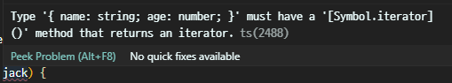
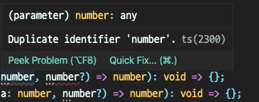
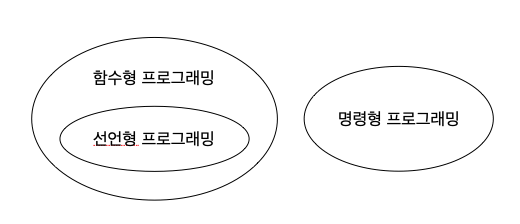
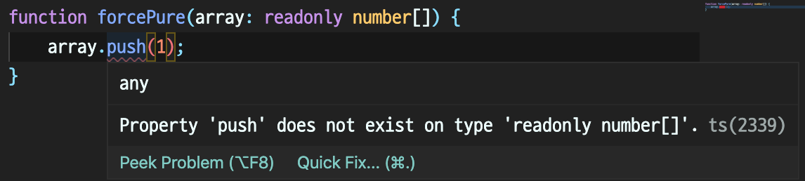
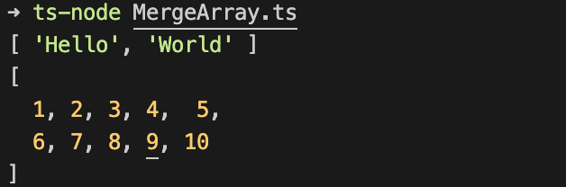

# 05장 배열과 튜플

<details><summary>Table of Contents</summary>

-   05-1 배열 이해하기 [:link:](#05-1-배열-이해하기)
    -   Javascript의 배열 [:link:](#javascript의-배열)
    -   [] 단축 구문 [:link:](#-단축-구문)
    -   배열은 객체다 [:link:](#배열은-객체다)
    -   배열의 타입 [:link:](#배열의-타입)
    -   문자열과 배열 간 변환 [:link:](#문자열과-배열-간-변환)
    -   인덱스 연산자 [:link:](#인덱스-연산자)
    -   배열의 비구조화 할당 [:link:](#배열의-비구조화-할당)
    -   for...in 문 [:link:](#forin-문)
    -   for...of 문 [:link:](#forof-문)
    -   제네릭 방식 타입 [:link:](#제네릭-방식-타입)
    -   제네릭 함수의 타입 추론 [:link:](#제네릭-함수의-타입-추론)
    -   제네릭 함수의 함수 시그니처 [:link:](#제네릭-함수의-함수-시그니처)
    -   전개 연산자 [:link:](#전개-연산자)
    -   range 함수 구현 [:link:](#range-함수-구현)
-   05-2 선언형 프로그래밍과 배열 [:link:](#05-2-선언형-프로그래밍과-배열)
    -   명령형 프로그래밍과 선언형 프로그래밍 [:link:](#명령형-프로그래밍과-선언형-프로그래밍)
    -   1부터 100까지 더하기 [:link:](#1부터-100까지-더하기)
    -   1에서 100까지 홀수의 합 구하기 [:link:](#1에서-100까지-홀수의-합-구하기)
    -   1에서 100까지 짝수의 합 구하기 [:link:](#1에서-100까지-홀수의-합-구하기)
    -   1² + 2² + ... + 100² 구하기 [:link:](#1--2----100-구하기)
-   05-3 배열의 map, reduce, filter 메서드 [:link:](#05-3-배열의-map-reduce-filter-메서드)
    -   배열의 메서드 체인 [:link:](#배열의-메서드-체인)
    -   filter 메서드 [:link:](#filter-메서드)
    -   map 메서드 [:link:](#map-메서드)
    -   reduce 메서드 [:link:](#reduce-메서드)
-   05-4 순수 함수와 배열 [:link:](#05-4-순수-함수와-배열)
    -   순수 함수 [:link:](#순수-함수)
    -   타입 수정자 readonly [:link:](#타입-수정자-readonly)
    -   깊은 복사와 얕은 복사 [:link:](#깊은-복사와-얕은-복사)
    -   전개 연산자와 깊은 복사 [:link:](#전개-연산자와-깊은-복사)
    -   배열의 sort 메서드를 순수 함수로 구현하기 [:link:](#배열의-sort-메서드를-순수-함수로-구현하기)
    -   배열의 filter 메서드와 순수한 삭제 [:link:](#배열의-filter-메서드와-순수한-삭제)
    -   가변 인수 함수와 순수 함수 [:link:](#가변-인수-함수와-순수-함수)
-   05-5 튜플 이해하기 [:link:](#05-5-튜플-이해하기)
    -   Typescript에서의 튜플 [:link:](#typescript에서의-튜플)
    -   튜플에 타입 별칭 사용하기 [:link:](#튜플에-타입-별칭-사용하기)
    -   튜플에 적용하는 비구조화 할당 [:link:](#튜플에-적용하는-비구조화-할당)

</details>

## 05-1 배열 이해하기

### Javascript의 배열

Javasript에서 배열은 `Array` 클래스의 인스턴스이며 아래와 같이 선언한다.<br/>

```javascript
let 배열 이름 = new Array(배열 길이)
```

아래와 같이 `Array` 인스턴스를 만들고 `push` 메서드를 이용해 배열에 값을 넣을 수 있다.<br/>

```javascript
let array = new Array();

array.push(1);
array.push(2);
array.push(3);

console.log(array); // [ 1, 2, 3 ]
```

배열에 담간 각각의 값을 **아이템** 또는 **원소**라고 하며 위의 `array`에는 3개의 아이템이 있다.<br/>

### [] 단축 구문

`new` 연산자를 이용해 `Array`클래스의 인스턴스를 생성해 배열을 만드는 것은 번거롭다.<br/>
따라서 Javascript는 `[]`라는 단축 구문으로 배열을 생성할 수 있다.<br/>

-   `[]` 단축 구문을 이용한 배열 생성 예시

```typescript
let numbers = [1, 2, 3];
let strings = ["Hello", "World!"];

console.log(numbers, strings); // [ 1, 2, 3 ] [ 'Hello', 'World!' ]
```

위의 코드는 `[]` 단축 구문을 이용해 `numbers` 배열과 `strings` 배열을 생성하는 예시다.<br/>

### 배열은 객체다

Javascript에서의 **배열은** 다른 언어와 다르게 **객체다**.<br/>
**배열**은 `Array` 클래스의 **인스턴스**인데 **인스턴스는 객체**이기 때문에 **배열은 객체다**.<br/>
`Array` 클래스는 배열을 사용하는데 필요한 **여러 가지 메서드를 제공**한다.<br/>

-   `Array` 클래스의 메서드 예시

```typescript
let a = [1, 2, 3];
let o = { name: "Jack", age: 32 };

console.log(Array.isArray(a), Array.isArray(o)); // true false
```

위의 코드의 `isArray` 메서드는 **인자로 받은 심벌**이 **배열인지 확인**하는 메서드다.<br/>

### 배열의 타입

Typescript에서 배열의 타입은 `아이템 타입[]`이다.<br/>
배열의 아이템이 `number` 타입이면 배열의 타입은 `number[]`고 `string`이면 `string[]`이다.<br/>

-   **배열에 타입 주석**을 붙이는 예시

```typescript
let numArray: number[] = [1, 2, 3];
let strArray: string[] = ["Hello", "World"];

type IPerson = { name: string; age?: number };
let personArray: IPerson[] = [{ name: "Jack" }, { name: "Jane", age: 32 }];
```

`number`타입과 `string`타입과 마찬가지로 `IPerson`과 같은 직접 선언한 타입 또한 가능하다.<br/>

### 문자열과 배열 간 변환

어떤 언어에서는 **문자열**(**String**)을 **문자**(**Character**)들의 **배열**로 간주한다.<br/>
Typescript에서는 **문자**(**Character**) 타입은 없고 **문자열**(**String**)의 내용은 변경할 수 없다.<br/>
이런 특징 때문에 **문자열을 가공**하기 위해서는 **문자열을 배열로 전환**해야 한다.<br/>
문자열을 배열로 전환할 때는 `String` 클래스의 `split` 메서드를 사용한다.<br/>

-   `split` 메서드 사용법

```typescript
split(구분자: string): string[]
```

-   `String`의 `split` 메서드를 이용해 구현한 `split` 함수

`split` 함수는 전달받은 **문자열**과 **구분자**를 이용해 **문자열을 문자열 배열을 반환**한다.<br/>

```typescript
const split = (str: string, delim: string = ""): string[] => str.split(delim);

console.log(split("Hello")); // [ 'H', 'e', 'l', 'l', 'o' ]
console.log(split("H_e_l_l_o", "_")); // [ 'H', 'e', 'l', 'l', 'o' ]
```

문자열을 `delim` 구분자를 이용해 문자열을 나누어 **배열로 반환**하는 것을 확인할 수 있다.<br/>
문자열 배열을 `string`타입으로 변환하기 위해서는 `Array`의 `join` 메서드를 사용한다.<br/>

-   `join` 메서드 사용법

```typescript
join(구분자: string): string
```

-   `Array`의 `join` 메서드를 이용해 구현한 `join` 함수

`join` 함수는 전달받은 **문자열 배열**과 **구분자**를 **결합해 새로운 문자열을 반환**한다.<br/>

```typescript
const join = (strArray: string[], delim: string = ""): string =>
    strArray.join(delim);

console.log(join(["H", "e", "l", "l", "o"])); // Hello
console.log(join(["H", "e", "l", "l", "o"], "_")); // H_e_l_l_o
```

**문자열 배열**에 있는 모든 **문자열**을 `delim` **구분자를 이용해 결합**해 반환하는 것을 확인할 수 있다..<br/>

### 인덱스 연산자

배열의 아이템 중 특정 위치에 있는 아이템을 얻고자 할 때 **인덱스 연산자**를 사용한다.<br/>
**인덱스 연산자**는 `배열명[인덱스]`처럼 사용하며 **배열의 특정 위치의 아이템**을 얻을 수 있다.<br/>

-   배열의 **인덱스 연산자** 예시

```typescript
const numbers: number[] = [1, 2, 3, 4, 5];

for (let index = 0; index < numbers.length; index++) {
    const item: number = numbers[index];
    console.log(item); // 1 2 3 4 5
}
```

위의 코드의 `numbers[index]`와 같이 `numbers`배열의 **특정 위치의 값**을 얻을 수 있다.<br/>

### 배열의 비구조화 할당

객체뿐만 아니라 배열에도 **비구조화 할당**을 적용할 수 있다.<br/>
배열의 **비구조화 할당**에는 객체와 달리 `[]` 기호를 사용한다.<br/>

-   배열의 **비구조화 할당** 예시

```typescript
let array: number[] = [1, 2, 3, 4, 5];
let [first, second, third, ...rest] = array;
console.log(first, second, third, rest); // 1 2 3 [ 4, 5 ]
```

`[]`기호를 사용하는 것을 제외하고 객체의 **비구조화 할당**과 동일하게 작동한다.<br/>

### for...in 문

ESNext와 Typescript는 `for`문을 더 쉽게 사용하도록 `for...in`문을 제공한다.<br/>
`for...in` 문은 객체를 대상으로 사용하지만 배열 또한 객체이기 때문에 사용할 수 있다.<br/>

-   `for...in`문 문법

```typescript
for (let 변수 in 객체) {
    ...
}
```

-   배열에서의 `for...in`문 예시

```typescript
let names = ["Jack", "Jane", "Steve"];

for (let index in names) {
    const name = names[index];
    console.log(`[${index}]: ${name}`); // [0]: Jack [1]: Jane [2]: Steve
}
```

배열에서의 `for...in`문은 **배열의 인덱스**값을 순회한다.<br/>

-   객체에서의 `for...in`문 예시

```typescript
let jack = { name: "Jack", age: 32 };

for (let property in jack) {
    console.log(`${property}: ${jack[property]}`); // name: Jack age: 32
}
```

객체에서의 `for...in`문은 객체가 가진 **속성**을 대상으로 순회한다.<br/>

### for...of 문

ESNext와 Typescript는 `for...in`문과 사용법이 약간 다른 `for...of`문도 제공한다.<br/>

-   `for...of`문 문법

```typescript
for (let 변수 of 객체) {
    ...
}
```

-   배열에서의 `for...of`문 예시

```typescript
let names = ["Jack", "Jane", "Steve"];

for (let name of names) {
    console.log(name); // Jack Jane Steve
}
```

배열에서의 `for...of`문은 인덱스가 아닌 배열의 **아이템값**을 대상으로 순회한다.<br/>

-   객체에서의 `for...of`문 예시

```typescript
let jack = { name: "Jack", age: 32 };

// Type '{ name: string; age: number; }' is not an array type or a string type
for (let name of jack) {
    console.log(name);
}
```



`for...in`문과 다르게 `for...of`문은 `object`타입에는 사용할 수 없다.<br/>

### 제네릭 방식 타입

배열을 다루는 함수를 작성할 때 아이템 타입을 `T[]`로 한꺼번에 표현하는 것이 편리하다.<br/>
**타입을 T와 같은 일종의 변수로 취급**하는 것을 **제네릭**(**Generics**) 타입 이라고 한다.<br/>

-   Typescript의 **제네릭**을 사용하는 예시

```typescript
const arrayLength = (array) => array.length;
```

위의 `arrayLength` 함수는 배열의 길이를 얻는 함수로 Javascript로 구현되었다.<br/>
이 함수가 다양한 타입에 적용되게 하려면 **배열의 타입 주석**을 `T[]`로 표현한다.<br/>

```typescript
const arrayLength = (array: T[]): number => array.length;
```

이렇게 작성하게 되면 컴파일러가 `T`가 타입 변수임을 알아야 한다.<br/>
아래와 같이 함수의 매개변수 앞에 `<T>`를 추가해 작성할 수 있다.<br/>

```typescript
const arrayLength = <T>(array: T[]): number => array.length;
const isEmpty = <T>(array: T[]): boolean => arrayLength<T>(array) == 0;

let numArray: number[] = [1, 2, 3];
let strArray: string[] = ["Hello", "World"];

type IPerson = { name: string; age?: number };
let personArray: IPerson[] = [{ name: "Jack" }, { name: "Jane", age: 32 }];

console.log(arrayLength(numArray)); // 3
console.log(arrayLength(strArray)); // 2
console.log(arrayLength(personArray)); // 2
console.log(isEmpty([])); // true
console.log(isEmpty([1])); // false
```

**제네릭 타입**으로 함수가 구현되었기 때문에 위와 같이 여러 타입에 적용이 가능하다.<br/>

### 제네릭 함수의 타입 추론

아래 코드의 `identity` 함수는 **제네릭** 형태로 구현되었다.<br/>

```typescript
const identity = <T>(n: T): T => n;
console.log(identity<boolean>(true)); // true
console.log(identity(true)); // true
```

**제네릭** 형태로 구현된 함수는 원칙적으로 아래와 같이 **타입 변수를 명시**해야 한다.<br/>

```typescript
함수 이름<타입 변수>(매개변수)
```

Typescript는 `identity(true)`와 같이 **타입 변수를 생략**할 수 있게 한다.<br/>
Typescript는 **타입 변수가 생략된 제네릭 함수**를 만나면 **타입 추론**을 통해 타입을 찾는다.<br/>

### 제네릭 함수의 함수 시그니처

Typescript는 어떤 경우 **함수 시그니처의 매개변수** 부분에 **변수 이름을 기입**하라고 요구한다.<br/>

```typescript
const normal = (cb: (number) => number): void => {};
const error = (cb: (number, number?) => number): void => {};
const fixed = (cb: (a: number, number?) => number): void => {};
```

위의 코드에서 `normal` 함수는 `cb` 매개변수에 함수 시그니처를 사용했다.<br/>
`normal`과 비슷하게 `error` 함수 역시 `cb` 매개변수에 함수 시그니쳐를 사용했다.<br/>
하지만 `normal`과 다르게 `error`에서는 아래와 같은 오류가 발생하는 것을 확인할 수 있다.<br/>



이 경우 `fixed` 선언문 처럼 해석하지 못하는 부분에 **변수와 변수 타입을 명시**해 해결한다.<br/>
제네릭 타입의 함수에서도 같은 문제가 발생하며 `fixed`와 동일하게 해결한다.<br/>

```typescript
const f = <T>(cb: (arg: T, i?: number) => number): void => {};
```

### 전개 연산자

**전개 연산자**는 점 세개가 나란히 있는 `...` 연산자를 의미한다.<br/>
객체와 동일하게 배열에도 **전개 연산자**를 적용할 수 있다.<br/>

-   배열에서의 **전개 연산자** 사용 예시

```typescript
let array1: number[] = [1];
let array2: number[] = [2, 3];
let mergedArray: number[] = [...array1, ...array2, 4];
console.log(mergedArray); // [ 1, 2, 3, 4 ]
```

### range 함수 구현

앞에서 `ramda`라는 외부 패키지가 제공하는 `R.range` 함수를 사용했었다.<br/>
배열에 **전개 연산자**를 적용하면 `R.range`와 같은 함수를 쉽게 만들 수 있다.<br/>

-   **전개 연산자**를 적용해 구현한 `range` 함수

```typescript
const range = (from: number, to: number): number[] =>
    from < to ? [from, ...range(from + 1, to)] : [];

let numbers: number[] = range(1, 9 + 1);
console.log(numbers); // [ 1, 2, 3, 4, 5, 6, 7, 8, 9 ]
```

위의 `range` 함수는 재귀 함수로 동작하며 `from`에서 `to`까지의 수의 배열을 생성한다.<br/>

[[🔝위로가기]](#05장-배열과-튜플)&nbsp; / &nbsp;[[🔙뒤로가기]](https://github.com/alstn2468/DoIt_Typescript_Programming/blob/master/README.md)

## 05-2 선언형 프로그래밍과 배열

### 명령형 프로그래밍과 선언형 프로그래밍

**함수형 프로그래밍**은 **선언형 프로그래밍**과 깊은 관련이 있다.<br/>
**배열**은 **선언형 프로그래밍**을 구현할 때 **절대적으로 필요한 문법** 기능이다.<br/>
**선언형 프로그래밍**은 **명령형 프로그래밍**과 비교되지만 대등하게 비교할 대상은 아니다.<br/>
**명령형**은 CPU 친화적인 **저수준 구현 방식**이고 **선언형**은 인간에게 친화적인 **고수준 구현 방식**이다.<br/>



**함수형 프로그래밍**과 **선언형 프로그래밍**, **명령형 프로그래밍**의 관계는 위와 같다.<br/>
프로그램의 아래와 같은 기본 형태로 구성된다.<br/>

1. 입력 데이터 얻기
2. 입력 데이터 가공해 출력 데이터 생성
3. 출력 데이터 출력

**명령형 프로그래밍**에서는 **여러 개의 데이터를 대상**으로 할때 `for`문을 사용한다.<br/>

```c
for ( ; ; ) {
    입력 데이터 얻기
    입력 데이터 가공해 출력 데이터 생성
    출력 데이터 출력
}
```

반면에 **선언형 프로그래밍**은 시스템 자원의 효율적인 운용보다는 **일관된 문제 해결 구조에 집중**한다.<br/>
선언형 프로그래밍은 아래와 같은 방법으로 여러 개의 데이터를 처리한다.<br/>

1. 문제를 푸는 데 필요한 모든 데이터를 배열에 저장
2. 입력 데이터 배열을 가공해 출력 데이터 배열 생성
3. 출력 데이터 배열에 담긴 아이템 출력

**선언형 프로그래밍**에서는 `for`문을 사용하지 않고 **모든 데이터를 배열**에 담는다.<br/>

### 1부터 100까지 더하기

#### 명령형 프로그래밍 방식

아래의 코드는 1부터 100까지 더하는 문제의 답을 `for`문을 사용해 구하는 방식이다.<br/>

```typescript
let sum = 0;
for (let val = 1; val <= 100; ) {
    sum += val++;
}
console.log(sum); // 5050
```

이러한 구조는 **명령형 프로그래밍** 방식이다.<br/>
**명령형 프로그래밍**은 데이터와 가공이 `for`문 안에서 이루어졌다.<br/>

#### 선언형 프로그래밍 방식

**선언형 프로그래밍**은 데이터 생성과 가공 과정을 분리한다.<br/>
앞서 만든 `range`함수를 사용해 1부터 100까지의 데이터를 **배열로 생성**한다.<br/>

```typescript
import { range } from "./Range";

let numbers: number[] = range(1, 100 + 1);
console.log(numbers); // [ 1, 2, 3, ..., 100 ]
```

이제는 배열에 담긴 데이터를 모두 더해야 한다.<br/>
이런 방식의 데이터 가공은 **함수형 프로그래밍**에서 흔히 쓰는 **폴드**라는 함수를 사용한다.<br/>
함수형 프로그래밍에서 **폴드**(**fold**)는 특별한 의미가 있는 용어다.<br/>
**폴드**는 `[1, 2, 3, ...]` 형태의 **배열 데이터를 가공해 하나의 값을 생성**하려할 때 사용한다.<br/>
배열의 타입이 `T[]` 타입일 때 **폴드 함수**는 배열을 가공해 `T` 타입 결과를 만든다.<br/>

-   `fold` 함수 구현 예시

```typescript
export const fold = <T>(
    array: T[],
    callback: (result: T, val: T) => T,
    initValue: T
) => {
    let result: T = initValue;
    for (let i = 0; i < array.length; ++i) {
        const value = array[i];
        result = callback(result, value);
    }
    return result;
};
```

위의 코드에서 `fold`함수는 `T`타입의 배열 `T[]`를 가공해 `T`타입의 결과를 반환한다.<br/>

```typescript
import { fold } from "./Fold";
import { range } from "./Range";

let numbers: number[] = range(1, 100 + 1);
let result = fold(numbers, (result, value) => result + value, 0);
console.log(result); // 5050
```

위와 같이 작성한 `fold` 함수를 이용해 1부터 100까지 더하는 코드를 구현할 수 있다.<br/>
`fold`함수에 **1부터 100까지 담긴 배열**과 **배열에 담긴 수를 더하는 콜백 함수**를 전달했다.<br/>
앞에서 작성한 **명령형 프로그래밍** 방식과 결과는 동일하지만 해결 방식에 차이가 있다.<br/>
**명령형 방식**은 **시스템 자원의 효율**을 최우선적으로 생각한다.<br/>
하지만 **선언형 방식**은 `fold`처럼 **범용으로 구현된 함수를 재사용**하며 문제를 해결한다.<br/>

### 1에서 100까지 홀수의 합 구하기

#### 명령형 프로그래밍 방식

1에서 100까지 숫자 중 홀수만 더하는 문제를 명령형 방식으로 구현한 코드다.<br/>

```typescript
let oddSum = 0;
for (let val = 1; val <= 100; val += 2) {
    oddSum += val;
}
console.log(oddSum); // 2500
```

`1`부터 값을 시작해 값을 `2`씩 증가시키면 홀수를 만들 수 있다는 **경험에 의존**한다.<br/>
`for`문에서 `2`씩 증가시킨 값을 `oddSum`에 더하면서 문제를 해결했다.<br/>

#### 선언형 프로그래밍 방식

앞에서 구현한 `fold`는 배열을 값으로 만들어 주는 기능만 수행한다.<br/>
따라서 특정한 조건을 만족하는 아이템만 추려내는 `filter` 함수를 작성한다.<br/>
`filter`는 입력 배열을 가공해 **조건에 맞는 값만 반환**하는 기능을한다.<br/>
예를 들어 `[1, 2, 3, 5]`에 `val % 2 != 0`를 적용해 `[1, 3, 5]`라는 배열을 만들 수 있다.<br/>

-   `filter` 함수 구현 예시

```typescript
export const filter = <T>(
    array: T[],
    callback: (value: T, index?: number) => boolean
): T[] => {
    let result: T[] = [];
    for (let index: number = 0; index < array.length; ++index) {
        const value = array[index];
        if (callback(value, index)) {
            result = [...result, value];
        }
    }
    return result;
};
```

작성한 `filter`를 이용해 앞서 구현한 `fold`함수도 이용해 아래와 같이 작성할 수 있다.<br/>

```typescript
import { fold } from "./Fold";
import { filter } from "./Filter";
import { range } from "./Range";

const isOdd = (n: number): boolean => n % 2 != 0;
let numbers: number[] = range(1, 100 + 1);
let result = fold(filter(numbers, isOdd), (result, value) => result + value, 0);
console.log(result); // 2500
```

`range`로 생성한 배열은 `filter`로 추려낸 후 `fold`로 배열의 합을 구한다.<br/>

### 1에서 100까지 짝수의 합 구하기

#### 명령형 프로그래밍 방식

1에서 100까지의 짝수의 합을 구하는 명령형 방식의 코드는 아래와 같이 작성할 수 있다.<br/>

```typescript
let evenSum = 0;
for (let val = 0; val <= 100; val += 2) {
    evenSum += val;
}
console.log(evenSum); // 2550
```

1에서 100까지의 홀수의 합을 구하는 코드와 비슷하게 구현되었다.<br/>
`0`부터 시작해 `2`씩 증가시키면 짝수만 얻을 수 있다는 **경험에 의존한 구현**이다.<br/>

#### 선언형 프로그래밍 방식

선언형 프로그래밍 방식은 앞에 구현한 함수를 그대로 사용해 작성할 수 있다.<br/>

```typescript
import { fold } from "./Fold";
import { filter } from "./Filter";
import { range } from "./Range";

let numbers: number[] = range(1, 100 + 1);
const isEven = (n: number): boolean => n % 2 == 0;
let result = fold(
    filter(numbers, isEven),
    (result, value) => result + value,
    0
);
console.log(result); // 2550
```

`isOdd`함수가 `isEven`가 되었고 나머지는 이미 구현한 `fold`와 `filter`를 **재사용**하였다.<br/>

### 1² + 2² + ... + 100² 구하기

#### 명령형 프로그래밍 방식

입력 데이터를 **모두 가공하는 형태**인 제곱의 합을 계산을 명령형 방식으로 구현한 예시다.<br/>

```typescript
let squareSum = 0;
for (let val = 1; val <= 100; ++val) {
    squareSum += val * val;
}
console.log(squareSum); // 338350
```

`1`부터 `100`까지 `for`문을 이용해 증가시키며 곱해 더하는 방식으로 해결하였다.<br/>

#### 선언형 프로그래밍 방식

선언형 방식으로 입력 데이터를 **모두 가공**하려면 `map`이라는 함수가필요하다.<br/>
선언형 방식으로 해결하려면 `[1, 2, ...]` 형태를 `[1*2, 2*2, ...]`와 같이 **가공하는 함수**가 필요하다.<br/>
이런 기능을 구현하려면 보통 `map`이라는 함수를 이용한다.<br/>
수학에서 `map`dms `'x ~> y'`형태로 어떤 값을 또 다른 값으로 만들어 주는 연산을 의미한다.<br/>
프로그래밍에서는 `'x: T ~> y: Q'`와 같이 **함수의 입출력 타입이 다를 수 있음**을 고려해야 한다.<br/>

-   `map` 함수를 구현한 예시

```typescript
export const map = <T, Q>(
    array: T[],
    callback: (value: T, index?: number) => Q
): Q[] => {
    let result: Q[] = [];
    for (let index = 0; index < array.length; ++index) {
        const value = array[index];
        result = [...result, callback(value, index)];
    }
    return result;
};
```

작성한 `map`함수를 이용해 선언형 방식의 코드를 아래와 같이 작성할 수 있다.<br/>

```typescript
import { range } from "./Range";
import { fold } from "./Fold";
import { map } from "./Map";

let numbers: number[] = range(1, 100 + 1);
let result = fold(
    map(numbers, (value) => value * value),
    (result, value) => result + value,
    0
);
console.log(result); // 338350
```

지금까지 구현한 `range`와 `fold`함수 또한 재사용해 구현하였다.<br/>
Typescript의 배열에는 우리가 구현한 `fold`나 `filter`, `map`같은 함수가 이미 구현되어 있다.<br/>

[[🔝위로가기]](#05장-배열과-튜플)&nbsp; / &nbsp;[[🔙뒤로가기]](https://github.com/alstn2468/DoIt_Typescript_Programming/blob/master/README.md)

## 05-3 배열의 map, reduce, filter 메서드

### 배열의 메서드 체인

이전에 클래스의 **메서드 체인**에 관해 살펴보았었다.<br/>
**배열** 또한 **메서드 체인 방식으로 동작**하도록 설계되었다.<br/>

-   배열의 **메서드 체인** 예시

```typescript
const multiply = (result, val) => result * val;

let numbers: number[] = [1, 2, 3, 4, 5, 6, 7, 8, 9, 10];
let tempResult = numbers
    .filter((val) => val % 2 != 0)
    .map((val) => val * val)
    .reduce(multiply, 1);
let result = Math.round(Math.sqrt(tempResult));
console.log(result); // 945
```

Typescript에서는 위와 같이 **메서드 체인 방식**으로 배열을 사용할 수 있다.<br/>

### filter 메서드

배열의 타입이 `T[]`일 때 배열의 `filter` 메서드는 아래와 같이 설계되었다.<br/>

```typescript
filter(callback: (value T, index? number): boolean): T[]
```

앞에서 보았던 `filter` 기능을 배열의 `filter` 메서드를 사용해 구현하면 아래와 같다.<br/>

-   배열의 `filter` 메서드 사용 예시

```typescript
import { range } from "./Range";

const array: number[] = range(1, 10 + 1);

let odds: number[] = array.filter((value) => value % 2 != 0);
let evens: number[] = array.filter((value) => value % 2 == 0);
console.log(odds, evens); // [ 1, 3, 5, 7, 9 ] [ 2, 4, 6, 8, 10 ]
```

`filter`메서드는 두 번째 매개변수에 `index`라는 선택 속성을 제공한다.<br/>
아래 코드는 `index`값을 사용해 배열을 반으로 나누는 예시다.<br/>

-   `index` 선택 속성을 사용해 배열을 반으로 나누는 예시

```typescript
import { range } from "./Range";

const array: number[] = range(1, 10 + 1);
const half = array.length / 2;

let belowHalf: number[] = array.filter((v, index) => index < half);
let overHalf: number[] = array.filter((v, index) => index >= half);
console.log(belowHalf, overHalf); // [ 1, 2, 3, 4, 5 ] [ 6, 7, 8, 9, 10 ]
```

선택 속성인 `index`값을 이용해 `half`를 기준으로 배열을 반으로 나누었다.<br/>

### map 메서드

배열의 타입이 `T[]`일 때 배열의 `map` 메서드는 아래와 같이 설계되었다.<br/>

```typescript
map(callback: (value T, index? number): Q): Q[]
```

`filter`와 달리 `map` 메서드는 입력 타입과 **다른 타입의 배열을 만들 수 있다**.<br/>
앞에서 보았던 `map` 기능을 배열의 `map` 메서드를 사용해 구현하면 아래와 같다.<br/>

-   배열의 `map` 메서드 사용 예시

```typescript
import { range } from "./Range";

let squares: number[] = range(1, 5 + 1).map((val: number) => val * val);
console.log(squares); // [ 1, 4, 9, 16, 25 ]
```

`map` 메서드는 입력 타입과 **다른 타입의 배열로 값으로 가공**할 수 있다.<br/>

-   `number[]` 타입 배열을 `string[]` 타입 배열로 가공하는 예시

```typescript
import { range } from "./Range";

let names: string[] = range(1, 5 + 1).map((val, index) => `[${index}]: ${val}`);
console.log(names); // [ '[0]: 1', '[1]: 2', '[2]: 3', '[3]: 4', '[4]: 5' ]
```

`map` 메서드는 `filter` 메서드와 동일하게 선택 속성 `index`를 제공한다.<br/>

### reduce 메서드

앞에서 구현한 `fold` 함수는 배열의 `reduce` 메서드로 대체할 수 있다.<br/>
배열의 타입이 `T[]`일 때 배열의 `reduce` 메서드는 아래와 같이 설계되었다.<br/>

```typescript
reduce(callback: (result: T, value: T), initialValue: T): T
```

1부터 100까지 더하는 코드를 `reduce` 메서드를 사용해 구현하면 아래와 같다.<br/>

-   `reduce` 메서드를 이용해 1부터 100까지 더하는 예시

```typescript
import { range } from "./Range";

let reduceSum: number = range(1, 100 + 1).reduce(
    (result: number, value: number) => result + value,
    0
);
console.log(reduceSum); // 5050
```

배열의 모든 아이템을 곱하고 싶다면 아래와 같이 구현할 수 있다.<br/>

-   `reduce` 메서드를 이용해 1부터 10까지 곱하는 예시

```typescript
import { range } from "./Range";

let reduceMul: number = range(1, 10 + 1).reduce(
    (result: number, value: number) => result * value,
    1
);
console.log(reduceMul); // 3628800
```

**어떤 수에 0을 곱하면 0**이기 때문에 `reduce`의 두 번째 인자에 `1`을 전달해야 한다.<br/>

[[🔝위로가기]](#05장-배열과-튜플)&nbsp; / &nbsp;[[🔙뒤로가기]](https://github.com/alstn2468/DoIt_Typescript_Programming/blob/master/README.md)

## 05-4 순수 함수와 배열

### 순수 함수

**함수형 프로그래밍**에서 함수는 **순수 함수**(**Pure Function**)이라는 조건을 만족해야한다.<br/>
**순수 함수**는 **부수 효과**(**Side Effect**)**가 없는 함수**를 말한다.<br/>
**부수 효과**란 함수가 가진 **목적 이외에 다른 효과가 나타나는 것**을 말하며 부작용이라고도 한다.<br/>
부수 효과가 있는 함수를 **불순 함수**(**Impure Function**)라고 한다.<br/>
어떤 함수가 부수 효과가 없는 순수한 함수라면 다음과 같은 조건을 만족해야 한다.<br/>

-   함수 몸통에 입출력 관련 코드가 없어야 한다.
-   함수 몸통에서 매개변수 값을 변경시키지 않는다.
-   함수는 몸통에서 만들어진 결과를 즉시 반환한다.
-   함수 내부에 전역 변수나 정적 변수를 사용하지 않는다.
-   함수가 예외를 발생시키지 않는다.
-   함수가 콜백 함수로 구현되었거나 함수 몸통에 콜백 함수를 사용하는 코드가 없다.
-   함수 몸통에 Promise와 같은 비동기 방식으로 동작하는 코드가 없다.

아래와 같은 `pure`함수는 이런 조건을 만족하는 **순수 함수**다.<br/>

-   **순수 함수** 예시

```typescript
function pure(a: number, b: number): number {
    return a + b;
}
```

하지만 아래의 `impure1`함수는 매개변수를 변경하므로 **부수 효과가 발생**한다.<br/>

-   **불순 함수** 에시

```typescript
function impure1(array: number[]): void {
    array.push(1);
    array.splice(0, 1);
}
```

함수의 몸통에서 매개변수로 전달받은 array배열의 `push`, `splice` 메서드를 호출하며 내용이 바뀐다.<br/>
즉 매개변수가 readonly 형태로 동작하지 않으므로 **불순 함수**다.<br/>

```typescript
let g = 10;
function impure2(x: number) {
    return x + g;
}
```

위의 `impure2`함수는 `g`라는 외부 변수를 사용하므로 **불순 함수**다.<br/>

### 타입 수정자 readonly

Typescript는 **순수 함수** 구현을 쉽게 하도록 `readonly` 키워드를 제공한다.<br/>
`readonly` 타입으로 선언된 매개변수를 변경하려는 시도가 있으면 오류가 발생한다.<br/>



`const` 키워드가 존재하지만 `readonly` 키워드가 왜 존재하는지 의문이 들 수 있다.<br/>
Typescript에서 **인터페이스**, **클래스**, **함수의 매개변수** 등은 `let`이나 `const` **키워드 없이 선언**한다.<br/>
따라서 이런 심볼에 `const`와 같은 효과를 주려면 `readonly`라는 **타입 수정자**가 필요하다.<brb/>

#### 불변과 가변

변수에 `const`나 `readonly`가 명시되어 있으면 변수값은 **초기값을 항상 유지**한다.<br/>
이런 변수는 변경할 수 없다는 의미로 **불변**(**Immutable**) 변수라고 한다.<br/>
반면에 `let`이나 `readonly`를 명시하지 않은 변수는 값을 변경할 수 있다.<br/>
이런 변수는 변경할 수 있다는 의미로 **가면**(**Mutable**) 변수라고 한다.<br/>

### 깊은 복사와 얕은 복사

프로그래밍 언어에서 **어떤 변수값은 다른 변수값으로 설정**하는 것을 **복사**라고 표현한다.<br/>
**복사**에는 **깊은 복사**(**Deep Copy**)와 **얕은 복사**(**Shallow Copy**) 두 종류가 있다.<br/>
**순수 함수**를 구현할 때에는 **매개변수**가 **불변성**을 유지해야한다.<br/>
따라서 **매개변수를 가공**하려 할 때 **깊은 복사**를 실행해 **매개변수의 값이 변하지 않게** 해야한다.<br/>
**깊은 복사**는 대상 변수값이 바뀔 때 **원본 변수값은 그대로인 형태**로 동작한다.<br/>

-   **깊은 복사** 예시

```typescript
let original = 1;
let copied = original;
copied += 2;
console.log(original, copied); // 1 3
```

`copied`변수는 `original`변수의 값을 복사한 뒤 `2`를 증가하였다.<br/>
이때 `original`변수의 값은 변하지 않는데 이를 **깊은 복사**라고 한다.<br/>
Typescript에서 `number`와 `boolean` 타입은 **깊은 복사**로 동작한다.<br/>
하지만 **객체**와 **배열**은 **얕은 복사** 형태로 동작한다.<br/>

-   **얕은 복사** 예시

```typescript
const originalArray = [5, 3, 9, 7];
const shallowCopiedArray = originalArray;
shallowCopiedArray[0] = 0;
console.log(originalArray, shallowCopiedArray); // [ 0, 3, 9, 7 ] [ 0, 3, 9, 7 ]
```

위와 같이 복사 대상이 **배열**인 경우 **얕은 복사**로 작동하는 것을 볼 수 있다.<br/>
`shallowCopiedArray` 배열의 값을 변경하였더니 `originalArray` 배열의 값 또한 변경되었다.<br/>

### 전개 연산자와 깊은 복사

**전개 연산자**를 사용해 배열을 복사하면 **깊은 복사**를 할 수 있다.<br/>

-   **전개 연산자**를 사용해 배열을 복사하는 예시

```typescript
const oArray = [1, 2, 3, 4];
const deepCopiedArray = [...oArray];
deepCopiedArray[0] = 0;
console.log(oArray, deepCopiedArray); // [ 1, 2, 3, 4 ] [ 0, 2, 3, 4 ]
```

`...` 연산자를 사용해 `oArray`를 `deepCopiedArray`에 복사한 후 값을 변경했다.<br/>
`deepCopiedArray`의 `0`번째 값을 변경해도 `oArray`의 값은 변하지 않는 것을 볼 수 있다.<br/>

### 배열의 sort 메서드를 순수 함수로 구현하기

`Array` 클래스의 `sort` 메서드는 배열을 **오름차순** 또는 **내림차순**으로 정렬해준다.<br/>
하지만 `sort` 메서드는 원본 배열의 내용을 변경한다.<br/>
아래와 같이 `pureSort` 함수를 구현해 입력 배열의 내용을 유지한 채 정렬할 수 있다.<br/>

-   **순수 함수**로 구현한 `sort` 함수 예시

```typescript
export const pureSort = <T>(array: readonly T[]): T[] => {
    let deepCopied = [...array];
    return deepCopied.sort();
};
```

입력 매개변수인 `array`에 `readonly` 키워드를 붙여 **입력 배열을 유지한 채 정렬**하도록 하였다.<br/>

```typescript
let beforeSort = [6, 2, 9, 0];
const afterSort = pureSort(beforeSort);
console.log(beforeSort, afterSort); // [ 6, 2, 9, 0 ] [ 0, 2, 6, 9 ]
```

위와 같이 **원본 배열의 변경없이 정렬된 배열을 얻을 수 있는 것**을 확인할 수 있다.<br/>

### 배열의 filter 메서드와 순수한 삭제

배열에서 특정 아이템을 삭제할 때는 `splice` 메서드를 사용한다.<br/>
`splice` 메서드는 **원본 배열의 내용을 변경**하므로 순수 함수에서는 사용할 수 없다.<br/>
특정 아이템을 삭제할 때 `filter` 메서드를 사용할 수도 있다.<br/>
`Array`클래스가 제공하는 `filter`와 `map` 메서드는 **깊은 복사** 형태로 동작한다.<br/>
따라서 `filter` 메서드를 사용하면 원**본 배열의 변경 없이 배열의 값을 삭제**할 수 있다.<br/>

-   `filter` 메서드를 사용해 **배열의 값을 삭제하는 순수 함수** 예시

```typescript
export const pureDelete = <T>(
    array: readonly T[],
    cb: (val: T, index?: number) => boolean
): T[] => array.filter((val, index) => cb(val, index) == false);
```

-   `pureDelete` 함수 테스트 예시

```typescript
const mixedArray: object[] = [
    [],
    { name: "Jack" },
    { name: "Jane", age: 32 },
    ["description"],
];
const objectsOnly: object[] = pureDelete(mixedArray, (val) =>
    Array.isArray(val)
);
console.log(mixedArray); // [ [], { name: 'Jack' }, { name: 'Jane', age: 32 }, [ 'description' ] ]
console.log(objectsOnly); // [ { name: 'Jack' }, { name: 'Jane', age: 32 } ]
```

`pureDelete` 함수를 이용해 원본 배열인 `mixedArray`의 변경없이 `objectsOnly` 배열을 생성했다.<br/>

### 가변 인수 함수와 순수 함수

함수를 호출할 때 전달하는 **인수의 개수를 제한하지 않는 것**을 **가변 인수**(**Variadic Arguments**)라고 한다.<br/>
아래의 예시에서 `mergeArray` 함수는 한 번은 2개 한 번은 4개의 인수를 받는다.<br/>

-   **가변 인수** 예시

```typescript
import { mergeArray } from "./MergeArray";

const mergeArray1: string[] = mergeArray(["Hello"], ["World"]);
console.log(mergeArray1); // [ "Hello", "World" ]

const mergeArray2: number[] = mergeArray([1], [2, 3], [4, 5, 6], [7, 8, 9, 10]);
console.log(mergeArray2); // [ 1, 2, 3, 4, 5, 6, 7, 8, 9, 10 ]
```

이렇게 `mergeArray`와 같은 방식으로 동작하는 함수를 **가변 인수 함수**라고 한다.<br/>
위와 같이 **가변 인수**로 호출 할 수 있는 `mergeArray`의 기본 형태는 아래와 같다.<br/>

```typescript
export const mergeArray = (...arrays) => {};
```

매개변수인 `arrays` 앞의 `...`는 잔여, 전개 연산자가 아닌 **가변 인수를 표현하는 구문**이다.<br/>
`mergeArray`함수는 타입에 상관없이 동작하도록 하기 위해 **제네릭 타입**으로 구현해야 한다.<br/>

```typescript
export const mergeArray = <T>(...arrays) => {};
```

또한 `mergeArray` 함수 호출 시 전달하는 값은 배열이기 때문에 매개변수의 타입은 배열의 배열로 선언한다.<br/>

```typescript
export const mergeArray = <T>(...arrays: T[][]) => {};
```

매개변수의 배열의 배열인 `T[][]`이지만 출력은 `T[]`형태의 배열을 반환해야 한다.<br/>

```typescript
export const mergeArray = <T>(...arrays: T[][]): T[] => {};
```

`mergeArray`함수를 **순수 함수**로 구현하기 위해 매개변수 타입 앞에 `readonly` 키워드를 추가한다.<br/>

```typescript
export const mergeArray = <T>(...arrays: readonly T[][]): T[] => {};
```

지금까지 살펴본 내용을 바탕으로 `mergeArray`함수 몸통을 구현하면 아래와 같다.<br/>

```typescript
export const mergeArray = <T>(...arrays: readonly T[][]): T[] => {
    let result: T[] = [];
    for (let index = 0; index < arrays.length; index++) {
        const array: T[] = arrays[index];
        result = [...result, ...array];
    }
    return result;
};
```

작성한 `mergeArray`함수를 테스트해보면 아래와 같이 잘 작동하는 것을 볼 수 있다.<br/>



**순수 함수**를 고려하면 Javascript가 제공하는 많은 메서드를 사용할 수 없다.<br/>
이런 메서드들을 **전개 연산자** 등의 방식을 사용하면 **순수 함수 형태로 구현**할 수 있다.<br/>

[[🔝위로가기]](#05장-배열과-튜플)&nbsp; / &nbsp;[[🔙뒤로가기]](https://github.com/alstn2468/DoIt_Typescript_Programming/blob/master/README.md)

## 05-5 튜플 이해하기

### Typescript에서의 튜플

어떤 프로그래밍 언어에는 **튜플**(**Tuple**)이라는 타입이 존재한다.<br/>
하지만 Javascript에는 **튜플**이 없으며 단순히 **배열의 한 종류**로 취급된다.<br/>
아래와 같이 `any[]`타입의 배열을 선언해 여러 타입이 대응되는 **튜플**처럼 사용할 수 있다.<br/>

-   여러 타입에 대응하는 `any`타입 배열 예시

```typescript
let tuple: any[] = [true, "the result is ok"];
```

하지만 `any[]`는 타입 기능을 무력화 하므로 튜플의 타입 표기법을 배열과 다르게 선언할 수 있다.<br/>

-   Typescript의 **튜플** 타입 표기법 예시

```typescript
const array: number[] = [1, 2, 3, 4];
const tuple: [boolean, string] = [true, "the result is ok"];
```

`[boolean, string]`과 같이 **튜플**의 타입을 표기하여 `any[]`타입을 사용하지 않을 수 있다.<br/>

### 튜플에 타입 별칭 사용하기

보통 **튜플**을 사용할 때는 **타입 별칭**(**Alias**)로 튜플의 의미를 명확하게 한다.<br/>
`[boolean, string]`타입을 지정하는 것보다 **타입 별칭**을 사용해 용도를 명시하는 것이 좋다.<br/>

-   **타입 별칭**을 사용한 튜플의 타입 예시

```typescript
export type ResultType = [boolean, string];
```

위에서 선언한 타입을 아래와 같은 코드에서 사용할 수 있다.<br/>

```typescript
import { ResultType } from "./ResultType";

export const doSomething = (): ResultType => {
    try {
        throw new Error("Some error occurs...");
    } catch (e) {
        return [false, e.message];
    }
};
```

`try-catch` 예외처리 구문을 사용해 예외가 발생했을 때 구체적인 내용플 튜플로 반환한다.<br/>
이때 `doSomething` 함수가 반환하는 **튜플의 타입**을 **타입 별칭**으로 정의한 `ResultType`으로 지정했다.<br/>
이런 예외 처리 코드는 **불순 함수를 순수 함수로 바꾸어주는 코드 설계 방식**이다.<br/>

### 튜플에 적용하는 비구조화 할당

**튜플**은 물리적으로는 **배열**이므로 배열처럼 **인덱스 연산자나 비구조화 할당문을 적용**할 수 있다.<br/>
아래와 같이 **비구조화 할당문**을 사용해 반환된 튜플의 내용을 얻을 수 있다.<br/>

-   **튜플**에 **비구조화 할당문**을 적용하는 예시

```typescript
import { doSomething } from "./TupleTypeAlias";

const [result, errorMessage] = doSomething();
console.log(result, errorMessage); // false Some error occurs...
```

앞에서 작성한 `doSomething` 함수를 호출해 반환된 튜플의 내용을 **비구조화 할당**을 사용했다.<br/>
배열과 동일하게 `result`와 `errorMessage`에 반환된 튜플의 각각의 값이 저장되는 것을 볼 수 있다.<br/>

[[🔝위로가기]](#05장-배열과-튜플)&nbsp; / &nbsp;[[🔙뒤로가기]](https://github.com/alstn2468/DoIt_Typescript_Programming/blob/master/README.md)
