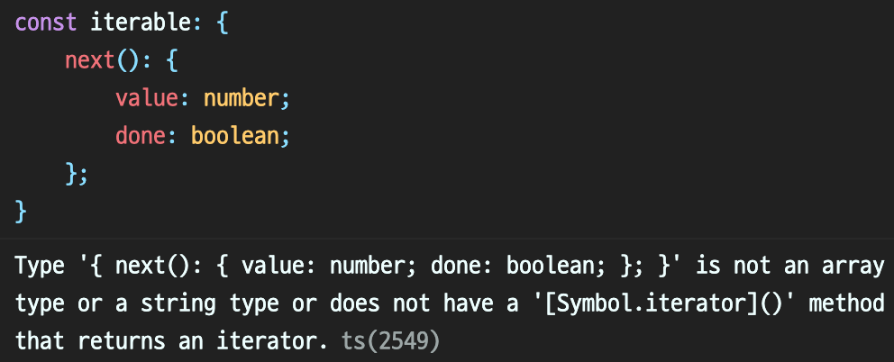

# 06장 반복기와 생성기

<details><summary>Table of Contents</summary>

-   06-1 반복기 이해하기 [:link:](#06-1-반복기-이해하기)
    -   반복기와 반복기 제공자 [:link:](#반복기와-반복기-제공자)
    -   반복기는 왜 필요한가? [:link:](#반복기는-왜-필요한가)
    -   for...of 구문과 [Symbol.iterator] 메서드 [:link:](#forof-구문과-symboliterator-메서드)
    -   Iterable\<T>와 Iterator\<T> 인터페이스 [:link:](#iterablet와-iteratort-인터페이스)
-   06-2 생성기 이해하기 [:link:](#06-2-생성기-이해하기)
    -   Javascript와 Typescript의 생성기 [:link:](#javascript와-typescript의-생성기)
    -   setInterval 함수와 생성기의 유사성 [:link:](#setinterval-함수와-생성기의-유사성)
    -   function\* 키워드 [:link:](#function-키워드)
    -   yield 키워드 [:link:](#yield-키워드)
    -   반복기 제공자의 메서드로 동작하는 생성기 구현 [:link:](#반복기-제공자의-메서드로-동작하는-생성기-구현)
    -   yield\* 키워드 [:link:](#yield2)
    -   yield 반환값 [:link:](#yield-반환값)

</details>

## 06-1 반복기 이해하기

### 반복기와 반복기 제공자

배열을 반복할 때 `for...in`과 `for...of` 구문을 사용할 수 있다.<br/>
이 중 `for...of` 구문은 아래처럼 배열에 담긴 값을 차례로 얻는데 쓰인다.<br/>

```typescript
const numArray: number[] = [1, 2, 3];

for (let value of numArray) {
    console.log(value); // 1  2 3
}

const strArray: string[] = ["Hello", "World", "!"];

for (let value of strArray) {
    console.log(value); // Hello World !
}
```

`for...of` 구문은 다른 프로그래밍 언어에서도 **반복기**(**Iterator**)라는 주제로 볼 수 있다.<br/>
대부분 프로그래밍 언어에서 **반복기**는 아래와 같은 특징이 있는 객체다.<br/>

-   `next`라는 이름의 메서드를 제공한다.
-   `next`메서드는 `value`와 `done`이라는 두 개의 속성을 가진 객체를 반환한다.<br/>

아래의 코드에서 `createRangeIterable` 함수는 `next`메서드가 있는 객체를 반환한다.<br/>
따라서 이 `createRangeIterable` 함수는 **반복기**를 제공하는 역할을 한다.<br/>

```typescript
export const createRangeIterable = (from: number, to: number) => {
    let currentValue = from;

    return {
        next() {
            const value = currentValue < to ? currentValue++ : undefined;
            const done = value == undefined;
            return { value, done };
        },
    };
};
```

아래와 같은 코드로 `createRangeIterable` 함수가 제공하는 **반복기**를 사용할 수 있다.<br/>

```typescript
import { createRangeIterable } from "./CreateRangeIterable";

const iterator = createRangeIterable(1, 3 + 1);

while (true) {
    const { value, done } = iterator.next();
    if (done) {
        break;
    }
    console.log(value); // 1 2 3
}
```

`createRangeIterable` 함수 호출로 **반복기**를 얻어 `iterator` 변수에 저장했다.<br/>
**반복기**는 이와 같이 **반복기 제공자를 호출해야만** 얻을 수 있다.<br/>
`while`문에서는 **반복기**의 `next` 메서드의 반환 값이 `done`이 `true`일때 까지 반복한다.<br/>
이때 `next` 메서드를 반복 호출하면서 **반복기 제공자**가 제공하는 `value`값을 얻게 된다.<br/>

### 반복기는 왜 필요한가?

앞의 예제의 실행 결과는 `1`부터 `3`까지의 정수를 출력한다.<br/>
즉 `next` 메서드가 반복 **호출될 때마다 각각 다른 값**이 출력된다.<br/>
**반복기 제공자**가 생성한 값을 배열에 담지 않고 마치 `for`문을 돌며 값을 출력한 것처럼 보인다.<br/>
**반복기 제공자**는 이처럼 어떤 범위의 값을 한꺼번에 생성하지 않고 **값이 필요할 때만 생성**한다.<br/>

-   값을 배열에 담는 `range` 함수

```typescript
export const range = (from, to) =>
    from < to ? [from, ...range(from + 1, to)] : [];
```

`createRangeIterable` 함수는 값이 필요한 시점 즉 `next` 메서드가 **호출될 때 값을 생성**한다.<br/>
하지만 `range` 함수는 값이 필요한 시점보다 이전에 **미리 모든 배열의 값을 생성**하게 된다.<br/>
따라서 시스템 메모리 효율적인 측면에서 `createRangeIterable` 함수가 **메모리를 더 적게 소모**한다.<br/>

### for...of 구문과 [Symbol.iterator] 메서드

위에 작성한 `range`함수는 `for...of` 구문의 `of` 뒤에 올 수 있다.<br/>

-   `range` 함수를 `for...of` 구문에 사용한 예시

```typescript
import { range } from "./Range";

for (let value of range(1, 3 + 1)) {
    console.log(value); // 1 2 3
}
```

-   `createRangeIterable` 함수를 `for...of` 구문에 사용한 예시

```typescript
import { createRangeIterable } from "./createRangeIterable";

const iterable = createRangeIterable(1, 3 + 1);

// Does not have [Symbol.iterator] method
for (let value of iterable) {
    console.log(value);
}
```

하지만 `createRangeIterable` 함수를 `for...of` 구문에 적용하면 아래의 오류가 발생한다.<br/>



이 오류는 `createRangeIterable` 함수를 아래의 `RangeIterable` 클래스처럼 구현해야한다는 의미다.<br/>

-   `[Symbol.iterator]` 메서드를 갖는 `RangeIterable` 클래스 예시

```typescript
export class RangeIterable {
    constructor(public from: number, public to: number) {}
    [Symbol.iterator]() {
        const that = this;
        let currentValue = that.from;
        return {
            next() {
                const value =
                    currentValue < that.to ? currentValue++ : undefined;
                const done = value == undefined;
                return { value, done };
            },
        };
    }
}
```

`RangeIterable` 클래스는 `[Symbol.iterator]` 메서드를 구현하고 있다.<br/>

-   `RangeIterable` 클래스를 `for...of` 구문에 사용한 예시

```typescript
import { RangeIterable } from "./RangeIterable";

const iterator = new RangeIterable(1, 3 + 1);

for (let value of iterator) {
    console.log(value); // 1 2 3
}
```

`createRangeIterable` 함수와 달리 `range` 함수처럼 `for..of` 구문의 `of` 뒤에 올 수 있다.<br/>


정상적으로 `RangeIterable` 클래스가 만들어낸 값을 출력하는 것을 볼 수 있다.<br/>

### Iterable\<T>와 Iterator\<T> 인터페이스

Typescript는 **반복기 제공자**에 `Iterable<T>`와 `Iterator<T>` **제네릭 인터페이스**를 사용할 수 있다.<br/>
`Iterable<T>`는 자신을 구현하는 클래스가 `[Symbol.iterator]` 메서드를 제공한다는 것을 알려준다.<br/>

```typescript
class 구현 클래스 implements Iterable<생성할 값의 타입> {}
```

또한 `Iterator<T>`는 **반복기가 생성할 값의 타입**을 명확하게 알려준다.<br/>

```typescript
[Symbol.iterator](): Iterator<생성할 값의 타입> {}
```

아래의 코든느 반복기 제공자를 `Iterable<T>`와 `Iterator<T>`를 사용해 구현한 예시다.<br/>

-   `Iterable<T>`와 `Iterator<T>`를 사용한 반복기 제공자 예시

```typescript
export class StringIterable implements Iterable<string> {
    constructor(
        private strings: string[] = [],
        private currentIndex: number = 0
    ) {}
    [Symbol.iterator](): Iterator<string> {
        const that = this;
        let currentIndex = that.currentIndex,
            length = that.strings.length;

        const iterator: Iterator<string> = {
            next(): { value: string; done: boolean } {
                const value =
                    currentIndex < length
                        ? that.strings[currentIndex++]
                        : undefined;
                const done = value == undefined;
                return { value, done };
            },
        };
        return iterator;
    }
}
```

-   작성한 `StringIterable` 클래스를 테스트하는 예시

```typescript
import { StringIterable } from "./StringIterable";

for (let value of new StringIterable(["Hello", "World", "!"])) {
    console.log(value); // Hello World !
}
```

위의 코드를 실행하면 `StringIterable` 클래스의 `strings`에 담긴 아이템을 하나씩 출력한다.<br/>

[[🔝위로가기]](#06장-반복기와-생성기)&nbsp; / &nbsp;[[🔙뒤로가기]](https://github.com/alstn2468/DoIt_Typescript_Programming/blob/master/README.md)

## 06-2 생성기 이해하기

### Javascript와 Typescript의 생성기

### setInterval 함수와 생성기의 유사성

### function\* 키워드

### yield 키워드

### 반복기 제공자의 메서드로 동작하는 생성기 구현

### yield\* <span id="yield2">키워드</span>

### yield 반환값

[[🔝위로가기]](#06장-반복기와-생성기)&nbsp; / &nbsp;[[🔙뒤로가기]](https://github.com/alstn2468/DoIt_Typescript_Programming/blob/master/README.md)
