# 07장 Promise와 async/await 구문

<details><summary>Table of Contents</summary>

-   07-1 비동기 콜백 함수 [:link:](#07-1-비동기-콜백-함수)
    -   동기와 비동기 API [:link:](#동기와-비동기-api)
    -   readFileSync와 readFile API [:link:](#readfilesync와-readfile-api)
    -   단일 스레드와 비동기 API [:link:](#단일-스레드와-비동기-api)
    -   콜백 지옥 [:link:](#콜백-지옥)
-   07-2 Promise 이해하기 [:link:](#07-2-promise-이해하기)
    -   Promise [:link:](#promise)
    -   resolve와 reject 함수 [:link:](#resolve와-reject-함수)
    -   Promise.resolve 메서드 [:link:](#promiseresolve-메서드)
    -   Promise.reject 메서드 [:link:](#promisereject-메서드)
    -   then 체인 [:link:](#then-체인)
    -   Promise.all 메서드 [:link:](#promiseall-메서드)
    -   Promise.race 메서드 [:link:](#promiserace-메서드)
-   07-3 async와 await 구문 [:link:](#07-3-async와-await-구문)
    -   await 구문 [:link:](#await-구문)
    -   async 함수 수정자 [:link:](#async-함수-수정자)
    -   async 함수의 두 가지 성질 [:link:](#async-함수의-두-가지-성질)
    -   async 함수가 반환하는 값의 의미 [:link:](#async-함수가-반환하는-값의-의미)
    -   async 함수 예외 처리 [:link:](#async-함수-예외-처리)
    -   async 함수와 Promise.all [:link:](#async-함수와-promiseall)

</details>

## 07-1 비동기 콜백 함수

### 동기와 비동기 API

`node.js`는 파일 시스템과 관련된 기능을 모아둔 `fs` 패키지를 제공한다.<br/>
`fs` 패키지는 같은 기능을 **동기**(**Synchronous**)와 **비동기**(**Asynchronous**) 버전으로 나누어 제공한다.<br/>
파일을 읽는 기능은 **동기** 버전인 `readFileSync`와 **비동기** 버전인 `readFile`로 제공한다.<br/>

-   `readFileSync` 함수와 `readFile` 함수를 이용해 파일을 읽는 예시

```typescript
import { readFileSync, readFile } from 'fs';

console.log('Read package.json using synchronous api...');
const buffer: Buffer = readFileSync('../package.json');
console.log(buffer.toString());

readFile('../package.json', (error: Error, buffer: Buffer) => {
    console.log('Read package.json using asynchronous api...');
    console.log(buffer.toString());
});
```

위의 코드는 `package.json`파일을 **동기**, **비동기** 방식으로 읽어 출력하는 예시다.<br/>
**동기** 방식인 `readFileSync` 함수는 파일의 경로를 인자로 받아 파일을 읽어온다.<br/>
**비동기** 방식인 `readFile` 함수는 경로와 파일을 읽어온 후 수행 할 콜백 함수를 받는다.<br/>

-   `readFileSync` 함수와 `readFile` 함수를 이용해 파일을 읽는 예시 실행 결과


**비동기** 방식인 `readFile` 함수는 `Promise`와 `async/await` 구문을 이용해 아래 같이 작성할 수 있다.<br/>

-   `Promise`와 `async/awiat` 구문을 이용해 파일을 읽는 예시

```typescript
const readFilePromise = (fileName: string): Promise<string> =>
    new Promise<string>((resolve, reject) => {
        readFile(fileName, (error: Error, buffer: Buffer) => {
            if (error) {
                reject(error);
            }

            resolve(buffer.toString());
        });
    });

(async () => {
    const content = await readFilePromise('../package.json');
    console.log('Read package.json using Promise and async/await...');
    console.log(content);
})();
```

-   `Promise`와 `async/awiat` 구문을 이용해 파일을 읽는 예시 실행 결과


**API**는 일반 함수와 달리 파일을 읽어오는 과정 등 실행 시 **물리적인 시간이 소요**된다.<br/>
`fs`는 파일의 **모든 내용이 읽을 때 까지 동작을 잠시 멈추는 동기 방식**의 API를 제공한다.<br/>
또한 프로그램의 **동작을 멈추지 않는 대신 결과를 콜백 함수로 얻게 하는 비동기 방식** 또한 제공한다.<br/>
**비동기 API**의 콜백 함수는 **비동기 콜백 함수**이며 일반 함수와 달리 **API의 결과를 받는 목적**으로 사용된다.<br/>

### readFileSync와 readFile API

웹 브라우저와 달리 `node.js`는 운영체제 파일 시스템에 있는 파일을 읽을 수 있다.<br/>
`node.js`에서 파일 읽기는 `readFileSync`라는 이름의 API를 이용해 구현한다.<br/>
`readFileSync` 함수는 파일을 읽어서 `Buffer` 타입으로 전달해 준다.<br/>

```typescript
import { readFileSync } from "fs";

readFileSync(path: string): Buffer
```

`Buffer`는 `node.js`가 제공하는 클래스로 **바이너리 데이터를 저장**하는 기능을 수행한다.<br/>
`Buffer`의 데이터를 문자열로 만들 때 `Buffer`의 `toStirng` 메서드를 사용할 수 있다.<br/>
`node.js`에서 API의 이름이 `xxxxSync`인 것은 모두 **동기** 방식으로 작동한다.<br/>
**동기** 방식 API는 해당 작**업이 종료될 때까지 프로그램을 일시적으로 멈추는 특성**이 있다.<br/>
아래의 코드는 `package.json` 파일을 `readFileSync`를 이용해 읽어 화면에 출력하는 예시다.<br/>

-   **동기** 방식으로 작동하는 `readFileSync`를 사용한 예시

```typescript
import { readFileSync } from 'fs';

const buffer: Buffer = readFileSync('../package.json');
const content: string = buffer.toString();
console.log(content);
```

-   **동기** 방식으로 작동하는 `readFileSync`를 사용한 예시 실행 결과


`node.js`는 **동기** 버전인 `readFileSync` 이외에도 **비동기**로 동작하는 `readFile`도 제공한다.<br/>

```typescript
import { readFile } from "fs";

readFile(파일 경로, 콜백 함수: (error: Error, buffer: Buffer) => void)
```

`readFile`은 `readFileSync`와 달리 **예외가 발생**하면 **콜백 함수의 첫 번째 매개변수에 전달**한다.<br/>
아래의 코드는 **비동기** 방식으로 동작하는 `readFile`을 사용한 예시다.<br/>

-   **비동기** 방식으로 작동하는 `readFile`을 사용한 예시

```typescript
import { readFile } from 'fs';

readFile('../package.json', (err: Error, buffer: Buffer) => {
    if (err) {
        throw err;
    } else {
        const content: string = buffer.toString();
        console.log(content);
    }
});
```

실행 결과는 **동기** 방식으로 작동하는 `readFileSync`를 사용한 예시와 동일하다.<br/>
위의 코드는 **비동기**로 동작하므로 `readFile`을 실행할 때 멈추지 않고 다음 코드를 실행한다.<br/>
`package.json`파일을 읽은 결과는 두 번째 매개변수인 콜백 함수에 전달된다.<br/>

```typescript
import { readFile } from 'fs';

readFile('../package.json', (err: Error, buffer: Buffer) => {
    if (err) {
        throw err;
    } else {
        const content: string = buffer.toString();
        console.log(content);
    }
});

console.log('After readFile api called...');
```

위와 같이 `readFile` 함수 호출 이후에 `console.log`를 사용하면 확실하게 결과를 확인할 수 있다.<br/>


`readFile` 함수 아래의 `console.log`는 `readFile` 함수의 결과를 기다리지 않고 먼저 실행된다.<br/>
파일을 읽는 `readFile` 함수가 실행된 후 파일을 읽을 동안 **멈추지 않고 다음 코드가 실행**되었다.<br/>

### 단일 스레드와 비동기 API

**프로세스**는 한 개의 **주 스레드**와 여러 개의 **작업 스레드**를 동작시킨다.<br/>

> 스레드 : CPU가 프로그램을 동작시키는 최소 단위<br/>
> 프로세스 : 운영체제에서 프로그램이 실행되고 있는 상태

웹 브라우저나 `node.js`는 다중 스레드로 동작하나 Javascript는 **한 개의 작업 스레드**에서 실행된다.<br/>
Typescript 또한 Javascript로 변환되어 실행되므로 자바스크립트와 **마찬가지로 단일 스레드로 동작**한다.<br/>

Typescript는 **단일 스레드**로 동작하므로 `readFileSync`와 같은 **동기 API를 사용하지 않는 것이 좋다**.<br/>
Typescript 코드에서 **동기 API**가 실행되면 운영체제는 **작업 결과를 반환값으로** 주어야한다.<br/>
따라서 운영체제는 **동기 API**가 실행된 코드를 **일시적으로 멈춘 다음 작업을 실행**한다.<br/>
실제 작업을 실행한 후 결과를 얻으면 멈췄던 **동기 API**를 실행해 결과를 반환한다.<br/>
**동기 API**의 이런 동작 방식은 코드를 작성하기 쉽게 하지만 **프로그램의 반응성**을 떨어뜨린다.<br/>

**동기 API**가 웹 서버에서 실행되면 웹 서버는 **결과를 반환할 때 까지 일시적으로 멈춘다**.<br/>
그리고 웹 브라우저에서는 작업중인 **웹 서버로 접속이 안되는 현상이 발생**할 것이다.<br/>
**단일 스레드**에서 동작하는 Typescirpt 코드를 작성할 때는 **비동기**로 동작하는 API를 사용해 반응성을 유지해야 한다.<br/>

### 콜백 지옥

**비동기 API**를 사용하면 **콜백 함수**에서 다른 **비동기 API**를 호출하는 경우가 있다.<br/>
콜백 함수에서 다른 **비동기 API**를 호출할 경우 코드가 매우 복잡해지는 상황이 발생한다.<br/>
아래의 코드는 `package.json`을 읽은 후 다시 `tsconfig.json` 파일을 읽는 코드다.<br/>
`readFile`의 콜백 함수에 다시 `readFile()`을 호출하는 방식의 **중첩 방식의 코드 구조**를 보인다.<br/>

```typescript
import { readFile } from 'fs';

readFile('../package.json', (err: Error, buffer: Buffer) => {
    if (err) {
        throw err;
    } else {
        const content: string = buffer.toString();
        console.log(content);

        readFile('../tsconfig.json', (err: Error, buffer: Buffer) => {
            if (err) {
                throw err;
            } else {
                const content: string = buffer.toString();
                console.log(content);
            }
        });
    }
});
```

이러한 복잡한 형태로 얽힌 콜백 구조를 Javascript에서는 **콜백 지옥**이라고 표현한다.<br/>
`Promise`는 이런 **콜백 지옥** 상태의 코드를 더 **다루기 쉬운 형태로 만드려는 목적**으로 고안되었다.<br/>

[[🔝위로가기]](#07장-promise와-asyncawait-구문)&nbsp; / &nbsp;[[🔙뒤로가기]](https://github.com/alstn2468/DoIt_Typescript_Programming/blob/master/README.md)

## 07-2 Promise 이해하기

### Promise

Javscript에서 `Promise`는 ES5 버전에서 정식 기능으로 채택되었다.<br/>
Javscript에서 `Promise`는 `Promise`라는 이름의 **클래스**다.<br/>
따라서 `Promise`를 사용하기 위해서는 `new` 연산자를 이용해 객체를 생성해야 한다.<br/>
`new` 연산자로 `Promise` 객체를 만들 때에는 콜백 함수를 제공해야한다.<br/>

```javascript
const promise = new Promise(콜백 함수)
```

여기서 `Promise`의 콜백 함수는 `resolve`와 `reject`라는 두 개의 매개변수를 갖는다.<br/>

```javascript
(resolve, reject) => {};
```

Typescript에서는 `Promise`는 아래와 같이 **제네릭 클래스 형태**로 사용한다.<br/>

```typescript
const numPromise: Promise<number> = new Promise<number>(콜백 함수);
const strPromise: Promise<string> = new Promise<string>(콜백 함수);
const arrayPromise: Promise<number[]> = new Promise<number[]>(콜백 함수);
```

Typescript의 `Promise`의 콜백 함수는 아래와 같이 `resolve`와 `reject` 함수를 매개변수로 받는다.<br/>

```typescript
new Promise<T>(
    (resolve: (successValue: T) => void, reject: (any) => void) => {}
);
```

### resolve와 reject 함수

아래의 코드는 **비동기** 방식의 API인 `readFile`을 호출하는 내용을 `Promise`로 구현한 예시다.<br/>

```typescript
import { readFile } from 'fs';

const readFilePromise = (fileName: string): Promise<string> =>
    new Promise<string>(
        (resolve: (value: string) => void, reject: (error: Error) => void) => {
            readFile(fileName, (err: Error, buffer: Buffer) => {
                if (err) {
                    reject(err);
                } else {
                    resolve(buffer.toString());
                }
            });
        }
    );
```

에러가 발생할 때는 `reject` 함수를 호출하고 에러가 없을 경우 `resolve` 함수를 호출한다.<br/>
작성한 `readFilePromise` 함수는 아래와 같이 사용할 수 있다.<br/>

-   `readFilePromise` 함수를 사용하는 예시

```typescript
readFilePromise('../package.json')
    .then((content: string) => {
        console.log(content);
        return readFilePromise('../tsconfig.json');
    })
    .then((content: string) => {
        console.log(content);
        return readFilePromise('.');
    })
    .catch((err: Error) => console.log('error :', err.message))
    .finally(() => console.log('프로그램 종료'));
```

-   `readFilePromise` 함수를 사용하는 예시 실행 결과

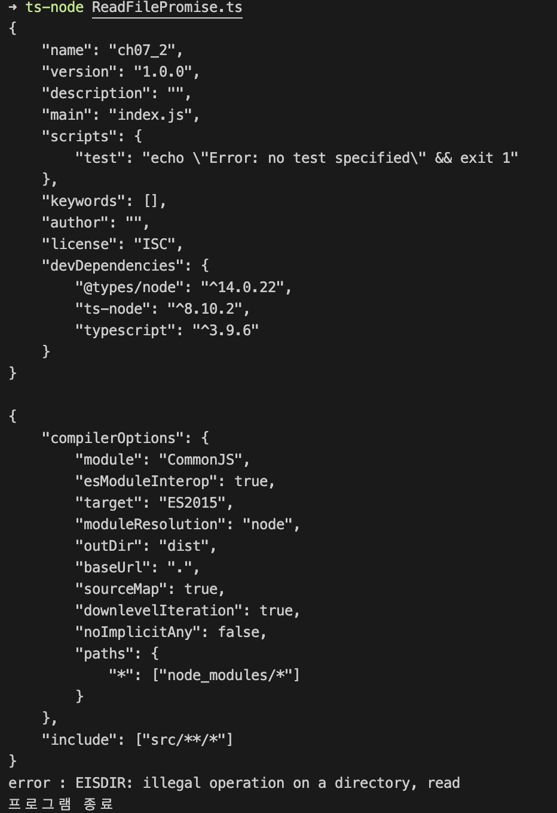

`resolve` 함수가 호출된 결과 값은 `then` 메서드의 콜백 함수에 전달된다.<br/>
`reject` 함수가 호출된 결과 값은 `catch` 메서드의 콜백 함수에 전달된다.<br/>
`finally` 메서드는 `Promise` 객체의 메서드 체인 코드에서 항상 마지막에 호출된다.<br/>

### Promise.resolve 메서드

`Promise` 클래스는 `resolve`라는 **정적 클래스 메서드**를 제공한다.<br/>
`Promise` 객체를 생성할 때 호출된 `resolve` 함수를 클래스 메서드로 구현한 것이 `Promise.resolve`다.<br/>

-   `Promise.resolve` 클래스 메서드를 사용하는 예시

```typescript
Promise.resolve(1).then((value) => console.log(value)); // 1

Promise.resolve('Hello').then((value) => console.log(value)); // Hello

Promise.resolve([1, 2, 3]).then((value) => console.log(value)); // [1, 2, 3]

Promise.resolve({ name: 'Jack', age: 32 }).then((value) => console.log(value)); // { name: 'Jack', age: 32 }
```

-   `Promise.resolve` 클래스 메서드를 사용하는 예시 실행 결과

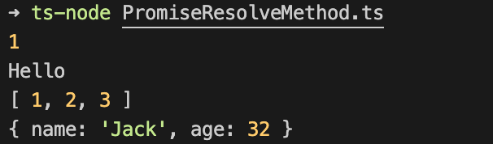

`Promise.resolve(값)` 형태로 호출하면 값은 `then` 메서드에서 얻을 수 있다.<br/>

### Promise.reject 메서드

`Promise.reject(Error 타입 객체)`를 호출하면 `Error` 타입 객체는 `catch` 메서드의 콜백함수에서 얻을 수 있다.<br/>

-   `Promise.reject` 클래스 메서드를 사용하는 예시

```typescript
Promise.reject(new Error('에러 발생')).catch(
    (err: Error) => console.log('error:', err.message) // error: 에러 발생
);
```

-   `Promise.reject` 클래스 메서드를 사용하는 예시 실행 결과

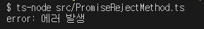

`Promise.resolve` 메서드와 동일하게 **정적 클래스 메서드**로 `Promise` 클래스에 구현되어 있다.<br/>

### then 체인

`Promise`의 `then` 메서드를 호출할 때 사용한 콜백 함수는 값을 반환할 수 있다.<br/>
이 `then`에서 반환된 값은 또 다른 `then` 메서드를 호출해 값을 받을 수 있다.<br/>
`Promise` 객체에 `then` 메서드를 여러 번 호출하는 코드 형채를 **then-체인**이라고 한다.

-   **then-체인** 형태를 보여주는 예시

```typescript
Promise.resolve(1)
    .then((value: number) => {
        console.log(value); // 1
        return Promise.resolve(true);
    })
    .then((value: boolean) => {
        console.log(value); // true
        return [1, 2, 3];
    })
    .then((value: number[]) => {
        console.log(value); // [1, 2, 3]
        return { name: 'Jack', age: 32 };
    })
    .then((value: { name: string; age: number }) => {
        console.log(value); // { name: 'Jack', age: 32 }
    });
```

-   **then-체인** 형태를 보여주는 예시 실행 결과

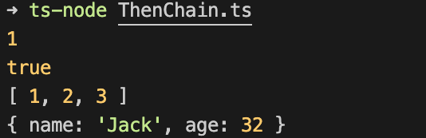

`then` 메서드는 반환된 값이 `Promise` 타입이면 이 값을 `resolve`한 값을 반환한다.<br/>
만약 `reject`된 값이 반환되면 `catch` 메서드에서 이 거절된 값을 받을 수 있다.<br/>

### Promise.all 메서드

`Array` 클래스는 `every`라는 이름의 인스턴스 메서드를 제공한다.<br/>
`every` 메서드는 배열의 모든 아이템이 어떤 조건을 만족하면 `true`를 반환한다.<br/>
아래 코드에서 `isAllTrue` 함수는 `every` 메서드를 사용해 배열의 값이 모두 `true`인지 확인한다.<br/>

```typescript
const isAllTrue = (values: boolean[]) =>
    values.every((value) => value === true);

console.log(isAllTrue([true, true, true])); // true
console.log(isAllTrue([false, true, true])); // false
```

`Promise` 클래스는 `every` 처럼 동작하는 `all`이라는 클래스 메서드를 제공한다.<br/>

```typescript
all(프로미스 객체 배열: Promise[]): Promise<해소된 값들의 배열(or any)>
```

`Promise.all` 메서드는 `Promise` 객체들을 배열 형태로 받는다.<br/>
이 받은 `Promise` 객체 배열을 대상으로 `resolve`된 값들의 배열로 만들어준다.<br/>
`Promise.all` 메서드는 값들의 배열을 `Promise`로 반환하므로 `then`을 이용해 값을 얻어야 한다.<br/>
배열에 `reject`된 객체가 생기면 기다리지 않고 거절된 `Promise.reject` 객체를 반환한다.<br/>
이 거절된 `Promise.reject` 객체는 `catch` 메서드를 통해 얻는다.<br/>

-   `Promise.all` 메서드를 사용하는 예시

```typescript
import { promises } from 'fs';

const getAllResolvedResult = <T>(promises: Promise<T>[]) =>
    Promise.all(promises);

getAllResolvedResult<any>([
    Promise.resolve(true),
    Promise.resolve('Hello'),
]).then((result) => console.log(result));

getAllResolvedResult<any>([
    Promise.reject(new Error('error')),
    Promise.resolve(1),
])
    .then((result) => console.log(result))
    .catch((error) => console.log(error));
```

-   `Promise.all` 메서드를 사용하는 예시 실행 결과

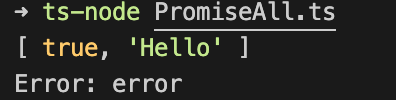

`reject`된 `Promise`가 있는 경우 `then` 메서드는 실행이 되지않고 `catch`만 실행이 된다.<br/>

### Promise.race 메서드

`Array` 클래스에는 배열의 내용 중 하나라도 조건에 만족하면 `true`를 반환하는 `some` 메서드가 존재한다.<br/>

```typescript
const isAnyTrue = (values: boolean[]) => values.some((value) => value === true);

console.log(isAnyTrue([false, true, false])); // true
console.log(isAnyTrue([false, false, false])); // false
```

비슷하게 `Promise` 클래스 또한 하나라도 `resolve`되면 `resolve`된 객체를 반환하는 메서드가 존재한다.<br/>
`Promise.race` 메서드를 사용해 `Array` 클래스의 `some` 메서드와 비슷하게 사용할 수 있다.<br/>

```typescript
race(프로미스 객체 배열: Promise[]): Promise<가장 먼저 해소된 객체의 값 타입(or Error)>
```

-   `Promise.race`를 사용하는 예시

```typescript
Promise.race([Promise.resolve(true), Promise.resolve('Hello')]).then((value) =>
    console.log(value)
);

Promise.race([Promise.resolve(true), Promise.reject(new Error('error'))])
    .then((value) => console.log(value))
    .catch((error) => console.log(error.message));

Promise.race([Promise.reject(new Error('error')), Promise.resolve(true)])
    .then((value) => console.log(value))
    .catch((error) => console.log(error.message));
```

-   `Promise.race`를 사용하는 예시 실행 결과

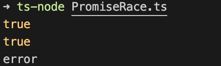

인자로 받은 `Promise` 객체 배열 중 가장 먼저 `resolve`된 값을 반환하게 된다.<br/>
거절된 값이 가장 먼저 발생하면 `Promise.reject` 객체를 반환하게 된다.<br/>
`Promise`는 **비동기** API 사용에서 나타나는 **콜백 지옥** 형태의 코드를 관리하도록 도와준다.<br/>
ESNext와 Typescript는 `Promise`를 더 쉬운 형태로 만들 수 있게 하는 `async/await` 구문을 제공한다.<br/>

[[🔝위로가기]](#07장-promise와-asyncawait-구문)&nbsp; / &nbsp;[[🔙뒤로가기]](https://github.com/alstn2468/DoIt_Typescript_Programming/blob/master/README.md)

## 07-3 async와 await 구문

### await 구문

`await` 키워드는 피연산자의 값을 반환해준다.<br/>
만약 피연산자가 `Promise` 객체일 경우 `then` 메서들르 후출해 얻은 값을 반환한다.<br/>
`await` 키워드를 사용하는 기본적인 문법은 아래와 같다.<br/>

```typescript
let value = await (Promise 객체 혹은 값)
```

### async 함수 수정자

`await` 키워드는 항상 `async`라는 함수 수정자가 있는 함수에서만 사용할 수 있다.<br/>
`async` 함수 수정자와 `await` 키워드를 사용하는 기본 문법은 아래와 같다.<br/>

```typescript
const test1 = async() => {
    await (Promise 객체 혹은 값)
}

async function test2() {
    await (Promise 객체 혹은 값)
}
```

-   화살표 함수 형태로 구현한 `async` 함수 예시

```typescript
export const test1 = async () => {
    let value = await 1;
    console.log(value); // 1

    value = await Promise.resolve(1);
    console.log(value); // 1
};
```

-   `function` 함수 형태로 구현한 `async` 함수 예시

```typescript
export async function test2() {
    let value = await 'hello';
    console.log(value); // hello

    value = await Promise.resolve('hello');
    console.log(value); // hello
}
```

`async` 함수 수정자를 붙인 함수 역시 함수이기 때문에 일반 함수 처럼 호출할 수 있다.<br/>

-   `async` 함수 수정자를 붙인 함수를 호출하는 예시

```typescript
import { test1 } from './ArrowAsyncAwait';
import { test2 } from './FunctionAsyncAwait';

test1();
test2();
```

-   `async` 함수를 호출하는 예시 실행 결과

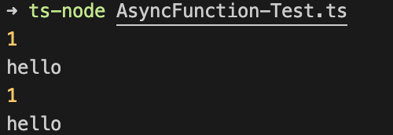

`test1` 함수가 먼저 호출되었으므로 `1`이 두 번 먼저 출력되어야 할 것 같다.<br/>
`test1` 함수가 종료된 후 `test2` 함수가 실행되어 `hello`가 출력되어야 할 것 같지만 그렇지 않다.<br/>
실행 결과를 보면 `test1`, `test2` 함수가 마치 동시에 실행된 것 처럼 보인다.<br/>

### async 함수의 두 가지 성질

`async` 함수 수정자가 붙은 함수는 아래와 같은 성질이 있다.<br/>

1. 일반 함수처럼 사용할 수 있다.
2. `Promise` 객체로 사용할 수 있다.

```typescript
import { test1 } from './ArrowAsyncAwait';
import { test2 } from './FunctionAsyncAwait';

test1();
test2();
```

위와 같은 코드는 `async` 함수를 일반 함수처럼 사용한 예시다.<br/>
반면에 아래의 코드는 `async` 함수를 `Promise` 객체로 사용한 예시다.<br/>

```typescript
import { test1 } from './ArrowAsyncAwait';
import { test2 } from './FunctionAsyncAwait';

test1().then(() => test2());
```

위의 코드는 `test1` 함수 호출이 `resolve`된 후 `test2` 함수가 호출이 된다.<br/>
따라서 일반 함수처럼 호출한 예시와 다른 아래와 같은 결과를 얻게 된다.<br/>

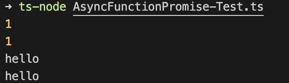

`test1` 함수가 호출되어 `1`이 모두 출력된 후 `test2` 함수가 호출되어 `hello`가 출력된다.<br/>

### async 함수가 반환하는 값의 의미

`async` 함수는 `Promise` 형태로 변환된 값을 반환할 수 있다.<br/>
따라서 아래와 같이 `then` 메서드를 호출해 `async` 함수의 반환값을 얻어야 한다.<br/>

```typescript
const asyncReturn = async () => {
    return [1, 2, 3];
};

asyncReturn().then((value) => console.log(value)); // [1, 2, 3]
```

`then` 메서드 없이 아래와 같이 `asyncReturn` 함수를 호출하면 다른 결과를 얻을 수 있다.<br/>

-   `then` 메서드 없이 `async` 함수를 호출한 예시

```typescript
const asyncReturn = async () => {
    return [1, 2, 3];
};

asyncReturn().then((value) => console.log(value)); // [1, 2, 3]
console.log(asyncReturn()); // Promise { [ 1, 2, 3 ] }
```

-   `then` 메서드 없이 `async` 함수를 호출한 예시 실행 결과

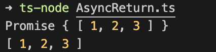

`then` 메서드를 사용하지 않았을 경우 `Promise` 객체가 반환된다.<br/>

### async 함수 예외 처리

`async` 함수에서 아래와 같이 예외가 발생하면 프로그램이 비정상 종료된다.<br/>

```typescript
const asyncException = async () => {
    throw new Error('error');
};

asyncException();
```

-   비정상 종료된 `async` 함수 호출 실행 결과

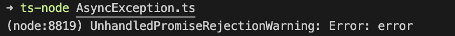

**예외로 인해 종료되는 상황**을 방지하려면 반환되는 `Promise` 객체에 `catch` 메서드를 호출해야 한다.<br/>

```typescript
const asyncException = async () => {
    throw new Error('error');
};

asyncException().catch((err) => console.log('error:', err.message)); // error: error
```

-   정상 종료된 `async` 함수 호출 실행 결과

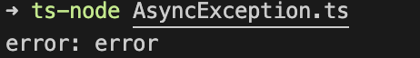

`await` 구문에서 `Promise.reject`값이 발생할 경우 마찬가지로 프로그램이 비정상 종료된다.<br/>

```typescript
const awaitReject = async () => {
    await Promise.reject(new Error('error'));
};

awaitReject();
```

-   비정상 종료된 `await` 구문 함수 호출 실행 결과

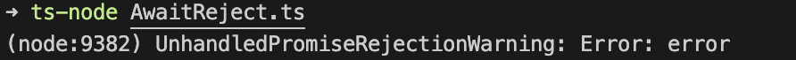

위와 같이 **비정상으로 종료되는 코드를 방지**하려면 동일하게 `catch` 메서드를 이용하면 된다.<br/>

```typescript
const awaitReject = async () => {
    await Promise.reject(new Error('error'));
};

awaitReject().catch((err) => console.log('error :', err.message)); // error: error
```

-   정상 종료된 `await` 구문 함수 호출 실행 결과

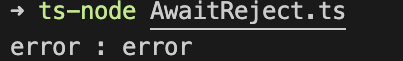

`async` 함수 수정자와 `await` 키워드 모두 `catch` 메서드를 이용해 예외를 제어할 수 있다.<br/>

### async 함수와 Promise.all

아래 코드는 비동기 API인 `readFile`을 `Promise`로 만든 함수다.<br/>

```typescript
import { readFile } from 'fs';

const readFilePromise = (fileName: string): Promise<string> =>
    new Promise<string>(
        (resolve: (value: string) => void, reject: (error: Error) => void) => {
            readFile(fileName, (err: Error, buffer: Buffer) => {
                if (err) {
                    reject(err);
                } else {
                    resolve(buffer.toString());
                }
            });
        }
    );
```

작성한 `readFilePromise` 함수를 `async`와 `Promise.all`을 적용해 사용하면 아래와 같다.<br/>

```typescript
const readFileAll = async (filenames: string[]) => {
    return await Promise.all(
        filenames.map((filename) => readFilePromise(filename))
    );
};

readFileAll(['../package.json', '../tsconfig.json'])
    .then(([packageJson, tsconfigJson]: string[]) => {
        console.log('<package.json>:', packageJson);
        console.log('<tsconfig.json>:', tsconfigJson);
    })
    .catch((err) => console.log('error:', err.message));
```

-   `async`와 `Promise.all`을 사용한 예시 실행결과

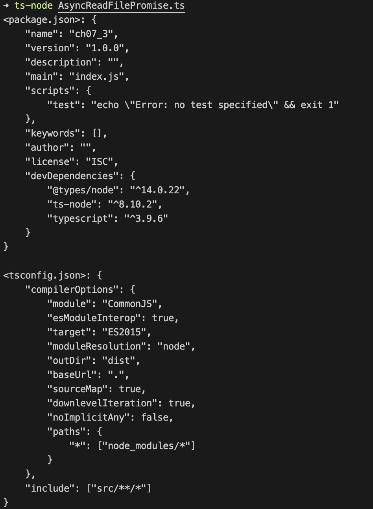

`readFilesAll` 함수는 매개변수롤 파일 이름들을 갖는 `filenames` 문자열 배열을 받는다.<br/>
`string[]` 타입의 배열에 `map` 메서드를 사용해 `Promise[]` 타입으로 변환한다.<br/>
그 후 `Promise.all`을 사용해 `Promise` 객체로 만든 후 `await`으로 `resolve`된 값을 만들어 반환한다.<br/>
`readFileAll` 함수를 `Promise` 객체로 취급해 `then`, `catch` 메서드를 사용한 **then-체인** 형태로 연결했다.<br/>
따라서 두 파일의 내용을 출력하거나 예외가 발생해도 비정상 종료가 되지 않는다.<br/>

[[🔝위로가기]](#07장-promise와-asyncawait-구문)&nbsp; / &nbsp;[[🔙뒤로가기]](https://github.com/alstn2468/DoIt_Typescript_Programming/blob/master/README.md)
