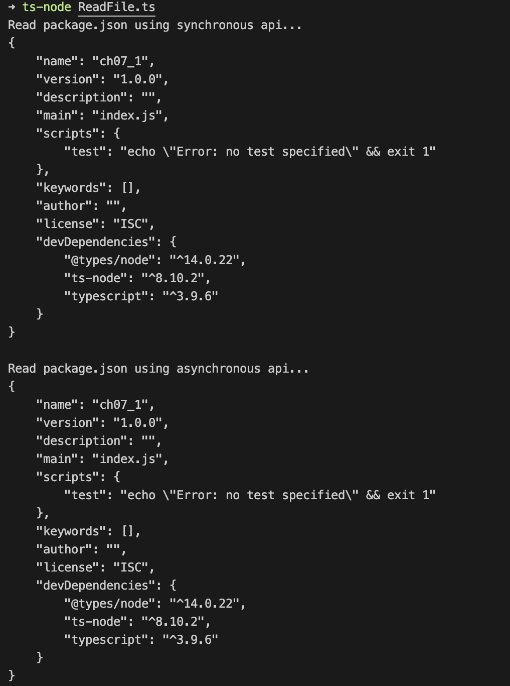
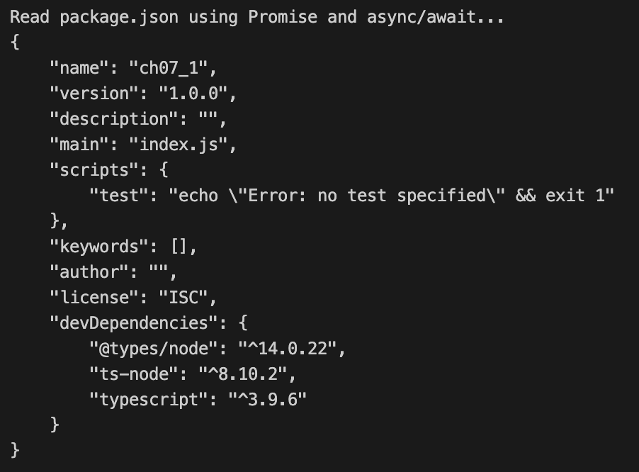
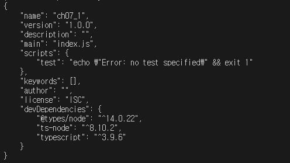
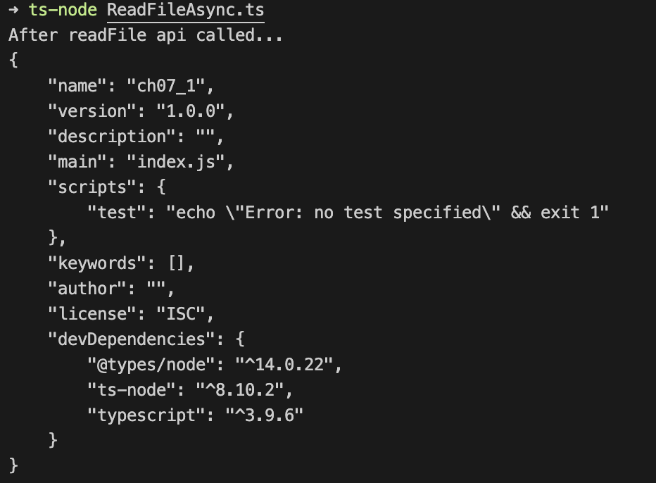

# 07장 Promise와 async/await 구문

<details><summary>Table of Contents</summary>

-   07-1 비동기 콜백 함수 [:link:](#07-1-비동기-콜백-함수)
    -   동기와 비동기 API [:link:](#동기와-비동기-api)
    -   readFileSync와 readFile API [:link:](#readfilesync와-readfile-api)
    -   단일 스레드와 비동기 API [:link:](#단일-스레드와-비동기-api)
    -   콜백 지옥 [:link:](#콜백-지옥)
-   07-2 Promise 이해하기 [:link:](#07-2-promise-이해하기)
-   07-3 async와 await 구문 [:link:](#07-3-async와-await-구문)

</details>

## 07-1 비동기 콜백 함수

### 동기와 비동기 API

`node.js`는 파일 시스템과 관련된 기능을 모아둔 `fs` 패키지를 제공한다.<br/>
`fs` 패키지는 같은 기능을 **동기**(**Synchronous**)와 **비동기**(**Asynchronous**) 버전으로 나누어 제공한다.<br/>
파일을 읽는 기능은 **동기** 버전인 `readFileSync`와 **비동기** 버전인 `readFile`로 제공한다.<br/>

-   `readFileSync` 함수와 `readFile` 함수를 이용해 파일을 읽는 예시

```typescript
import { readFileSync, readFile } from "fs";

console.log("Read package.json using synchronous api...");
const buffer: Buffer = readFileSync("./package.json");
console.log(buffer.toString());

readFile("./package.json", (error: Error, buffer: Buffer) => {
    console.log("Read package.json using asynchronous api...");
    console.log(buffer.toString());
});
```

위의 코드는 `package.json`파일을 **동기**, **비동기** 방식으로 읽어 출력하는 예시다.<br/>
**동기** 방식인 `readFileSync` 함수는 파일의 경로를 인자로 받아 파일을 읽어온다.<br/>
**비동기** 방식인 `readFile` 함수는 경로와 파일을 읽어온 후 수행 할 콜백 함수를 받는다.<br/>

-   `readFileSync` 함수와 `readFile` 함수를 이용해 파일을 읽는 예시 실행 결과



**비동기** 방식인 `readFile` 함수는 `Promise`와 `async/await` 구문을 이용해 아래 같이 작성할 수 있다.<br/>

-   `Promise`와 `async/awiat` 구문을 이용해 파일을 읽는 예시

```typescript
const readFilePromise = (fileName: string): Promise<string> =>
    new Promise<string>((resolve, reject) => {
        readFile(fileName, (error: Error, buffer: Buffer) => {
            if (error) {
                reject(error);
            }

            resolve(buffer.toString());
        });
    });

(async () => {
    const content = await readFilePromise("./package.json");
    console.log("Read package.json using Promise and async/await...");
    console.log(content);
})();
```

-   `Promise`와 `async/awiat` 구문을 이용해 파일을 읽는 예시 실행 결과



**API**는 일반 함수와 달리 파일을 읽어오는 과정 등 실행 시 **물리적인 시간이 소요**된다.<br/>
`fs`는 파일의 **모든 내용이 읽을 때 까지 동작을 잠시 멈추는 동기 방식**의 API를 제공한다.<br/>
또한 프로그램의 **동작을 멈추지 않는 대신 결과를 콜백 함수로 얻게 하는 비동기 방식** 또한 제공한다.<br/>
**비동기 API**의 콜백 함수는 **비동기 콜백 함수**이며 일반 함수와 달리 **API의 결과를 받는 목적**으로 사용된다.<br/>

### readFileSync와 readFile API

웹 브라우저와 달리 `node.js`는 운영체제 파일 시스템에 있는 파일을 읽을 수 있다.<br/>
`node.js`에서 파일 읽기는 `readFileSync`라는 이름의 API를 이용해 구현한다.<br/>
`readFileSync` 함수는 파일을 읽어서 `Buffer` 타입으로 전달해 준다.<br/>

```typescript
import { readFileSync } from "fs";

readFileSync(path: string): Buffer
```

`Buffer`는 `node.js`가 제공하는 클래스로 **바이너리 데이터를 저장**하는 기능을 수행한다.<br/>
`Buffer`의 데이터를 문자열로 만들 때 `Buffer`의 `toStirng` 메서드를 사용할 수 있다.<br/>
`node.js`에서 API의 이름이 `xxxxSync`인 것은 모두 **동기** 방식으로 작동한다.<br/>
**동기** 방식 API는 해당 작**업이 종료될 때까지 프로그램을 일시적으로 멈추는 특성**이 있다.<br/>
아래의 코드는 `package.json` 파일을 `readFileSync`를 이용해 읽어 화면에 출력하는 예시다.<br/>

-   **동기** 방식으로 작동하는 `readFileSync`를 사용한 예시

```typescript
import { readFileSync } from "fs";

const buffer: Buffer = readFileSync("./package.json");
const content: string = buffer.toString();
console.log(content);
```

-   **동기** 방식으로 작동하는 `readFileSync`를 사용한 예시 실행 결과



`node.js`는 **동기** 버전인 `readFileSync` 이외에도 **비동기**로 동작하는 `readFile`도 제공한다.<br/>

```typescript
import { readFile } from "fs";

readFile(파일 경로, 콜백 함수: (error: Error, buffer: Buffer) => void)
```

`readFile`은 `readFileSync`와 달리 **예외가 발생**하면 **콜백 함수의 첫 번째 매개변수에 전달**한다.<br/>
아래의 코드는 **비동기** 방식으로 동작하는 `readFile`을 사용한 예시다.<br/>

-   **비동기** 방식으로 작동하는 `readFile`을 사용한 예시

```typescript
import { readFile } from "fs";

readFile("./package.json", (err: Error, buffer: Buffer) => {
    if (err) {
        throw err;
    } else {
        const content: string = buffer.toString();
        console.log(content);
    }
});
```

실행 결과는 **동기** 방식으로 작동하는 `readFileSync`를 사용한 예시와 동일하다.<br/>
위의 코드는 **비동기**로 동작하므로 `readFile`을 실행할 때 멈추지 않고 다음 코드를 실행한다.<br/>
`package.json`파일을 읽은 결과는 두 번째 매개변수인 콜백 함수에 전달된다.<br/>

```typescript
import { readFile } from "fs";

readFile("./package.json", (err: Error, buffer: Buffer) => {
    if (err) {
        throw err;
    } else {
        const content: string = buffer.toString();
        console.log(content);
    }
});

console.log("After readFile api called...");
```

위와 같이 `readFile` 함수 호출 이후에 `console.log`를 사용하면 확실하게 결과를 확인할 수 있다.<br/>



`readFile` 함수 아래의 `console.log`는 `readFile` 함수의 결과를 기다리지 않고 먼저 실행된다.<br/>
파일을 읽는 `readFile` 함수가 실행된 후 파일을 읽을 동안 **멈추지 않고 다음 코드가 실행**되었다.<br/>

### 단일 스레드와 비동기 API

### 콜백 지옥

[[🔝위로가기]](#07장-promise와-asyncawait-구문)&nbsp; / &nbsp;[[🔙뒤로가기]](https://github.com/alstn2468/DoIt_Typescript_Programming/blob/master/README.md)

## 07-2 Promise 이해하기

[[🔝위로가기]](#07장-promise와-asyncawait-구문)&nbsp; / &nbsp;[[🔙뒤로가기]](https://github.com/alstn2468/DoIt_Typescript_Programming/blob/master/README.md)

## 07-3 async와 await 구문

[[🔝위로가기]](#07장-promise와-asyncawait-구문)&nbsp; / &nbsp;[[🔙뒤로가기]](https://github.com/alstn2468/DoIt_Typescript_Programming/blob/master/README.md)
