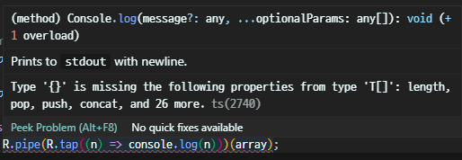

# 09장 람다 라이브러리

<details><summary>Table of Contents</summary>

-   09-1 람다 라이브러리 소개 [:link:](#09-1-람다-라이브러리-소개)
    -   ramda 라이브러리 [:link:](#ramda-라이브러리)
    -   실습 프로젝트 구성 [:link:](#실습-프로젝트-구성)
    -   ramda 패키지 불러오기 [:link:](#ramda-패키지-불러오기)
-   09-2 람다 기본 사용법 [:link:](#09-2-람다-기본-사용법)
    -   R.range 함수 [:link:](#rrange-함수)
    -   R.tap 디버깅용 함수 [:link:](#rtap-디버깅용-함수)
    -   R.pipe 함수 [:link:](#rpipe-함수)
    -   포인트가 없는 함수 [:link:](#포인트가-없는-함수)
    -   자동 커리 이해하기 [:link:](#자동-커리-이해하기)
    -   R.curryN 함수 [:link:](#rcurryn-함수)
    -   순수 함수 [:link:](#순수-함수)
-   09-3 배열에 담긴 수 다루기 [:link:](#09-3-배열에-담긴-수-다루기)
    -   선언형 프로그래밍 [:link:](#선언형-프로그래밍)
    -   사칙 연산 함수 [:link:](#사칙-연산-함수)
    -   R.addIndex 함수 [:link:](#raddindex-함수)
    -   R.flip 함수 [:link:](#rflip-함수)
    -   사칙 연산 함수들의 조합 [:link:](#사칙-연산-함수들의-조합)
    -   2차 방정식의 해 구현 [:link:](#2차-방정식의-해-구현)
-   09-4 서술자와 조건 연산 [:link:](#09-4-서술자와-조건-연산)
    -   서술자 [:link:](#서술자)
    -   수의 크기를 판단하는 서술자 [:link:](#수의-크기를-판단하는-서술자)
    -   R.allPass 로직 함수 [:link:](#rallpass-로직-함수)
    -   R.not 함수 [:link:](#rnot-함수)
    -   R.ifElse 함수 [:link:](#rifelse-함수)
-   09-5 문자열 다루기 [:link:](#09-5-문자열-다루기)
-   09-6 chance 패키지로 객체 만들기 [:link:](#09-6-chance-패키지로-객체-만들기)
-   09-7 렌즈를 활용한 객체의 속성 다루기 [:link:](#09-7-렌즈를-활용한-객체의-속성-다루기)
-   09-8 객체 다루기 [:link:](#09-8-객체-다루기)
-   09-9 배열 다루기 [:link:](#09-9-배열-다루기)
-   09-10 조합 논리 이해하기 [:link:](#09-10-조합-논리-이해하기)

</details>

## 09-1 람다 라이브러리 소개

### ramda 라이브러리

`ramda` 패키지는 `compose`나 `pipe`를 사용하는 **함수 조합**을 쉽게 사용하도록 설계된 라이브러리다.<br/>
자바스크립트 오픈소스 라이브러리인 `ramda`는 아래와 같은 특징이 있다.<br/>

1. Typescript 언어와 100% 호환된다.
2. `compose`와 `pipe` 함수를 제공한다.
3. 자동 커리 기능을 제공한다.
4. 포인트가 없는 고차 도움 함수를 제공한다.
5. 조합 논리 함수를 일부 제공한다.
6. 하스켈 렌즈 라이브러리의 기능을 일부 제공한다.
7. 자바스크립트 표준 모나드 규격과 호환된다.

`ramda` 패키지는 많은 도움 함수를 제공한다.<br/>
이 도움 함수들의 문서는 아래의 두 사이트에서 찾을 수 있다.<br/>

> [https://ramdajs.com/docs/](https://ramdajs.com/docs/) : 함수를 알파벳 순서로 분류<br/>[https://devdocs.io/ramda/](https://devdocs.io/ramda/) : 함수를 기능 위주로 분류<br/>

0.26.1버전 기준의 `ramda` 패키지가 제공하는 함수 구분은 아래와 같다.<br/>

|      구분       | 내용                                                                                        |
| :-------------: | :------------------------------------------------------------------------------------------ |
| 함수 (Function) | `R.compose`, `R.pipe`, `R.curry` 등 52개의 함수                                             |
|  리스트 (List)  | 배열을 대상으로 하는 `R.map`, `R.filter`, `R.reduce` 등 87개 함수                           |
|  로직 (Logic)   | `R.not`, `R.or`, `R.cond` 등 불리언 로직 관련 17개 함수                                     |
|   수학 (Math)   | `R.add`, `R.subtract`, `R.multiply`, `R.divide` 등 수 관련 13개 함수                        |
|  객체 (Object)  | `R.prop`, `R.lens` 등 객체와 렌즈 관련 49개 함수                                            |
| 관계 (Relation) | `R.lt`, `R.lte`, `R.gt`, `R.gte` 등 두 값의 관계를 파악하게 하는 25개 함수                  |
| 문자열 (String) | `R.match`, `R.replace`, `R.split` 등 문자열을 대상으로 정규식 등을 할 수 있게 하는 8개 함수 |
|   타입 (Type)   | `R.is`, `R.isNil`, `R.type` 등 대상의 타입을 파악하게 하는 4개 함수                         |

### 실습 프로젝트 구성

프로젝트를 진행할 폴더를 만들고 해당 폴더로 이동한 후 아래의 명령어를 실행한다.<br/>

```shell
> npm init --y
> npm i -D typescript ts-node @types/node
> mkdir src
```

이어서 아래의 명령어로 `ramda` 패키지를 설치한다.<br/>

```shell
> npm i -S ramda
> npm i -D @types/ramda
```

또한 가짜 데이터를 만들어 주는 `chance` 패키지를 설치한다.<br/>

```shell
> npm i -S chance
> npm i -D @types/chance
```

마지막으로 `package.json`이 있는 경로에 아래와 같이 `tsconfig.json` 파일을 생성한다.<br/>

```json
{
    "compilerOptions": {
        "module": "CommonJS",
        "esModuleInterop": true,
        "target": "es5",
        "moduleResolution": "node",
        "outDir": "dist",
        "baseUrl": ".",
        "sourceMap": true,
        "downlevelIteration": true,
        "noImplicitAny": false,
        "paths": {
            "*": ["node_modules/*"]
        }
    },
    "include": ["src/**/*"]
}
```

`ramda` 패키지는 Javascript를 대상으로 설계되었기 때문이다.<br/>
따라서 Typescript는 `any` 타입을 완전히 Javascript 적으로 해석애야 한다.<br/>
그러므로 `tsconfig.json`의 `noImplicitAny` 속성값을 `false`로 지정한다.<br/>

### ramda 패키지 불러오기

보통 Typescript 소스코드에서는 `ramda` 패키지는 아래와 같이 불러온다.<br/>

```typescript
import * as R from "ramda";
```

`R` 이라는 심벌로 `ramda` 패키지를 사용해 `R.함수명` 형식으로 함수들을 사용한다.<br/>
프로젝트 배포 시 크기를 줄이기 위해서 패키지를 `* as R`과 같이 불러온 것을 아래와 같이 변경하는 것이 좋다.<br/>

```typescript
import { range } from "ramda";
```

`import * as R`과 같이 사용하면 `ramda` 패키지 중 사용하지 않는 함수들도 패키징되게 된다.<br/>
`import { range }`와 같이 사용하면 `range` 함수만 패키징 되므로 패키징된 코드의 크기를 줄일 수 있다.<br/>

[[🔝위로가기]](#09장-람다-라이브러리)&nbsp; / &nbsp;[[🔙뒤로가기]](https://github.com/alstn2468/DoIt_Typescript_Programming/blob/master/README.md)

## 09-2 람다 기본 사용법

### R.range 함수

`R.range` 함수는 아래의 형식으로 사용하며 `[최솟값, 최솟값 + 1, ..., 최댓값 - 1]` 형태의 배열을 생성한다.<br/>

```typescript
import * as R from "ramda";

console.log(R.range(1, 9 + 1)); // [ 1, 2, 3, 4, 5, 6, 7, 8, 9 ]
```

위의 코드는 `R.range` 함수를 이용해 1부터 9까지 연속된 숫자 배열을 생성하는 예시다.<br/>

### R.tap 디버깅용 함수

복잡한 함수를 간단하게 구현하려면 **함수 조합**을 이용한다.<br/>
이때 단계별로 값이 어떻게 변하는지 파악하면서 코드를 작성해야한다.<br/>
이때 `ramda`가 제공하는 `R.tap` 함수는 **2차 고차 함수** 형태로 현재 값을 파악할 수 있게 해준다.<br/>

```typescript
R.tap(콜백 함수)(배열)
```

아래 코드는 `R.range` 함수로 생성한 배열의 내용을 `R.tap` 함수를 사용해 화면에 출력하는 예시다.<br/>

```typescript
import * as R from "ramda";

const numbers: number[] = R.range(1, 9 + 1);
R.tap((n) => console.log(n))(numbers); // [ 1, 2, 3, 4, 5, 6, 7, 8, 9 ]
```

`R.tap` 함수는 설계대로 **합수 조합**이 동작하지 않을 때 **논리 오류를 찾기 위해 사용**한다.<br/>

### R.pipe 함수

`ramda`는 앞에서 설명한 `compose`와 `pipe` 함수를 `R.compose`와 `R.pipe` 형태로 제공한다.<br/>

```typescript
import * as R from "ramda";

const array: number[] = R.range(1, 10);
R.pipe(R.tap((n) => console.log(n)))(array); // [ 1, 2, 3, 4, 5, 6, 7, 8, 9 ]
```

`R.compose`보다 `R.pipe` 함수가 코드를 이해하기 편하며 두 함수 모두 **함수 조합**을 위해 사용된다.<br/>

### 포인트가 없는 함수

`ramda` 라이브러리는 200개가 넘는 함수를 제공하지만 대부분은 **2차 고차 함수** 형태로 구현되어 있다.<br/>
**2차 고차 함수**는 **포인트가 없는 함수** 형태로 사용할 수 있다.<br/>

```typescript
import * as R from "ramda";

export const dump = R.pipe(R.tap((n) => console.log(n)));
```

위의 `dump` 함수는 **포인트가 없는 함수**의 전형적인 모습이다.<br/>
아래와 같은 테스트 코드를 작성해 실행하면 실제 함수로 동작한다.<br/>

```typescript
import * as R from "ramda";
import { dump } from "./Dump";

dump(R.range(1, 10)); // [ 1, 2, 3, 4, 5, 6, 7, 8, 9 ]
```

`ramda` 라이브러리는 Typescript를 고려해 만든 라이브러리가 아니다.<br/>
따라서 **포인트가 없는 함수**를 아래 같이 일반 화살표 함수로 만들면 오류가 발생한다.<br/>

```typescript
const dumpError = <T>(array: T[]): T[] =>
    R.pipe(R.tap((n) => console.log(n)))(array);
```

-   **포인트가 없는 함수**를 화살표 함수로 만들었을 경우 발생한 오류



이 오류를 해결하기 위해서는 **타입 단언**을 사용해야 한다.<br/>

```typescript
export const dumpArrow = <T>(array: T[]): T[] =>
    R.pipe(R.tap((n) => console.log(n)))(array) as T[];
```

`as T[]`처럼 타입 단언을 사용해 `R.pipe(...)(array)`가 반환하는 타입을 `T[]`로 바꾸어준다.<br/>

```typescript
import * as R from "ramda";
import { dumpArrow } from "./Dump";

dumpArrow(R.range(1, 10)); // [ 1, 2, 3, 4, 5, 6, 7, 8, 9 ]
```

**포인트가 없는 함수**인 `dump` 함수와 동일하게 `dumpArraow` 함수가 작동하는 것을 볼 수 있다.<br/>
동일하게 작동하지만 **포인트가 없는 함수**를 만드는 것이 불필요한 오류를 만나지 않는 방법이다.<br/>

### 자동 커리 이해하기

`ramda`의 함수들은 `R.add(1, 2)`처럼 매개변수가 두 개인 **일반 함수**처럼 사용할 수 있다.<br/>
또한 `R.add(1)(2)`와 같이 **2차 고차 함수**로 사용할 수도 있다.<br/>

```typescript
import * as R from "ramda";

console.log(R.add(1, 2)); // 3
console.log(R.add(1)(2)); // 3
```

`ramda` 라이브러리에서는 이와 같이 기능을 **자동 커리**라고 한다.<br/>

### R.curryN 함수

`ramda`의 함수들은 **자동 커리** 방식으로 동작할 수 있도록 매개변수의 개수가 모두 정해져있다.<br/>
따라서 아래의 `sum` 함수처럼 **가변 인수** 형태로 구현된 함수는 없다.<br/>

```typescript
export const sum = (...numbers: number[]): number =>
    numbers.reduce((result: number, sum: number) => result + sum, 0);
```

`sum`과 같은 함수를 **N차 고차 함수**로 만들고 싶다면 `R.curryN` 함수를 사용하면 된다.<br/>
`R.curryN` 함수는 `N`개의 매개변수를 가진 **1차 함수**를 `N`개의 커리를 갖는 **N차 고차 함수**로 만들 어준다.<br/>

```typescript
R.curryN(N, 함수);
```

아래의 코드는 앞의 `sum` 함수에 `R.curryN`을 적용해 **4차 고차 함수**로 만든 예시다.<br/>

```typescript
import * as R from "ramda";
import { sum } from "./Sum";

export const curriedSum = R.curryN(4, sum);
```

아래와 같은 테스트 코드를 작성해 **4차 고차 함수**로 만든 `curriedSum` 함수 동작을 확인한다.<br/>

```typescript
import { curriedSum } from "./CurriedSum";

console.log(curriedSum()); // [Function]
console.log(curriedSum(1)); // [Function]
console.log(curriedSum(1)(2)); // [Function]
console.log(curriedSum(1)(2)(3)); // [Function]
console.log(curriedSum(1)(2)(3)(4)); // 10
```

`curriedSum` 함수가 **4차 고차 함수**이기 때문에 `curriedSum(1)(2)(3)(4)`만 값을 반환한다.<br/>
반면에 나머지는 **함수 호출 연산자**가 **차수**를 충족하지 못하므로 모두 **부분 함수를 반환**한다.<br/>

### 순수 함수

`ramda` 라이브러리는 **순수 함수**를 고려해 설계되었다.<br/>
따라서 `ramda` 라이브러리의 함수들은 **입력 변수의 상태를 변화시키지 않고 새로운 값을 반환**한다.<br/>
아래 코드의 `resultArray`를 만드는 `originalArray`는 자신의 모습을 그대로 유지한다.<br/>

```typescript
import * as R from "ramda";

const originalArray: number[] = [1, 2, 3];
const resultArray = R.pipe(R.map(R.add(1)))(originalArray);

console.log(originalArray, resultArray); // [ 1, 2, 3 ] [ 2, 3, 4 ]
```

`ramda` 라이브러리의 모든 함수는 이와 같이 **순수 함수** 형태로 동작한다.<br/>

[[🔝위로가기]](#09장-람다-라이브러리)&nbsp; / &nbsp;[[🔙뒤로가기]](https://github.com/alstn2468/DoIt_Typescript_Programming/blob/master/README.md)

## 09-3 배열에 담긴 수 다루기

### 선언형 프로그래밍

보통 **함수형 프로그래밍**은 **선언형 프로그래밍** 방식으로 코드를 작성한다.<br/>
**선언형 프로그래밍**에서 모든 입력 데이터는 단순 데이터보다 **배열** 형태를 주로 사용한다.<br/>

-   입력 데이터를 단순 데이터로 사용한 예시

```typescript
import * as R from "ramda";

const value = 1;
const newValue = R.inc(value);
```

-   입력 데이터를 **배열**로 사용한 예시

```typescript
import * as R from "ramda";

const value = 1;
const newArray = R.pipe(R.map(R.inc))([value]);
```

아래의 코드는 `R.tap` 디버깅 함수를 사용해 `R.map` 실행 전과 후의 배열의 값을 출력한다.<br/>

```typescript
import * as R from "ramda";

const numbers: number[] = R.range(1, 9 + 1);

const incNumber = R.pipe(
    R.tap((a) => console.log("Before inc:", a)),
    // Before inc: [ 1, 2, 3, 4, 5, 6, 7, 8, 9 ]
    R.map(R.inc),
    R.tap((a) => console.log("After inc:", a))
    // After inc: [ 2, 3, 4, 5, 6, 7, 8, 9, 10 ]
);

const newNumbers = incNumber(numbers);
console.log(newNumbers); // [ 2, 3, 4, 5, 6, 7, 8, 9, 10 ]
```

`R.pipe`안에서는 `console.log`를 직접 사용할 수 없으므로 `R.tap` 함수를 사용해야한다.<br/>
`ramda` 라이브러리로 어떤 로직을 구현할 때 이런 방식으로 디버깅을 진행한다.<br/>

### 사칙 연산 함수

`ramda`는 다음과 같은 사칙 연산 관련 함수들을 제공한다.<br/>

```typescript
R.add(a: number)(b: number); // a + b
R.subtract(a: number)(b: number); // a - b
R.multiply(a: number)(b: number); // a * b
R.divide(a: number)(b: number); // a / b
```

앞의 `R.inc`는 `R.add(1)`과 동일한 기능을 한다.<br/>
아래 코드는 포인트가 있는 함수 형태로 `R.add`를 사용해 `inc`라는 함수를 만든 예시다.<br/>

```typescript
const inc = (b: number): number => R.add(1)(b);
```

이 코드를 **포인트가 없는 함수**로 구현하면 아래와 같다.<br/>

```typescript
const inc = R.add(1);
```

이렇게 만든 `inc` 함수를 `R.map` 함수에 포인트가 있는 형태로 사용하면 아래와 같다.<br/>

```typescript
const inc = (b: number): number => R.add(1)(b);
R.map((n: number) => inc(n));
```

이 구조는 `R.map(콜백 함수)`의 콜백 함수를 익명 함수로 구현한 구조다.<br/>
현재 `inc` 함수는 그 자체가 콜백 함수로 사용될 수 있다.<br/>
따라서 앞의 코드는 아래와 같이 간결하게 표현할 수 있다.<br/>

```typescript
const inc = (b: number): number => R.add(1)(b);
R.map(inc);
```

또한 `inc` 함수는 `R.add(1)`이므로 아래와 같이 작성해도 동일하게 동작한다.<br/>

```typescript
R.map(R.add(1));
```

아래 코드는 이러한 내용을 바탕으로 작성한 코드다.<br/>

```typescript
import * as R from "ramda";

const incNumber = R.pipe(
    R.map(R.add(1)),
    R.tap((a) => console.log("After add(1):", a))
    // After add(1): [ 2, 3, 4, 5, 6, 7, 8, 9, 10 ]
);

const newNumbers = incNumber(R.range(1, 9 + 1));
```

**포인트가 없는 함수**와 **콜백 함수**를 **익명 함수 형태로만 구현하는 것이 아니라는 점**이 중요하다.<br/>

### R.addIndex 함수

`Array.map`은 두 번째 매개변수로 `index`를 제공하지만 `R.map`은 `index`를 제공하지 않는다.<br/>
따라서 `R.map`이 `Array.map`과 같이 동작하려면 `R.addIndex` 함수를 사용해야 한다.<br/>

```typescript
const indexedMap = R.addIndex(R.map);
```

위와 같이 `R.addIndex` 함수를 사용해 `R.map`을 `index`를 제공하는 새로운 함수를 만들어야 한다.<br/>
이렇게 만들어진 `indexedMap`은 두 번째 매개변수로 `index`를 제공한다.<br/>

```typescript
indexedMap((value: number, index: number) => R.add(number)(index));
```

만약 `indexedMap`의 콜백 함수가 위와 같다면 아래 처럼 더 간결하게 작성할 수 있다.<br/>

```typescript
indexedMap(R.add);
```

아래의 코드는 위의 내용을 바탕으로 구현한 예시다.<br/>

```typescript
import * as R from "ramda";

const addIndex = R.pipe(
    R.addIndex(R.map)(R.add),
    R.tap((a) => console.log(a))
    // [ 1, 3, 5, 7, 9, 11, 13, 15, 17 ]
);

const newNumbers = addIndex(R.range(1, 9 + 1));
```

`R.add`만 사용해도 `R.add(value)(index)`와 동일하게 동작하는 것을 볼 수 있다.<br/>

### R.flip 함수

`R.add`, `R.multiply`와 달리 `R.subtract`와 `R.divide`는 매개변수의 순서에 따라 값이 달라진다.<br/>
`R.subtract`는 첫 번째 매개변수에서 두 번째 매개변수 값을 빼는 형태로 구현되어있다.<br/>

```typescript
import * as R from "ramda";

const subtract = (a) => (b) => a - b;

const subtractFrom10 = subtract(10);

const newArray = R.pipe(
    R.map(subtractFrom10),
    R.tap((a) => console.log(a))
    // 9, 8, 7, 6, 5, 4, 3, 2, 1
)(R.range(1, 9 + 1));
```

두 번째 매개변수에서 첫 번째 매개변수 값을 빼는 형태로 구현을 하려면 `R.filp`을 사용하면 된다.<br/>
`R.flip`은 `R.subtract`와 같은 **2차 고차 함수**의 매개변수 순서를 바꾸어준다.<br/>
`R.filp`을 이용해 `b - a`와 같이 동작하는 함수는 아래와 같이 작성할 수 있다.<br/>

```typescript
const reverseSubtract = R.flip(R.subtract);
```

앞의 `subtractFrom10`은 배열의 아이템을 대상으로 `10 - value` 연산을 수행했다.<br/>
아래의 `reverseSubtract`는 배열의 아이템을 대상으로 `value - 10`의 연산을 수행한다.<br/>

```typescript
import * as R from "ramda";

const reverseSubtract = R.flip(R.subtract);

const newArray = R.pipe(
    R.map(reverseSubtract(10)),
    R.tap((a) => console.log(a))
    // [ -9, -8, -7, -6, -5, -4, -3, -2, -1 ]
)(R.range(1, 9 + 1));
```

위와 같이 `R.flip` 함수를 이용해 **2차 고차 함수**의 매개변수를 반대로 사용할 수 있다.<br/>

### 사칙 연산 함수들의 조합

수핵에서는 아래 형태의 공식을 자주 볼 수 있다.<br/>

```text
f(x) = ax² + bx + c
```

이 공식을 Typescript로 구현하면 아래와 같다.<br/>

```typescript
type NumberToNumberFunc = (number) => number;

export const f = (a: number, b: number, c: number): NumberToNumberFunc => (
    x: number
): number => a * x ** 2 + b * x + c;
```

위의 `f` 함수를 `ramda`를 이용해 구현하면 아래와 같은 형태가 된다.<br/>

```typescript
import * as R from "ramda";

const exp = (N: number) => (x: number): number => x ** N;
const square = exp(2);

type NumberToNumberFunc = (number) => number;

export const f = (a: number, b: number, c: number): NumberToNumberFunc => (
    x: number
): number => R.add(a * square(x) + b * x, c);
```

`R.add` 함수는 **2차 고차 함수**이므로 `R.add(a * square(x) + b * x, c)` 같은 형태가 만들어 진다.<br/>
`f` 함수의 곱셈 부분을 `R.multiply`로 대체하면 아래와 같이 바뀐다.<br/>

```typescript
export const f = (a: number, b: number, c: number): NumberToNumberFunc => (
    x: number
): number => R.add(R.multiply(a)(square(x)) + R.multiply(b)(x), c);
```

또한 `+` 연산자를 `R.add`로 대체하면 최종적으로 아래 형태의 함수가 만들어진다.<br/>

```typescript
export const f = (a: number, b: number, c: number): NumberToNumberFunc => (
    x: number
): number => R.add(R.add(R.multiply(a)(square(x)), R.multiply(b)(x)), c);

console.log(f(2, 2, 4)(2)); // 2 * 2² + 2 * 2 + 4 = 16
```

위와 같이 `f(2, 2, 4)(2)`와 같이 호출하면 `2 * 2² + 2 * 2 + 4`의 결과값인 `16`을 확인할 수 있다.<br/>

### 2차 방정식의 해 구현

수학에서 2차 방정식은 아래 조건을 만족하는 `x`를 구하는 것이다.<br/>

```text
ax² + bx + c = 0
```

만약 `a = 1`, `b = 2`, `c = 1`이라면 다음 인수 분해 공식이 성립된다.<br/>

```text
x² + 2x + 1 = (x + 1)²
```

아래 코드의 `quadratic` 함수는 일반적인 2차 함수에 `a = 1`, `b = 2`, `c = 1`을 대입한 1차 함수다.<br/>

```typescript
import { f, exp, square } from "./FRamda";

export const quadratic = f(1, 2, 1);
export { exp, square };
```

아래 코드는 `quadratic` 함수를 사용해 `1`부터 `10`까지 변수를 `x`에 대입한 결과를 얻는다.<br/>

```typescript
import * as R from "ramda";
import { quadratic } from "./Quadratic";

const input: number[] = R.range(1, 10 + 1);
const quadraticResult = R.pipe(
    R.map(quadratic),
    R.tap((a) => console.log(a))
    // [ 4, 9, 16, 25, 36, 49, 64, 81, 100, 121 ]
)(input);
```

아래 코드는 `(x + 1)²` 수식에 `1`부터 `10`까지의 수를 변수 `x`에 대입한 결과를 얻는다.<br/>

```typescript
import * as R from "ramda";
import { square } from "./Quadratic";

const input: number[] = R.range(1, 10 + 1);
const squareAfterInc = R.pipe(R.inc, square);

const squareResult = R.pipe(
    R.map(squareAfterInc),
    R.tap((a) => console.log(a))
    // [ 4, 9, 16, 25, 36, 49, 64, 81, 100, 121 ]
)(input);
```

`quadraticResult`의 결과와 `squareResult`의 결과가 동일하므로 공식이 맞다는 것을 증명한다.<br/>

[[🔝위로가기]](#09장-람다-라이브러리)&nbsp; / &nbsp;[[🔙뒤로가기]](https://github.com/alstn2468/DoIt_Typescript_Programming/blob/master/README.md)

## 09-4 서술자와 조건 연산

### 서술자

`Array.filter` 함수에서 사용되는 콜백함수는 `boolean` 타입을 반환해야한다.<br/>
함수형 프로그래밍에서 `boolean` 타입을 반환해 조건을 판단하는 함수를 **서술자**라고 한다.<br/>

```typescript
const filteredArray = [1, 2, 6, 7, 8].filter((number) => number > 5);
console.log(filteredArray); // [ 6, 7, 8 ]
```

위의 코드에서 `(number) => number > 5`과 같은 콜백함수가 **서술자**다.<br/>
값이 5보다 큰 조건을 만족하는 `6`, `7`, `8`을 담은 배열이 반환되는 것을 볼 수 있다.<br/>

### 수의 크기를 판단하는 서술자

`ramda`는 수를 비교해 `true`나 `false`를 반환하는 아래의 **서술자**들을 제공한다.<br/>

```typescript
R.lt(a)(b): boolean // a < b
R.lte(a)(b): boolean // a <= b
R.gt(a)(b): boolean // a > b
R.gte(a)(b): boolean // a >= b
```

이 함수들은 주로 `R.filter` 함수와 결합해 포인트가 없는 함수 형태로 사용된다.<br/>
아래 코드는 `3`보다 **크거나 같은** 수만 선택하는 작업을 `R.lte`를 사용해 구현한 예시다.<br/>

```typescript
import * as R from "ramda";

R.pipe(
    R.filter(R.lte(3)),
    R.tap((n) => console.log(n))
    // [ 3, 4, 5, 6, 7, 8, 9, 10 ]
)(R.range(1, 10 + 1));
```

`R.lte(3)`의미는 `3 <= x`이며 `R.filp(R.gte)(3)`과 같이 직관적으로 변경해 사용할 수도 있다.<br/>

```typescript
import * as R from "ramda";

R.pipe(
    R.filter(R.gt(6 + 1)),
    R.tap((n) => console.log(n))
    // [ 1, 2, 3, 4, 5, 6 ]
)(R.range(1, 10 + 1));
```

위 코드는 배열에서 `7`보다 작은 아이템만 선택하는 예시이며 `R.gt(6 + 1)`은 `x < 7`의 의미다.<br/>

```typescript
import * as R from "ramda";

R.pipe(
    R.filter(R.lte(3)),
    R.filter(R.gt(6 + 1)),
    R.tap((n) => console.log(n))
    // [ 3, 4, 5, 6 ]
)(R.range(1, 10 + 1));
```

위의 예시는 배열의 아이템 중 `3 <= x < 7` 범위에 있는 수만 선택하는 로직을 구현한 예시다.<br/>

### R.allPass 로직 함수

`R.lt` 처럼 `boolean` 타입의 값을 반환하는 함수들은 `R.allPass`와 `R.anyPass` 함수로 결합할 수 있다.<br/>

```typescript
R.allPass(서술자 배열) // 배열의 조건을 모두 만족하면 true
R.anyPass(서술자 배열) // 배열의 조건을 하나라도 만족하면 true
```

아래 코드는 `x`가 `min <= x < max` 조건을 만족하는지 `R.allPass` 함수를 사용해 확인한다.<br/>

```typescript
import * as R from "ramda";

type NumberToBooleanFunc = (n: number) => boolean;
export const selectRange = (min: number, max: number): NumberToBooleanFunc =>
    R.allPass([R.lte(min), R.gt(max)]);
```

작성한 `selectRange` 함수를 `R.filter`와 결합해 포인트가 없는 함수 형태로 사용한 예시다.<br/>

```typescript
import * as R from "ramda";
import { selectRange } from './SelectRange';

R.pipe(
    R.filter(selectRange(3, 6 + 1)),
    R.tap(n => console.log(n)); // [ 3, 4, 5, 6]
)(R.range(1, 10 + 1))
```

작성한 코드의 결과물은 `R.lte(3)`와 `R.gt(6 + 1)`을 사용한 예시와 동일하다.<br/>
앞의 예시는 `R.filter` 함수를 두 번 사용했지만 위의 예시는 한 번만 사용해 동작 속도가 더 빠를 것 이다.<br/>

### R.not 함수

`R.not`은 함수 이름 그대로 입력값이 `true`이면 `false`를 반환하고 `false`이면 `true`를 반환하는 함수다.<br/>

```typescript
import * as R from "ramda";
import { selectRange } from "./SelectRange";
export const notRange = (min: number, max: number) =>
    R.pipe(selectRange(min, max), R.not);
```

`selectRange`와 반대로 작용하는 함수는 `R.pipe`로 `R.not`을 `selectRange`와 조합해 구현할 수 있다.<br/>

```typescript
import * as R from "ramda";
import { notRange } from "./NotRange";

R.pipe(
    R.filter(notRange(3, 6 + 1)),
    R.tap((n) => console.log(n)) // [ 1, 2, 7, 8, 9, 10]
)(R.range(1, 10 + 1));
```

위의 코드의는 `selectRange`를 사용한 실행 결과와 정반대의 결과를 볼 수 있다.<br/>

### R.ifElse 함수

`R.ifElse` 함수는 세 가지 매개변수를 포함한다.<br/>

1. `true`/`false`를 반환하는 서술자
2. 선택자가 `true`를 반환할 때 실행할 함수
3. 선택자가 `false`를 반환할 때 실행할 함수

```typescript
R.ifElse(
    조건 서술자,
    true일 때 실행할 함수,
    false일 때 실행할 함수
)
```

아래 코드는 `R.ifElse`를 사용한 예시다.<br/>

```typescript
import * as R from "ramda";

const input: number[] = R.range(1, 10 + 1);
const halfValue = input[input.length / 2];

const subtractOrAdd = R.pipe(
    R.map(R.ifElse(R.lte(halfValue), R.inc, R.dec)),
    R.tap((a) => console.log(a))
    // [ 0, 1, 2, 3, 4, 7, 8, 9, 10, 11 ]
);
const result = subtractOrAdd(input);
```

`1`부터 `10`까지의 수에서 `halfValue`보다 작은 수는 `1` 감소시키고 같거나 큰 수는 `1` 증가시킨다.<br/>
`halfValue`보다 같거나 큰 수는 `R.inc` 함수가 적용되고 작은 수는 `R.dec` 함수가 적용된다.<br/>

[[🔝위로가기]](#09장-람다-라이브러리)&nbsp; / &nbsp;[[🔙뒤로가기]](https://github.com/alstn2468/DoIt_Typescript_Programming/blob/master/README.md)

## 09-5 문자열 다루기

[[🔝위로가기]](#09장-람다-라이브러리)&nbsp; / &nbsp;[[🔙뒤로가기]](https://github.com/alstn2468/DoIt_Typescript_Programming/blob/master/README.md)

## 09-6 chance 패키지로 객체 만들기

[[🔝위로가기]](#09장-람다-라이브러리)&nbsp; / &nbsp;[[🔙뒤로가기]](https://github.com/alstn2468/DoIt_Typescript_Programming/blob/master/README.md)

## 09-7 렌즈를 활용한 객체의 속성 다루기

[[🔝위로가기]](#09장-람다-라이브러리)&nbsp; / &nbsp;[[🔙뒤로가기]](https://github.com/alstn2468/DoIt_Typescript_Programming/blob/master/README.md)

## 09-8 객체 다루기

[[🔝위로가기]](#09장-람다-라이브러리)&nbsp; / &nbsp;[[🔙뒤로가기]](https://github.com/alstn2468/DoIt_Typescript_Programming/blob/master/README.md)

## 09-9 배열 다루기

[[🔝위로가기]](#09장-람다-라이브러리)&nbsp; / &nbsp;[[🔙뒤로가기]](https://github.com/alstn2468/DoIt_Typescript_Programming/blob/master/README.md)

## 09-10 조합 논리 이해하기

[[🔝위로가기]](#09장-람다-라이브러리)&nbsp; / &nbsp;[[🔙뒤로가기]](https://github.com/alstn2468/DoIt_Typescript_Programming/blob/master/README.md)
